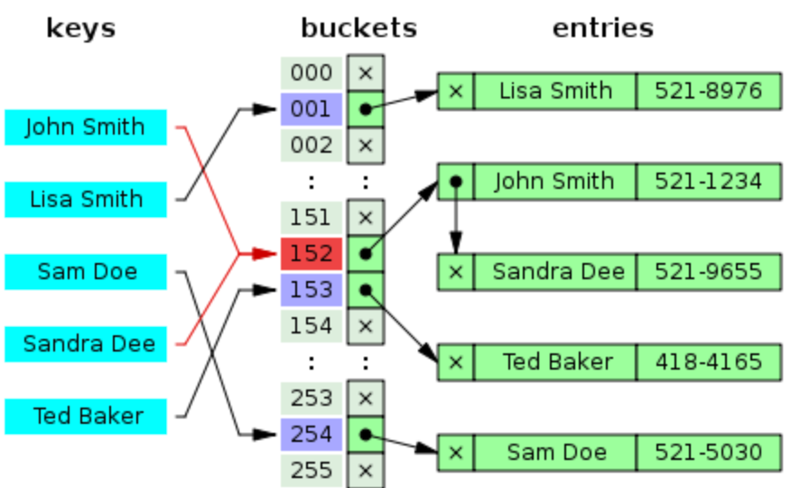
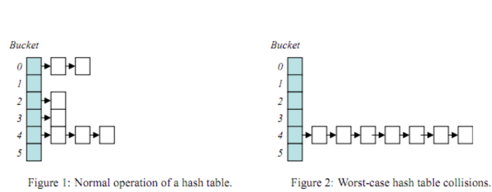
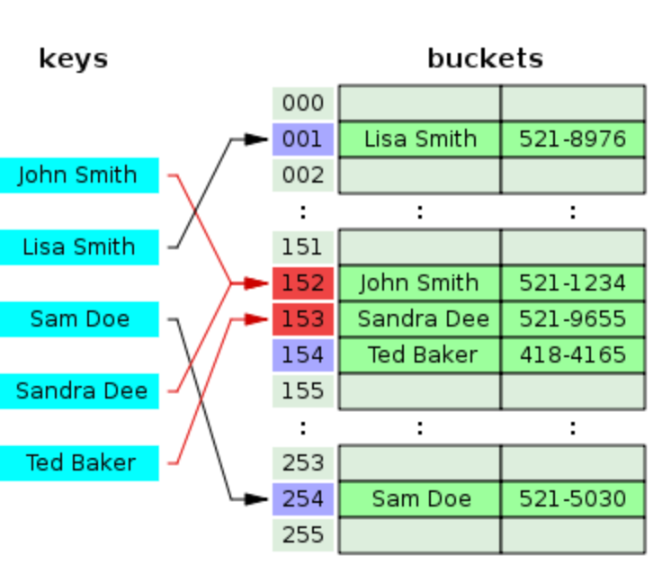

### 哈希查找

**散列表**（**Hash table**，也叫**哈希表**），是根据**键**（Key）而直接访问在内存存储位置的**数据结构**。也就是说，它通过计算一个关于键值的函数，将所需查询的数据**映射**到表中一个位置来访问记录，这加快了查找速度。这个映射函数称做**散列函数**，存放记录的数组称做**散列表**。

**散列函数**的规则是：通过某种转换关系，使关键字适度的分散到指定大小的的顺序结构中，越分散，则以后查找的时间复杂度越小，空间复杂度越高。

**Hash**是一种典型**以空间换时间**的算法

#### 1.算法流程

1. 用给定的哈希函数构造哈希表；
2. 根据选择的冲突处理方法解决地址冲突，常见的解决冲突的方法：拉链法和线性探测法。

#### 2.拉链法

通过哈希函数，我们可以将**键**转换为**数组的索引**(0-M-1)，但是对于**两个或者多个键**具有**相同索引值**的情况，我们需要有一种方法来处理这种冲突。

　　一种比较直接的办法就是，将大小为M 的数组的每一个元素**指向一个链表**，链表中的**每一个节点**都存储散列值为**该索引的键值对**，这就是**拉链法**。下图很清楚的描述了什么是**拉链法**。

　　“John Smith”和“Sandra Dee” 通过哈希函数都指向了152 这个索引，该索引**又指向**了一个链表， 在链表中依次存储了这两个字符串。

**单独链表法**：将散列到同一个存储位置的所有元素保存在一个链表中（聚集），该方法的基本思想就是选择足够大的M，使得所有的链表都尽可能的短小，以保证查找的效率。当链表过长、大量的键都会映射到相同的索引上，哈希表的顺序查找会转变为链表的查找，查找时间将会变大。对于开放寻址会造成性能的灾难性损失。

　实现基于拉链表的散列表，目标是选择适当的数组大小M，使得既不会因为空链表而浪费内存空间，也不会因为链表太而在查找上浪费太多时间。拉链表的优点在于，这种数组大小M的选择不是关键性的，如果存入的键多于预期，那么查找的时间只会比选择更大的数组稍长。另外，我们也可以使用更高效的结构来代替链表存储。如果存入的键少于预期，索然有些浪费空间，但是查找速度就会很快。所以当内存不紧张时，我们可以选择足够大的M，可以使得查找时间变为常数，如果内存紧张时，选择尽量大的M仍能够将性能提高M倍。

#### 3.线性探测法

**线性探测法**是**开放寻址法**解决哈希冲突的一种方法，基本原理为，使用大小为M的数组来保存N个键值对，其中M>N，我们需要使用数组中的空位解决碰撞冲突。如下图所示：

　对照前面的拉链法，在该图中，“Ted Baker” 是有唯一的哈希值153的，但是由于153被“Sandra Dee”占用了。而原先“Snadra Dee”和“John Smith”的哈希值**都是**152的，但是在对“Sandra Dee”进行哈希的时候发现152已经**被占用了**，所以往下找发现153**没有被占用**，所以**索引加1** 把“Sandra Dee”存放在没有被占用的153上，然后想把“Ted Baker”哈希到153上，发现已**经被占用了**，所以往下找，发现154**没有被占用**，所以值存到了154上。

[1]: https://www.cnblogs.com/magic-sea/p/11395997.html	"哈希查找"

