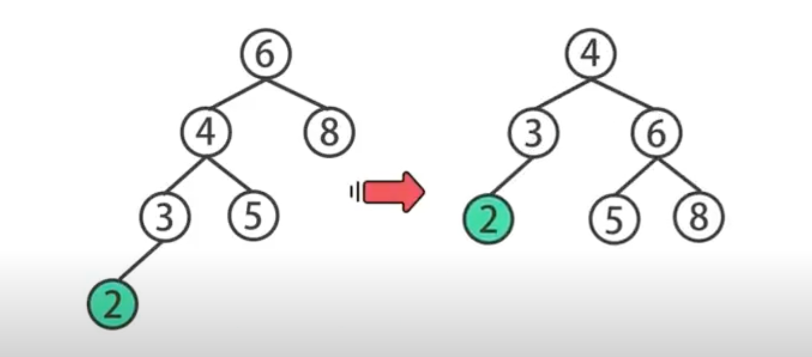
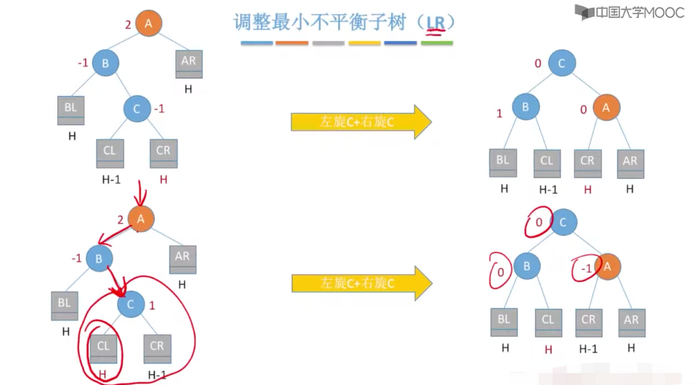

### 1.二叉查找树

#### 定义

二叉排序树（Binary Sort Tree，简称 BST ）又叫二叉查找树和二叉搜索树，是一种实现动态查找表的树形存储结构。

二叉排序树本质是一棵二叉树，它的特别之处在于：

- 对于树中的每个结点，如果它有左子树，那么左子树上所有结点的值都比该结点小；
- 对于树中的每个结点，如果它有右子树，那么右子树上所有结点的值都比该结点大。

> 时间复杂度logN

> Note : 和数学上的符号不一样，这里的log指的是以**2为底的对数计算**。

[1]: http://data.biancheng.net/view/338.html	"二叉查找树"

### 2.平衡二叉树  Balanced BinaryTree

如果二叉查找树的数据分布不均匀的话,如下图

时间复杂度从O(logN) 变成 O(N)。所以要设计一种在插入不均匀数据时，平衡的二叉树

#### 1.条件

#### 2.自平衡

`节点的平衡因子：左子树高-右子树高`

每次调整的对象都是"最小平衡子树"

#### 3.平衡调整

##### 1.LL

##### 2.RR

##### 3.LR

##### 4.RL

**在插入操作中，只要将最小不平衡子树调整平衡，则其他祖先节点都会恢复平衡**

##### 4.查询效率

[1]: https://www.youtube.com/watch?v=YQDk4FlU9Os	"平衡二叉树"

#### 1.AVL树

AVL树严格符合平衡二叉树的定义。也不一定非要严格按照定义，只要高度相差不太大也行，后续发明了红黑树(Red Black Tree)、

伸展树(Splay Tree)、 树堆(Trap)

[1]: http://data.biancheng.net/view/59.html	"平衡二叉树"
[2]: https://www.youtube.com/watch?v=NrQ-49C-eNo	"看动画学平衡二叉树"

#### 2.自平衡二叉查找树

##### [1.红黑树 Red Black Tree](https://zh.wikipedia.org/zh-hans/%E7%BA%A2%E9%BB%91%E6%A0%91)

它可以在logN时间内完成查找、插入和删除，这里的是树中元素的数目。

在节点中增加了标记节点红黑的变量

##### 2.伸展树(Splay Tree)

查询次数多的关键字被移动到靠近根节点的位置，并保持一定的平衡

