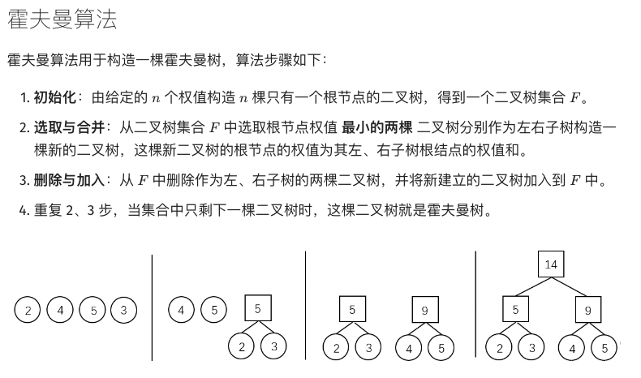
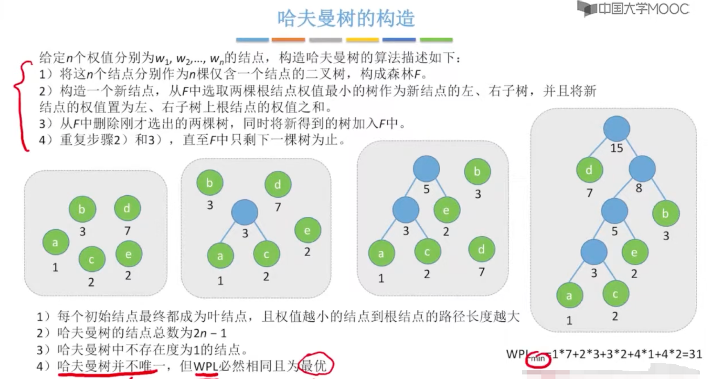

### [哈夫曼树](https://oi-wiki.org/ds/huffman-tree/)

设二叉树具有  个带权叶结点，从根结点到各叶结点的路径长度与相应叶节点权值的乘积之和称为 **树的带权路径长度（Weighted Path Length of Tree，WPL)**。

对于给定一组具有确定权值的叶结点，可以构造出不同的二叉树，其中，**WPL 最小的二叉树** 称为 **霍夫曼树（Huffman Tree）**。

对于霍夫曼树来说，其叶结点权值越小，离根越远，叶结点权值越大，离根越近，此外其仅有叶结点的度为0 ，其他结点度均为 2。

> 也称作**最优二叉树**

#### 1.算法实现

#### 2.哈夫曼编码

> 哈夫曼算法的应用

