### 1.线索二叉树

为了更好的找到节点的前序、后继

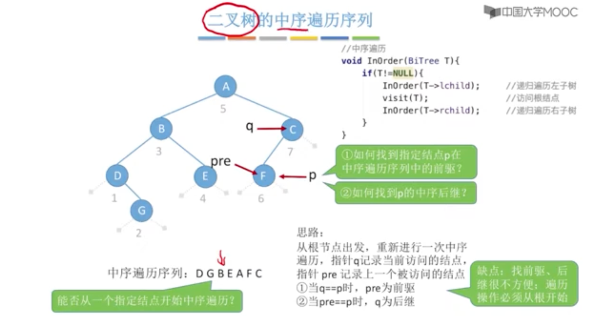

#### 1.中序线索二叉树

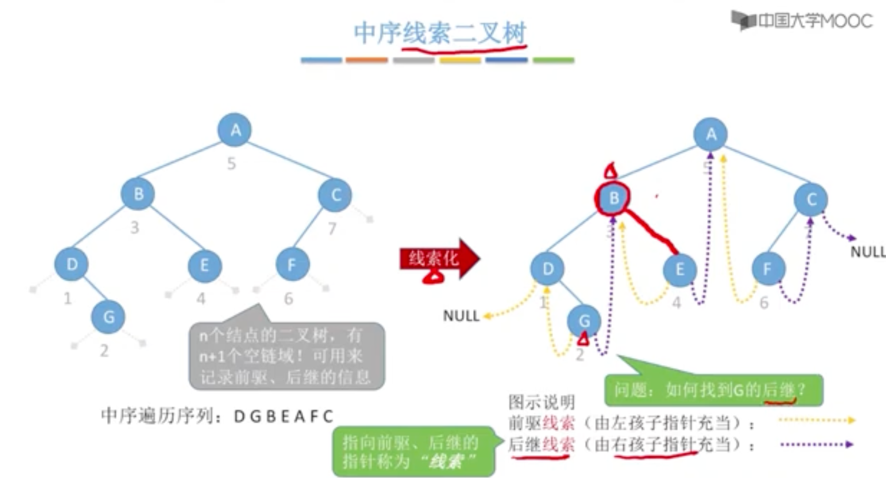

线索二叉树的优点：

1.找前驱、后继方便

2.遍历方便

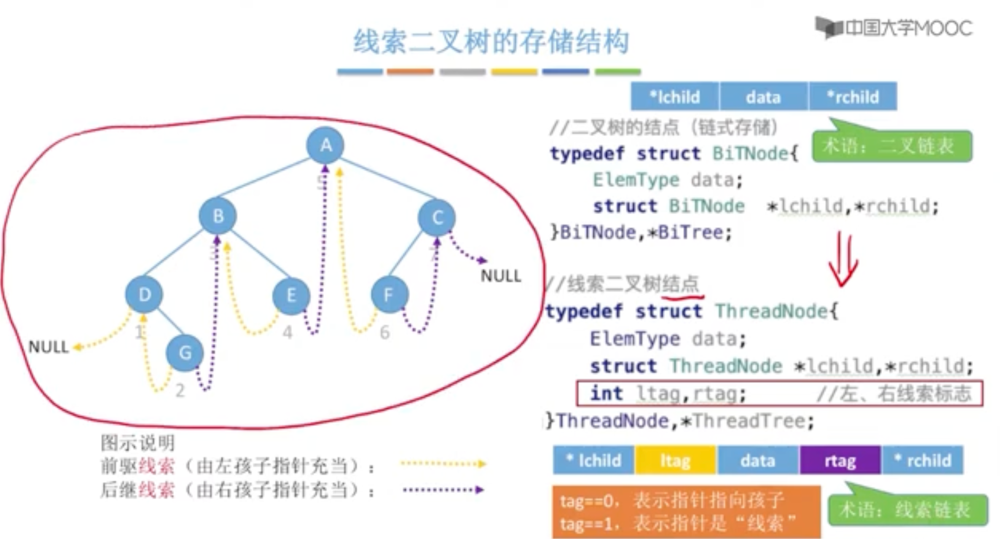

二叉链表、线索链表

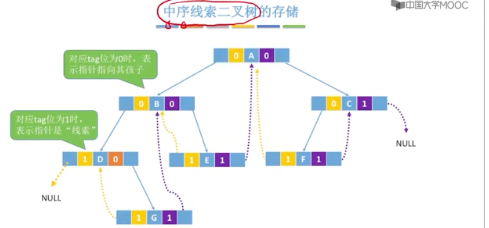

#### 2.先序线索二叉树

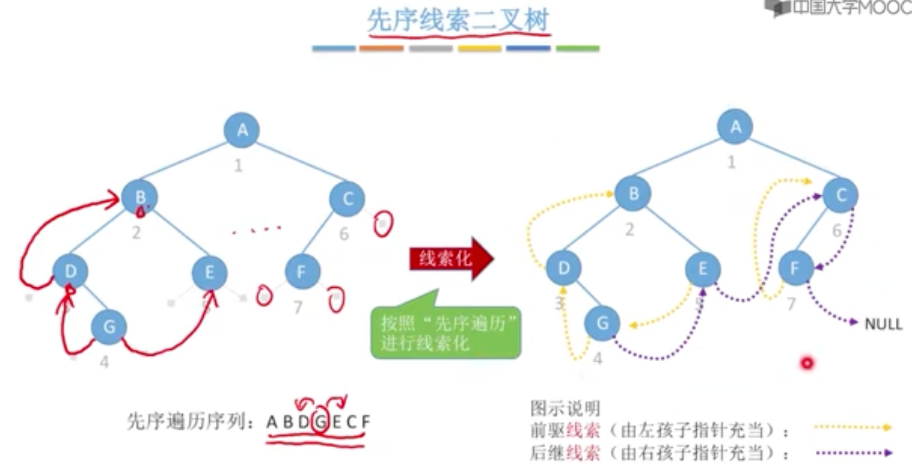

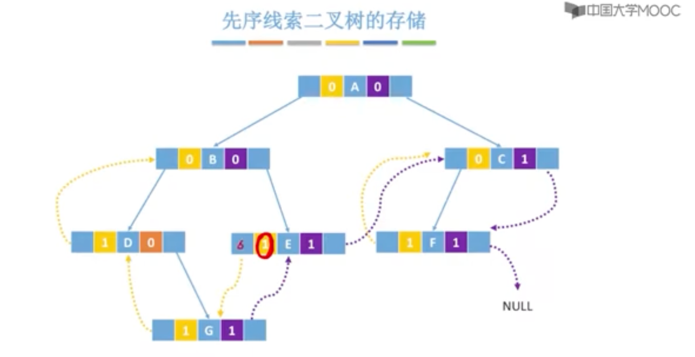

#### 3.后序线索二叉树

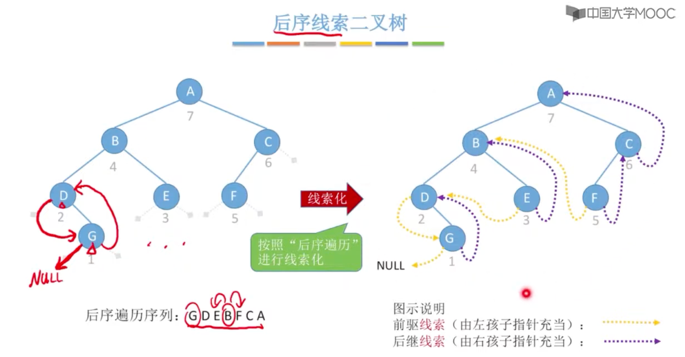

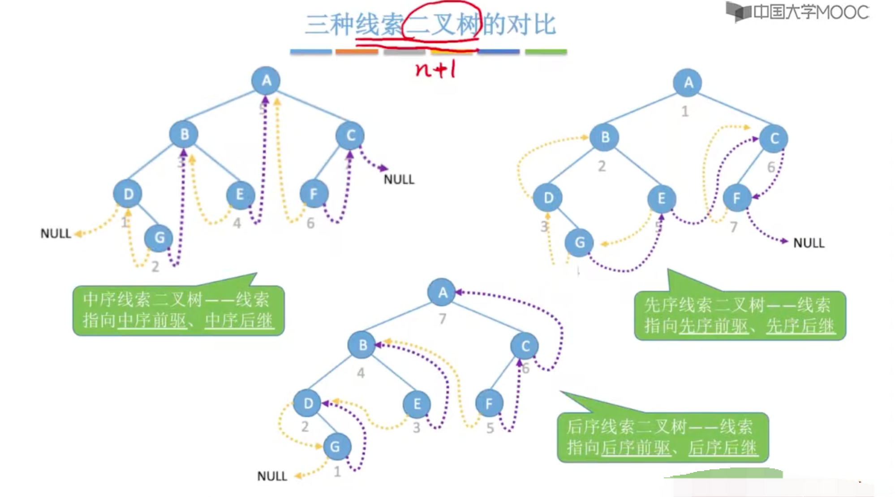

[1]: https://www.youtube.com/watch?v=TuJFf2x0R8Y	"线索二叉树"

### 2.二叉树的线索化

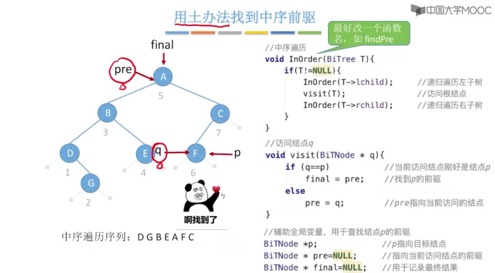

#### 1.中序线索化

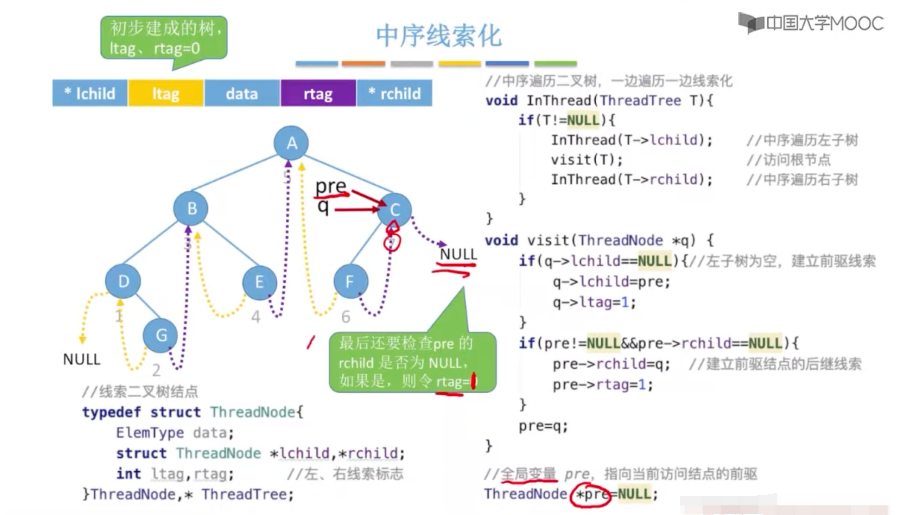

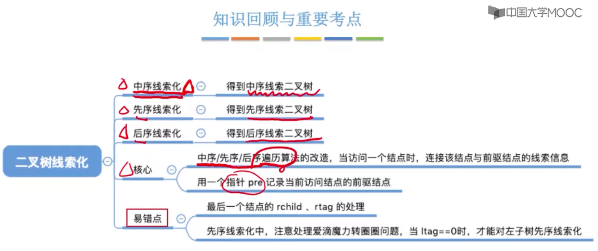

### 3.在线索二叉树中找前驱、后继

#### 1.中序线索二叉树找中序后继

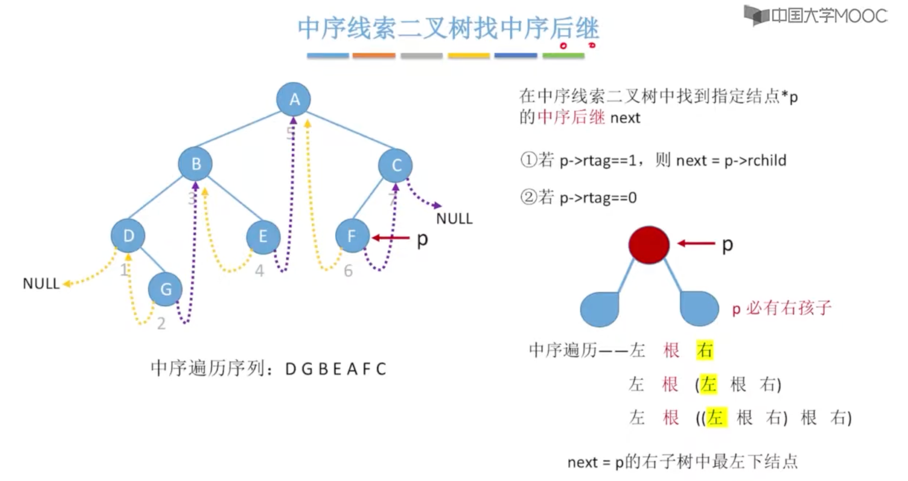

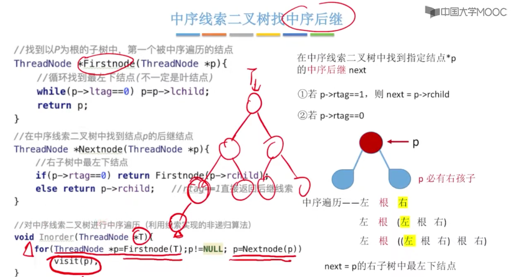

#### 2.中序线索二叉树找中序前驱

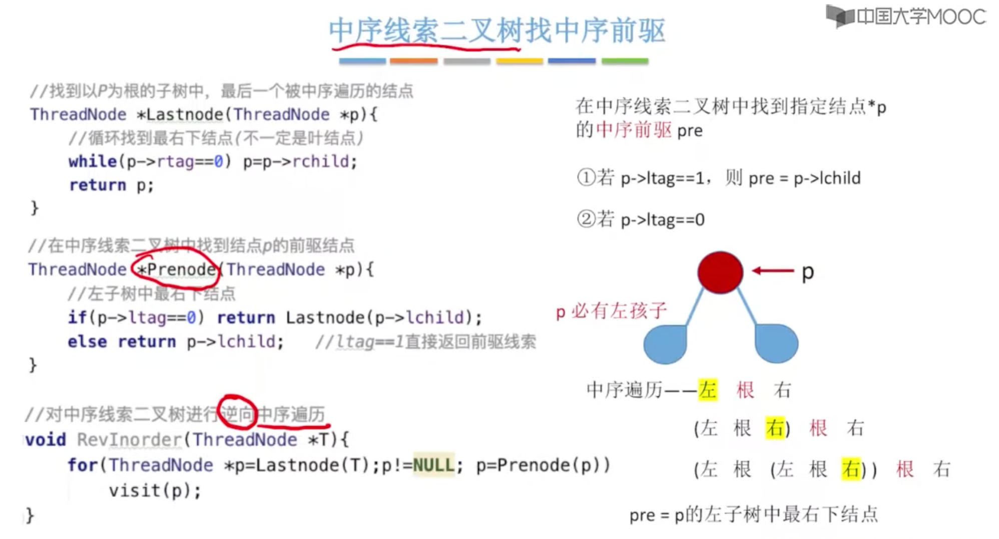

#### 3.先序找后继

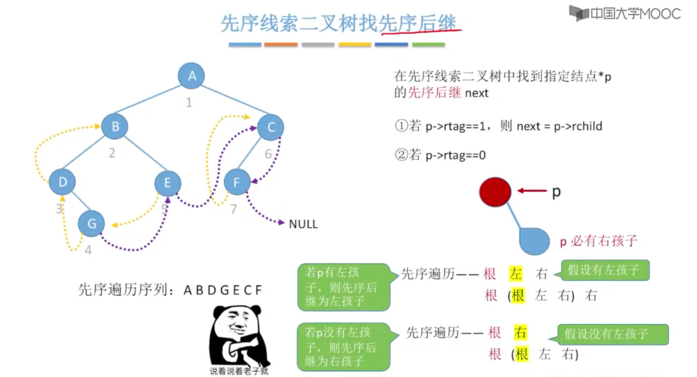

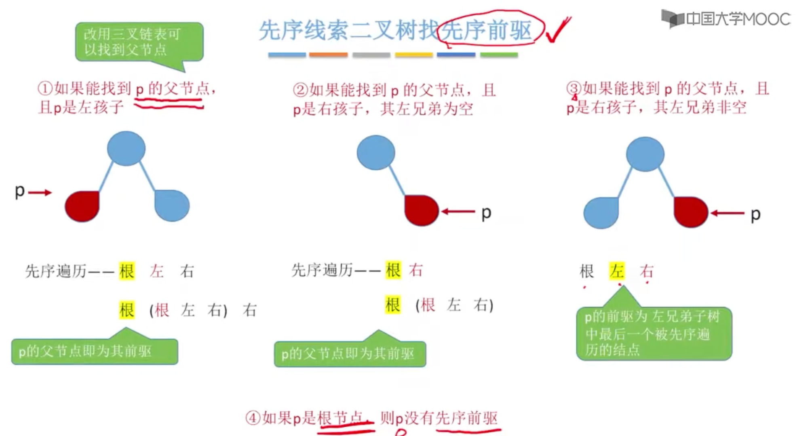

#### 4.后序前驱

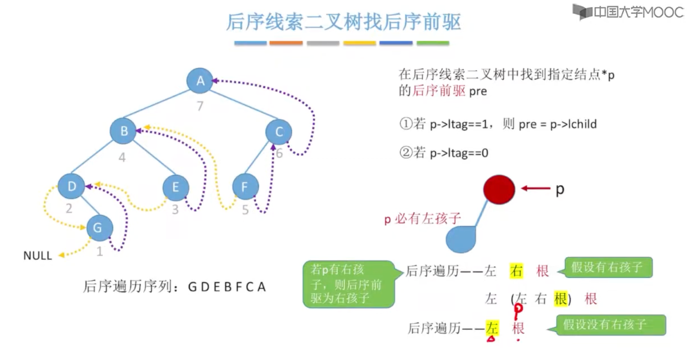

#### 5.后序后继

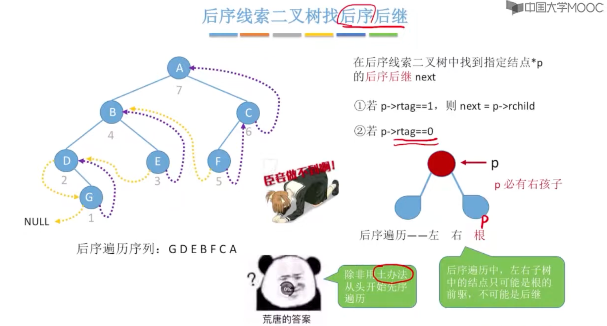

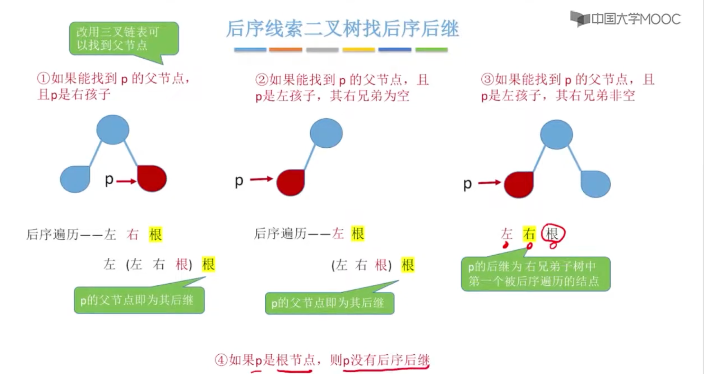