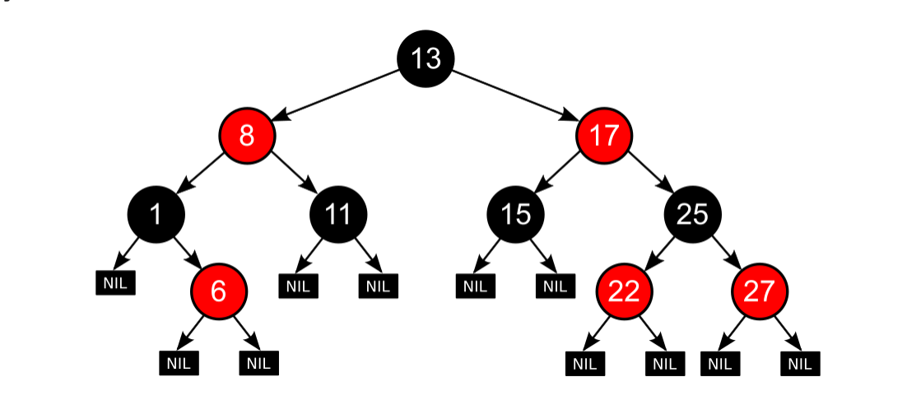
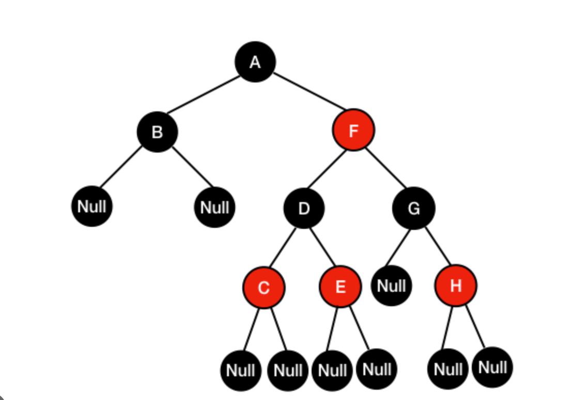
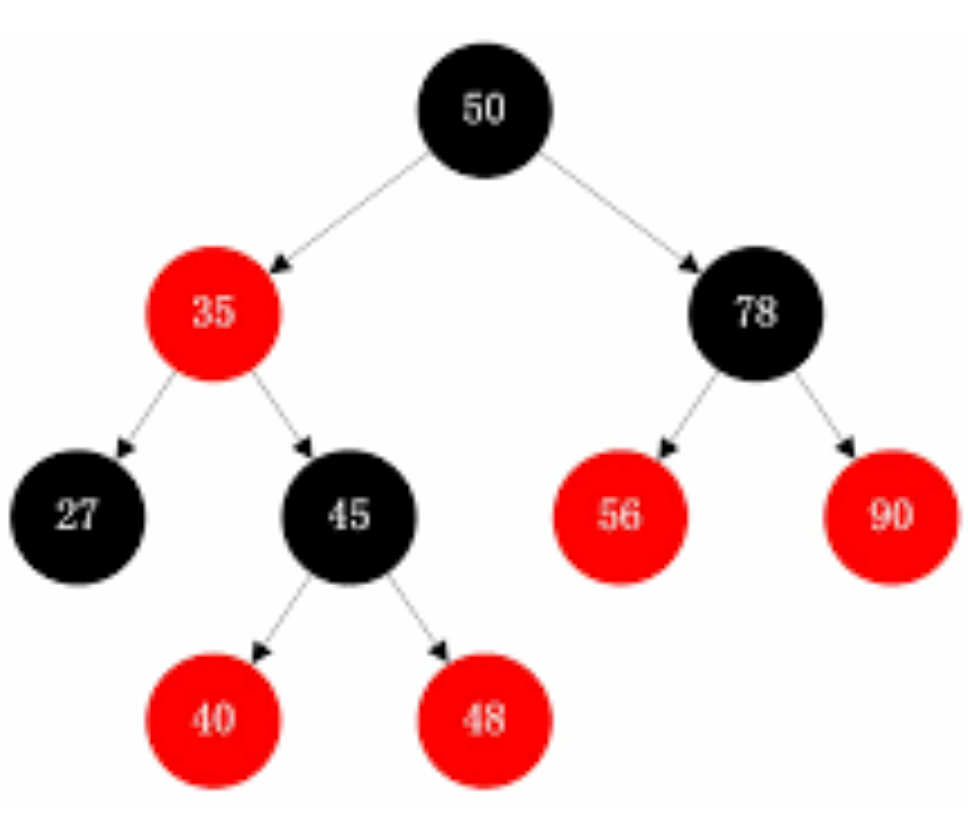

### [红黑树](https://zh.wikipedia.org/zh-hans/%E7%BA%A2%E9%BB%91%E6%A0%91)

红黑树是每个节点都带有颜色属性的[二叉查找树](https://zh.wikipedia.org/wiki/二元搜尋樹)，颜色为红色或黑色。在二叉查找树强制一般要求以外，对于任何有效的红黑树我们增加了如下的额外要求：

1. 节点是红色或黑色。
2. 根是黑色。
3. 所有叶子都是黑色（叶子是NIL节点）。
4. 每个红色节点必须有两个黑色的子节点。（或者说从每个叶子到根的所有路径上不能有两个连续的红色节点。）（或者说不存在两个相邻的红色节点，相邻指两个节点是父子关系。）（或者说红色节点的父节点和子节点均是黑色的。）
5. 从任一节点到其每个叶子的所有[简单路径](https://zh.wikipedia.org/wiki/道路_(图论))都包含相同数目的黑色节点。

因为每一个红黑树也是一个特化的[二叉查找树](https://zh.wikipedia.org/wiki/二叉查找树)，因此红黑树上的只读操作与普通[二叉查找树](https://zh.wikipedia.org/wiki/二叉查找树)上的只读操作相同。然而，在红黑树上进行插入操作和删除操作会导致不再符合红黑树的性质。恢复红黑树的性质需要少量（[O(log⁡�)](https://zh.wikipedia.org/wiki/大O符号)）的颜色变更（实际是非常快速的）和不超过三次[树旋转](https://zh.wikipedia.org/wiki/树旋转)（对于插入操作是两次）。虽然插入和删除很复杂，但操作时间仍可以保持为次。

