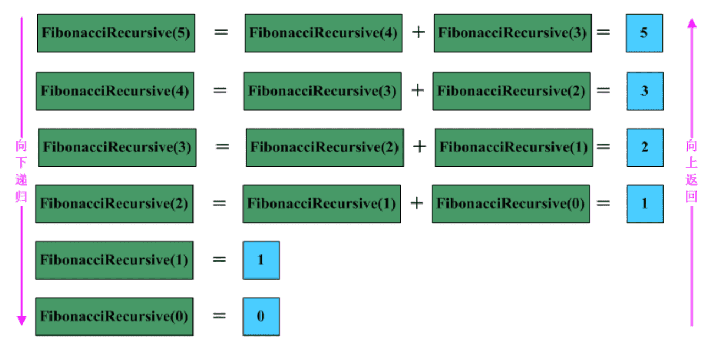
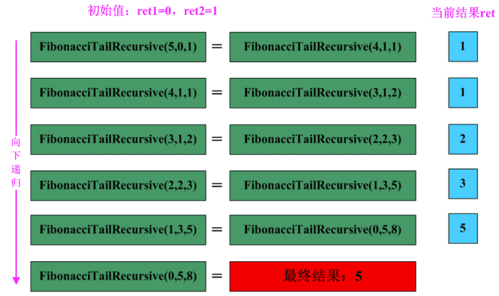

#### 1.递归定义

关于递归的概念，我们都不陌生。简单的来说递归就是一个函数直接或间接地调用自身，是为直接或间接递归。一般来说，递归需要有边界条件、递归前进段和递归返回段。当边界条件不满足时，递归前进；当边界条件满足时，递归返回。用递归需要注意以下两点：**(1) 递归就是在过程或函数里调用自身。(2) 在使用递归策略时，必须有一个明确的递归结束条件，称为递归出口**

#### 2.递归一般用于解决三类问题：

　 **(1)数据的定义是按递归定义的。（Fibonacci函数，n的阶乘）**

　  **(2)问题解法按递归实现。（回溯）**

　  **(3)数据的结构形式是按递归定义的。（二叉树的遍历，图的搜索）**

#### 3.递归的缺点：

　　递归解题相对常用的算法如普通循环等，运行效率较低。因此，应该尽量避免使用递归，除非没有更好的算法或者某种特定情况，递归更为适合的时候。**在递归调用的过程当中系统为每一层的返回点、局部量等开辟了栈来存储，因此递归次数过多容易造成栈溢出**

#### 4.线性递归实现Fibonacc函数

```javascript
function  FibonacciRecursive( n)
{
     if( n < 2)
        return n;
    return (FibonacciRecursive(n-1)+FibonacciRecursive(n-2));
 }
```



#### 5.尾递归

顾名思义，尾递归就是从最后开始计算, 每递归一次就算出相应的结果, 也就是说, 函数调用出现在调用者函数的尾部, 因为是尾部, 所以根本没有必要去保存任何局部变量. 直接让被调用的函数返回时越过调用者, 返回到调用者的调用者去。**尾递归就是把当前的运算结果（或路径）放在参数里传给下层函数**，深层函数所面对的不是越来越简单的问题，而是越来越复杂的问题，因为参数里带有前面若干步的运算路径。

　　尾递归是极其重要的，不用尾递归，函数的堆栈耗用难以估量，需要保存很多中间函数的堆栈。比如f(n, sum) = f(n-1) + value(n) + sum; 会保存n个函数调用堆栈，而使用尾递归f(n, sum) = f(n-1, sum+value(n)); 这样则只保留后一个函数堆栈即可，之前的可优化删去。

```javascript
function FibonacciTailRecursive( n, ret1, ret2)
 {
    if(n==0)
       return ret1; 
     return FibonacciTailRecursive(n-1,ret2,ret1+ret2);
 }
```

