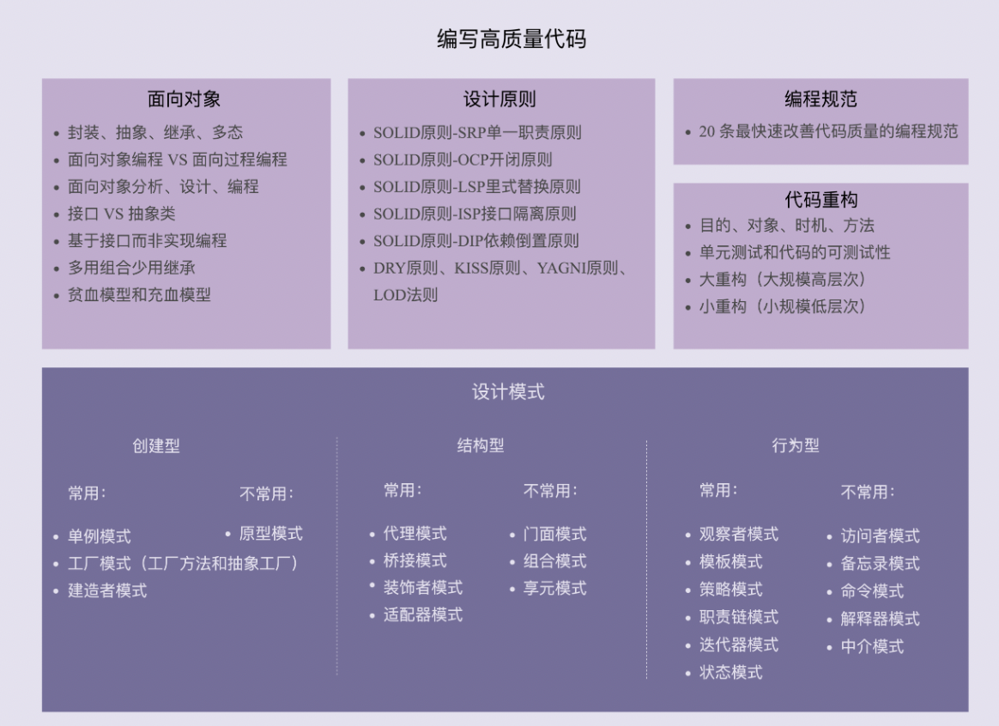

#### 1.如何评判代码的质量？

##### 1.可维护性

如果代码分层清晰、模块化好、高内聚低耦合、遵从基于接口而非实现编程的设计原则等等，那就可能意味着代码易维护。除此之外，代码的易维护性还跟项目代码量的多少、业务的复杂程度、利用到的技术的复杂程度、文档是否全面、团队成员的开发水平等诸多因素有关。

##### 2.可读性

软件设计大师 Martin Fowler

代码是否符合编码规范、命名是否达意、注释是否详尽、函数是否长短合适、模块划分是否清晰、是否符合高内聚低耦合等等。

##### 3.可扩展性

代码预留了一些功能扩展点，可以把新功能代码，直接插到扩展点上，而不需要因为要添加一个功能而大动干戈，改动大量的原始代码。

##### 4.灵活性

- 当我们添加一个新的功能代码的时候，原有的代码已经预留好了扩展点，我们不需要修改原有的代码，只要在扩展点上添加新的代码即可。这个时候，我们除了可以说代码易扩展，还可以说代码写得好灵活。
- 当我们要实现一个功能的时候，发现原有代码中，已经抽象出了很多底层可以复用的模块、类等代码，我们可以拿来直接使用。这个时候，我们除了可以说代码易复用之外，还可以说代码写得好灵活。
- 当我们使用某组接口的时候，如果这组接口可以应对各种使用场景，满足各种不同的需求，我们除了可以说接口易用之外，还可以说这个接口设计得好灵活或者代码写得好灵活。

##### 5.简洁性

有一条非常著名的设计原则， KISS 原则：“Keep It Simple，Stupid”。

思从深而行从简，真正的高手能云淡风轻地用最简单的方法解决最复杂的问题。这也是一个编程老手跟编程新手的本质区别之一。

##### 6.可重复性

设计原则: DRY（Don’t Repeat Yourself）

##### 7.可测试性

#### 2.五者的关系

##### 1.面相对象

编程风格：面向过程、面向对象和函数式编程

##### 2.设计原则

- SOLID 原则 -SRP 单一职责原则
- SOLID 原则 -OCP 开闭原则
- SOLID 原则 -LSP 里式替换原则
- SOLID 原则 -ISP 接口隔离原则
- SOLID 原则 -DIP 依赖倒置原则
- DRY 原则、KISS 原则、YAGNI 原则、LOD 法则

##### 3.设计模式

1. 创造型
2. 结构型
3. 行为型

##### 4.编程规范

编程规范主要解决的是代码的可读性问题。编码规范相对于设计原则、设计模式，更加具体、更加偏重代码细节。

推荐书籍：《重构》、《代码大全》、《代码整洁之道》

##### 5.代码重构

重构是软件开发中非常重要的一个环节。持续重构是保持代码质量不下降的有效手段，能有效避免代码腐化到无可救药的地步。

重构的工具就是面向对象设计思想、设计原则、设计模式、编码规范

- 重构的目的（why）、对象（what）、时机（when）、方法（how）；
- 保证重构不出错的技术手段：单元测试和代码的可测试性；
- 两种不同规模的重构：大重构（大规模高层次）和小重构（小规模低层次）。

##### 五者的关系

面向对象、设计原则、设计模式、编程规范、代码重构：

- **面向对象编程**因为其具有丰富的特性（封装、抽象、继承、多态），可以实现很多复杂的设计思路，是很多设计原则、设计模式等编码实现的基础。
- **设计原则**是指导我们代码设计的一些经验总结，对于某些场景下，是否应该应用某种设计模式，具有指导意义。比如，“开闭原则”是很多设计模式（策略、模板等）的指导原则。
- **设计模式**是针对软件开发中经常遇到的一些设计问题，总结出来的一套解决方案或者设计思路。应用设计模式的主要目的是提高代码的可扩展性。从抽象程度上来讲，设计原则比设计模式更抽象。设计模式更加具体、更加可执行。
- **编程规范**主要解决的是代码的可读性问题。编码规范相对于设计原则、设计模式，更加具体、更加偏重代码细节、更加能落地。持续的小重构依赖的理论基础主要就是编程规范。
- **重构**作为保持代码质量不下降的有效手段，利用的就是面向对象、设计原则、设计模式、编码规范这些理论。

> 实际上，面向对象、设计原则、设计模式、编程规范、代码重构，这五者都是保持或者提高代码质量的方法论，本质上都是服务于编写高质量代码这一件事的。

#### 3.基于接口而非实现编程 

原则：基于接口而非实现编程 Program to an interface, not an implementation

原则的设计初衷是，将接口和实现相分离，封装不稳定的实现，暴露稳定的接口。

> 做任何事情都要讲求一个“度”，过度使用这条原则，非得给每个类都定义接口，接口满天飞，也会导致不必要的开发负担。至于什么时候，该为某个类定义接口，实现基于接口的编程，什么时候不需要定义接口，直接使用实现类编程，我们做权衡的根本依据，还是要回归到设计原则诞生的初衷上来。只要搞清楚了这条原则是为了解决什么样的问题而产生的，你就会发现，很多之前模棱两可的问题，都会变得豁然开朗。
>
> 这条原则的设计初衷是，将接口和实现相分离，封装不稳定的实现，暴露稳定的接口。上游系统面向接口而非实现编程，不依赖不稳定的实现细节，这样当实现发生变化的时候，上游系统的代码基本上不需要做改动，以此来降低代码间的耦合性，提高代码的扩展性。
>
> 从这个设计初衷上来看，如果在我们的业务场景中，某个功能只有一种实现方式，未来也不可能被其他实现方式替换，那我们就没有必要为其设计接口，也没有必要基于接口编程，直接使用实现类就可以了。
>
> 除此之外，越是不稳定的系统，我们越是要在代码的扩展性、维护性上下功夫。相反，如果某个系统特别稳定，在开发完之后，基本上不需要做维护，那我们就没有必要为其扩展性，投入不必要的开发时间。

1.“基于接口而非实现编程”，这条原则的另一个表述方式，是“基于抽象而非实现编程”。后者的表述方式其实更能体现这条原则的设计初衷。我们在做软件开发的时候，一定要有抽象意识、封装意识、接口意识。越抽象、越顶层、越脱离具体某一实现的设计，越能提高代码的灵活性、扩展性、可维护性。

2.在定义接口的时候，一方面，命名要足够通用，不能包含跟具体实现相关的字眼；另一方面，与特定实现有关的方法不要定义在接口中。

3.“基于接口而非实现编程”这条原则，不仅仅可以指导非常细节的编程开发，还能指导更加上层的架构设计、系统设计等。比如，服务端与客户端之间的“接口”设计、类库的“接口”设计。

#### 4.多用组合少用继承

继承是面向对象的四大特性之一，用来表示类之间的 is-a 关系，可以解决代码复用的问题。虽然继承有诸多作用，但继承层次过深、过复杂，也会影响到代码的可维护性和可读性。

