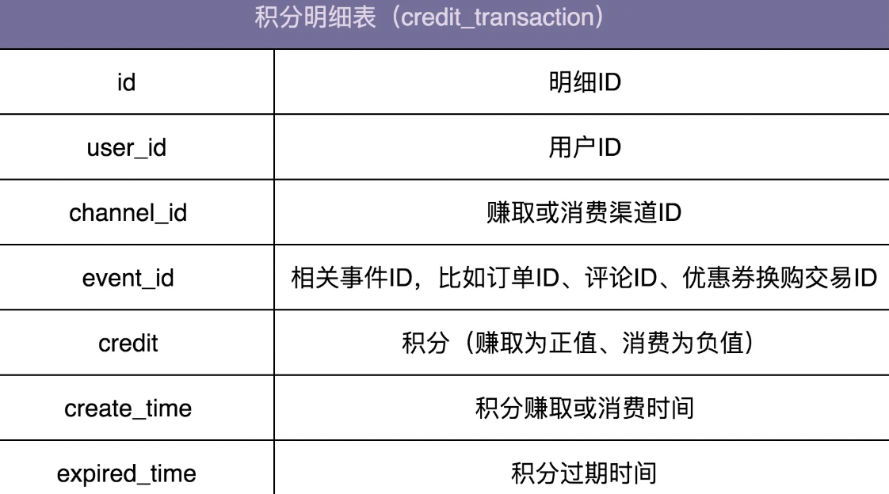
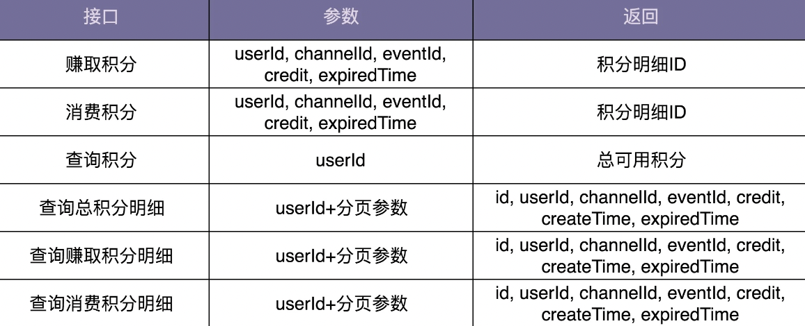

### 1.SOLID 原则

SOLID 原则并非单纯的 1 个原则，而是由 5 个设计原则组成的，它们分别是：单一职责原则、开闭原则、里式替换原则、接口隔离原则和依赖反转原则，依次对应 SOLID 中的 S、O、L、I、D 这 5 个英文字母。

#### 1.单一职责 SRP 

Single Responsibility Principle ：一个类或者模块只负责完成一个职责（或者功能）。

> A class or module should have a single responsibility。

不同的应用场景、不同阶段的需求背景下，对同一个类的职责是否单一的判定，可能都是不一样的。在某种应用场景或者当下的需求背景下，一个类的设计可能已经满足单一职责原则了，但如果换个应用场景或着在未来的某个需求背景下，可能就不满足了，需要继续拆分成粒度更细的类。

这几条判断原则，比起很主观地去思考类是否职责单一，要更有指导意义、更具有可执行性：

- 类中的代码行数、函数或属性过多，会影响代码的可读性和可维护性，我们就需要考虑对类进行拆分；
- 类依赖的其他类过多，或者依赖类的其他类过多，不符合高内聚、低耦合的设计思想，我们就需要考虑对类进行拆分；
- 私有方法过多，我们就要考虑能否将私有方法独立到新的类中，设置为 public 方法，供更多的类使用，从而提高代码的复用性；
- 比较难给类起一个合适名字，很难用一个业务名词概括，或者只能用一些笼统的 Manager、Context 之类的词语来命名，这就说明类的职责定义得可能不够清晰；
- 类中大量的方法都是集中操作类中的某几个属性，比如，在 UserInfo 例子中，如果一半的方法都是在操作 address 信息，那就可以考虑将这几个属性和对应的方法拆分出来。

不管是应用设计原则还是设计模式，最终的目的还是提高代码的可读性、可扩展性、复用性、可维护性等。我们在考虑应用某一个设计原则是否合理的时候，也可以以此作为最终的考量标准。

#### 2.开闭原则 OCP

Open Closed Principle： 软件实体（模块、类、方法等）应该“对扩展开放、对修改关闭”。

> software entities (modules, classes, functions, etc.) should be open for extension , but closed for modification。

> 添加一个新的功能应该是，在已有代码基础上扩展代码（新增模块、类、方法等），而非修改已有代码（修改模块、类、方法等）

##### 1.Api 接口监控告警代码：

```java

public class Alert {
  private AlertRule rule;
  private Notification notification;

  public Alert(AlertRule rule, Notification notification) {
    this.rule = rule;
    this.notification = notification;
  }

  public void check(String api, long requestCount, long errorCount, long durationOfSeconds) {
    long tps = requestCount / durationOfSeconds;
    if (tps > rule.getMatchedRule(api).getMaxTps()) {
      notification.notify(NotificationEmergencyLevel.URGENCY, "...");
    }
    if (errorCount > rule.getMatchedRule(api).getMaxErrorCount()) {
      notification.notify(NotificationEmergencyLevel.SEVERE, "...");
    }
  }
}
```

业务需求需要添加一个功能，当每秒钟接口超时请求个数,超过某个预先设置的最大阈值时，我们也要触发告警发送通知。

```java

public class Alert {
  // ...省略AlertRule/Notification属性和构造函数...
  
  // 改动一：添加参数timeoutCount
  public void check(String api, long requestCount, long errorCount, long timeoutCount, long durationOfSeconds) {
    long tps = requestCount / durationOfSeconds;
    if (tps > rule.getMatchedRule(api).getMaxTps()) {
      notification.notify(NotificationEmergencyLevel.URGENCY, "...");
    }
    if (errorCount > rule.getMatchedRule(api).getMaxErrorCount()) {
      notification.notify(NotificationEmergencyLevel.SEVERE, "...");
    }
    // 改动二：添加接口超时处理逻辑
    long timeoutTps = timeoutCount / durationOfSeconds;
    if (timeoutTps > rule.getMatchedRule(api).getMaxTimeoutTps()) {
      notification.notify(NotificationEmergencyLevel.URGENCY, "...");
    }
  }
}
```

这样的代码修改实际上存在挺多问题的。一方面，对接口进行了修改，这就意味着调用这个接口的代码都要做相应的修改。另一方面，修改了 check() 函数，相应的单元测试都需要修改。

基于“扩展”的方式，来实现。

- 第一部分是将 check() 函数的多个入参封装成 ApiStatInfo 类。

- 第二部分是引入 handler 的概念，将 if 判断逻辑分散在各个 handler 中。

```java

public class Alert {
  private List<AlertHandler> alertHandlers = new ArrayList<>();
  
  public void addAlertHandler(AlertHandler alertHandler) {
    this.alertHandlers.add(alertHandler);
  }

  public void check(ApiStatInfo apiStatInfo) {
    for (AlertHandler handler : alertHandlers) {
      handler.check(apiStatInfo);
    }
  }
}

public class ApiStatInfo {//省略constructor/getter/setter方法
  private String api;
  private long requestCount;
  private long errorCount;
  private long durationOfSeconds;
}

public abstract class AlertHandler {
  protected AlertRule rule;
  protected Notification notification;
  public AlertHandler(AlertRule rule, Notification notification) {
    this.rule = rule;
    this.notification = notification;
  }
  public abstract void check(ApiStatInfo apiStatInfo);
}

public class TpsAlertHandler extends AlertHandler {
  public TpsAlertHandler(AlertRule rule, Notification notification) {
    super(rule, notification);
  }

  @Override
  public void check(ApiStatInfo apiStatInfo) {
    long tps = apiStatInfo.getRequestCount()/ apiStatInfo.getDurationOfSeconds();
    if (tps > rule.getMatchedRule(apiStatInfo.getApi()).getMaxTps()) {
      notification.notify(NotificationEmergencyLevel.URGENCY, "...");
    }
  }
}

public class ErrorAlertHandler extends AlertHandler {
  public ErrorAlertHandler(AlertRule rule, Notification notification){
    super(rule, notification);
  }

  @Override
  public void check(ApiStatInfo apiStatInfo) {
    if (apiStatInfo.getErrorCount() > rule.getMatchedRule(apiStatInfo.getApi()).getMaxErrorCount()) {
      notification.notify(NotificationEmergencyLevel.SEVERE, "...");
    }
  }
}
```

重构之后的 Alert 该如何使用呢？

ApplicationContext 是一个单例类，负责 Alert 的创建、组装（alertRule 和 notification 的依赖注入）、初始化（添加 handlers）工作。

```java

public class ApplicationContext {
  private AlertRule alertRule;
  private Notification notification;
  private Alert alert;
  
  public void initializeBeans() {
    alertRule = new AlertRule(/*.省略参数.*/); //省略一些初始化代码
    notification = new Notification(/*.省略参数.*/); //省略一些初始化代码
    alert = new Alert();
    alert.addAlertHandler(new TpsAlertHandler(alertRule, notification));
    alert.addAlertHandler(new ErrorAlertHandler(alertRule, notification));
  }
  public Alert getAlert() { return alert; }

  // 饿汉式单例
  private static final ApplicationContext instance = new ApplicationContext();
  private ApplicationContext() {
    initializeBeans();
  }
  public static ApplicationContext getInstance() {
    return instance;
  }
}

public class Demo {
  public static void main(String[] args) {
    ApiStatInfo apiStatInfo = new ApiStatInfo();
    // ...省略设置apiStatInfo数据值的代码
    ApplicationContext.getInstance().getAlert().check(apiStatInfo);
  }
}
```

基于重构之后的代码，如果再添加上面讲到的那个新功能，每秒钟接口超时请求个数超过某个最大阈值就告警，我们又该如何改动代码呢？主要的改动有下面四处。

- 第一处改动是：在 ApiStatInfo 类中添加新的属性 timeoutCount。
- 第二处改动是：添加新的 TimeoutAlertHander 类。
- 第三处改动是：在 ApplicationContext 类的 initializeBeans() 方法中，往 alert 对象中注册新的 timeoutAlertHandler。
- 第四处改动是：在使用 Alert 类的时候，需要给 check() 函数的入参 apiStatInfo 对象设置 timeoutCount 的值。

```java

public class Alert { // 代码未改动... }
public class ApiStatInfo {//省略constructor/getter/setter方法
  private String api;
  private long requestCount;
  private long errorCount;
  private long durationOfSeconds;
  private long timeoutCount; // 改动一：添加新字段
}
public abstract class AlertHandler { //代码未改动... }
public class TpsAlertHandler extends AlertHandler {//代码未改动...}
public class ErrorAlertHandler extends AlertHandler {//代码未改动...}
// 改动二：添加新的handler
public class TimeoutAlertHandler extends AlertHandler {//省略代码...}

public class ApplicationContext {
  private AlertRule alertRule;
  private Notification notification;
  private Alert alert;
  
  public void initializeBeans() {
    alertRule = new AlertRule(/*.省略参数.*/); //省略一些初始化代码
    notification = new Notification(/*.省略参数.*/); //省略一些初始化代码
    alert = new Alert();
    alert.addAlertHandler(new TpsAlertHandler(alertRule, notification));
    alert.addAlertHandler(new ErrorAlertHandler(alertRule, notification));
    // 改动三：注册handler
    alert.addAlertHandler(new TimeoutAlertHandler(alertRule, notification));
  }
  //...省略其他未改动代码...
}

public class Demo {
  public static void main(String[] args) {
    ApiStatInfo apiStatInfo = new ApiStatInfo();
    // ...省略apiStatInfo的set字段代码
    apiStatInfo.setTimeoutCount(289); // 改动四：设置tiemoutCount值
    ApplicationContext.getInstance().getAlert().check(apiStatInfo);
}
```

> 要认识到，添加一个新功能，不可能任何模块、类、方法的代码都不“修改”，这个是做不到的。类需要创建、组装、并且做一些初始化操作，才能构建成可运行的的程序，这部分代码的修改是在所难免的。我们要做的是尽量让修改操作更集中、更少、更上层，尽量让最核心、最复杂的那部分逻辑代码满足开闭原则。

实际上，开闭原则讲的就是代码的扩展性问题，是判断一段代码是否易扩展的“金标准”。为了尽量写出扩展性好的代码，我们要时刻具备扩展意识、抽象意识、封装意识。这些“潜意识”可能比任何开发技巧都重要。

> 在写代码的时候后，我们要多花点时间往前多思考一下，这段代码未来可能有哪些需求变更、如何设计代码结构，事先留好扩展点，以便在未来需求变更的时候，不需要改动代码整体结构、做到最小代码改动的情况下，新的代码能够很灵活地插入到扩展点上，做到“对扩展开放、对修改关闭”。
>
> 还有，在识别出代码可变部分和不可变部分之后，我们要将可变部分封装起来，隔离变化，提供抽象化的不可变接口，给上层系统使用。当具体的实现发生变化的时候，我们只需要基于相同的抽象接口，扩展一个新的实现，替换掉老的实现即可，上游系统的代码几乎不需要修改。

很多设计原则、思想、模式都是相通的。

最常用来提高代码扩展性的方法有：多态、依赖注入、基于接口而非实现编程，以及大部分的设计模式（比如，装饰、策略、模板、职责链、状态等）。

##### 2.kafka 发送异步消息

比如，我们代码中通过 Kafka 来发送异步消息。对于这样一个功能的开发，我们要学会将其抽象成一组跟具体消息队列（Kafka）无关的异步消息接口。所有上层系统都依赖这组抽象的接口编程，并且通过依赖注入的方式来调用。当我们要替换新的消息队列的时候，比如将 Kafka 替换成 RocketMQ，可以很方便地拔掉老的消息队列实现，插入新的消息队列实现。具体代码如下所示：

```java

// 这一部分体现了抽象意识
public interface MessageQueue { //... }
public class KafkaMessageQueue implements MessageQueue { //... }
public class RocketMQMessageQueue implements MessageQueue {//...}

public interface MessageFromatter { //... }
public class JsonMessageFromatter implements MessageFromatter {//...}
public class ProtoBufMessageFromatter implements MessageFromatter {//...}

public class Demo {
  private MessageQueue msgQueue; // 基于接口而非实现编程
  public Demo(MessageQueue msgQueue) { // 依赖注入
    this.msgQueue = msgQueue;
  }
  
  // msgFormatter：多态、依赖注入
  public void sendNotification(Notification notification, MessageFormatter msgFormatter) {
    //...    
  }
}
```

> 在某些场景下，代码的扩展性很重要，我们就可以适当地牺牲一些代码的可读性；在另一些场景下，代码的可读性更加重要，那我们就适当地牺牲一些代码的可扩展性。
>
> 总之，这里没有一个放之四海而皆准的参考标准，全凭实际的应用场景来决定。

#### 3.里式替换 LSP

Liskov Substitution Principle： 子类对象（object of subtype/derived class）能够替换程序（program）中父类对象（object of base/parent class）出现的任何地方，并且保证原来程序的逻辑行为（behavior）不变及正确性不被破坏。

> Functions that use pointers of references to base classes must be able to use objects of derived classes without knowing it。

##### 1.举例

如下代码中，父类 Transporter 使用 org.apache.http 库中的 HttpClient 类来传输网络数据。子类 SecurityTransporter 继承父类 Transporter，增加了额外的功能，支持传输 appId 和 appToken 安全认证信息。

```java

public class Transporter {
  private HttpClient httpClient;
  
  public Transporter(HttpClient httpClient) {
    this.httpClient = httpClient;
  }

  public Response sendRequest(Request request) {
    // ...use httpClient to send request
  }
}

public class SecurityTransporter extends Transporter {
  private String appId;
  private String appToken;

  public SecurityTransporter(HttpClient httpClient, String appId, String appToken) {
    super(httpClient);
    this.appId = appId;
    this.appToken = appToken;
  }

  @Override
  public Response sendRequest(Request request) {
    if (StringUtils.isNotBlank(appId) && StringUtils.isNotBlank(appToken)) {
      request.addPayload("app-id", appId);
      request.addPayload("app-token", appToken);
    }
    return super.sendRequest(request);
  }
}

public class Demo {    
  public void demoFunction(Transporter transporter) {    
    Reuqest request = new Request();
    //...省略设置request中数据值的代码...
    Response response = transporter.sendRequest(request);
    //...省略其他逻辑...
  }
}

// 里式替换原则
Demo demo = new Demo();
demo.demofunction(new SecurityTransporter(/*省略参数*/););
```

在上面的代码中，子类 SecurityTransporter 的设计完全符合里式替换原则，可以替换父类出现的任何位置，并且原来代码的逻辑行为不变且正确性也没有被破坏。

改造一下就不合适了，如下：

```java

// 改造前：
public class SecurityTransporter extends Transporter {
  //...省略其他代码..
  @Override
  public Response sendRequest(Request request) {
    if (StringUtils.isNotBlank(appId) && StringUtils.isNotBlank(appToken)) {
      request.addPayload("app-id", appId);
      request.addPayload("app-token", appToken);
    }
    return super.sendRequest(request);
  }
}

// 改造后：
public class SecurityTransporter extends Transporter {
  //...省略其他代码..
  @Override
  public Response sendRequest(Request request) {
    if (StringUtils.isBlank(appId) || StringUtils.isBlank(appToken)) {
      throw new NoAuthorizationRuntimeException(...);
    }
    request.addPayload("app-id", appId);
    request.addPayload("app-token", appToken);
    return super.sendRequest(request);
  }
}
```

子类替换父类传递进 demoFunction 函数之后，整个程序的逻辑行为有了改变,demoFunction() 有可能会有异常抛出。

从设计思路上来讲，改造之后的SecurityTransporter 的设计是不符合里式替换原则的。

##### 2.那些代码违背了LSP 原则

实际上，里式替换原则还有另外一个更加能落地、更有指导意义的描述，那就是“Design By Contract”，中文翻译就是“按照协议来设计”。

子类在设计的时候，要遵守父类的行为约定（或者叫协议）。父类定义了函数的行为约定，那子类可以改变函数的内部实现逻辑，但不能改变函数原有的行为约定。这里的行为约定包括：函数声明要实现的功能；对输入、输出、异常的约定；甚至包括注释中所罗列的任何特殊说明。实际上，定义中父类和子类之间的关系，也可以替换成接口和实现类之间的关系。

几个违反里式替换原则的例子：

1. 子类违背父类声明要实现的功能
2. 子类违背父类对输入、输出、异常的约定
3. 子类违背父类注释中所罗列的任何特殊说明

> 里氏替换就是子类完美继承父类的设计初衷，并做了增强

#### 4.接口隔离原则 ISP

Interface Segregation Principle：客户端不应该被强迫依赖它不需要的接口。其中的“客户端”，可以理解为接口的调用者或者使用者。

> Clients should not be forced to depend upon interfaces that they do not use.

在这条原则中，可以把“接口”理解为下面三种东西：

- 一组 API 接口集合
- 单个 API 接口或函数
- OOP 中的接口概念

##### 1.把“接口”理解为一组 API 接口集合

微服务用户系统提供了一组跟用户相关的 API 给其他系统使用，比如：注册、登录、获取用户信息等。

```java

public interface UserService {
  boolean register(String cellphone, String password);
  boolean login(String cellphone, String password);
  UserInfo getUserInfoById(long id);
  UserInfo getUserInfoByCellphone(String cellphone);
}

public class UserServiceImpl implements UserService {
  //...
}
```

后台管理系统要实现删除用户的功能，希望用户系统提供一个删除用户的接口。这个时候我们该如何来做呢？

最好的解决方案是从架构设计的层面，通过接口鉴权的方式来限制接口的调用。

不过，如果暂时没有鉴权框架来支持，还可以从代码设计的层面，尽量避免接口被误用。参照接口隔离原则，调用者不应该强迫依赖它不需要的接口，将删除接口单独放到另外一个接口 RestrictedUserService 中，然后将 RestrictedUserService 只打包提供给后台管理系统来使用。具体的代码实现如下所示：

```java

public interface UserService {
  boolean register(String cellphone, String password);
  boolean login(String cellphone, String password);
  UserInfo getUserInfoById(long id);
  UserInfo getUserInfoByCellphone(String cellphone);
}

public interface RestrictedUserService {
  boolean deleteUserByCellphone(String cellphone);
  boolean deleteUserById(long id);
}

public class UserServiceImpl implements UserService, RestrictedUserService {
  // ...省略实现代码...
}
```

##### 2.把“接口”理解为单个 API 接口或函数

再换一种理解方式，把接口理解为单个接口或函数（以下为了方便讲解，我都简称为“函数”）。那接口隔离原则就可以理解为：函数的设计要功能单一，不要将多个不同的功能逻辑在一个函数中实现。

```java

public class Statistics {
  private Long max;
  private Long min;
  private Long average;
  private Long sum;
  private Long percentile99;
  private Long percentile999;
  //...省略constructor/getter/setter等方法...
}

public Statistics count(Collection<Long> dataSet) {
  Statistics statistics = new Statistics();
  //...省略计算逻辑...
  return statistics;
}
```

count() 函数的功能不够单一，包含很多不同的统计功能，比如，求最大值、最小值、平均值等等。按照接口隔离原则，我们应该把 count() 函数拆成几个更小粒度的函数，每个函数负责一个独立的统计功能。

```java
public Long max(Collection<Long> dataSet) { //... }
public Long min(Collection<Long> dataSet) { //... } 
public Long average(Colletion<Long> dataSet) { //... }
// ...省略其他统计函数...
```

判定功能是否单一，除了很强的主观性，还需要结合具体的场景。

如果在项目中，对每个统计需求，Statistics 定义的那几个统计信息都有涉及，那 count() 函数的设计就是合理的。相反，如果每个统计需求只涉及 Statistics 罗列的统计信息中一部分，比如，有的只需要用到 max、min、average 这三类统计信息，有的只需要用到 average、sum。而 count() 函数每次都会把所有的统计信息计算一遍，就会做很多无用功，势必影响代码的性能，特别是在需要统计的数据量很大的时候。所以，在这个应用场景下，count() 函数的设计就有点不合理了，我们应该按照第二种设计思路，将其拆分成粒度更细的多个统计函数。

> 接口隔离原则跟单一职责原则有点类似，不过稍微还是有点区别。单一职责原则针对的是模块、类、接口的设计。而接口隔离原则相对于单一职责原则，一方面它更侧重于接口的设计，另一方面它的思考的角度不同。它提供了一种判断接口是否职责单一的标准：通过调用者如何使用接口来间接地判定。如果调用者只使用部分接口或接口的部分功能，那接口的设计就不够职责单一。

##### 3.把“接口”理解为 OOP 中的接口概念

假设我们的项目中用到了三个外部系统：Redis、MySQL、Kafka。每个系统都对应一系列配置信息，比如地址、端口、访问超时时间等。

```java

public class RedisConfig {
    private ConfigSource configSource; //配置中心（比如zookeeper）
    private String address;
    private int timeout;
    private int maxTotal;
    //省略其他配置: maxWaitMillis,maxIdle,minIdle...

    public RedisConfig(ConfigSource configSource) {
        this.configSource = configSource;
    }

    public String getAddress() {
        return this.address;
    }
    //...省略其他get()、init()方法...

    public void update() {
      //从configSource加载配置到address/timeout/maxTotal...
    }
}

public class KafkaConfig { //...省略... }
public class MysqlConfig { //...省略... }
```

新需求：支持Redis 和 Kafka 配置信息的热更新，mysql不需要支持。

为了实现这样一个功能需求，我们设计实现了一个 ScheduledUpdater 类，以固定时间频率（periodInSeconds）来调用 RedisConfig、KafkaConfig 的 update() 方法更新配置信息。具体的代码实现如下所示：

```java

public interface Updater {
  void update();
}

public class RedisConfig implemets Updater {
  //...省略其他属性和方法...
  @Override
  public void update() { //... }
}

public class KafkaConfig implements Updater {
  //...省略其他属性和方法...
  @Override
  public void update() { //... }
}

public class MysqlConfig { //...省略其他属性和方法... }

public class ScheduledUpdater {
    private final ScheduledExecutorService executor = Executors.newSingleThreadScheduledExecutor();;
    private long initialDelayInSeconds;
    private long periodInSeconds;
    private Updater updater;

    public ScheduleUpdater(Updater updater, long initialDelayInSeconds, long periodInSeconds) {
        this.updater = updater;
        this.initialDelayInSeconds = initialDelayInSeconds;
        this.periodInSeconds = periodInSeconds;
    }

    public void run() {
        executor.scheduleAtFixedRate(new Runnable() {
            @Override
            public void run() {
                updater.update();
            }
        }, this.initialDelayInSeconds, this.periodInSeconds, TimeUnit.SECONDS);
    }
}

public class Application {
  ConfigSource configSource = new ZookeeperConfigSource(/*省略参数*/);
  public static final RedisConfig redisConfig = new RedisConfig(configSource);
  public static final KafkaConfig kafkaConfig = new KakfaConfig(configSource);
  public static final MySqlConfig mysqlConfig = new MysqlConfig(configSource);

  public static void main(String[] args) {
    ScheduledUpdater redisConfigUpdater = new ScheduledUpdater(redisConfig, 300, 300);
    redisConfigUpdater.run();
    
    ScheduledUpdater kafkaConfigUpdater = new ScheduledUpdater(kafkaConfig, 60, 60);
    kafkaConfigUpdater.run();
  }
}
```

新需求：只想暴露 MySQL 和 Redis 的配置信息，不想暴露 Kafka 的配置信息。

在项目中开发一个内嵌的 SimpleHttpServer，输出项目的配置信息到一个固定的 HTTP 地址，比如：http://127.0.0.1:2389/config 。

```java

public interface Updater {
  void update();
}

public interface Viewer {
  String outputInPlainText();
  Map<String, String> output();
}

public class RedisConfig implemets Updater, Viewer {
  //...省略其他属性和方法...
  @Override
  public void update() { //... }
  @Override
  public String outputInPlainText() { //... }
  @Override
  public Map<String, String> output() { //...}
}

public class KafkaConfig implements Updater {
  //...省略其他属性和方法...
  @Override
  public void update() { //... }
}

public class MysqlConfig implements Viewer {
  //...省略其他属性和方法...
  @Override
  public String outputInPlainText() { //... }
  @Override
  public Map<String, String> output() { //...}
}

public class SimpleHttpServer {
  private String host;
  private int port;
  private Map<String, List<Viewer>> viewers = new HashMap<>();
  
  public SimpleHttpServer(String host, int port) {//...}
  
  public void addViewers(String urlDirectory, Viewer viewer) {
    if (!viewers.containsKey(urlDirectory)) {
      viewers.put(urlDirectory, new ArrayList<Viewer>());
    }
    this.viewers.get(urlDirectory).add(viewer);
  }
  
  public void run() { //... }
}

public class Application {
    ConfigSource configSource = new ZookeeperConfigSource();
    public static final RedisConfig redisConfig = new RedisConfig(configSource);
    public static final KafkaConfig kafkaConfig = new KakfaConfig(configSource);
    public static final MySqlConfig mysqlConfig = new MySqlConfig(configSource);
    
    public static void main(String[] args) {
        ScheduledUpdater redisConfigUpdater =
            new ScheduledUpdater(redisConfig, 300, 300);
        redisConfigUpdater.run();
        
        ScheduledUpdater kafkaConfigUpdater =
            new ScheduledUpdater(kafkaConfig, 60, 60);
        redisConfigUpdater.run();
        
        SimpleHttpServer simpleHttpServer = new SimpleHttpServer(“127.0.0.1”, 2389);
        simpleHttpServer.addViewer("/config", redisConfig);
        simpleHttpServer.addViewer("/config", mysqlConfig);
        simpleHttpServer.run();
    }
}
```

设计了两个功能非常单一的接口：Updater 和 Viewer。ScheduledUpdater 只依赖 Updater 这个跟热更新相关的接口，不需要被强迫去依赖不需要的 Viewer 接口，满足接口隔离原则。同理，SimpleHttpServer 只依赖跟查看信息相关的 Viewer 接口，不依赖不需要的 Updater 接口，也满足接口隔离原则。

如果我们不遵守接口隔离原则，不设计 Updater 和 Viewer 两个小接口，而是设计一个大而全的 Config 接口，让 RedisConfig、KafkaConfig、MysqlConfig 都实现这个 Config 接口，并且将原来传递给 ScheduledUpdater 的 Updater 和传递给 SimpleHttpServer 的 Viewer，都替换为 Config，那会有什么问题呢？

```java

public interface Config {
  void update();
  String outputInPlainText();
  Map<String, String> output();
}

public class RedisConfig implements Config {
  //...需要实现Config的三个接口update/outputIn.../output
}

public class KafkaConfig implements Config {
  //...需要实现Config的三个接口update/outputIn.../output
}

public class MysqlConfig implements Config {
  //...需要实现Config的三个接口update/outputIn.../output
}

public class ScheduledUpdater {
  //...省略其他属性和方法..
  private Config config;

  public ScheduleUpdater(Config config, long initialDelayInSeconds, long periodInSeconds) {
      this.config = config;
      //...
  }
  //...
}

public class SimpleHttpServer {
  private String host;
  private int port;
  private Map<String, List<Config>> viewers = new HashMap<>();
 
  public SimpleHttpServer(String host, int port) {//...}
  
  public void addViewer(String urlDirectory, Config config) {
    if (!viewers.containsKey(urlDirectory)) {
      viewers.put(urlDirectory, new ArrayList<Config>());
    }
    viewers.get(urlDirectory).add(config);
  }
  
  public void run() { //... }
}
```

首先，第一种设计思路更加灵活、易扩展、易复用。

因为 Updater、Viewer 职责更加单一，单一就意味了通用、复用性好。比如，我们现在又有一个新的需求，开发一个 Metrics 性能统计模块，并且希望将 Metrics 也通过 SimpleHttpServer 显示在网页上，以方便查看。这个时候，尽管 Metrics 跟 RedisConfig 等没有任何关系，但我们仍然可以让 Metrics 类实现非常通用的 Viewer 接口，复用 SimpleHttpServer 的代码实现。具体的代码如下所示：

```java

public class ApiMetrics implements Viewer {//...}
public class DbMetrics implements Viewer {//...}

public class Application {
    ConfigSource configSource = new ZookeeperConfigSource();
    public static final RedisConfig redisConfig = new RedisConfig(configSource);
    public static final KafkaConfig kafkaConfig = new KakfaConfig(configSource);
    public static final MySqlConfig mySqlConfig = new MySqlConfig(configSource);
    public static final ApiMetrics apiMetrics = new ApiMetrics();
    public static final DbMetrics dbMetrics = new DbMetrics();
    
    public static void main(String[] args) {
        SimpleHttpServer simpleHttpServer = new SimpleHttpServer(“127.0.0.1”, 2389);
        simpleHttpServer.addViewer("/config", redisConfig);
        simpleHttpServer.addViewer("/config", mySqlConfig);
        simpleHttpServer.addViewer("/metrics", apiMetrics);
        simpleHttpServer.addViewer("/metrics", dbMetrics);
        simpleHttpServer.run();
    }
}
```

其次，第二种设计思路在代码实现上做了一些无用功。因为 Config 接口中包含两类不相关的接口，一类是 update()，一类是 output() 和 outputInPlainText()。理论上，KafkaConfig 只需要实现 update() 接口，并不需要实现 output() 相关的接口。同理，MysqlConfig 只需要实现 output() 相关接口，并需要实现 update() 接口。但第二种设计思路要求 RedisConfig、KafkaConfig、MySqlConfig 必须同时实现 Config 的所有接口函数（update、output、outputInPlainText）。除此之外，如果我们要往 Config 中继续添加一个新的接口，那所有的实现类都要改动。相反，如果我们的接口粒度比较小，那涉及改动的类就比较少。

#### 5.依赖反转原则 DIP

##### 1.控制反转 IOC

Inversion Of Control 

> 实际上，控制反转是一个比较笼统的设计思想，并不是一种具体的实现方法，一般用来指导框架层面的设计。这里所说的“控制”指的是对程序执行流程的控制，而“反转”指的是在没有使用框架之前，程序员自己控制整个程序的执行。在使用框架之后，整个程序的执行流程通过框架来控制。流程的控制权从程序员“反转”给了框架。

```java

public class UserServiceTest {
  public static boolean doTest() {
    // ... 
  }
  
  public static void main(String[] args) {//这部分逻辑可以放到框架中
    if (doTest()) {
      System.out.println("Test succeed.");
    } else {
      System.out.println("Test failed.");
    }
  }
}
```

利用框架来实现：

```java

public abstract class TestCase {
  public void run() {
    if (doTest()) {
      System.out.println("Test succeed.");
    } else {
      System.out.println("Test failed.");
    }
  }
  
  public abstract boolean doTest();
}

public class JunitApplication {
  private static final List<TestCase> testCases = new ArrayList<>();
  
  public static void register(TestCase testCase) {
    testCases.add(testCase);
  }
  
  public static final void main(String[] args) {
    for (TestCase case: testCases) {
      case.run();
    }
  }
```

把这个简化版本的测试框架引入到工程中之后，我们只需要在框架预留的扩展点，也就是 TestCase 类中的 doTest() 抽象函数中，填充具体的测试代码就可以实现之前的功能了，完全不需要写负责执行流程的 main() 函数了。

```java

public class UserServiceTest extends TestCase {
  @Override
  public boolean doTest() {
    // ... 
  }
}

// 注册操作还可以通过配置的方式来实现，不需要程序员显示调用register()
JunitApplication.register(new UserServiceTest();
```

刚刚举的这个例子，就是典型的通过框架来实现“控制反转”的例子。框架提供了一个可扩展的代码骨架，用来组装对象、管理整个执行流程。程序员利用框架进行开发的时候，只需要往预留的扩展点上，添加跟自己业务相关的代码，就可以利用框架来驱动整个程序流程的执行。

这里的“控制”指的是对程序执行流程的控制，而“反转”指的是在没有使用框架之前，程序员自己控制整个程序的执行。在使用框架之后，整个程序的执行流程可以通过框架来控制。流程的控制权从程序员“反转”到了框架。

实际上，实现控制反转的方法有很多，除了刚才例子中所示的类似于模板设计模式的方法之外，还有依赖注入等方法，所以，控制反转并不是一种具体的实现技巧，而是一个比较笼统的设计思想，一般用来指导框架层面的设计。

##### 2.依赖注入 DI

Dependency Injection：不通过 new() 的方式在类内部创建依赖类对象，而是将依赖的类对象在外部创建好之后，通过构造函数、函数参数等方式传递（或注入）给类使用。

> 依赖注入和控制反转恰恰相反，它是一种具体的编码技巧。我们不通过 new 的方式在类内部创建依赖类的对象，而是将依赖的类对象在外部创建好之后，通过构造函数、函数参数等方式传递（或注入）给类来使用。

在这个例子中，Notification 类负责消息推送，依赖 MessageSender 类实现推送商品促销、验证码等消息给用户。我们分别用依赖注入和非依赖注入两种方式来实现一下。具体的实现代码如下所示：

```java

// 非依赖注入实现方式
public class Notification {
  private MessageSender messageSender;
  
  public Notification() {
    this.messageSender = new MessageSender(); //此处有点像hardcode
  }
  
  public void sendMessage(String cellphone, String message) {
    //...省略校验逻辑等...
    this.messageSender.send(cellphone, message);
  }
}

public class MessageSender {
  public void send(String cellphone, String message) {
    //....
  }
}
// 使用Notification
Notification notification = new Notification();

// 依赖注入的实现方式
public class Notification {
  private MessageSender messageSender;
  
  // 通过构造函数将messageSender传递进来
  public Notification(MessageSender messageSender) {
    this.messageSender = messageSender;
  }
  
  public void sendMessage(String cellphone, String message) {
    //...省略校验逻辑等...
    this.messageSender.send(cellphone, message);
  }
}
//使用Notification
MessageSender messageSender = new MessageSender();
Notification notification = new Notification(messageSender);
```

通过依赖注入的方式来将依赖的类对象传递进来，这样就提高了代码的扩展性，我们可以灵活地替换依赖的类。这一点在我们之前讲“开闭原则”的时候也提到过。当然，上面代码还有继续优化的空间，我们还可以把 MessageSender 定义成接口，基于接口而非实现编程。改造后的代码如下所示：

```java

public class Notification {
  private MessageSender messageSender;
  
  public Notification(MessageSender messageSender) {
    this.messageSender = messageSender;
  }
  
  public void sendMessage(String cellphone, String message) {
    this.messageSender.send(cellphone, message);
  }
}

public interface MessageSender {
  void send(String cellphone, String message);
}

// 短信发送类
public class SmsSender implements MessageSender {
  @Override
  public void send(String cellphone, String message) {
    //....
  }
}

// 站内信发送类
public class InboxSender implements MessageSender {
  @Override
  public void send(String cellphone, String message) {
    //....
  }
}

//使用Notification
MessageSender messageSender = new SmsSender();
Notification notification = new Notification(messageSender);
```

尽管依赖注入非常简单，但却非常有用，它是编写可测试性代码最有效的手段。

##### 3.依赖注入框架 DI Framework

> 我们通过依赖注入框架提供的扩展点，简单配置一下所有需要的类及其类与类之间依赖关系，就可以实现由框架来自动创建对象、管理对象的生命周期、依赖注入等原本需要程序员来做的事情。

在采用依赖注入实现的 Notification 类中，虽然我们不需要用类似 hard code 的方式，在类内部通过 new 来创建 MessageSender 对象，但是，这个创建对象、组装（或注入）对象的工作仅仅是被移动到了更上层代码而已，还是需要我们程序员自己来实现。具体代码如下所示：

```java

public class Demo {
  public static final void main(String args[]) {
    MessageSender sender = new SmsSender(); //创建对象
    Notification notification = new Notification(sender);//依赖注入
    notification.sendMessage("13918942177", "短信验证码：2346");
  }
}
```

在实际的软件开发中，一些项目可能会涉及几十、上百、甚至几百个类，类对象的创建和依赖注入会变得非常复杂。如果这部分工作都是靠程序员自己写代码来完成，容易出错且开发成本也比较高。而对象创建和依赖注入的工作，本身跟具体的业务无关，我们完全可以抽象成框架来自动完成。

这个框架就是“依赖注入框架”，只需要通过依赖注入框架提供的扩展点，简单配置一下所有需要创建的类对象、类与类之间的依赖关系，就可以实现由框架来自动创建对象、管理对象的生命周期、依赖注入等原本需要程序员来做的事情。

实际上，现成的依赖注入框架有很多，比如 Google Guice、Java Spring、Pico Container、Butterfly Container 等。不过，如果你熟悉 Java Spring 框架，你可能会说，Spring 框架自己声称是控制反转容器（Inversion Of Control Container）。

实际上，这两种说法都没错。只是控制反转容器这种表述是一种非常宽泛的描述，DI 依赖注入框架的表述更具体、更有针对性。因为我们前面讲到实现控制反转的方式有很多，除了依赖注入，还有模板模式等，而 Spring 框架的控制反转主要是通过依赖注入来实现的。

##### 4.依赖反转原则 DIP

> 依赖反转原则也叫作依赖倒置原则。这条原则跟控制反转有点类似，主要用来指导框架层面的设计。高层模块不依赖低层模块，它们共同依赖同一个抽象。抽象不要依赖具体实现细节，具体实现细节依赖抽象。

Dependency Inversion Principle：高层模块（high-level modules）不要依赖低层模块（low-level）。高层模块和低层模块应该通过抽象（abstractions）来互相依赖。除此之外，抽象（abstractions）不要依赖具体实现细节（details），具体实现细节（details）依赖抽象（abstractions）。

> High-level modules shouldn’t depend on low-level modules. Both modules should depend on abstractions. In addition, abstractions shouldn’t depend on details. Details depend on abstractions.

所谓高层模块和低层模块的划分，简单来说就是，在调用链上，调用者属于高层，被调用者属于低层。在平时的业务代码开发中，高层模块依赖底层模块是没有任何问题的。实际上，这条原则主要还是用来指导框架层面的设计，跟前面讲到的控制反转类似。

拿 Tomcat 这个 Servlet 容器作为例子来解释一下。Tomcat 是运行 Java Web 应用程序的容器。我们编写的 Web 应用程序代码只需要部署在 Tomcat 容器下，便可以被 Tomcat 容器调用执行。按照之前的划分原则，Tomcat 就是高层模块，我们编写的 Web 应用程序代码就是低层模块。Tomcat 和应用程序代码之间并没有直接的依赖关系，两者都依赖同一个“抽象”，也就是 Servlet 规范。Servlet 规范不依赖具体的 Tomcat 容器和应用程序的实现细节，而 Tomcat 容器和应用程序依赖 Servlet 规范。

### 2.KISS 原则

Keep It Simple and Stupid. 尽量保持简单.

代码的可读性和可维护性是衡量代码质量非常重要的两个标准。而 KISS 原则就是保持代码可读和可维护的重要手段。代码足够简单，也就意味着很容易读懂，bug 比较难隐藏。即便出现 bug，修复起来也比较简单。

在做开发的时候，一定不要过度设计，不要觉得简单的东西就没有技术含量。实际上，越是能用简单的方法解决复杂的问题，越能体现一个人的能力。

- 不要使用同事可能不懂的技术来实现代码；
- 不要重复造轮子，要善于使用已经有的工具类库；
- 不要过度优化。

### 3.YAGNI  原则

You Ain’t Gonna Need It 你不会需要它

当用在软件开发中的时候，它的意思是：不要去设计当前用不到的功能；不要去编写当前用不到的代码。实际上，这条原则的核心思想就是：不要做过度设计。

比如，我们的系统暂时只用 Redis 存储配置信息，以后可能会用到 ZooKeeper。根据 YAGNI 原则，在未用到 ZooKeeper 之前，我们没必要提前编写这部分代码。当然，这并不是说我们就不需要考虑代码的扩展性。我们还是要预留好扩展点，等到需要的时候，再去实现 ZooKeeper 存储配置信息这部分代码。

> YAGNI 原则跟 KISS 原则并非一回事儿。KISS 原则讲的是“如何做”的问题（尽量保持简单），而 YAGNI 原则说的是“要不要做”的问题（当前不需要的就不要做）。

### 4.DRY 原则

Don’t Repeat Yourself  不要写重复的代码

1. 实现逻辑重复

   尽管代码的实现逻辑是相同的，但语义不同，我们判定它并不违反 DRY 原则。对于包含重复代码的问题，我们可以通过抽象成更细粒度函数的方式来解决。比如将校验只包含 a~z、0~9、dot 的逻辑封装成 boolean onlyContains(String str, String charlist); 函数。

   > 合并之后的 isValidUserNameOrPassword() 函数，负责两件事情：验证用户名和验证密码，违反了“单一职责原则”和“接口隔离原则”。

2. 功能语义重复

   在同一个项目代码中有下面两个函数：isValidIp() 和 checkIfIpValid()。尽管两个函数的命名不同，实现逻辑不同，但功能是相同的，都是用来判定 IP 地址是否合法的。在这个例子中，尽管两段代码的实现逻辑不重复，但语义重复，也就是功能重复，我们认为它违反了 DRY 原则。我们应该在项目中，统一一种实现思路，所有用到判断 IP 地址是否合法的地方，都统一调用同一个函数。

3. 代码执行重复

   函数被多次无用重复调用。

#### 代码复用性（Code Reusability）

代码复用性（Code Reusability）、代码复用（Code Resue）和 DRY 原则。

代码复用表示一种行为：我们在开发新功能的时候，尽量复用已经存在的代码。

代码的可复用性表示一段代码可被复用的特性或能力：我们在编写代码的时候，让代码尽量可复用。

DRY 原则是一条原则：不要写重复的代码。

>  从定义描述上，它们好像有点类似，但深究起来，三者的区别还是蛮大的。


首先，“不重复”并不代表“可复用”。在一个项目代码中，可能不存在任何重复的代码，但也并不表示里面有可复用的代码，不重复和可复用完全是两个概念。所以，从这个角度来说，DRY 原则跟代码的可复用性讲的是两回事。

其次，“复用”和“可复用性”关注角度不同。代码“可复用性”是从代码开发者的角度来讲的，“复用”是从代码使用者的角度来讲的。比如，A 同事编写了一个 UrlUtils 类，代码的“可复用性”很好。B 同事在开发新功能的时候，直接“复用”A 同事编写的 UrlUtils 类。

#### 怎么提高代码复用性？

- 减少代码耦合
- 满足单一职责原则
- 模块化
- 业务与非业务逻辑分离
- 通用代码下沉
- 继承、多态、抽象、封装
- 应用模板等设计模式

> 有一个著名的原则，叫作“Rule of Three”。
>
> 我们在第一次写代码的时候，如果当下没有复用的需求，而未来的复用需求也不是特别明确，并且开发可复用代码的成本比较高，那我们就不需要考虑代码的复用性。在之后我们开发新的功能的时候，发现可以复用之前写的这段代码，那我们就重构这段代码，让其变得更加可复用。

### 5.迪米特法则 LOD

Law of Demeter   LOD

> Each unit should have only limited knowledge about other units: only units “closely” related to the current unit. Or: Each unit should only talk to its friends; Don’t talk to strangers.
>
> 每个模块（unit）只应该了解那些与它关系密切的模块（units: only units “closely” related to the current unit）的有限知识（knowledge）。或者说，每个模块只和自己的朋友“说话”（talk），不和陌生人“说话”（talk）。

“高内聚、松耦合”是一个非常重要的设计思想，能够有效地提高代码的可读性和可维护性，缩小功能改动导致的代码改动范围。

> 实际上，“高内聚、松耦合”是一个比较通用的设计思想，可以用来指导不同粒度代码的设计与开发，比如系统、模块、类，甚至是函数，也可以应用到不同的开发场景中，比如微服务、框架、组件、类库等。
>
> 所谓高内聚，就是指相近的功能应该放到同一个类中，不相近的功能不要放到同一类中。相近的功能往往会被同时修改，放到同一个类中，修改会比较集中。所谓松耦合指的是，在代码中，类与类之间的依赖关系简单清晰。即使两个类有依赖关系，一个类的代码改动也不会或者很少导致依赖类的代码改动。

#### 如何理解“迪米特法则”？

##### **不该有直接依赖关系的类之间，不要有依赖；**

```java
//原来的代码
public class NetworkTransporter {
    // 省略属性和其他方法...
    public Byte[] send(HtmlRequest htmlRequest) {
      //...
    }
}

public class HtmlDownloader {
  private NetworkTransporter transporter;//通过构造函数或IOC注入
  
  public Html downloadHtml(String url) {
    Byte[] rawHtml = transporter.send(new HtmlRequest(url));
    return new Html(rawHtml);
  }
}

public class Document {
  private Html html;
  private String url;
  
  public Document(String url) {
    this.url = url;
    HtmlDownloader downloader = new HtmlDownloader();
    this.html = downloader.downloadHtml(url);
  }
  //...
}
```

```java
// 修改之后的代码
public class NetworkTransporter {
    // 省略属性和其他方法...
    public Byte[] send(String address, Byte[] data) {
      //...
    }
}


public class HtmlDownloader {
  private NetworkTransporter transporter;//通过构造函数或IOC注入
  
  // HtmlDownloader这里也要有相应的修改
  public Html downloadHtml(String url) {
    HtmlRequest htmlRequest = new HtmlRequest(url);
    Byte[] rawHtml = transporter.send(
      htmlRequest.getAddress(), htmlRequest.getContent().getBytes());
    return new Html(rawHtml);
  }
}


public class Document {
  private Html html;
  private String url;
  
  public Document(String url, Html html) {
    this.html = html;
    this.url = url;
  }
  //...
}

// 通过一个工厂方法来创建Document
public class DocumentFactory {
  private HtmlDownloader downloader;
  
  public DocumentFactory(HtmlDownloader downloader) {
    this.downloader = downloader;
  }
  
  public Document createDocument(String url) {
    Html html = downloader.downloadHtml(url);
    return new Document(url, html);
  }
}
```

##### **有依赖关系的类之间，尽量只依赖必要的接口。**

迪米特法则是希望减少类之间的耦合，让类越独立越好。每个类都应该少了解系统的其他部分。一旦发生变化，需要了解这一变化的类就会比较少。

```java
// 原先代码
public class Serialization {
  public String serialize(Object object) {
    String serializedResult = ...;
    //...
    return serializedResult;
  }
  
  public Object deserialize(String str) {
    Object deserializedResult = ...;
    //...
    return deserializedResult;
  }
}
```

```java
//优化之后的
public class Serializer {
  public String serialize(Object object) {
    String serializedResult = ...;
    ...
    return serializedResult;
  }
}

public class Deserializer {
  public Object deserialize(String str) {
    Object deserializedResult = ...;
    ...
    return deserializedResult;
  }
}
```

```java

public interface Serializable {
  String serialize(Object object);
}

public interface Deserializable {
  Object deserialize(String text);
}

public class Serialization implements Serializable, Deserializable {
  @Override
  public String serialize(Object object) {
    String serializedResult = ...;
    ...
    return serializedResult;
  }
  
  @Override
  public Object deserialize(String str) {
    Object deserializedResult = ...;
    ...
    return deserializedResult;
  }
}

public class DemoClass_1 {
  private Serializable serializer;
  
  public Demo(Serializable serializer) {
    this.serializer = serializer;
  }
  //...
}

public class DemoClass_2 {
  private Deserializable deserializer;
  
  public Demo(Deserializable deserializer) {
    this.deserializer = deserializer;
  }
  //...
}
```

尽管我们还是要往 DemoClass_1 的构造函数中，传入包含序列化和反序列化的 Serialization 实现类，但是，我们依赖的 Serializable 接口只包含序列化操作，DemoClass_1 无法使用 Serialization 类中的反序列化接口，对反序列化操作无感知，这也就符合了迪米特法则后半部分所说的“依赖有限接口”的要求。

### 6.实战

独立负责一个系统的能力，能端到端（end to end）开发一个完整的系统。其中的工作就包括：**前期的需求沟通分析**、**中期的代码设计实现**、**后期的系统上线维护**等。

#### 1.需求分析

学会借鉴，创造的一大秘诀是要懂得如何隐藏你的来源。通过产品的**线框图**、**用户用例（user case ）**或者叫用户故事（user story）来细化业务流程，挖掘一些比较细节的、不容易想到的功能点。

#### 2.系统设计

**面向对象设计**聚焦在代码层面（主要是针对类），那**系统设计**就是聚焦在架构层面（主要是针对模块），两者有很多相似之处。很多设计原则和思想不仅仅可以应用到代码设计中，还能用到架构设计中。

##### 1.合理地将功能划分到不同模块

怎么判断哪种模块划分合理呢？实际上，可以反过来通过看它是否符合高内聚、低耦合特性来判断。

如果一个功能的修改或添加，经常要跨团队、跨项目、跨系统才能完成，那说明模块划分的不够合理，职责不够清晰，耦合过于严重。

除此之外，为了避免业务知识的耦合，让下层系统更加通用，一般来讲，我们不希望下层系统（也就是被调用的系统）包含太多上层系统（也就是调用系统）的业务信息，但是，可以接受上层系统包含下层系统的业务信息。

##### 2.设计模块与模块之间的交互关系

在面向对象设计中，类设计好之后，我们需要**设计类之间的交互关系**。类比到系统设计，系统职责划分好之后，接下来就是设计系统之间的交互，也就是确定有哪些系统跟积分系统之间有交互以及如何进行交互。

比较常见的系统之间的交互方式有两种，一种是同步接口调用，另一种是利用消息中间件异步调用。第一种方式简单直接，第二种方式的解耦效果更好。

> 比如，用户下订单成功之后，订单系统推送一条消息到消息中间件，营销系统订阅订单成功消息，触发执行相应的积分兑换逻辑。这样订单系统就跟营销系统完全解耦，订单系统不需要知道任何跟积分相关的逻辑，而营销系统也不需要直接跟订单系统交互。

除此之外，上下层系统之间的调用倾向于通过同步接口，同层之间的调用倾向于异步消息调用。比如，营销系统和积分系统是上下层关系，它们之间就比较推荐使用同步接口调用。

##### 3.设计模块的接口、数据库、业务模型

业务系统本身的设计无外乎有这样三方面的工作要做：接口设计、数据库设计和业务模型设计。

##### 4.业务开发包括哪些工作？

实际上，我们平时做业务系统的设计与开发，无外乎有这样三方面的工作要做：**接口设计**、**数据库设计**和**业务模型设计**（也就是业务逻辑）。

###### 1.如何设计数据库

数据库的设计比较简单。实际上，我们只需要一张记录积分流水明细的表就可以了。



###### 2.如何设计积分系统的接口

**接口设计要符合单一职责原则，粒度越小通用性就越好。**但是，接口粒度太小也会带来一些问题。比如，一个功能的实现要调用多个小接口，一方面如果接口调用走网络（特别是公网），多次远程接口调用会影响性能；另一方面，本该在一个接口中完成的原子操作，现在分拆成多个小接口来完成，就可能会涉及分布式事务的数据一致性问题（一个接口执行成功了，但另一个接口执行失败了）。所以，为了兼顾易用性和性能，我们可以借鉴 **facade（外观）设计模式**，在职责单一的细粒度接口之上，再封装一层粗粒度的接口给外部使用。




###### 3.业务模型的设计

从代码实现角度来说，大部分业务系统的开发都可以分为 Controller、Service、Repository 三层。Controller 层负责接口暴露，Repository 层负责数据读写，Service 层负责核心业务逻辑，也就是这里说的业务模型。

除此之外，前面我们还提到两种开发模式，基于贫血模型的传统开发模式和基于充血模型的 DDD 开发模式。前者是一种面向过程的编程风格，后者是一种面向对象的编程风格。不管是 DDD 还是 OOP，高级开发模式的存在一般都是为了应对复杂系统，应对系统的复杂性。对于我们要开发的积分系统来说，因为业务相对比较简单，所以，选择简单的基于贫血模型的传统开发模式就足够了。

从开发的角度来说，我们可以把积分系统作为一个独立的项目，来独立开发，也可以跟其他业务代码（比如营销系统）放到同一个项目中进行开发。从运维的角度来说，我们可以将它跟其他业务一块部署，也可以作为一个微服务独立部署。具体选择哪种开发和部署方式，我们可以参考公司当前的技术架构来决定。

实际上，积分系统业务比较简单，代码量也不多，我更倾向于将它跟营销系统放到一个项目中开发部署。只要我们做好代码的模块化和解耦，让积分相关的业务代码跟其他业务代码之间边界清晰，没有太多耦合，后期如果需要将它拆分成独立的项目来开发部署，那也并不困难。

##### 5.为什么要分 MVC 三层开发？

###### 1.分层能起到代码复用的作用

同一个 Repository 可能会被多个 Service 来调用，同一个 Service 可能会被多个 Controller 调用。比如，UserService 中的 getUserById() 接口封装了通过 ID 获取用户信息的逻辑，这部分逻辑可能会被 UserController 和 AdminController 等多个 Controller 使用。如果没有 Service 层，每个 Controller 都要重复实现这部分逻辑，显然会违反 DRY 原则。

###### 2.分层能起到隔离变化的作用

分层体现了一种抽象和封装的设计思想。

比如，Repository 层封装了对数据库访问的操作，提供了抽象的数据访问接口。基于接口而非实现编程的设计思想，Service 层使用 Repository 层提供的接口，并不关心其底层依赖的是哪种具体的数据库。当我们需要替换数据库的时候，比如从 MySQL 到 Oracle，从 Oracle 到 Redis，只需要改动 Repository 层的代码，Service 层的代码完全不需要修改。

除此之外，Controller、Service、Repository 三层代码的稳定程度不同、引起变化的原因不同，所以分成三层来组织代码，能有效地隔离变化。比如，Repository 层基于数据库表，而数据库表改动的可能性很小，所以 Repository 层的代码最稳定，而 Controller 层提供适配给外部使用的接口，代码经常会变动。分层之后，Controller 层中代码的频繁改动并不会影响到稳定的 Repository 层。

###### 3.分层能起到隔离关注点的作用

Repository 层只关注数据的读写。Service 层只关注业务逻辑，不关注数据的来源。Controller 层只关注与外界打交道，数据校验、封装、格式转换，并不关心业务逻辑。三层之间的关注点不同，分层之后，职责分明，更加符合单一职责原则，代码的内聚性更好。

###### 4.分层能提高代码的可测试性

单元测试不依赖不可控的外部组件，比如数据库。分层之后，Repsitory 层的代码通过依赖注入的方式供 Service 层使用，当要测试包含核心业务逻辑的 Service 层代码的时候，可以用 mock 的数据源替代真实的数据库，注入到 Service 层代码中。

###### 5.分层能应对系统的复杂性

所有的代码都放到一个类中，那这个类的代码就会因为需求的迭代而无限膨胀。我们知道，当一个类或一个函数的代码过多之后，可读性、可维护性就会变差。那我们就要想办法拆分。拆分有垂直和水平两个方向。水平方向基于业务来做拆分，就是模块化；垂直方向基于流程来做拆分，就是这里说的分层。


> 记录交易流水或者记录账户积分余额,账户模型的两种设计方式：第一种类似Bitcoin的设计UXTO 模型 （Unspent Transaction output），第二种是类似银行账户，区块链里面ETH采用了这种设计方式。实际中都有普遍的应用，很难说哪种更好。

##### 6.BO、VO、Entity 存在的意义是什么？

对 Controller、Service、Repository 三层，每层都会定义相应的数据对象，它们分别是 VO（View Object）、BO（Business Object）、Entity，例如 UserVo、UserBo、UserEntity。

从设计的角度来说，VO、BO、Entity 的设计思路并不违反 DRY 原则，为了分层清晰、减少耦合，多维护几个类的成本也并不是不能接受的。但是，如果你真的有代码洁癖，对于代码重复的问题，我们可以通过继承或者组合来解决。

如何进行数据对象之间的转化？最简单的方式就是手动复制。当然，你也可以使用 Java 中提供了数据对象转化工具，比如 BeanUtils、Dozer 等，可以大大简化繁琐的对象转化工作。

尽管 VO、BO、Entity 的设计违背 OOP 的封装特性，有被随意修改的风险。但 Entity 和 VO 的生命周期是有限的，都仅限在本层范围内，相对来说是安全的。Service 层包含比较多的业务逻辑代码，所以 BO 就存在被任意修改的风险了。为了使用方便，我们只能做一些妥协，放弃 BO 的封装特性，由程序员自己来负责这些数据对象的不被错误使用。


