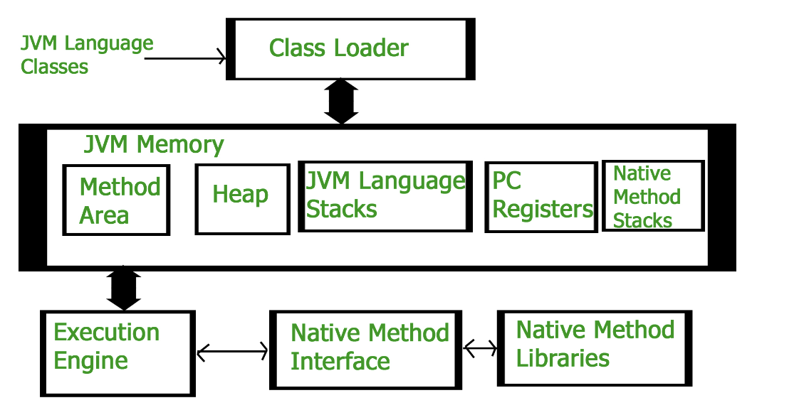
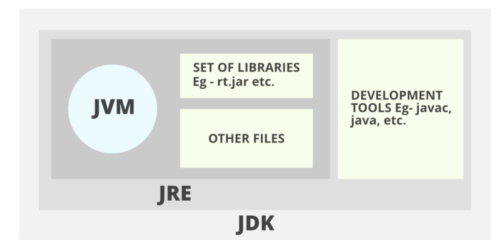

### 1.java基础

[Java教程](https://www.runoob.com/java/java-tutorial.html)

```java
/** GFG.java */
public class GFG {
	public static void main(String[] args)
	{
		System.out.println("GFG!");
	}
}

```

```shell
javac GFG.java
java GFG
```

> **Source File Name**
>
> The name of a source file should exactly match the public class name with the extension of .**java**. The name of the file can be a different name if it does not have any public class. Assume you have a public class **GFG**.



### 2.注解

在Java中，注解（Annotation）是一种将元数据（metadata）与Java代码相关联的方法。元数据是关于程序中数据和代码的额外信息，它可以用于描述代码的结构、行为和约束。注解可以提供编译时和运行时的额外信息，用于代码生成、编译检查、运行时处理等。

Java注解有以下几种类型：

1. 标准注解：Java提供了一些预定义的标准注解，例如@Override、@Deprecated、@SuppressWarnings等。这些注解可以提高代码的可读性和编译器的诊断能力。

2. 元注解：元注解是用于定义其他注解的注解。Java提供了一些预定义的元注解，例如@Retention、@Target、@Documented、@Inherited等。这些注解可以用来控制自定义注解的行为和约束。

3. 自定义注解：用户可以通过使用元注解来创建自己的注解。自定义注解可以用于提供编译时或运行时的特定信息，用于实现特定的功能或约束。

   要创建自定义注解，需要使用@interface关键字。

### 3. JDK, JRE and JVM



### 4.private、public、protected

- **default** (即默认，什么也不写）: 在同一包内可见，不使用任何修饰符。使用对象：类、接口、变量、方法。
- **private** : 在同一类内可见。使用对象：变量、方法。 **注意：不能修饰类（外部类）**
- **public** : 对所有类可见。使用对象：类、接口、变量、方法
- **protected** : 对同一包内的类和所有子类可见。使用对象：变量、方法。 **注意：不能修饰类（外部类）**。
