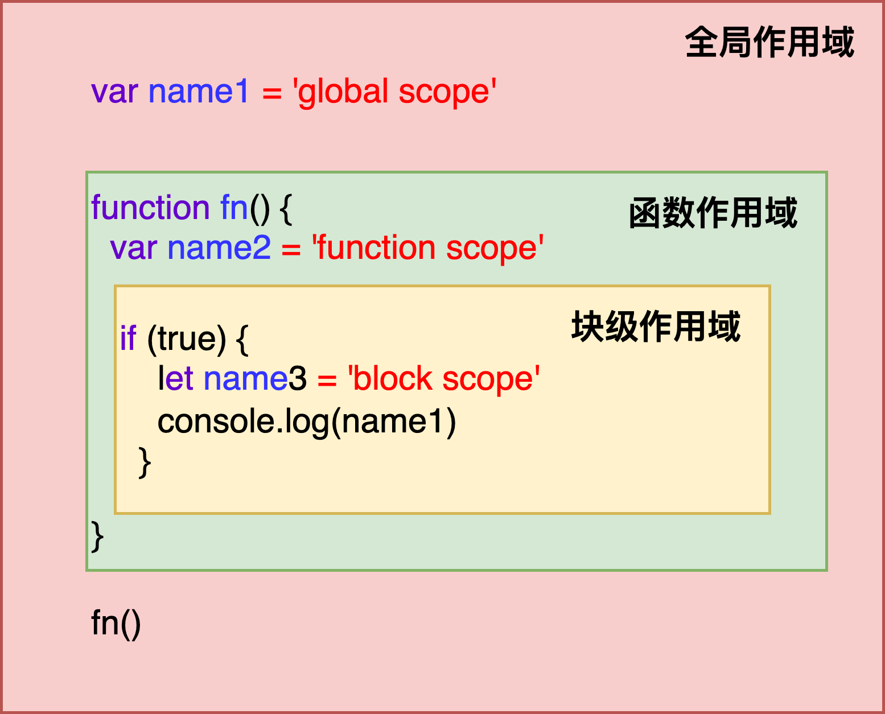
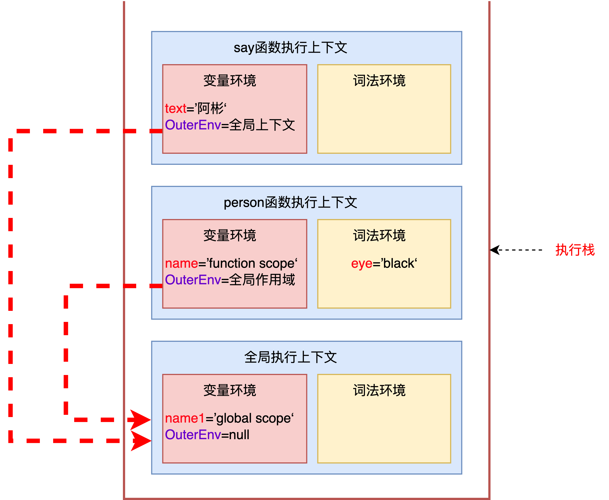

### 作用域 Scope

#### 1.作用域

 作用域是指在程序中定义变量的区域，该位置决定了变量的生命周期。通俗地理解，作用域就是变量与函数的可访问范围，即作用域控制着变量和函数的可见性和生命周期。

#### 2.作用域种类

##### 1.全局作用域

全局作用域中的对象在代码中的任何地方都能访问。

##### 2.函数作用域

函数作用域就是在函数内部定义的变量或者函数，并且定义的变量或者函数只能在函数内部被访问。函数执行结束之后，函数内部定义的变量会被销毁。

##### 3.块级作用域

块级作用域就是`{}`符号内部定义的变量或者函数，其只能在`{}`内部访问。

执行代码遇到`let` 、`const` 声明的变量时，会创建块级作用域。变量会被存到执行上下文中的词法环境中。


```javascript
// 示例1
var name1 = 'global scope'
function fn() {
  var name2 = 'function scope'
  if (true) {
    let name3 = 'block scope'
    console.log(name1)
  }
}
fn() 
```





#### 3.作用域链

每个执行上下文的变量环境中，都包含一个外部引用`OuterEnv`用来指向外部的执行上下文。当在当前的作用域内没有查到变量的信息时，会通过`OuterEnv`在上一级作用域中查找此变量信息。一直找到顶层作用域（全局作用域）为止，如果还没找到则报错。把这个查找链条叫做**作用域链**。

变量环境中`OuterEnv`指向的上一层作用域，是通过词法作用域来确认。

词法作用域是代码编译阶段就决定好的，和函数是怎么调用的没有关系。

> ##### 词法作用域
>
> 词法作用域就是指作用域是由代码中函数声明的位置来决定的，所以词法作用域是静态的作用域，通过它就能够预测代码在执行过程中如何查找标识符。

```javascript
var name = 'global scope'
function person() {
  var name = 'function scope'
  let eye = 'black'
  say()
}
function say() {
  var text = '阿彬'
  console.log(name)
}
person() // 打印：global scope
```



#### 4.在单个执行上下文中，变量的查找

在词法环境内部，维护了一个小型栈结构，栈底是函数最外层的变量，进入一个作用域块后，就会把该作用域块内部的变量压到栈顶；当作用域执行完成之后，该作用域的信息就会从栈顶弹出。（`let`、`const`声明的变量）

单个执行上下文中，查找一个变量，会沿着词法环境的栈顶向下查询，如果在词法环境中的某个块中查找到，就直接返回，如果没有查找到，继续在变量环境中查找。

```
```


[1]: https://exploringjs.com/impatient-js/toc.html	"JavaScript for impatient programmers"
[2]: https://exploringjs.com/

