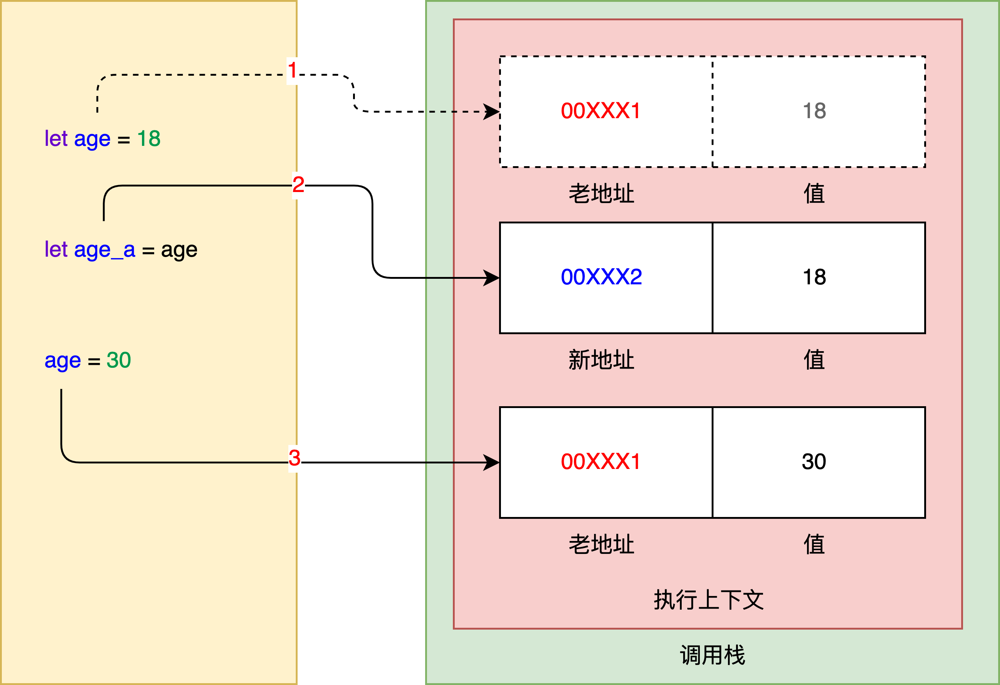
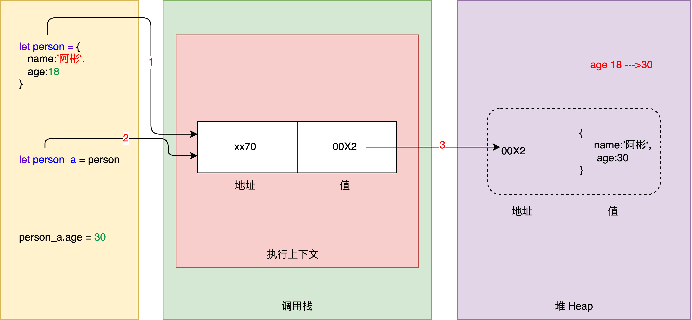
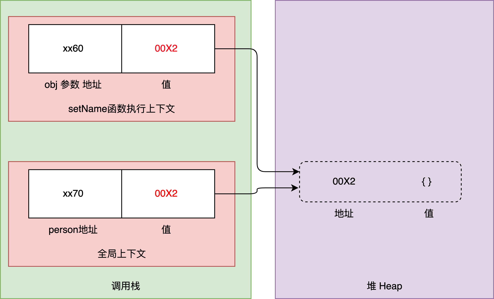
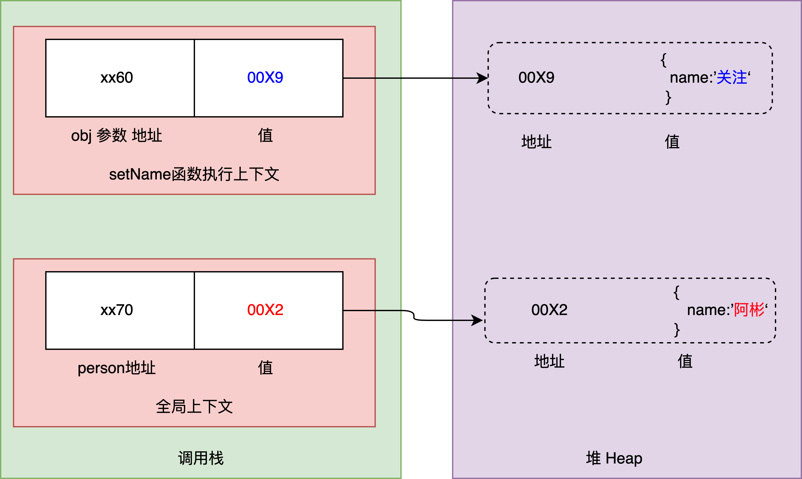

### 原始值、引用值

### 1.原始值 primitive value

原始值包括：`undfined`、`Null`、`Boolean`、`Number`、`String`、`Symbol`、`BigInt` 7种类型。

保存原始值的变量是按值（by value）访问的，因为我们操作的就是存储在变量中的实际值。

原始值存储在回调栈中的执行上下文中。


### 2.引用值  **Reference Value**

引用值包括：`Object` 类型一种, `Array`、`Function`都是对象类型,都继承于`Object `对象。

在操作对象时，实操作的是对该对象的引用（reference）而非实际的对象本身。

引用值存放在堆内存中。

### 3.复制值

#### 原始值复制

原始值从一个变量赋给另一个变量，原始值会被复制到新变量的位置。这两个变量可以独立使用，互不干扰。

```javascript
let age = 18;
let age_a = age;
age = 30
```



#### 引用值复制

引用值从一个变量赋给另一个变量，复制的值实际上是一个指针，它指向存储在堆内存中的对象。两个变量实际

上指向同一个对象，因此一个对象上面的变化会在另一个对象上反映出来。

```javascript
let person = {
	name:'阿彬',
	age:18
}
let person_a = person
person_a.age = 30
```



### 4.传递参数

所有函数的参数都是按值传递的。尤其要注意对象作为参数传递给函数时，也是按值传递的，传递过去的是对象在堆中的**地址**，在函数内部，对参数操作会影响到外面的对象。

```javascript
function setName(obj) {
  obj.name = '阿彬'
  obj = new Object()
  obj.name = '关注'
}
let person = new Object();
setName(person);
console.log(person.name); // 打印：'阿彬'
```





> 内存中，栈在上，堆在下分布。上图堆栈并排，只是为了好理解。 


[1]: https://www.geeksforgeeks.org/primitive-and-reference-value-in-javascript/#:~:text=Reference%20Value%3A%20JavaScript%20provides%20three,actual%20value%20that%20is%20stored.
[2]: https://www.zhenghao.io/posts/javascript-memory
[3]: https://anil-pace.medium.com/memory-allocations-in-js-30269d5a0e30
[4]: https://felixgerschau.com/javascript-memory-management/

