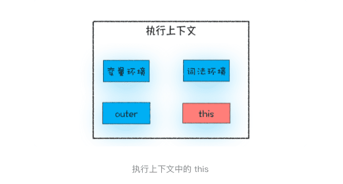

> 从javasscript执行上下文的视角讲清楚this

**在对象内部的方法中使用对象内部的属性是一个非常普遍的需求**(c++ 语言中能访问)。但是 JavaScript 的作用域机制并不支持这一点，基于这个需求，JavaScript 又搞出来另外一套 **this** 机制。

**作用域链和 this 是两套不同的系统，它们之间基本没太多联系。**

### 1.JavaScript 中的this是什么

**执行上下文中包含了变量环境、词法环境、外部环境、this**



> this 是和执行上下文绑定的，也就是说每个执行上下文中都有一个 this。前面《调用栈》中，执行上下文主要分为三种——全局执行上下文、函数执行上下文和 eval 执行上下文，所以对应的 this 也只有这三种——全局执行上下文中的 this、函数中的 this 和 eval 中的 this。

### 2.全局执行上下文中的this

**全局执行上下文中的 this 是指向 window 对象的。这也是 this 和作用域链的唯一交点，作用域链的最底端包含了 window 对象，全局执行上下文中的 this 也是指向 window 对象。**


### 3.函数执行上下文中的 this

#### 1.通过函数的call 方法设置

```javascript
let bar = {
  myName : "极客邦",
  test1 : 1
}
function foo(){
  this.myName = "极客时间"
}
foo.call(bar)
console.log(bar)
console.log(myName)
```

> call、bind、apply 的区别及实现

#### 2.通过对象调用方法设置

```javascript
var myObj = {
  name : "极客时间", 
  showThis: function(){
    console.log(this)
  }
}
myObj.showThis()
```

```javascript
var myObj = {
  name : "极客时间",
  showThis: function(){
    this.name = "极客邦"
    console.log(this)
  }
}
var foo = myObj.showThis
foo()
```

**在全局环境中调用一个函数，函数内部的 this 指向的是全局变量 window。**

**通过一个对象来调用其内部的一个方法，该方法的执行上下文中的 this 指向对象本身。**

#### 3.通过构造函数中设置

```
function CreateObj(){
  this.name = "极客时间"
}
var myObj = new CreateObj()
```

> new 的内部步骤？

#### 4.this 的设计缺陷以及应对方案

##### 1.嵌套函数中的 this 不会从外层函数中继承

```javascript
var myObj = {
  name : "极客时间", 
  showThis: function(){
    console.log(this)
    function bar(){console.log(this)}
    bar()
  }
}
myObj.showThis()
```

**函数 bar 中的 this 指向的是全局 window 对象，而函数 showThis 中的 this 指向的是 myObj 对象。**

解决这个问题的小技巧：

1.声明一个变量 self 用来保存 this

```javascript
var self = this 
function bar(){ 
	self.name = "极客邦"
}
```

本质是把 this 体系转换为了作用域的体系。

##### 2.普通函数中的 this 默认指向全局对象 window

，在默认情况下调用一个函数，其执行上下文中的 this 是默认指向全局对象 window 的。

> 不过这个设计也是一种缺陷，因为在实际工作中，我们并不希望函数执行上下文中的 this 默认指向全局对象，因为这样会打破数据的边界，造成一些误操作。如果要让函数执行上下文中的 this 指向某个对象，最好的方式是通过 call 方法来显示调用。
>
> 这个问题可以通过设置 JavaScript 的“严格模式”来解决。在严格模式下，默认执行一个函数，其函数的执行上下文中的 this 值是 undefined，这就解决上面的问题了。

```javascript
let userInfo = {
  name:"jack.ma",
  age:13,
  sex:male,
  updateInfo:function(){
    //模拟xmlhttprequest请求延时
    setTimeout(function(){
      this.name = "pony.ma"
      this.age = 39
      this.sex = female
    },100)
  }
}

userInfo.updateInfo()
// 修改代码 使this 指向userInfo
```