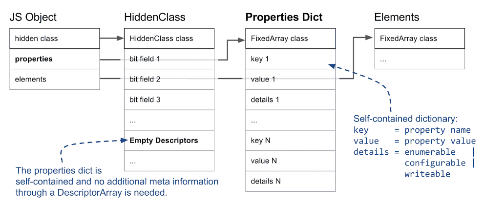

### 1.命名属性、数组属性

命名属性 Named properties、排序属性 Indexed properties

```javascript
{‘first’:1,'second':2}   // 命名属性
```

```javascript
{1:'a',2:'b'} //排序属性
```

js对象中的**数字属性**被称为排序属性，按照索引大小升序排列。

js对象中的**字符串属性**被称为命名属性，根据创建时的顺序升序排序。


- Array-indexed properties are stored in a separate elements store.
- Named properties are stored in the properties store.
- Elements and properties can either be **arrays** or **dictionaries**.
- Each JavaScript object has a **HiddenClass** associated that keeps information about the object shape.

### 2.隐藏类、描述符数组

#### 1.什么是隐藏类 hiddenClasses

在V8中，js对象的第一个字段指向隐藏类（在V8，隐藏类又称为map，每个对象都有map属性指向内存中的隐藏类）。隐藏类用来存储对象的元信息，包括对象上属性的数量（准确的说是快属性）和对象prototype的引用。

在隐藏类第三个字段是最重要的，存储着对象属性数量的值和指向描述符数组的指针。描述符数组里面包含：属性的名称和属性存放的位置的信息。


#### 2.怎么创建隐藏类

默认对象每添加一个**命名属性**，就会创建一个新的隐藏类。属性名一样、属性名顺序也一样的对象，共享相同的隐藏类。

给对象添加排序属性不会创建隐藏类。

##### 1.每添加一个新的属性，就会创建一个新的隐藏类。


##### 2.添加的属性顺序不一样也会创建不同的隐藏类


#### 3.为什么会有隐藏类呢？

 在静态编程语言中如C++，使用对象时需要先定义对象的结构（都包含哪些属性），编译之后对象的结构不可以改变，增加属性或者删除属性。javascript是动态编程语言，在运行时是可以动态改变对象的结构的。在V8中为了实现js动态改变对象的特性，引入了隐藏类（hiddenClasses）。有了隐藏类之后，对象增/删属性都会在隐藏类中实现，不会去动原对象的结构。V8在访问对象的某个属性时，就会先去隐藏类中找该属性的内存地址，然后V8就去内存中取出对应的属性值。


#### 4.再探js慢属性和快属性

js 访问快属性时，先访问隐藏类，获取属性内存地址，再去Properties找属性值。


如果从一个对象中添加和删除许多属性，就会产生大量的时间和内存开销来维护描述符数组和隐藏类HiddenClasses。因此V8支持慢属性，把属性值信息全部存放在Properties 字典中，不再存放在隐藏类中的描述符数组中。



#### 5.代码优化

因为一个对象中添加和删除许多属性，就会产生大量的时间和内存开销来维护描述符数组和隐藏类HiddenClasses。所以从这方面可以优化代码

1.预先把对象中的属性全部定义出来，以此减少创建新的隐藏类。同时一眼就能看出这个对象有什么属性。

不要先定义一个空对象，之后在业务逻辑中，不停的添加新属性。

2.减少用delete操作符删除对象属性，以此减少创建新的隐藏类。


### 3.Elements or array-indexed properties

排序属性(整数索引属性)存储在对象的elements上，大概分为以下几类

#### 1. **Packed or Holey Elements:**

**不连续空间的Elements**

删除对象的排序属性或者排序属性未定义，会造成内存不连续的空间。V8 在对象上没找到属性，则会去原型链上找。如果每次都去原型链上找会很耗时消耗性能，需要一个标识来判断是否去原型链上找属性。创建排序属性不会创建隐藏类来保存元素信息，因此有个特殊的值`the_hole`,来标识属性是否存在elments上。这对于Array函数的性能至关重要。


#### 2.**Fast or Dictionary Elements**

elements 的存储结构分为：数组结构和字典结构。数组结构的elements访问最快，字节结构访问慢。

##### 什么情况下elements会使用字典结构？

1.如果数组结构有很多空地址，则会改用字典结构来存储，来节省内存空间。


2.因为排序属性不会产生隐藏类，来保存信息。当给对象排序属性自定义描述时，V8会用字典结构来保存。


注意：Array functions 性能会慢，在处理对象排序属性为字典结构的时候。

#### 3.**Smi and Double Elements:** 

如果只将整数存储在数组结构的elements时，GC不会去查看elements，因为整数直接编译成小整数(Smis)。

如果双精度数值存储在数组结构的elements时，V8会为pure double array 存储 raw doubles，以避免内存和性能的消耗。

因为浮点数表示为占用多个单词的完整对象。

#### 4.**Special Elements**

With the information so far we covered 7 out of the 20 different element kinds. For simplicity we excluded 9 element kinds for TypedArrays, two more for String wrappers and last but not least, two more special element kinds for arguments objects.

#### 5.**The ElementsAccessor**

总不能为每种类型的elements 写一次Array functions，V8 会在内部调用一个用 C++ 编写的内置函数，并通过 ElementsAccessor 分派到该函数的专用版本。


```javascript
 let obj = {
      b: 'testb',
      a: 'testa',
      2: 'test2',
      测: 'test测',
      1: 'test1',
  };
  console.log(Object.keys(obj));
// Chrome 的js 引擎遍历对象属性时会遵循一个规律:会先提取所有key的parseFloat值为非负整数的属性，然后根据数字顺序排序首先遍历出来，然后按照对象定义的顺序遍历余下的所有属性
```


[1]: https://v8.dev/blog/fast-properties
[2]: https://www.cnblogs.com/chargeworld/p/12236848.html
[3]: https://medium.com/swlh/writing-optimized-code-in-js-by-understanding-hidden-classes-3dd42862ad1d
[4]: https://blog.bitsrc.io/secret-behind-javascript-performance-v8-hidden-classes-ba4d0ebfb89d
[5]: https://draft.li/blog/2016/12/22/javascript-engines-hidden-classes/

