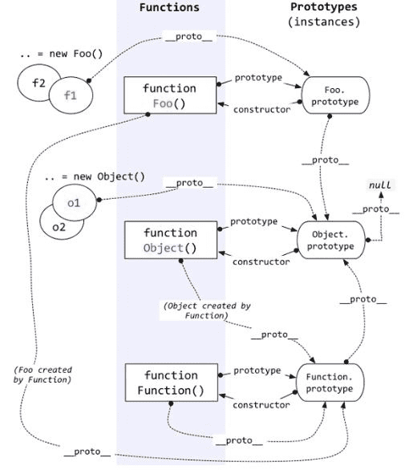

#### 1.原型定义：

1. 每个函数都会创建一个 prototype 属性，这个属性是一个对象，包含应该由特定引用类型的实例 共享的属性和方法。

2. 无论何时建一个函数，就会按照特定的规则为这个函数创建一个 prototype 属性（指向原型对象）。默认情况下，所有原型对象自动获得一个名为 constructor 的属性，指回与之关联的构造函数。

3. 在读取实例上的属性时，首先会在实例上搜索这个属性。如果没找到，则会继承搜索实例的原型。在通过原型链实现继承之后，搜索就可以继承向上，搜索原型的原型。

4. 默认情况下，所有引用类型都继承自 Object ，这也是通过原型链实现的。

   ```
    Object.create()
   ```

   > 脚本中没有访问这个[[prototype]]特性的标准方式，但是Firefox、Safari和Chrome会在每个对象上暴露`__proto__ `属性，通过这个属性可以访问对象的原型。

   ```javascript
   function SuperType(){
       this.name = 'Super'
   }
   SuperType.prototype.getSuperName = function(){
       return this.name
   }
   function SubType(){
       this.SubName = 'Sub'
   }
   SubType.prototype = new SuperType();
   SubType.prototype.getSubName = function(){
       return this.Subname
   }
   let instance = new SubType()
   ```

   



#### 2.判断一个对象是否存在另一个对象的原型链中

##### 1.`isProtoTypeOf()`

语法：`prototypeObj.isPrototypeOf(object)`

```javascript
function object1() {}
function object2() {}
object1.prototype = Object.create(object2.prototype);
const object3 = new object1();
console.log(object1.prototype.isPrototypeOf(object3));
// expected output: true
console.log(object2.prototype.isPrototypeOf(object3));
// expected output: true
```

##### 2.`instanceof` 

语法：`object instanceof constructor`

```javascript
// defining constructors
function C() {}
function D() {}

let o = new C()

// true, because: Object.getPrototypeOf(o) === C.prototype
o instanceof C

// false, because D.prototype is nowhere in o's prototype chain
o instanceof D

o instanceof Object           // true, because:
C.prototype instanceof Object // true
```

> `isPortotypeOf() ` 与 `instanceof` 的区别是：
>
> ```javascript
> var superProto = {
>     // some super properties
> }
> 
> var subProto = Object.create(superProto);
> subProto.someProp = 5;
> 
> var sub = Object.create(subProto);
> 
> console.log(superProto.isPrototypeOf(sub));  // true
> console.log(sub instanceof superProto);      // TypeError
> //Here, you don't have a constructor function to use with instanceof. You can only use subProto.isPrototypeOf(sub).
> ```
>
> `isPrototypeOf()` differs from the [`instanceof`](https://developer.mozilla.org/en-US/docs/Web/JavaScript/Reference/Operators/instanceof) operator. In the expression "`object instanceof AFunction`", the `object` prototype chain is checked against `AFunction.prototype`, not against `AFunction` itself.
>
> [1]: https://stackoverflow.com/questions/18343545/javascript-isprototypeof-vs-instanceof-usage
>
> 

##### 3.`instancof` 实现

```javascript
function instance_of(L, R) {//L 表示左表达式，R 表示右表达式 
    var O = R.prototype;   // 取 R 的显示原型 
    L = L.__proto__;  // 取 L 的隐式原型
    while (true) {    
        if (L === null)      
             return false;   
        if (O === L)  // 当 O 显式原型 严格等于  L隐式原型 时，返回true
             return true;   
        L = L.__proto__;  
    }
}
// 关于instanceof的结果不要仅从字面上理解, 它的计算规则是: 如果右侧构造函数的prototype属性能在左侧的对象的原型链中找到, 那么就返回true, 否则就返回false
```

#### 3.获取对象的原型

##### `Object.getPrototypeOf()` 

The **`Object.getPrototypeOf()`** method returns the prototype (i.e. the value of the internal `[[Prototype]]` property) of the specified object.

```javascript
function hasPrototypeProperty(object,name){
    return !object.hasOwnProperty(name) && (name in object)
}
```

#### 4.判断属性是在实例上还是在原型对象上

>  只要给对象实例添加一个属性，这个属性就会遮蔽（shadow）原型对象上的同名属性，也就是虽然
> 不会修改它，但会屏蔽对它的访问。即使在实例上把这个属性设置为 null，也不会恢复它和原型的联
> 系。不过，使用 **delete** 操作符可以完全删除实例上的这个属性，从而让标识符解析过程能够继续搜索
> 原型对象。

##### 1.`hasOwnProperty()`   

判断属性是否在实例上

> 检查属性是否为`undefined` 是不能购检查其是否存在的。该属性可能已经存在，但其值恰好被设置成了`undefined`

##### 2.`in` 操作符 

判断属性是否在实例的原型链上

```javascript
function Person() {} 
Person.prototype.name = "Nicholas"; 
Person.prototype.age = 29; 
Person.prototype.job = "Software Engineer"; 
Person.prototype.sayName = function() { 
 console.log(this.name); 
}; 
let person1 = new Person(); 
let person2 = new Person(); 
console.log(person1.hasOwnProperty("name")); // false 
console.log("name" in person1); // true 
person1.name = "Greg"; 
console.log(person1.name); // "Greg"，来自实例
console.log(person1.hasOwnProperty("name")); // true 
console.log("name" in person1); // true 
console.log(person2.name); // "Nicholas"，来自原型
console.log(person2.hasOwnProperty("name")); // false 
console.log("name" in person2); // true 
delete person1.name; 
console.log(person1.name); // "Nicholas"，来自原型
console.log(person1.hasOwnProperty("name")); // false 
console.log("name" in person1); // true
```

##### 3.确定某个属性是否在原型上

```javascript
function hasPrototypeProperty(object, name){ 
 return !object.hasOwnProperty(name) && (name in object); 
}
```

#### 5.习题

```javascript
Function.prototype.say = function () {
    console.log('fn')
}
Object.prototype.print = function () {
    console.log('obj')
}

function Foo() { }
let instance = new Foo()

try {
    Foo.say()
    Foo.print()

    console.log(Object.prototype.__proto__)
    console.log(Function.__proto__ === Object.prototype)
    console.log(Function.__proto__ === Function.prototype)
    console.log(instance.__proto__.__proto__ === Object.prototype)
    console.log(Foo.__proto__.__proto__.__proto__)
    console.log(instance.prototype)

    instance.print()
    instance.say()

} catch (e) {
    console.log(e)
}

```

```javascript
function foo() {
    this.value = 42
}

foo.prototype = {
    method: function () {
        return false
    },
}

function bar() {
    var value = 1
    return {
        method: function () {
            return value
        },
    }
}

foo.prototype = new bar()

console.log(foo.prototype.constructor)
console.log(foo.prototype instanceof bar)

let test = new foo()

console.log(test instanceof foo)
console.log(test.__proto__ === foo.prototype)
console.log(test instanceof bar)
console.log(test.method())
```


