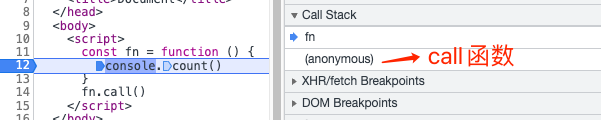
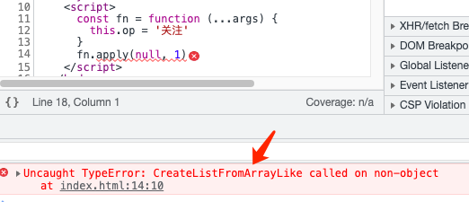

### 1.call

#### 1.Ecma262定义：

`Function.prototype.call ( thisArg, ...args )`：

1. Let func be the this value. 

   设目标函数func 为 this 的值

2. If [IsCallable](https://tc39.es/ecma262/multipage/abstract-operations.html#sec-iscallable)(func) is false, throw a TypeError exception.

   调用`icCallable`函数判断判断`func` 是否可执行调用, func不能调用咋抛出错误。

   >  IsCallable ( argument ):
   >
   > 1. If argument [is not an Object](https://tc39.es/ecma262/multipage/ecmascript-data-types-and-values.html#sec-object-type), return false.
   > 2. If argument has a [[Call]] internal method, return true.
   > 3. Return false.

3. Perform [PrepareForTailCall](https://tc39.es/ecma262/multipage/ecmascript-language-functions-and-classes.html#sec-preparefortailcall)().

   PrepareForTailCall 函数作用是：尾调用优化，在调用目标函数之前(即下边第4步骤)，释放当前执行上下文环境(即call函数的)相关资源。

   注意：只是释放了资源，函数调用栈的数量没变(call函数没有从调用栈中删除)。如下图

   

   

4. Return ? [Call](https://tc39.es/ecma262/multipage/abstract-operations.html#sec-call)(func, thisArg, args).

   尾调用执行目标函数func


[1]: https://developer.mozilla.org/en-US/docs/Web/JavaScript/Reference/Global_Objects/Array/slice#calling_slice_on_non-array_objects	"slice 截non-array 对象"
[2]: https://tc39.es/ecma262/multipage/fundamental-objects.html#sec-function.prototype.call	"ecma262 call标准定义"
[3]: https://tc39.es/ecma262/multipage/abstract-operations.html#sec-iscallable	" isCallable"
[4]: https://stackoverflow.com/questions/50419625/do-bound-functions-support-proper-tail-calls-in-es6	"stackoverflow "

> he `PrepareForTailCall` happens in [`EvaluateDirectCall` during the evaluation of the call expression](https://www.ecma-international.org/ecma-262/6.0/index.html#sec-evaluatedirectcall), where it checks whether that expression is in a tail position. When the tail call is prepared, the current running execution context is dropped, before the function is [called](https://www.ecma-international.org/ecma-262/6.0/index.html#sec-call), dispatching on the respective `[[Call]]` internal method. The new running execution context is set up in [`PrepareForOrdinaryCall`](https://www.ecma-international.org/ecma-262/6.0/index.html#sec-prepareforordinarycall) from the [`[[Call\]]` method of user-defined functions](https://www.ecma-international.org/ecma-262/6.0/index.html#sec-ecmascript-function-objects-call-thisargument-argumentslist). The [`[[Call\]]` method of bound functions](https://www.ecma-international.org/ecma-262/6.0/index.html#sec-bound-function-exotic-objects-call-thisargument-argumentslist) just introduces an extra level of indirection before that happens.
>
> > In the ECMAScript 2015 Language Specification, the definitions of `Function.prototype.apply` and `Function.prototype.call` both include "*Perform `PrepareForTailCall()`*" as one of their steps, so we know that these functions support proper tail calls.
>
> The `call` and `apply` methods are functions calling functions, and when they are called there are two calls on the stack that need to be tail-call-optimised. (Contrast this to - for example - `Array.prototype.map`, which also calls other functions, but here the `map` execution context stays on the call stack. In `call` and `apply`, the `Call()` is indeed in a tail position of the algorithm).

[5]: https://262.ecma-international.org/6.0/#sec-evaluatedirectcall	"Sec-evaluatedirectcall"
[6]: https://tc39.es/ecma262/multipage/indexed-collections.html#sec-array.prototype.map	" ecma 262 map"
[7]: https://262.ecma-international.org/6.0/#sec-evaluatedirectcall	" Runtime Semantics: EvaluateDirectCall( func, thisValue, arguments, tailPosition )"
[8]: https://262.ecma-international.org/6.0/#sec-bound-function-exotic-objects-call-thisargument-argumentslist	" BoundFunctionCreate (targetFunction, boundThis, boundArgs)"

#### 2.实现

```javascript
Function.prototype._call = function (v, ...args) {
	// v 为null、undefined、非对象、转化为对象处理.代码实现省略
  // this在_call指向的是目标函数 本例指fn
  v.fn = this
  // 把this 复制给v的一个属性并执行，是改变目标函数执行时this的指向，
  // 即this指向v
  return v.fn(...args)
}
const obj = {
  name: '关注@程序员阿彬',
}
const fn = function () {
  console.log(this.name)
  console.log(arguments)
}
fn._call(obj, 1, 2)
// 打印：'关注@程序员阿彬'
// 打印：Arguments(2) [1, 2, callee: ƒ, Symbol(Symbol.iterator): ƒ]
```

```javascript
Function.prototype.call2 = function (context) {
    var context = context || window;
    context.fn = this;

    var args = [];
    for(var i = 1, len = arguments.length; i < len; i++) {
        args.push('arguments[' + i + ']');
    }

    var result = eval('context.fn(' + args +')');

    delete context.fn
    return result;
}
// 写法很垃圾
```

### 2.apply

#### 1.定义

`Function.prototype.apply ( thisArg, argArray )`

1.  Let func be the this value.

2. If [IsCallable](https://tc39.es/ecma262/multipage/abstract-operations.html#sec-iscallable)(func) is false, throw a TypeError exception.

3. If argArray is undefined or null, then

   a. Perform [PrepareForTailCall](https://tc39.es/ecma262/multipage/ecmascript-language-functions-and-classes.html#sec-preparefortailcall)().

   b. Return ? [Call](https://tc39.es/ecma262/multipage/abstract-operations.html#sec-call)(func, thisArg).

   > 对`argArray` 进行判断，如果没有参数，执行跟call一样

4. Let argList be ? [CreateListFromArrayLike](https://tc39.es/ecma262/multipage/abstract-operations.html#sec-createlistfromarraylike)(argArray).

   >  如果argArray为类数组对象，调用CreateListFromArrayLike函数把它转化为数组。argArray非数组或非类数组对象的话，会报错。
   >
   > 
   >
   > 类数组对象这样的 `{0:'a',1:'b',length:2}`

5. Perform [PrepareForTailCall](https://tc39.es/ecma262/multipage/ecmascript-language-functions-and-classes.html#sec-preparefortailcall)().

6.  Return ? [Call](https://tc39.es/ecma262/multipage/abstract-operations.html#sec-call)(func, thisArg, argList).

#### 2.实现

参考call 的实现


> 注意call、apply中：
>
> 1.如果目标函数是箭头函数或者绑定了外部对象的函数，在最后一步`Call(func,thisArg,args)`时，会忽略 `thisArg` 参数。
>
> 看下图代码：
>
> ```javascript
> const obj = {
>   name: '关注@程序员阿斌',
> }
> const fn = function () {
>   console.log(this.name)
> }
> const bound_function_exotic_object = fn.bind(obj)
> //绑定了外部对象的函数
> bound_function_exotic_object.call({ name: '收藏' }) 
> // 打印：关注@程序员阿斌,绑定的对象失效
> 
> const fn1111 = () => {
>    console.log(this.name === '')
> }
> fn1111.call(obj)
> // 打印：true，绑定的对象失效
> ```
>
> 2.`thisArg` 为`null`、`undefined`时，`thisArg`会被赋值为全局对象。 非对象String、Boolean、Number、BigInt、Symbol会被转化成对应的对象类型（如： a new Boolean object）。


### 3.bind

#### 1.语法

`func.bind(thisArg, arg1, arg2, /* …, */ argN)`

1. thisArg

   func内部this 的指向

2. arg1, …, argN

   传给func 的参数

#### 2.特性

1. 返回值函数为：内部`this = Argthis`的func函数的**复制**，有参数则初始参数。

   对func的复制是关键。底层的实现逻辑是：复制出来的函数 记为funcCopyed，是一个*exotic object*，不是普通的对象。

   funcCopyed 是个本质是个对象，所以funcCopyed.prototype 为`undefined`（在前面‘原型链’笔记中提过）。

   ```javascript
    const fn = function () {}
    const fnBind = fn.bind(null)
    console.log(fnBind.prototype) //undefined
   ```

   funcCopyed 没有`prototype`属性，所以funcCopyed 不能被继承。

   ```javascript
   class Derived extends class {}.bind(null) {}
   // TypeError
   ```

   底层复制过程如下：

   `obj.[[Prototype]] = func.prototype`

   `obj.[[BoundTargetFunction]]` = func

   `obj.[[BoundThis]] =Argthis `

   `obj.[[BoundArguments]]= 参数`

   `obj.[[Call]]`复制为func.[[call]]

   `obj.[[Constructor]]` 赋值为func.[[Constructor]]

   > 在浏览器环境中，除了`[[Prototype]]`可通过`__proto__`访问,其它属性[[]] 都不能访问。这在模拟实现bind 的时候，不能通过obj 去复制func，只能通过创建一个函数去模拟复制func。

2. 已绑定this的func，再次调用bind 绑定this会失效，但是参数会被传递过去。

   ```javascript
   function log(...args) {
     'use strict' // prevent `this` from being boxed into the wrapper object
     console.log(this, ...args)
   };
   const boundLog = log.bind('关注', 1, 2)
   const boundLog2 = boundLog.bind('点赞', 3, 4)
   boundLog2(5, 6) // '关注', 1, 2, 3, 4, 5, 6
   ```

3. 对返回函数funcCopyed，进行new 操作时，其绑定的this失效，

   ```javascript
   let obj = { name: '小彬' }
   
   function say() {
   console.log(this.name)
   }
   
   let sayBind = say.bind(obj)
   sayBind() // 小彬
   new sayBind()  // undefined
   ```

4. 对func new 操作符时，继承funcCopy 函数

   > funCopy 是 func的复制： new func() instanceof  func === new func() instanceof  funcCopy

   ```javascript
   function Base(){}
   const BoundBase = Base.bind(null)
   console.log(new Base() instanceof BoundBase)
   // true
   ```

   

#### 3.实现

根据bind的特点模拟实现如下：`func._bind(thisArg,...args)`

1. 返回函数 : funcCopy
2. 继承 :new func  instanceof  funcCopy  === true 
3. 连续bind 时，第一个this 生效，参数合并

```javascript
Function.prototype._bind = function (thisArgs, ...args) {
  let F = this
  const boundFunction = function (...boundArgs) { 
    let applyArgs = args.concat(boundArgs) 
    // 3.合并参数
    return F.apply(thisArgs, applyArgs) 
    // 3.第一个绑定this生效
  }
  boundFunction.prototype = F.prototype //2.继承
  return boundFunction // 1.返回函数
}
```

第4个特性，需要判断是否作为构造函数。可通过 instanceof 去判断（详见前面笔记”new 操作符的执行过程“）。

```javascript
if (this instanceof boundFunction) {
  // 作为构造函数时候
  return new F(...applyArgs)
} else {
  return F.apply(thisArgs, applyArgs)
}
```

简洁版完整代码

```javascript
Function.prototype._bind = function (thisArgs, ...args) {
  let F = this
  const boundFunction = function (...boundArgs) {
    let applyArgs = args.concat(boundArgs)
    if (this instanceof boundFunction) {
      return new F(...applyArgs)
    } else {
      return F.apply(thisArgs, applyArgs)
    }
  }
  boundFunction.prototype = F.prototype
  return boundFunction
}
```

> 简单版实现方式会有以下问题：
>
> ```javascript
>  // 简单版实现方式会有以下问题：示例1
> let fn = function () {}
>  fn.prototype.say = function () {
>    console.log('1')
>  }
> let fnBind = fn._bind(null)
> fnBind.prototype.say = function () { 
>   console.log('2')
> }
> let ins = new fn()
> ins.say() // 2 
> ```
>
> 在原型链中间加一层 即可
>
> ```javascript
> Function.prototype._bind = function (thisArgs, ...args) {
>   let F = this
>   let bridge = function () {}
>   bridge.prototype = F.prototype
>   const boundFunction = function (...boundArgs) {
>     let applyArgs = args.concat(boundArgs)
>     if (this instanceof boundFunction) {
>       return new F(...applyArgs)
>     } else {
>       return F.apply(thisArgs, applyArgs)
>     }
>   }
>   boundFunction.prototype = new bridge()
>   return boundFunction
> }
> // 在执行示例1 打印//1
> ```

#### 4.习题

 检测下自己有没有理解

```javascript
// 打印什么
var value = 2
let foo = { value: 1 }

function bar(name, age) {
  console.log(this.value)
}

let instance = new bar()
let bindFoo = bar.bind(foo)
let bindInstance = new bindFoo('18')

console.log(bar())
bindFoo()
console.log(bindInstance.__proto__ === bar.prototype)
console.log(bindFoo.prototype)
```

```

/*
undefined
undefined
2
undefined
1
true
undefined
  */
```


> 耐心看完前几张图，会面会有实现方式，前面的ema262 标准定义的bind 函数执行过程。

[1]: https://developer.mozilla.org/en-US/docs/Web/JavaScript/Reference/Global_Objects/Array/slice#using_slice_to_convert_array-like_objects_to_arrays	"slice 转array-like 对象 为数组"
[2]: https://github.com/zloirock/core-js/blob/master/packages/core-js/internals/function-bind.js	"Core-js中bind 的实现方法"
[3]: https://tc39.es/ecma262/multipage/fundamental-objects.html#sec-function.prototype.bind	"Function.prototype.bind"

