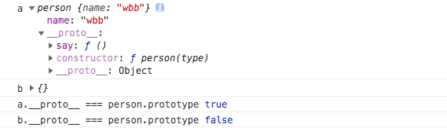

### js的new 操作符 内部执行过程

#### 一、new操作符执行的过程

1. 在内存中创建一个新对象。
2. 这个新对象内部的[[Prototype]]特性被赋值为构造函数的 prototype 属性。
3. 构造函数内部的 this 被赋值为这个新对象（即 this 指向新对象）。
4. 执行构造函数内部的代码（给新对象添加属性）。
5. 如果构造函数返回非空对象，则返回该对象；否则，返回刚创建的新对象。

#### 二、js 中 new 操作符调用构造函数时，执行步骤

以` let func = new Fn()` 为例,js 中使用 new 操作符来调用构造函数Fn时，会执行4步骤：

1. 创建一个新对象obj  

   ```javascript
   let obj = new Object()
   ```

2. 新对象obj的原型属性`__proto__` 指向 构造函数( Fn )的原型对象(Fn.prototype)

   ```javascript
   obj.__proto__ = Fn.prototype
   ```

3. 新对象会绑定到函数调用的this上，并执行构造函数

   ```
   let result =  Fn.call(obj) 
   ```

4. 如果构造函数没有返回其它对象，则返回这个新对象

   ```
   if(type result === 'object'){
   	return result  // func = result
   }else{
   	return obj  	 // func = obj
   }
   ```

*例一：*

```javascript
function person(type) {
  this.name = 'wbb'
  switch (type) {
    case 1:  
      // 返回 除object 类型外的其它基本类型时
      return 1

    case 2:
      // 返回 object 时
      return {}
  }
}
person.prototype.say = function() {
	console.log(this.name)
}
let a = new person(1)
let b = new person(2)
console.log('a',a)
console.log('b',b)
console.log(a.__proto__ === person.prototype)  // true
console.log(b.__proto__ === person.prototype)  // false
```



#### 三、模拟new 操作符

```javascript
function $new (fn){
  let obj = new Object(),
      // 获取fn 的 入参
      args = Array.prototype.slice.call(arguments,null).slice(1),  
      result
  obj.__proto__ = fn.prototype
  result = fn.apply(obj,args)
  return typeof result === 'object' ? result : obj
}
let a = $new(person , 1)
let b = $new(person , 2,3)
console.log('a',a)
console.log('b',b)
console.log('a.__proto__ === person.prototype',a.__proto__ === person.prototype)  // true
console.log('b.__proto__ === person.prototype',b.__proto__ === person.prototype)  // false
// 跟上面例一输出一样
```

