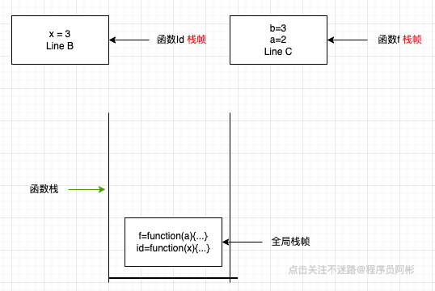
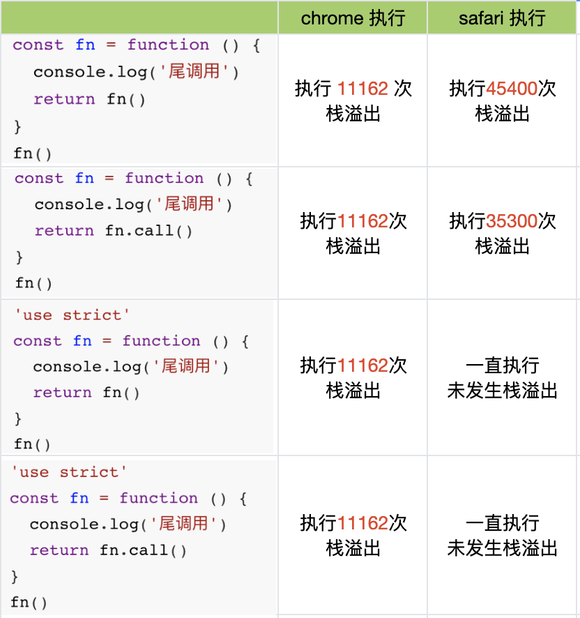

### js中的尾调用优化

#### 1.什么是尾调用

尾调用就是指某个函数的最后一步是 调用另一个函数。

```javascript
function fn(x){
	return gn(x)
}
//函数fn的最后一步调用函数gn，这就叫尾调用
```

#### 2.尾调用优化

```javascript
function id(x) {
    return x
}
function f(a) {
    let b = a + 1
    return id(b)
}
f(2)
```

函数`f(2)` 执行时，函数f栈帧会被压入函数栈。执行到 `id(b)`时，由于是函数f执行的最后一步，所以不需要函数f 栈帧。函数f 栈帧会被弹出函数栈，函数id栈帧被压入。尾调用减少了函数栈的使用空间，本来要压入两个栈帧，现在只需压入一个即可。

尾递归的时候不会栈溢出。





#### 3.四种函数调用方式，能触发尾调用优化

1. 直接调用函数：func(...)
2. 对象方法调用：obj.method(...)
3. 用call函数调用函数:  func.call(...)
4. 用apply函数调用函数: func.apply(...)

以上四种方式，在函数尾部调用，都会触发尾调用优化。

#### 4.四种运算符，能触发尾调用优化

1. 三元操作符 ( ? : )

   `const a = x => x ? f() : g()`  

   函数f()、函数g() 都在最后一步执行。

2. 逻辑或操作符( || )

   `const a = () => f() || g()` 

   f()没有在尾位置，g()在尾位置。g()会触发尾优化。

   ```js
   // 上面代码等同于
   const a = () => {
       let fResult = f() // not a tail call
       if (fResult) {
           return fResult
       } else {
           return g() // tail call
       }
   };
   ```

3. 逻辑与操作符(  && )

   `const a = () => f() && g()`

   f()没在尾位置，g()在最后一步会触发尾优化

   上面代码等用于

   ```javascript
   const a = () => {
       let fResult = f() // not a tail call
       if (!fResult) {
           return fResult
       } else {
           return g() // tail call
       }
   };
   ```

4. 逗号操作符 ( , )

   `const a = () => (f() , g())`

   f()没有在尾位置，g()在尾位置。g()会触发尾优化。

   

   ```javascript
   //上面代码等同于
   const a = () => {
       f()
       return g()
   }
   ```

#### 5.以下均不能触发尾调用优化

1. ```javascript
   function foo() {
       bar() // 这不是尾调用
   }
   //等同于
   function foo() {
       bar()
       return undefined
   }
   ```

2. ```javascript
   function f(x){  
     let y = g(x)
     return y; // 不是尾调用
   }
   ```

3. ```javascript
   function f(x){
     return g(x) + 1 // 不是尾调用	
   }		
   ```

尾调用不一定出现在函数尾部，只要是最后一步操作即可。

```javascript
function f(x) {
  if (x > 0) {
    return m(x) // 这是尾调用
  }
  return n(x)  // 尾调用
}
```

注意：尾调用形成闭包时，不能触发尾调用优化

```javascript
function foo() {
    let name = '程序员小彬'
    return  bar(name) 
  // 形成闭包了，不是
}
```

#### 6.ES6的尾调用优化只在严格模式下开启，正常模式是无效的。

因为在正常模式下，函数内部有两个变量，可以跟踪函数的调用栈。

在非严格模式下，函数的调用栈会有`func.arguments` ``func.caller`可以跟踪函数的调用栈。

- `arguments` 返回调用时函数的参数
- `caller`返回调用当前函数的那个函数

尾调用优化发生时，函数的调用栈会改写，因此上面两个变量就会失真。严格模式禁用这两个变量，所以尾调用模式仅在严格模式下生效。

#### 7.目前所有的浏览器中只有Safari 浏览器支持尾调用优化，在严格模式下。

尾递归在chrome、safari实验，如下：

```javascript
'use strict'
const fn = function () {
  console.log('尾调用')
  return fn.call()
}
fn()
```




[1]: https://2ality.com/2015/06/tail-call-optimization.html	"Tail call optimization in ECMAScript 6"
[2]: https://stackoverflow.com/questions/37224520/are-functions-in-javascript-tail-call-optimized	"Are functions in JavaScript tail-call optimized?"
[3]: https://baike.baidu.com/item/%E5%B0%BE%E8%B0%83%E7%94%A8/22718028?fr=aladdin	" 尾调用"
[4]: https://www.ruanyifeng.com/blog/2015/04/tail-call.html	"尾调用优化"

