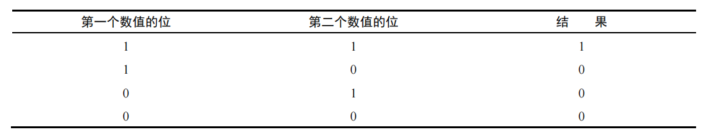
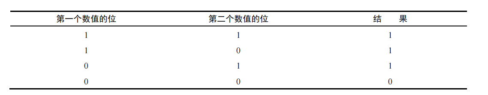
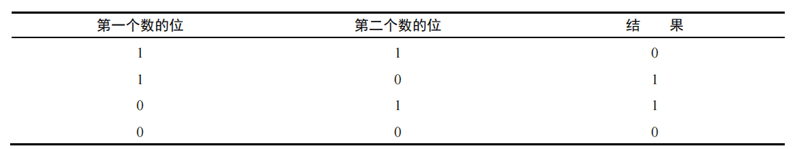

### 1.负数的二进制表示

1.确定绝对值的二进制表示（如，对于18，先确定 18 的二进制表示）;

2.找到数值的一补数（或反码），换句话说，就是每个 0 都变成 1，每个 1 都变成 0；

3.给结果加 1。

> 在对 ECMAScript 中的数值应用位操作符时，后台会发生转换：64 位数值会转换为 32 位数值，然
>
> 后执行位操作，最后再把结果从 32 位转换为 64 位存储起来。

### 2.按位非

按位非的最终效果是对数值取反并减1

### 3.按位与

### 3.按位或

### 4.按位异或

### 5.左移

左移操作符用两个小于号（<<）表示，会按照指定的位数将数值的所有位向左移动。

注意，左移会保留它所操作数值的符号。

### 6.有符号右移

有符号右移由两个大于号（>>）表示，会将数值的所有 32 位都向右移，同时保留符号（正或负）。有符号右移实际上是左移的逆运算。

### 7.无符号右移

无符号右移用 3 个大于号表示（>>>），会将数值的所有 32 位都向右移。

