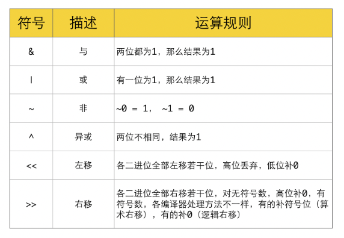

### 1.位运算表示

#### 1.二进制

二进制数在JavaScript中以`0b`或`0B`开头。

```javascript
const TransitionHydrationLane: Lane = /*                */ 0b0000000000000000000000001000000;
```

```javascript
//数字转二进制
let num = 10;
let binaryString = num.toString(2); // '1010'
console.log(binaryString); // 输出：'1010'
```

```javascript
// 二进制转数字
let binaryString = '1010';
let num = parseInt(binaryString, 2); // 10
console.log(num); // 输出：10
```

#### 2.八进制

在JavaScript中，八进制数以`0o`或`0O`开头。例如：

```javascript
let octalNumber = 0o12; // 十进制中的10
console.log(octalNumber); // 输出：10
```

```javascript
// 数字转二进制
let num = 10;
let octalString = num.toString(8); // '12'
console.log(octalString); // 输出：'12'
```

```javascript
//字符串转八进制
let octalString = '12';
let num = parseInt(octalString, 8); // 10
console.log(num); // 输出：10
```

注意，`parseInt`函数会忽略字符串中的非数字字符。如果字符串以`0o`开头，`parseInt`函数会忽略这两个字符。

#### 3.十六进制

在JavaScript中，十六进制数以`0x`或`0X`开头。例如：

```javascript
let hexNumber = 0xA; // 十进制中的10
console.log(hexNumber); // 输出：10
```

```javascript
let num = 10;
let hexString = num.toString(16); // 'a'
console.log(hexString); // 输出：'a'
```

```javascript
let hexString = 'a';
let num = parseInt(hexString, 16); // 10
console.log(num); // 输出：10
```

1. 位运算只能在整型变量之间进行运算
2. js 中的`Number`类型在底层都是以浮点数(参考 IEEE754 标准)进行存储.
3. js 中所有的按位操作符的操作数都会被[转成补码（two's complement）](https://www.ecma-international.org/ecma-262/5.1/#sec-9.5)形式的`有符号32位整数`.

> 所以在 js 中使用位运算时, 有 2 种情况会造成结果异常:
>
> 1. 操作数为浮点型(虽然底层都是浮点型, 此处理解为显示性的浮点型)
>
>    - 转换流程: 浮点数 -> 整数(丢弃小数位) -> 位运算
>
> 2. 操作数的大小超过`Int32`范围(`-2^31 ~ 2^31-1`). 超过范围的二进制位会被截断, 取`低位32bit`.
>
>    ```undefined
>    Before: 11100110111110100000000000000110000000000001
>    
>          After:              10100000000000000110000000000001
>    ```
>    
>    在对 ECMAScript 中的数值应用位操作符时，后台会发生转换：64 位数值会转换为 32 位数值，然
>    
>    后执行位操作，最后再把结果从 32 位转换为 64 位存储起来。

### 2.位运算符




