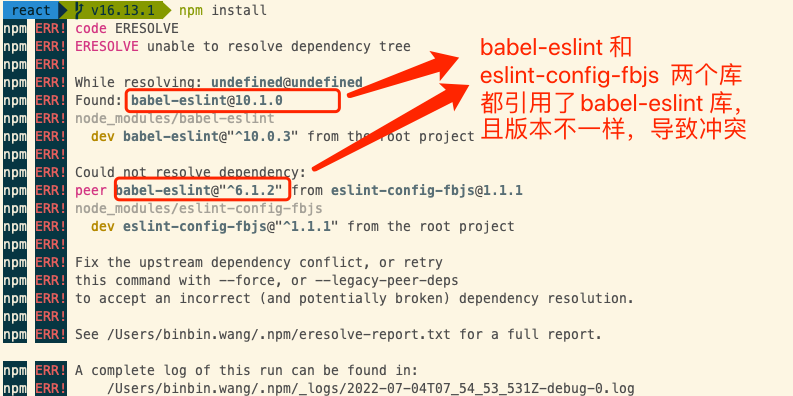

### npm

#### npm 知识

##### 1.全局安装路径

​	Mac上npm 包的全局安装路：径`usr/local/lib/node_modules`

##### 2.--save与--save-dev 的区别

​	--save 添加到 dependencies 中,记录的都是项目运行时需要的文件

​	--save-dev 添加到

##### 3.库的版本控制

​	`>=` `^` `*`

http://www.conardli.top/blog/article/%E5%89%8D%E7%AB%AF%E5%B7%A5%E7%A8%8B%E5%8C%96/%E5%89%8D%E7%AB%AF%E5%B7%A5%E7%A8%8B%E5%8C%96%EF%BC%88%E4%B8%80%EF%BC%89npm%E5%8C%85%E5%A6%82%E4%BD%95%E8%BF%9B%E8%A1%8C%E7%89%88%E6%9C%AC%E7%AE%A1%E7%90%86%EF%BC%9F.html

##### 4.`npm install` 报错



Peer Dependencies

`peerDependency` 可以避免类似的核心依赖库被重复下载的问题。

##### 5.更新库

要更新`package.json`中的所有库，你可以使用几种不同的方法。以下是一些常见的方法：

1. **手动更新**：
   手动将`package.json`中的版本号更改为你想要的版本，然后运行`npm install`。这种方法比较繁琐，但可以精确控制每个包的版本。

2. **使用`npm update`**：
   运行`npm update`将会更新所有的包到符合`package.json`文件中指定的语义版本控制（semver）兼容的最新版本。这不会更新到最新的主版本（major version），除非你在`package.json`中已经指定了。

3. **使用`npm-check-updates`**：
   `npm-check-updates`是一个第三方工具，可以帮助你升级`package.json`中的依赖项到最新版本。首先，你需要全局安装这个工具：

   ```sh
   npm install -g npm-check-updates
   ```

   然后，运行以下命令来升级所有的包：

   ```sh
   ncu -u
   npm install
   ```

   这将会升级`package.json`中所有的包到最新版本，并且需要你运行`npm install`来安装这些新版本的包。

4. **使用`npm outdated`**：
   运行`npm outdated`可以查看哪些包有更新的版本。然后，你可以选择性地更新特定的包，或者手动更改`package.json`中的版本号，然后运行`npm install`。

5. **使用`yarn`的`upgrade-interactive`**：
   如果你使用的是`yarn`而不是`npm`，你可以使用`yarn upgrade-interactive`命令，它提供了一个交互式界面来选择你想要升级的包。

请注意，升级依赖项可能会引入破坏性更改，特别是如果你升级到一个新的主版本。在升级之后，确保运行你的测试套件并手动测试应用程序以验证更新不会破坏现有功能。此外，建议在升级之前创建一个新的分支或使用版本控制系统，以便在出现问题时可以轻松回滚更改。

#### 2.常用命令

##### 1.npm install

​	Nom install moduleName 安装 moduleName 模块. -g 为全局安装

##### 2.npm list

​	列出已安装模块

##### 3.npm show

​	npm show moduleName 显示 moduleName 模块详情

##### 4.npm config

​	npm show  ls 查看安装路径

##### 5.npm link

1. 功能

   在本地开发npm模块的时候，我们可以使用npm link命令，将npm 模块链接到对应的运行项目中去，方便地对模块进行调试和测试

2. 在这里，我们有两个项目，一个是`npm-link-module`，是我们要开发的npm模块,另一个是`npm-link-example`,是我们要运行npm模块的项目。

   1. 首先，进入我们的`npm-link-module`项目，执行npm link
   2. 然后，进入`npm-link-example`项目，执行 npm link npm-link-module

##### 6.npm config set

`npm config set cache C:\Devel\nodejs\npm-cache --global `

设置npm 缓存

##### 7.npm cache

##### 8.版本号

npm install 包名@版本号 -S `


### npx

#### 1.npx 想要解决的主要问题，就是调用项目内部安装的模块

npm 调用内部模块方法

```shell
# 项目的根目录下执行
$ node-modules/.bin/mocha --version
```

npx 调用内部模块方法

```shell
npx mocha --version
```

#### 2.避免全局安装

`create-react-app`这个模块是全局安装，npx 可以运行它，而且不进行全局安装。

`npx create-react-app my-react-app`

### [pnpm](https://pnpm.io/)


​      

