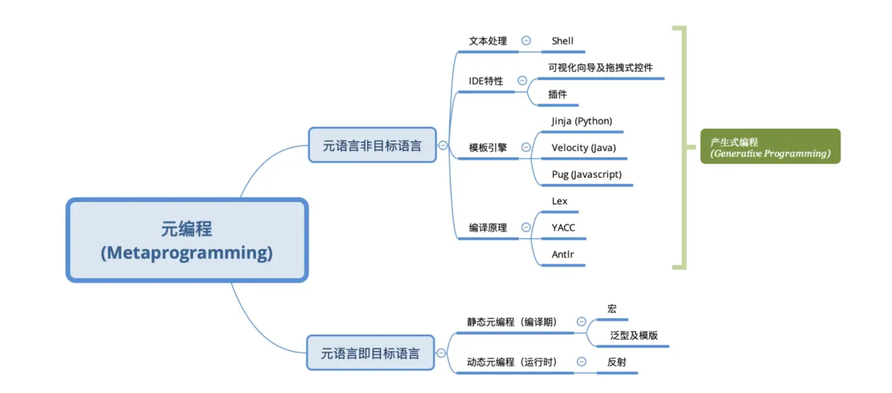

### [1.元编程](https://zh.wikipedia.org/wiki/%E5%85%83%E7%BC%96%E7%A8%8B)

编写元程序的语言称之为[元语言](https://zh.wikipedia.org/wiki/元語言)。被操纵的程序的语言称之为“[目标语言](https://zh.wikipedia.org/w/index.php?title=目标语言&action=edit&redlink=1)”。一门编程语言同时也是自身的元语言的能力称之为“[反射](https://zh.wikipedia.org/wiki/反射式编程)”或者“自反”。



#### 1.反射

反射是指计算机程序在运行时可以访问、检测和修改它本身状态或行为的一种能力。用比喻来说，反射就是程序在运行的时候能够“观察”并且修改自己的行为。

一般来说，程序中代码的执行逻辑是明确的，运行时引擎（Runtime engine）将代码解析为机器指令，然后计算机按照顺序执行，在此过程中代码无法自己改变执行的顺序，但**反射机制允许在运行过程中通过调用运行时引擎暴露的API来实时获取和改变代码**，从而可以改变源代码中预设的执行顺序。

反射的实现因语言而异，这也就让不同的语言有不同的元编程体验。

Javascript中的`eval`函数，将字符串解析为代码并执行：

```javascript
// 等同于new Foo().bar()
eval('new Foo().bar()')
```

Java中利用`Class`和`Method`类，在运行时加载一个编译时未引用的类，并执行其方法：

```java
try{
    Object foo = Class.forName("com.package.Foo").newInstance();
    Method m = foo.getClass().getDeclaredMethod("bar");
    m.invoke(foo);
} catch(Exception e){
    // Catching Exception
}
```


[1]: https://www.jianshu.com/p/d3b637ece518

