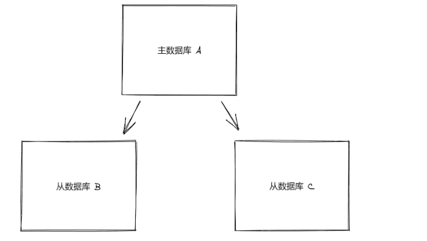

对于一个小型项目来说，使用一台 Redis 服务器已经非常足够了，然后现实中的项目通常需要若干台 Redis 服务器的支持：

- 从结构上，单个 Redis 服务器会发生单点故障，同时一台服务器需要承受所有的请求负载。这就需要为数据生成多个副本并分配在不同的服务器上；
- 从容量上，单个 Redis 服务器的内存非常容易成为存储瓶颈，所有需要进行数据分片

同时拥有多个 Redis 服务器后就会面临如何管理集群的问题，包括如何增加节点、故障恢复等。

为此，我们将依次介绍 Redis 中的复制、哨兵（sentinel）和集群的使用和原理。

### 1.复制

通过持久化功能，Redis 保证了即使在服务器重启的情况下也不会损失（或少量损失）数据。但是由于数据是存储在一台服务器上的，如果这台服务器出现硬盘故障等问题，也会导致数据丢失。为了避免单点故障，通常的做法是将数据库复制多个副本以部署在不同的服务器上，这样即使有一台服务器出现故障，其它服务器依然可以继续提供服务。为此，Redis 提供了复制功能，可以实现当一台数据库中的数据更新后，自动将更新的数据同步到其它数据库上。

### 2.配置

在复制的概念中，数据库分为两类，一类是主数据库（master），另一类是从数据库（slave）。

- 主数据库可以进行读写操作
- 当写操作导致数据变化时会自动将数据同步给从数据库
- 而从数据库一般是只读的，并接受主数据库同步过来的数据
- 一个主数据库可以拥有多个从数据库，而一个从数据库只能拥有一个主数据库



在 Redis 中使用复制功能非常容易，只需要在从数据库的配置文件中加入下面的配置即可，主数据库无需进行任何配置。

```shell
slaveof 主数据库地址 主数据库端口
```

#### 1.开启两个 Redis 服务进程

为了能够更直观的展示复制的流程，下面将实现一个最简化的复制系统。我们要在一台服务器上启动两个 Redis 实例，监听不同端口，其中一个作为主数据库，另一个作为从数据库。首先我们不加任何参数来启动一个 Redis 实例作为主数据库：

```shell
redis-server
```

该实例默认监听 6379 端口。然后加上 slaveof 参数启动另一个 Redis 实例作为从数据库，并让其监听 6380 端口；

```shell
redis-server --port 6380 --slaveof 127.0.0.1 6379
```

此时在主数据库中的任何数据变化都会自动地同步到从数据库中。

#### 2.查看复制信息

```shell
INFO replication
```

#### 3.测试数据同步效果

```shells
在实例 A 中写入数据，会被自动同步到实例 B 中。
```

#### 4.从数据库中的数据是只读的

默认情况下，从数据库是只读的，如果直接修改从数据库的数据会出现错误：

可以通过设置从数据库的配置文件中的 slave-read-only 为 no 以使从数据库可写，但是因为对从数据库的任何更改都不会同步给任何其它数据库，并且一旦主数据库中更新了对应的数据就会覆盖从数据库中的改动，所有通常的场景下不应该设置从数据库可写，以免导致被忽略的潜在应用逻辑错误。

配置多台从数据库的方法也一样，在所有的从数据库的配置文件中都加上 slaveof 参数指向同一个主数据库即可。

除了通过配置文件或命令行参数设置 slaveof 参数，还可以在运行时使用 SLAVEOF 命令修改。

- http://doc.redisfans.com/topic/cluster-tutorial.html

