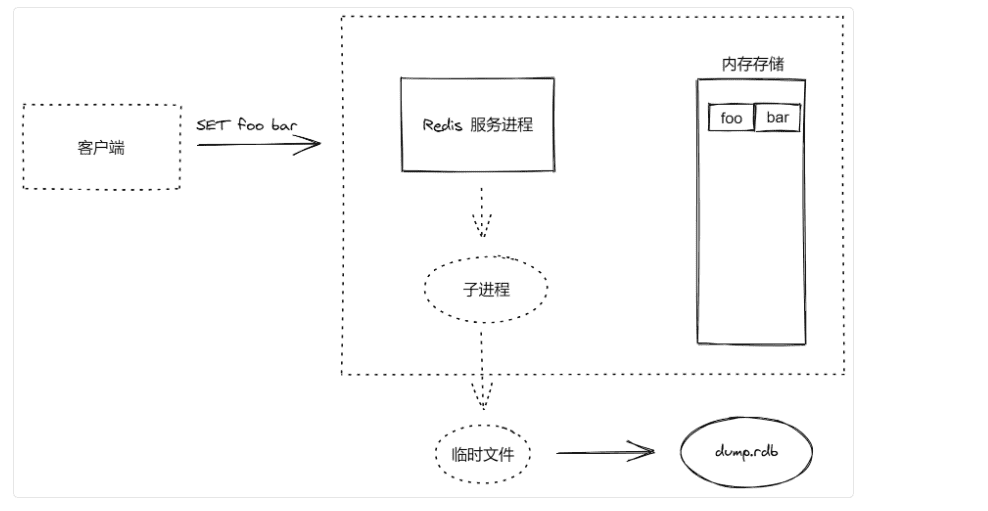

Redis 的强劲性能很大程度上是由于其将所有数据都存储在内存中，然而当 Redis 重启或宕机后，所有存储在内存中的数据就会丢失。在一些情况下，我们会希望 Redis 在重启后能够保证数据不丢失。

这时我们希望 Redis 能将数据从内存中以某种形式同步到硬盘中，使得重启后可以根据硬盘中的记录恢复数据。这一过程就是持久化。

Redis 提供了两种持久化方案：

https://redis.io/docs/manual/persistence/

- RDB  Redis Database持久化，根据指定的规则“定时”将内存中的数据存储在硬盘上，在重启之后读取硬盘上的 `.rdb` 快照文件将数据恢复到内存中。
- AOF  Append Only File持久化：AOF 持久化记录服务器执行的所有写操作命令形成 `.aof` 日志文件保存到硬盘中，并在服务器启动时，通过重新执行这些命令来还原数据集。

### 1.RDB 持久化

RDB 方式的持久化是通过快照完成的，当符合一定条件时 Redis 会自动将内存中的所有数据生成一份副本并存储在硬盘上，这个过程即为“快照”。

Redis 允许用户自定义快照条件，当符合快照条件时，Redis 会自动执行快照操作。进行快照的条件可以由用户在配置文件中自定义，由两个参数构成：时间窗口 M 和改动的键的个数  N。每当时间 M 内被更改的键的个数大于 N 时，即符合自动快照条件。

RDB 持久化相关配置规则如下：

```shell
save 900 1 # 每 900 秒至少有 1 个 key 变化了，则写入快照
save 300 10 # 每 300 秒至少有 10 个 key 变化了，则写入快照
save 60 10000 # 每 60 秒至少有 10000 个 key 变化了，则写入快照

dbfilename dump.rdb # 快照保存的文件名称

dir ./ # 快照文件保存路径
```

RDB 快照的运行方式是异步进行的，在保存快照期间依然能够提供客户端请求。



1. Redis 调用 `fork()` 创建一个子进程
2. 使用子进程将数据集写入到一个临时 RDB 文件中
3. 当子进程完成对新 RDB 文件的写入时，Redis 用新 RDB 文件替换原来的 RDB 文件，并删除旧的 RDB 文件

### 2.AOF 持久化

快照功能并不是非常持久（durable）： 如果 Redis 因为某些原因而造成故障停机， 那么服务器将丢失最近写入、且仍未保存到快照中的那些数据。

尽管对于某些程序来说， 数据的持久性并不是最重要的考虑因素， 但是对于那些追求完全持久化（full durability）的程序来说， 快照功能就不太适用了。

从 1.1 版本开始， Redis 增加了一种完全耐久的持久化方式： AOF 持久化。

AOF 可以将 Redis 执行的每一条写命令操作日志存储到硬盘文件中，这一过程显然会降低 Redis 的性能，但是大部分情况下这个影响是可以接受的，另外使用较快硬盘可以提供 AOF 性能。

AOF 机制对于日志的写入操作采用的是 `append` 模式，就是追加模式，因此在写入过程中如果出现宕机问题，也不会破坏已经写入的日志数据。

默认情况下，Redis 没有开启 AOF 方式的持久化，可以通过 `appendonly` 参数启用：

```shell
appendonly yes
```

AOF 文件的保存位置和 RDB 文件的位置相同，都是 `dir` 参数设置的。默认的文件名是 `appendonly.aof`，可以通过 `appendfilename` 来修改：

```shell
# AOF 文件和 RDB 文件保存目录是一样的
dir ./

# 同步的文件名称
appendfilename "appendonly.aof"
```

AOF 有三种同步策略：

```shell
# 每修改同步，每一次发送数据变化都会被立即同步到磁盘中，效率比较低，但是数据最安全
appendfsync always

# 默认值，每秒同步，异步完成，同步效率非常高，缺点是一旦系统出现宕机，这1秒之内操作的数据就会丢失
appendfsync everysec

# 不同步
appendfsync no
```

一般情况下使用默认值 everysec 就足够了，既兼顾了性能又保证了安全。

### 3.RDB vs AOF

参考阅读：http://doc.redisfans.com/topic/persistence.html。

| 持久化方式 | 优点                                                     | 缺点                                                         |
| ---------- | -------------------------------------------------------- | ------------------------------------------------------------ |
| RDB        | 1 文件小  2.异步备份，性能好 3.恢复大数据集速度比 AOF 快 | 1.数据安全性低，容易丢失数据 2.数据量比较大时备份速度慢      |
| AOF        | 1. 数据安全性高 2.有利于开发分析                         | 1.相同数据集比 RDB 文件大 2.根据所使用的 fsync 策略，AOF 速度可能会慢于 RDB |

一般来说， 如果想达到足以媲美关系型数据库的安全性， 你应该同时使用两种持久化功能。

如果你非常关心你的数据， 但仍然可以承受数分钟以内的数据丢失， 那么你可以只使用 RDB 持久化。

有很多用户都只使用 AOF 持久化， 但我们并不推荐这种方式： 因为定时生成 RDB 快照（snapshot）非常便于进行数据库备份， 并且 RDB 恢复数据集的速度也要比 AOF 恢复的速度要快。


