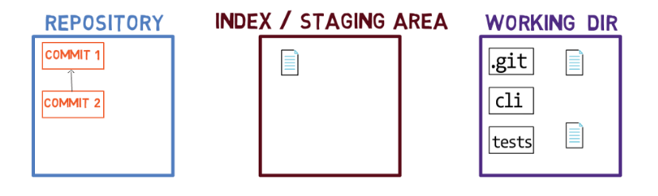
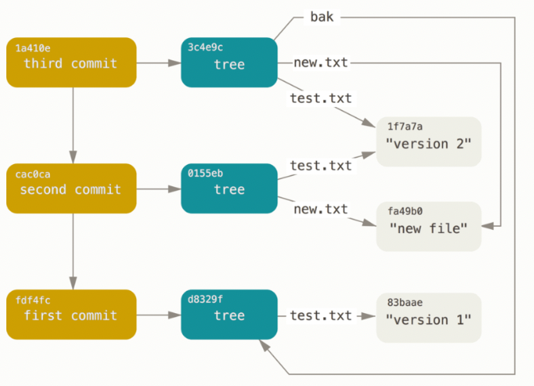

### 1.git命令

1. `git reset --hard commitId ` 

   **删除**工作空间改动代码，撤销commit，撤销git add .

2. `git reset --soft commitId`  

   **不删除**工作空间改动代码，撤销commit，不撤销git add . 

3. `git reset --mixed commitId`

​       **不删除**工作空间改动代码，撤销commit，并且撤销git add . 操作

> `git revert commitId` 撤销 commit 提交

4. `git log` 

    记录所有commit历史

5. `git reflog`  

    记录所有HEAD历史

6. `git branch -a` 

   查看所有分支包括远程分支

   如果需要查看每一个分支的最后一次提交，可以运行 `git branch -v` 命令：

   `--merged` 与 `--no-merged` 这两个有用的选项可以过滤这个列表中已经合并或尚未合并到当前分支的分支。 如果要查看哪些分支已经合并到当前分支，可以运行 `git branch --merged`：

7. `git branch branchName`

   创建分支

8. `git branch -d branchNname`

   删除分支

   > `git push origin --delete [branch_name]` 删除远程分支
   >
   > ` git remote show origin` 以查看remote地址，远程分支，还有本地分支与之相对应关系等信息
   >
   > `git remote prune origin`  本地删除远程不存在的分支

9. `git config --global alias.st status`

   git 命令缩写

10. `git config --global user.name "yourname"`  `git config --global user.email "youremail"` 

     配置全局用户名跟邮箱

    局部配置（命令行需要进入对应的代码工作目录）

    `git config user.name "name"`  `git config user.email "email"`

11. `git config --list`

    查看git配置

12. ` git config credential.helper wincred`

    解决git密码保存不了 fatal: unable to get credential storage lock: File exist

13. `git checkout . ` 删除所有 修改

14. `git clean -f ` 删除所有未跟踪文件  `git clean -fd` 删除所有未跟踪文件和目录

     `git clean -nf` 1`git clean -nfd`  强烈建议加上 -n 参数来先看看会删掉哪些文件，防止重要文件被误删
    
15. `git clone -b branchName gitAddress dirName`

     clone 具体分支到指定文件夹
    
16. `git rebase `

     https://juejin.cn/post/6844903600976576519 git合并commit
    
    [1]: https://waynerv.com/posts/git-rebase-intro/	"git rebase 用法详解与工作原理"
    
    
    
17. `git stash`

     1. `git stash list`  查看stash存储

     2. `git stash save "save message"`  存储

     3. `git stash show`  默认显示第一个存储 

        >  `git stash show stash@{$num}`  显示第几stash

     4. `git stash apply` 应用某个存储，但不会从存储列表中删除

        > `git stash apply stash@{$num}` 应用第几个存储

     5. `git stash pop` 应用并删除  

        > `git stash pop stash@{$num}`

     6. `git stash drop stash@{$num}` 从存储列表中删除存储

     7. `git stash clear `  删除所有缓存的stash

18.撤销merge

https://segmentfault.com/q/1010000000140446

19.删除分支

`git branch -d branchName`  删除本地分支

`git push  origin --delete branchName` 删除远程分支

20.远程仓库操作

​	`git remote `

21.缩写

`git config --global alias.st status`

`git config --global alias.cm commit`

`git config --global alias.ck checkout`

`git config --global alias.br branch`

22.git 回滚commit  到远程分支

1. 查看

`git log`

2. reset --hard 到 'git reset hard test first' 版本

`git reset --hard 45f5c01d0dd4cb83f25bc1ea7b82b0348600a041`

3. push 到远程

正常推送会被拒绝[git push -u origin master]

`git push -u origin master`

需要强制推送[git push -u -f origin master]

`git push -u -f origin master`

> 其他人的库，直接git pull 可能回退不了，要执行 `git reset --hard origin/testing`
>
> 因为你是force push，对比之下，之前已经pull下来的会当作是本地的提交，刚刚这个命令，就相当于“抛弃本地所有提交”，这样就一致了

https://www.cnblogs.com/eternityz/p/13201595.html

23.确保你的本地仓库的远程分支状态是最新和最清晰的

`git fetch --prune` 是 Git 中用来更新远程分支引用的命令，并同时移除本地已失效（即在远程仓库中已删除）的分支引用

### 2.git实例

#### 2.git 提交功能备注

feat: 新功能 （feature）
fix: 修补 bug
docs: 文档（document）
style: 格式/样式（不影响代码运行的变动）
refactor: 重构（既不是新增功能，也不是修改bug的代码改动）
test: 增加测试
chore: 构建过程或辅助工具的变动
perf: 提高性能的代码更改
build: 影响构建系统或外部依赖项的更改（示例范围： gulp, npm）
ci: 对CI配置文件和脚本的更改（示例范围：Travis，Circle，BrowserStack）
revert: 恢复到以前的提交

https://github.com/liuchengxu/git-commit-emoji-cn

- build
- chore
- ci
- docs
- feat
- fix
- perf
- refactor
- revert
- style
- test

[1]: https://github.com/conventional-changelog/commitlint/#what-is-commitlint


#### 3.将子文件夹拆分成新仓库

`git filter-repo --path FOLDER-NAME`

https://docs.github.com/cn/get-started/using-git/splitting-a-subfolder-out-into-a-new-repository

#### 4.移动文件 [git mv](https://git-scm.com/docs/git-mv)

`git mv <source> <destination>`

#### 5.回退版本

`git reset --soft <commit>`  reset only HEAD

`git reset --hard <commit>`   reset HEAD, index and working tree


`git push -f` 回滚远程版本

#### 6.取消新增的文件

`git clean`是从工作目录中移除没有track的文件.

通常的参数是`git clean -df`:

-d表示同时移除目录,-f表示force,因为在git的配置文件中, clean.requireForce=true,如果不加-f,clean将会拒绝执行.

#### 7.放弃修改

`git checkout .`

git reset --soft HEAD~1 软恢复

#### 8.只克隆某个分支

如果你只想克隆Git仓库的主分支，你可以使用`--branch`（或`-b`）选项，后面跟上你想要克隆的分支名。例如，如果主分支的名字是`main`，你可以这样做：

```shell
git clone --branch main https://github.com/username/repo.git
```

然而，这样做仍然会获取整个仓库的历史记录。如果你想要减少克隆的大小，你可以使用`--depth 1`选项来创建一个浅克隆，这将只获取最近一次提交的历史：

```shell
git clone --branch main --depth 1 https://github.com/username/repo.git
```

这将只克隆`main`分支的最新版本，不包括任何历史记录。

#### 9.git pull 与 git fetch 的区别

`git pull`和`git fetch`是Git中两个常用的命令，它们都用于从远程仓库获取最新的内容。然而，它们的工作方式和用途有所不同。

##### git fetch

`git fetch`命令用于从远程仓库下载本地仓库中不存在的数据。它会获取远程仓库中所有分支的最新提交（commits），但不会自动合并或修改你当前的工作。`git fetch`只是下载数据到本地仓库，它不会改变你的工作目录或当前分支。

执行`git fetch`之后，你可以使用`git log`、`git diff`等命令来查看远程分支与你的本地分支之间的差异。如果你想要更新你的当前分支，你可以手动执行`git merge`来合并远程分支到你的本地分支。

##### git pull

`git pull`命令实际上是`git fetch`之后紧接着一个`git merge`命令的组合。当你执行`git pull`时，Git会从远程仓库获取当前分支的最新版本，并尝试自动合并到你的本地分支。这意味着，如果没有冲突，执行`git pull`后你的本地分支会自动更新到远程分支的状态。

简而言之，`git pull` = `git fetch` + `git merge`

##### 使用场景

- 当你只想查看远程仓库的更新，但还不想合并到你的工作中时，你应该使用`git fetch`。
- 当你想要获取远程分支的更新，并且立即将这些更新合并到你的本地分支时，你应该使用`git pull`。

##### 注意事项

- `git pull`可能会导致合并冲突，如果你不准备立即处理这些冲突，可能会打断你的工作流程。
- `git fetch`允许你在合并之前审查更新，这可以帮助你更好地准备合并，特别是在复杂的项目中。
- 有时候，你可能想要使用`git pull --rebase`，这个命令会使用变基（rebase）而不是合并来整合远程分支的更新。这可以帮助你保持一个更干净的提交历史。

总的来说，`git fetch`是一个安全的命令，因为它不会改变你的本地仓库的状态。而`git pull`则可能会改变你的本地仓库的状态，因为它包含了合并操作。在团队协作环境中，了解何时使用`git fetch`和`git pull`可以帮助你更好地管理代码和避免不必要的合并冲突。

#### 10.打补丁

给 Git 项目打补丁通常涉及到创建和应用补丁文件（patch）。补丁文件是一个文本文件，它记录了文件之间的差异，可以被应用到代码库中以引入这些变更。以下是创建和应用补丁的基本步骤：

##### 1.创建补丁

首先，你需要在本地版本库中创建你的更改。完成更改后，你可以使用 `git diff` 命令来生成补丁文件。例如，如果你想为最近的一次提交创建补丁，可以使用

```shell
git diff HEAD^ HEAD > fix.patch
```

在发送补丁之前，应该检查补丁文件的内容，确保它只包含你想要的更改。

##### 2.应用补丁

在另一个 Git 仓库中，你可以使用 `git apply` 命令来应用这个补丁。将补丁文件复制到该仓库的根目录下，然后运行：

```shell
git apply fix.patch
```

这会将补丁中的更改应用到当前工作目录中。

应用补丁后，使用 `git diff` 和 `git status` 检查更改是否正确应用，并且没有产生冲突。

如果一切正常，你可以像平常一样提交这些更改：

```shell
git add .
git commit -m "Apply patch fix"
```

> 除了 `git diff` 和 `git apply`，Git 还提供了 `git format-patch` 和 `git am` 命令，这两个命令通常用于通过电子邮件发送和接收补丁。
>
> 打补丁是一个在开源项目中常见的协作方式，它允许贡献者在不直接访问仓库的情况下提交更改。

##### 3.Git 创建补丁的方法

补丁(patch)是将代码变更以文件形式保存的方式，可以方便地在不同仓库或分支间传递变更。以下是几种创建 Git 补丁的方法：

###### 1. 创建未提交更改的补丁

```bash
# 查看当前未暂存的变更
git diff > changes.patch

# 创建已暂存但未提交的变更补丁
git diff --cached > staged-changes.patch

# 创建所有未提交变更的补丁（包括暂存和未暂存）
git diff HEAD > all-changes.patch
```

###### 2. 创建最近提交的补丁

```bash
# 创建最近一次提交的补丁
git format-patch -1

# 创建最近N次提交的补丁（例如最近3次）
git format-patch -3
```

这会生成以 `.patch` 或 `.mbox` 结尾的文件，文件名包含提交信息。

###### 3. 创建特定提交范围的补丁

```bash
# 创建两个提交之间的所有变更补丁
git format-patch <起始提交哈希>..<结束提交哈希>

# 示例：创建从v1.0到当前的所有提交补丁
git format-patch v1.0..HEAD
```

###### 4. 创建单个提交的补丁

```bash
# 为特定提交创建补丁
git format-patch -1 <提交哈希>
```

###### 5. 创建分支间的差异补丁

```bash
# 创建当前分支与另一分支差异的补丁
git diff <其他分支名> > branch-diff.patch
```

###### 应用补丁的方法

```bash
# 检查补丁是否能正常应用（不实际应用）
git apply --check changes.patch

# 应用补丁
git apply changes.patch

# 或者使用更智能的方式（会创建提交记录）
git am *.patch
```

###### 高级选项

1. **二进制文件支持**：
   
   ```bash
   git diff --binary > changes.patch
   ```
   
2. **包含二进制差异**：
   ```bash
   git format-patch --binary <提交哈希>
   ```

3. **生成补丁时重命名检测**：
   ```bash
   git diff -M > changes.patch
   ```

###### 注意事项

1. `git diff` 生成的补丁需要用 `git apply` 应用
2. `git format-patch` 生成的补丁更适合用 `git am` 应用
3. 补丁文件是纯文本文件，可以轻松通过邮件或其他方式分享
4. 应用补丁前最好先检查是否有冲突

补丁是代码审查、跨仓库协作和问题修复的有效工具，特别适合在不直接访问远程仓库的情况下共享代码变更。

### 3.git概念

#### 1.轻量标签 与 附注标签

##### 轻量标签（Lightweight Tags）

轻量标签是指向特定提交的引用，它就像一个不会改变的分支。轻量标签本质上是一个特定提交的别名，因为它们不包含其他信息，如标签创建者的名字、电子邮件、创建日期等。

- 临时性的标记提交，比如为了方便地回到某个特定的开发阶段。
- 在私有项目中，当你不需要标签上的额外信息时。

##### 附注标签（Annotated Tags）

附注标签是存储在Git数据库中的一个完整对象。它包含了提交者的名字、电子邮件、日期、标签信息以及一个可选的签名（如果使用GPG签名的话）。附注标签是推荐的方式，因为它们包含了有关标签的更多信息。

- 发布版本（如v1.0、v2.0等），因为它们可以包含发布说明和其他重要信息。
- 当你希望保留更多关于标签的元数据时，比如为了验证标签的真实性。

##### 区别

- **存储**：轻量标签只是一个文件，其中包含了指向特定提交的SHA-1值；而附注标签是一个完整的对象，它有自己的SHA-1值，包含了标签信息和指向被标记提交的指针。
- **信息量**：轻量标签不包含任何额外信息，而附注标签包含了创建者信息、日期、消息和可选的GPG签名。
- **使用场景**：轻量标签适用于私有或临时性的标记，而附注标签适用于公开发布，因为它们可以包含更多的信息和验证。

##### 总结

在实际使用中，如果你需要为特定的提交打上永久性的、公开的标记，比如发布软件的版本，应该使用附注标签。如果你只是想快速地为某个提交打上标记，而不需要任何额外信息，那么轻量标签就足够了。附注标签是更加正式的，它们适用于需要记录更多信息的场景。轻量标签更简单，适用于需要较少或没有历史记录的场景。

#### 2[.深入理解 Git 底层实现原理](http://chuquan.me/2022/05/21/understand-principle-of-git/)

底层命令、上层命令、对象数据库

对象模型：`blob对象` 、`tree对象`、`commit对象`、`tag 标签对象`

引用：标签Tag、heads(分支)、远程引用

包文件


#### [3.Git 内部原理图解——对象、分支以及如何从零开始建仓库](https://www.freecodecamp.org/chinese/news/git-internals-objects-branches-create-repo/)



库、

索引(暂存区) 位于`.git\index` 中的文件

工作区

> 所以，`git` 实际上是使用 SHA-1 哈希值的前两个字符作为目录的名字，剩余字符用作 **blob** 所在文件的文件名。
>
> 为什么要这样呢？考虑一个非常大的仓库，仓库的数据库内存有三十万个对象（**blob 对象**、**树对象** 和 **提交对象**）。从这三十万个哈希值中找出一个值会花些时间，因此，`git` 将这个问题划分成了 256 份。
>
> 为了查找上面的那个哈希值，`git` 会先寻找 `.git\objects` 目录下名为 `54` 的目录，然后搜索那个目录，这进一步缩小了搜索范围。`.git\objects` 目录下最多可能会有 256 个子目录（从 `00` 到 `FF`）

#### [4.Git 官方教程](https://git-scm.com/book/zh/v2/%E8%B5%B7%E6%AD%A5-%E5%85%B3%E4%BA%8E%E7%89%88%E6%9C%AC%E6%8E%A7%E5%88%B6)

##### [1.Git内部原理](https://git-scm.com/book/zh/v2/Git-%E5%86%85%E9%83%A8%E5%8E%9F%E7%90%86-Git-%E5%AF%B9%E8%B1%A1)

底层命令的运用:

`git hash-object`  创建一个新的数据对象

`git cat-file` 从 Git 那里取回数据

`git update-index ` 创建一个暂存区

`git write-tree` 将暂存区内容写入一个树对象

`git read-tree` 可以把树对象读入暂存区 

`git commit-tree`  命令创建一个提交对象

`find .git/objects -type f`



#### 5.概念

[当你试图合并两个分支时， 如果顺着一个分支走下去能够到达另一个分支，那么 Git 在合并两者的时候， 只会简单的将指针向前推进（指针右移），因为这种情况下的合并操作没有需要解决的分歧——这就叫做 “快进（fast-forward）”。](https://git-scm.com/book/zh/v2/Git-%E5%88%86%E6%94%AF-%E5%88%86%E6%94%AF%E7%9A%84%E6%96%B0%E5%BB%BA%E4%B8%8E%E5%90%88%E5%B9%B6)

### 4.git SubModule

**Git Submodule** 是 [Git](https://so.csdn.net/so/search?q=Git&spm=1001.2101.3001.7020) 中用于管理子项目的强大功能。它允许我们将一个 Git 仓库作为另一个 Git 仓库的子模块进行管理，从而使项目结构更加清晰，代码维护更加方便。

[1]: https://blog.csdn.net/yuxiatongzhi/article/details/138115350	"Git Submodule 全流程使用指南"

### 5.git SubTree

经由 Git Subtree 来维护的子项目代码，对于父项目来说是透明的，所有的开发人员**看到的就是一个普通的目录，原来怎么做现在依旧那么做**，只需要维护这个 Subtree 的人在合适的时候去做同步代码的操作

**关于子仓库或者说是仓库共用，git官方推荐的工具是git subtree。**

[1]: https://www.cnblogs.com/goloving/p/16678440.html	"浅析Git Subtree的原理与实际应用"
[2]: https://www.cnblogs.com/anliven/p/13681894.html	" subTree 与 subModule"

### 6.git status 中文乱码

`git config --global core.quotepath false`


[1]: https://geek-docs.com/git/git-questions/225_git_switch_node_modules_folder_when_i_change_git_branch.html	"Git 在切换git分支时如何处理node_modules文件夹"

### 7.git commit 编写指南

- feat：新功能（feature）
- fix：修补 bug
- docs：文档（documentation）
- style：格式（不影响代码运行的变动）
- refactor：重构（即不是新增功能，也不是修改 bug 的代码变动）
- test：增加测试
- chore：构建过程或辅助工具的变动

[1]: https://help.gitee.com/enterprise/code-manage/Git%20%E7%9F%A5%E8%AF%86%E5%A4%A7%E5%85%A8/Git%20Commit%20message%20%E7%BC%96%E5%86%99%E6%8C%87%E5%8D%97	"Git Commit message 编写指南"


