### 一、二进制编码

#### 1.理解二进制的“逢二进一”

十进制转二进制用**短除法**。

##### 负数表示

###### 1.原码表示法：

个 4 位的二进制数， 0011 就表示为 +3。而 1011 最左侧的第一位是 1，所以它就表示 -3。这个其实就是整数的原码表示法。

> 原码表示法有一个很直观的缺点就是，0 可以用两个不同的编码来表示，1000 代表 0， 0000 也代表 0。习惯万事一一对应的程序员看到这种情况，必然会被“逼死”。

###### 2.补码

通过最左侧第一位的 0 和 1，来判断这个数的正负。但不再把这一位当成单独的符号位，在剩下几位计算出的十进制前加上正负号，而是在计算整个二进制值的时候，在左侧最高位前面加个负号。

> 比如，一个 4 位的二进制补码数值 1011，转换成十进制，就是 −1×23+0×22+1×21+1×20=−5。如果最高位是 1，这个数必然是负数；最高位是 0，必然是正数。并且，只有 0000 表示 0，1000 在这样的情况下表示 -8。一个 4 位的二进制数，可以表示从 -8 到 7 这 16 个整数，不会白白浪费一位。

当然更重要的一点是，用补码来表示负数，使得我们的整数相加变得很容易，不需要做任何特殊处理，只是把它当成普通的二进制相加，就能得到正确的结果。

#### 2.字符互的表示，从编码到数字

##### 1.ASCII 码

>  American Standard Code for Information Interchange，美国信息交换标准代码

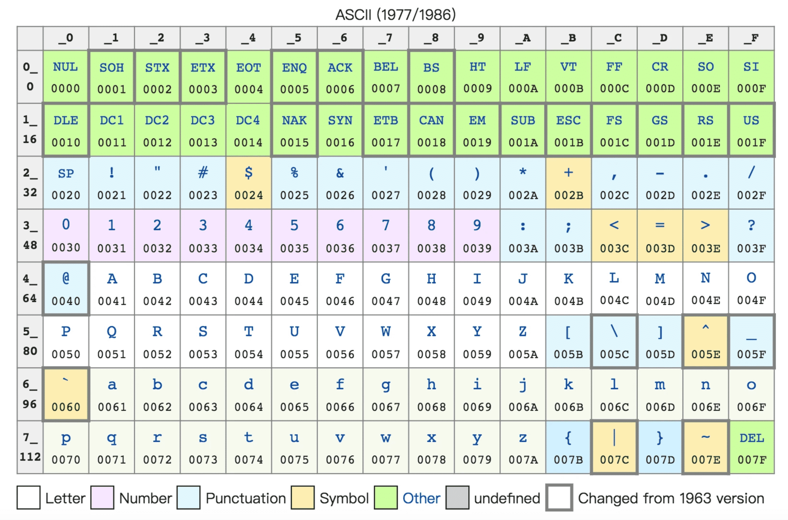

> ASCII 码就好比一个字典，用 **8 位二进制中的 128 个不同的数**，映射到 128 个不同的字符里。
>
> 在 ASCII 码里面，数字 9 不再像整数表示法里一样，用 0000 1001 来表示，而是用 0011 1001 来表示。字符串 15 也不是用 0000 1111 这 8 位来表示，而是变成两个字符 1 和 5 连续放在一起，也就是 0011 0001 和 0011 0101，需要用两个 8 位来表示。 2
>
> **因为9的ASCII码是0039，换算成二进制，就是0011 1001了**

##### 2.不管是整数也好，浮点数也好，采用二进制序列化会比存储文本省下不少空间。

最大的 32 位整数，就是 2147483647。如果用整数表示法，只需要 32 位就能表示了。但是如果用字符串来表示，一共有 10 个字符，每个字符用 8 位的话，需要整整 80 位。比起整数表示法，要多占很多空间。

##### 3.字符集（Charset）和字符编码（Character Encoding）

###### 字符集

字符集，表示的可以是字符的一个集合。我们日常说的 Unicode，其实就是一个字符集，包含了 150 种语言的 14 万个不同的字符。

> 比如“中文”就是一个字符集，不过这样描述一个字符集并不准确。想要更精确一点，我们可以说，“第一版《新华字典》里面出现的所有汉字”，这是一个字符集。这样，我们才能明确知道，一个字符在不在这个集合里面。

###### **字符编码**

而字符编码则是对于字符集里的这些字符，怎么一一用二进制表示出来的一个字典。

>  Unicode字符集，就可以用 UTF-8、UTF-16，乃至 UTF-32 来进行编码，存储成二进制。有了 Unicode，其实可以用不止 UTF-8 一种编码形式，也可以自己发明一套 GT-32 编码，比如就叫作 Geek Time 32 好了。只要别人知道这套编码规则，就可以正常传输、显示这段代码。

##### **4.中文乱码**

在中文世界里，最典型的就是“手持两把锟斤拷，口中疾呼烫烫烫”的典故。

“锟斤拷”来源，如果想要用 Unicode 编码记录一些文本，但这些字符在 Unicode 中可能并不存在。于是，Unicode 会统一把这些字符记录为 U+FFFD 这个编码。如果用 UTF-8 的格式存储下来，就是\xef\xbf\xbd。如果连续两个这样的字符放在一起，\xef\xbf\xbd\xef\xbf\xbd，这个时候，如果程序把这个字符，用 GB2312 的方式进行 decode，就会变成“锟斤拷”。这就好比我们用 GB2312 这本密码本，去解密别人用 UTF-8 加密的信息，自然没办法读出有用的信息。

而“烫烫烫”，则是因为如果你用了 Visual Studio 的调试器，默认使用 MBCS 字符集。“烫”在里面是由 0xCCCC 来表示的，而 0xCC 又恰好是未初始化的内存的赋值。于是，在读到没有赋值的内存地址或者变量的时候，电脑就开始大叫“烫烫烫”了。

### 二、理解电路

#### 1.从信使到电报，我们怎么做到“其那里传书”？

1. 靠人传口或者送信，速度慢

2. “击鼓进军”和“鸣金收兵”，效率高，但传递范围有限

3. 海上灯塔、长城烽火台，因为光比声速更快，传的距离更远，不能传太复杂的信息

4. 电报传输的信号有两种，一种是短促的点信号（dot 信号），一种是长一点的划信号（dash 信号）。

   > 电影里最常见的电报信号是“SOS”，这个信号表示出来就是 “点点点划划划点点点”。

电报机本质上就是一个“蜂鸣器 + 长长的电线 + 按钮开关”。

>  蜂鸣器装在接收方手里，开关留在发送方手里。双方用长长的电线连在一起。当按钮开关按下的时候，电线的电路接通了，蜂鸣器就会响。短促地按下，就是一个短促的点信号；按的时间稍微长一些，就是一个稍长的划信号。
>
> 摩尔斯电码发报机


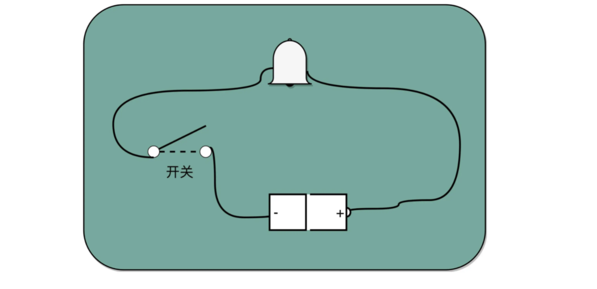

#### 2.理解继电器，给跑不动的信号续一秒

随着电线的线路越长，电线的电阻就越大。当电阻很大，而电压不够的时候，即使按下开关，蜂鸣器也不会响。

继电器

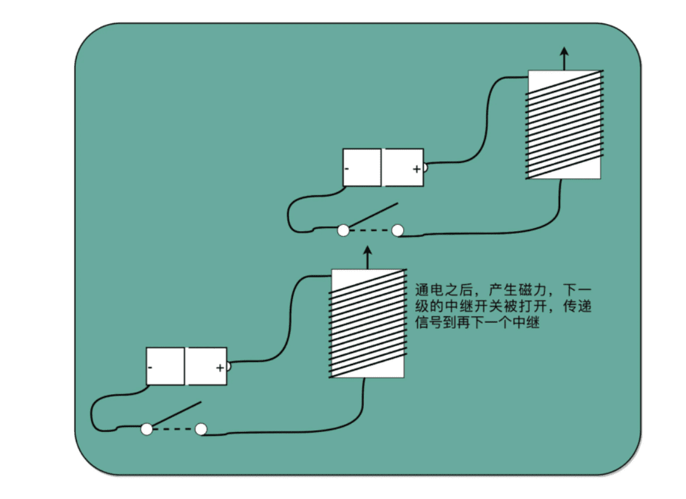

中继，其实就是不短地通过新的电源重新放大已经开始衰减的原有信号

>  继电器也叫电驿，这个接力的策略不仅可以用在电报中，也可以用在通信类的科技产品中如 “中继”的WiFi 路由器，光信号传输中信号放大信号的中继。

有了继电器之后，不仅有了一个能接力传输信号的方式，更重要的是和输入端通过开端的“开”和“关”来表示“1”和“0”一样，在输入端也能表示“1”和“0”了。

##### 与（AND）

在输入端的电路上，提供串联的两个开关，只有两个开关都打开，电路才接通，输出开关也才能接通，这其实就是模拟了计算机里面的“与”操作。

##### 或 （OR）

在输入端的电路，提供两条独立的线路到输出端，两条线路上各有一个开关，那么任何一个开关打开了，到输出端的电路都是接通的，这其实就是模拟了计算机中的“或”操作。

##### 非 （NOT）

把输出端的“螺旋线圈+磁性开关”的组合，从默认关掉，只有通电有了磁场之后打开，换成默认是打开通电的，只有通电之后才关闭，就得到了一个计算机中的“非”操作。输出端开和关正好和输入端相反。这个在数字电路中，也叫作反向器（Inverter）。

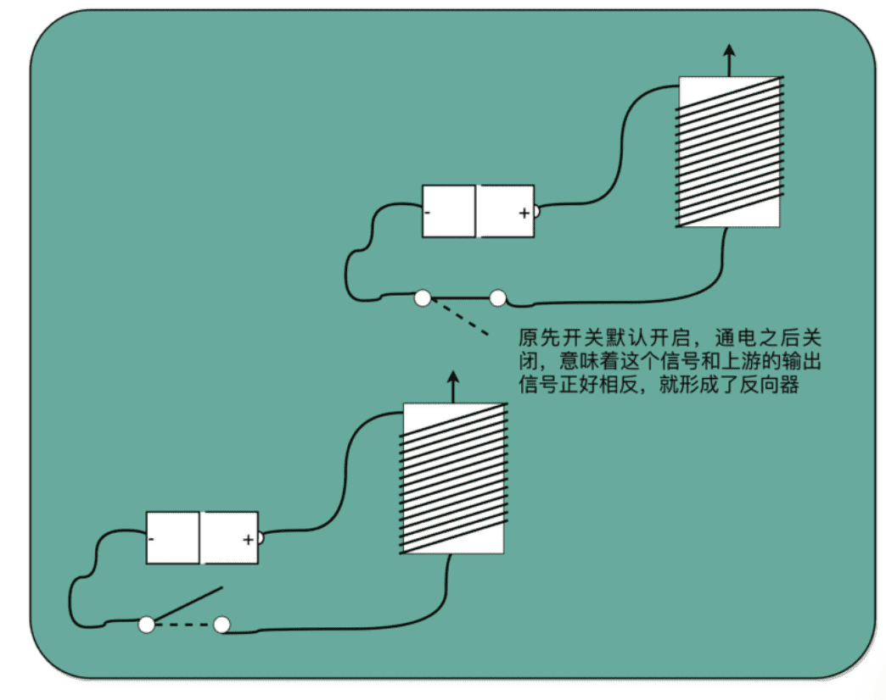

反向器的电路，其实就是开关从默认关闭变成默认开启而已。

与、或、非的电路都非常简单，要想做稍微复杂一点的工作，就需要很多电路的组合。不过，这也彰显了现代计算机体系中一个重要的思想，就是通过分层和组合，逐步搭建起更加强大的功能。

#### 3.推荐阅读

《编码：隐匿在计算机软硬件背后的语言》的第 6～11 章，是一个很好的入门材料，可以帮助你深入理解数字电路，值得你花时间好好读一读。

> 除了与、或、非之外，还有很多基础的门电路，比如“异或（XOR）门”。你可以想一想，试着搜索一些资料，设计一个异或门的电路。

### 三、加法器

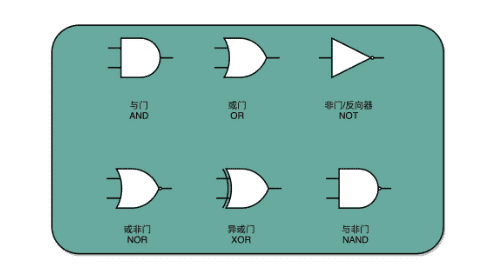

#### 1.异或门和半加器

**其实，异或门就是一个最简单的整数加法，所需要使用的基本门电路**。

所以，通过一个异或门计算出个位，通过一个与门计算出是否进位，我们就通过电路算出了一个一位数的加法。于是，**我们把两个门电路打包，给它取一个名字，就叫作半加器（Half Adder）。**

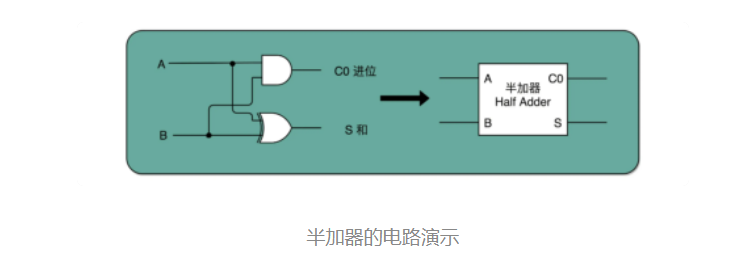

#### 2.全加器

**我们用两个半加器和一个或门，就能组合成一个全加器。**第一个半加器，我们用和个位的加法一样的方式，得到是否进位 X 和对应的二个数加和后的结果 Y，这样两个输出。然后，我们把这个加和后的结果 Y，和个位数相加后输出的进位信息 U，再连接到一个半加器上，就会再拿到一个是否进位的信号 V 和对应的加和后的结果 W。

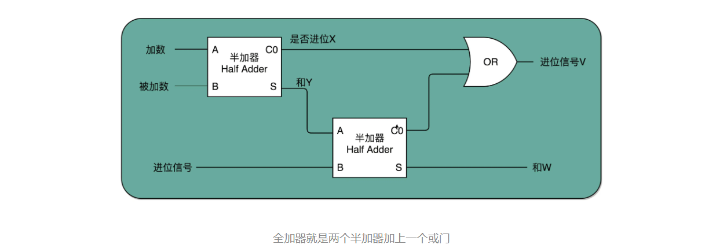

这个 W 就是我们在二位上留下的结果。我们把两个半加器的进位输出，作为一个或门的输入连接起来，只要两次加法中任何一次需要进位，那么在二位上，我们就会向左侧的四位进一位。因为一共只有三个 bit 相加，即使 3 个 bit 都是 1，也最多会进一位。这样，通过两个半加器和一个或门，我们就得到了一个，能够接受进位信号、加数和被加数，这样三个数组成的加法。这就是我们需要的全加器。

有了全加器，我们要进行对应的两个 8 bit 数的加法就很容易了。我们只要把 8 个全加器串联起来就好了。个位的全加器的进位信号作为二位全加器的输入信号，二位全加器的进位信号再作为四位的全加器的进位信号。这样一层层串接八层，我们就得到了一个支持 8 位数加法的算术单元。如果要扩展到 16 位、32 位，乃至 64 位，都只需要多串联几个输入位和全加器就好了。

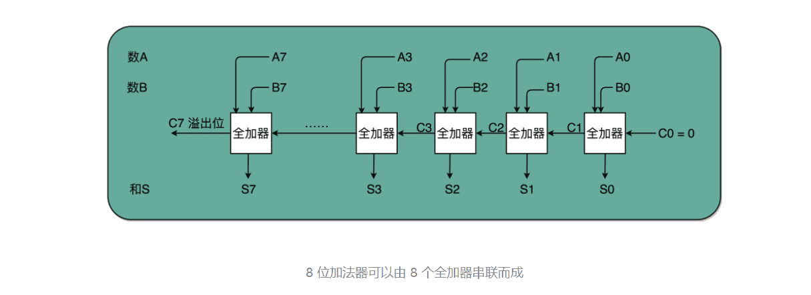

唯一需要注意的是，对于这个全加器，在个位，我们只需要用一个半加器，或者让全加器的进位输入始终是 0。因为个位没有来自更右侧的进位。而最左侧的一位输出的进位信号，表示的并不是再进一位，而是表示我们的加法是否溢出了。

一个个疑问，既然 int 这样的 16 位的整数加法，结果也是 16 位数，那怎么知道加法最终是否溢出了呢？

因为结果也只存得下加法结果的 16 位数。并没有留下一个第 17 位，来记录这个加法的结果是否溢出。看到全加器的电路设计，相信你应该明白，在整个加法器的结果中，其实有一个电路的信号，会标识出加法的结果是否溢出。把这个对应的信号，输出给到硬件中其他标志位里，让计算机知道计算的结果是否溢出。而现代计算机也正是这样做的。这就是为什么你在撰写程序的时候，能够知道你的计算结果是否溢出在硬件层面得到的支持。

#### 3.总结延伸

无论软件还是硬件中一个很重要的设计思想，分层。

从简单到复杂，我们一层层搭出了拥有更强能力的功能组件。在上面的一层，我们只需要考虑怎么用下一层的组件搭建出自己的功能，而不需要下沉到更低层的其他组件。就像你之前并没有深入学习过计算机组成原理，一样可以直接通过高级语言撰写代码，实现功能。

在硬件层面，我们通过门电路、半加器、全加器一层层搭出了加法器这样的功能组件。把这些用来做算术逻辑计算的组件叫作 ALU，也就是算术逻辑单元。当进一步打造强大的 CPU 时，我们不会再去关注最细颗粒的门电路，只需要把门电路组合而成的 ALU，当成一个能够完成基础计算的黑盒子就可以了。

#### 4.补充阅读

出于性能考虑，实际 CPU 里面使用的加法器，比起我们今天讲解的电路还有些差别，会更复杂一些。真实的加法器，使用的是一种叫作**超前进位加法器**的东西。可以找到北京大学在 Coursera 上开设的《计算机组成》课程中的 Video-306 “加法器优化”一节，了解一下超前进位加法器的实现原理，以及我们为什么要使用它。

> 出于性能考虑，实际 CPU 里面使用的加法器，比起我们今天讲解的电路还有些差别，会更复杂一些。真实的加法器，使用的是一种叫作超前进位加法器的东西。你可以找到北京大学在 Coursera 上开设的《计算机组成》课程中的 Video-306 “加法器优化”一节，了解一下超前进位加法器的实现原理，以及我们为什么要使用它。
>
> 你的思考很对，实际的加法器，并不是由全加器串联组成的，在14讲里面我们可以看到为了减少门延迟的损失，实际高位的计算结果直接来自低位的组合电路里面的输入。 封装意味着我们提供了更多的“简单电路”或者说“简单指令”来操作。但这也意味着同样复杂的操作需要更多条指令。 这个也是为什么在计算机体系结构里面会有 RISC 和 CISC 这样的复杂/精简 指令之争。

### 四、乘法器

#### 1.顺序乘法的实现过程


二进制的乘法有个很大的优点，就是这个过程你不需要背九九乘法口诀表了。因为单个位置上，乘数只能是 0 或者 1，所以实际的乘法，就退化成了位移和加法。

用上一讲的加法器来实现。乘法因为只有“0”和“1”两种情况，所以可以做成输入输出都是 4 个开关，中间用 1 个开关，同时来控制这 8 个开关的方式，这就实现了二进制下的单位的乘法。

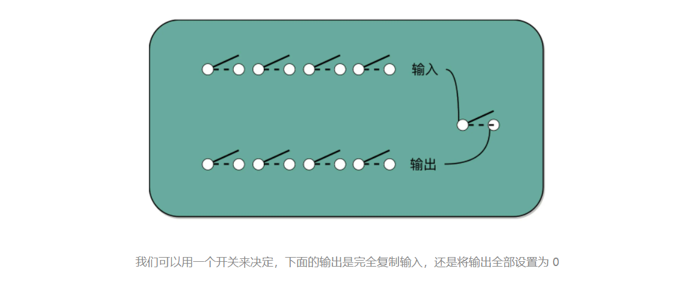


至于位移也不麻烦，我们只要不是直接连线，把正对着的开关之间进行接通，而是斜着错开位置去接就好了。如果要左移一位，就错开一位接线；如果要左移两位，就错开两位接线。

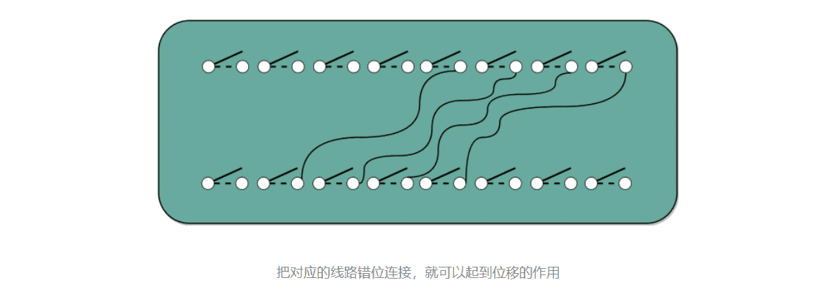

不需要引入任何新的、更复杂的电路，仍然用最基础的电路，只要用不同的接线方式，就能够实现一个“列竖式”的乘法。

为了节约一点开关，也就是晶体管的数量。

先拿乘数最右侧的个位乘以被乘数，然后把结果写入用来存放计算结果的开关里面，然后，把被乘数左移一位，把乘数右移一位，仍然用乘数去乘以被乘数，然后把结果加到刚才的结果上。反复重复这一步骤，直到不能再左移和右移位置。这样，乘数和被乘数就像两列相向而驶的列车，仅仅需要简单的加法器、一个可以左移一位的电路和一个右移一位的电路，就能完成整个乘法。

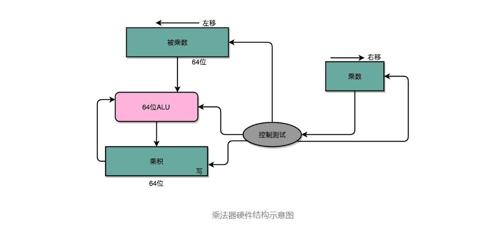

这里的控制测试，其实就是通过一个时钟信号，来控制左移、右移以及重新计算乘法和加法的时机。

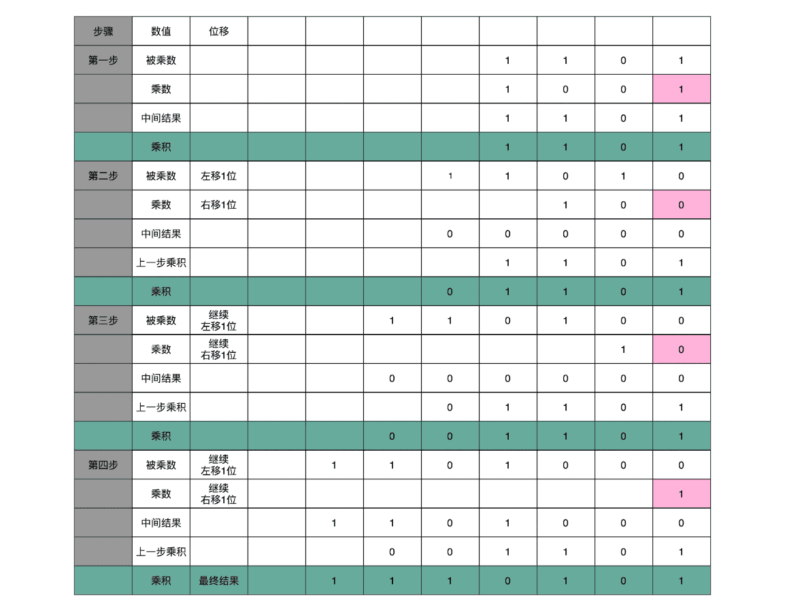

这个计算方式虽然节约电路了，但是也有一个很大的缺点，那就是慢。

在这个乘法器的实现过程里，我们其实就是把乘法展开，变成了“加法 + 位移”来实现。我们用的是 4 位数，所以要进行 4 组“位移 + 加法”的操作。而且这 4 组操作还不能同时进行。**因为下一组的加法要依赖上一组的加法后的计算结果，下一组的位移也要依赖上一组的位移的结果。这样，整个算法是“顺序”的，每一组加法或者位移的运算都需要一定的时间。**

#### 2.并行加速方法

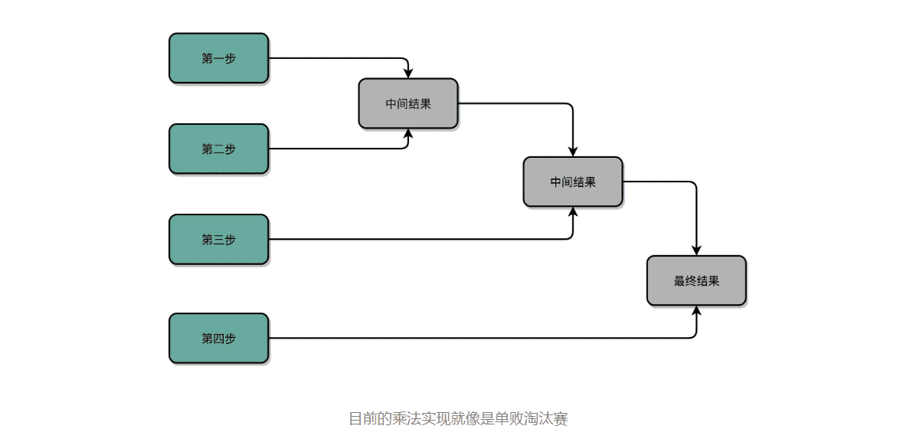

加速的办法，就是把比赛变成像世界杯足球赛那样的淘汰赛，32 个球队捉对厮杀，同时开赛。这样一天一下子就淘汰了 16 支队，也就是说，32 个数两两相加后，你可以得到 16 个结果。后面的比赛也是一样同时开赛捉对厮杀。只需要 5 天，也就是 O(log2N) 的时间，就能得到计算的结果。但是这种方式要求我们得有 16 个球场。因为在淘汰赛的第一轮，我们需要 16 场比赛同时进行。对应到我们 CPU 的硬件上，就是需要更多的晶体管开关，来放下中间计算结果。

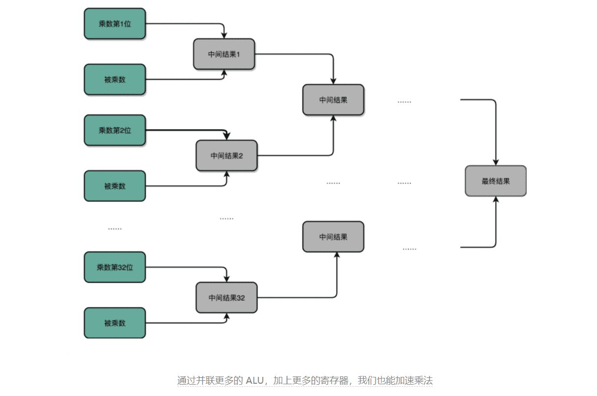

#### 3.电路并行

最典型的例子就是我们上一讲讲的加法器。每一个全加器，都要等待上一个全加器，把对应的进入输入结果算出来，才能算下一位的输出。位数越多，越往高位走，等待前面的步骤就越多，这个等待的时间有个专门的名词，叫作**门延迟（Gate Delay）**。

每通过一个门电路，我们就要等待门电路的计算结果，就是一层的门电路延迟，我们一般给它取一个**“T”**作为符号。

> 一个全加器，其实就已经有了 3T 的延迟（进位需要经过 3 个门电路）。而 4 位整数，最高位的计算需要等待前面三个全加器的进位结果，也就是要等 9T 的延迟。如果是 64 位整数，那就要变成 63×3=189T 的延迟。这可不是个小数字啊！

除了门延迟之外，还有一个问题就是**时钟频率**。在上面的顺序乘法计算里面，如果我们想要用更少的电路，计算的中间结果需要保存在寄存器里面，然后等待下一个时钟周期的到来，控制测试信号才能进行下一次移位和加法，这个延迟比上面的门延迟更可观。

那么，我们有什么办法可以解决这个问题呢？

我们只要把进位部分的电路完全展开就好了。我们的半加器到全加器，再到加法器，都是用最基础的门电路组合而成的。门电路的计算逻辑，可以像我们做数学里面的多项式乘法一样完全展开。在展开之后呢，我们可以把原来需要较少的，但是有较多层前后计算依赖关系的门电路，展开成需要较多的，但是依赖关系更少的门电路

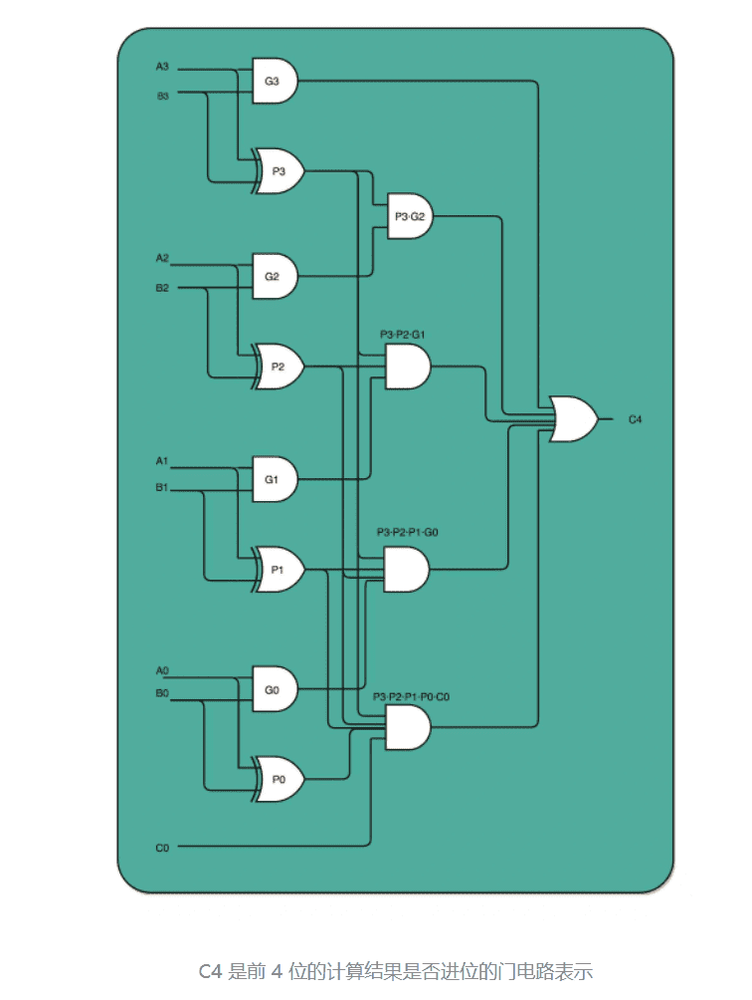

如果一个 4 位整数最高位是否进位，展开门电路图，你会发现，我们只需要 3T 的延迟就可以拿到是否进位的计算结果。而对于 64 位的整数，也不会增加门延迟，只是从上往下复制这个电路，接入更多的信号而已。看到没？我们通过把电路变复杂，就解决了延迟的问题。这个优化，本质上是利用了电路天然的并行性。**电路只要接通，输入的信号自动传播到了所有接通的线路里面，这其实也是硬件和软件最大的不同。**

无论是这里把对应的门电路逻辑进行完全展开以减少门延迟，还是上面的乘法通过并行计算多个位的乘法，都是把我们完成一个计算的电路变复杂了。而电路变复杂了，也就意味着晶体管变多了。

为什么晶体管的数量增加可以优化计算机的计算性能。实际上，这里的门电路展开和上面的并行计算乘法都是很好的例子。我们通过更多的晶体管，就可以拿到更低的门延迟，以及用更少的时钟周期完成一个计算指令。

#### 4.总结延伸

通过精巧地设计电路，用较少的门电路和寄存器，就能够计算完成乘法这样相对复杂的运算。是用更少更简单的电路，但是需要更长的门延迟和时钟周期；还是用更复杂的电路，但是更短的门延迟和时钟周期来计算一个复杂的指令，这之间的权衡，其实就是计算机体系结构中 RISC 和 CISC 的经典历史路线之争。

#### 5.推荐阅读

如果还有什么细节你觉得还没有彻底弄明白，我推荐你看一看《计算机组成与设计：硬件 / 软件接口》的 3.3 节。

### 五、浮点数和定点数

> [什么是浮点数？ - 知乎 (zhihu.com)](https://zhuanlan.zhihu.com/p/339949186?ivk_sa=1024320u)

#### 1.浮点数的不准确性

```shell
>>> 0.3 + 0.6
0.8999999999999999
```

无论是在 Python 还是在 JavaScript 里面，算出来的结果居然不是准确的 0.9，而是 0.8999999999999999 这么个结果。这是为什么呢？

先来想一个更抽象的问题。计算机通常用 16/32 个比特（bit）来表示一个数。那我问你，我们用 32 个比特，能够表示所有实数吗？

答案很显然是不能。32 个比特，只能表示 2 的 32 次方个不同的数，差不多是 40 亿个。如果表示的数要超过这个数，就会有两个不同的数的二进制表示是一样的。那计算机可就会一筹莫展，不知道这个数到底是多少。

40 亿个数看似已经很多了，但是比起无限多的实数集合却只是沧海一粟。所以，这个时候，计算机的设计者们，就要面临一个问题了：我到底应该让这 **40 亿个数映射到实数集合上的哪些数，在实际应用中才能最划得来呢？**

#### 2.定点数的表示

用 4 个比特来表示 0～9 的整数，那么 32 个比特就可以表示 8 个这样的整数。然后把最右边的 2 个 0～9 的整数，当成小数部分；把左边 6 个 0～9 的整数，当成整数部分。这样就可以用 32 个比特，来表示从 0 到 999999.99 这样 1 亿个实数了。


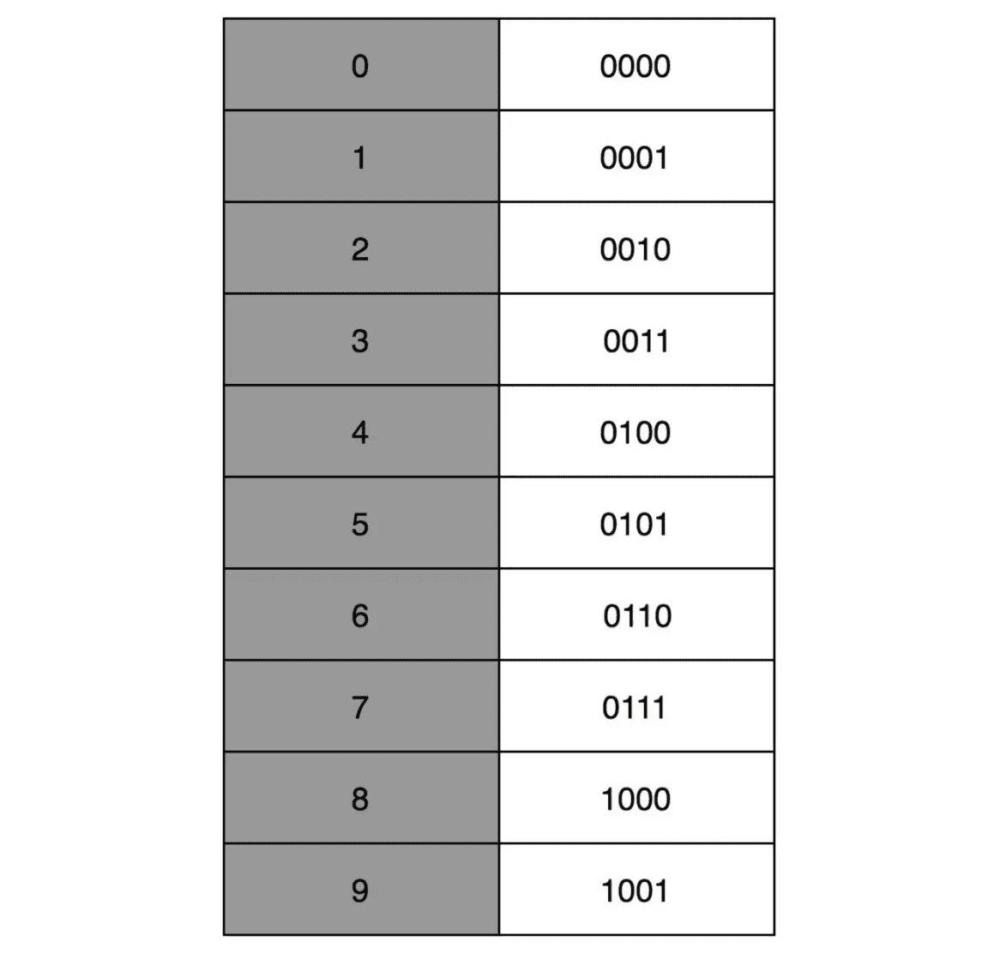

这种用二进制来表示十进制的编码方式，叫作**BCD 编码（Binary-Coded Decimal）**。其实它的运用非常广泛，最常用的是在超市、银行这样需要用小数记录金额的情况里。在超市里面，我们的小数最多也就到分。这样的表示方式，比较直观清楚，也满足了小数部分的计算。

##### BCD编码方式也有几个缺点：

**第一，这样的表示方式有点“浪费”。**本来 32 个比特我们可以表示 40 亿个不同的数，但是在 BCD 编码下，只能表示 1 亿个数，如果我们要精确到分的话，那么能够表示的最大金额也就是到 100 万。如果我们的货币单位是人民币或者美元还好，如果我们的货币单位变成了津巴布韦币，这个数量就不太够用了。

**第二，这样的表示方式没办法同时表示很大的数字和很小的数字。**我们在写程序的时候，实数的用途可能是多种多样的。有时候我们想要表示商品的金额，关心的是 9.99 这样小的数字；有时候，我们又要进行物理学的运算，需要表示光速，也就是 3×108 这样很大的数字。那么，我们有没有一个办法，既能够表示很小的数，又能表示很大的数呢？

#### 3.浮点数的表示

答案当然是有的，就是你可能经常听说过的浮点数（Floating Point），也就是 float 类型。

> 那么，在现实生活中，我们是怎么表示一个很大的数的呢？比如说，我们想要在一本科普书里，写一下宇宙内原子的数量，莫非是用一页纸，用好多行写下很多个 0 么？
>
> 当然不是了，我们会用科学计数法来表示这个数字。宇宙内的原子的数量，大概在 10 的 82 次方左右，我们就用 1.0×1082 这样的形式来表示这个数值，不需要写下 82 个 0。

计算机里，我们也可以用一样的办法，用科学计数法来表示实数。**浮点数的科学计数法的表示，有一个 IEEE 的标准，它定义了两个基本的格式。一个是用 32 比特表示单精度的浮点数，也就是我们常常说的 float 或者 float32 类型。另外一个是用 64 比特表示双精度的浮点数，也就是我们平时说的 double 或者 float64 类型。**

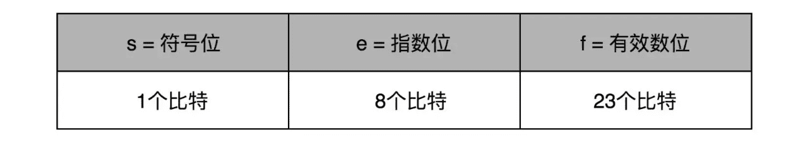

##### 单精度

单精度的 32 个比特可以分成三部分。

第一部分是一个符号位，用来表示是正数还是负数。我们一般用 s 来表示。在浮点数里，我们不像正数分符号数还是无符号数，所有的浮点数都是有符号的。

接下来是一个 8 个比特组成的指数位。我们一般用 e 来表示。8 个比特能够表示的整数空间，就是 0～255。我们在这里用 1～254 映射到 -126～127 这 254 个有正有负的数上。因为我们的浮点数，不仅仅想要表示很大的数，还希望能够表示很小的数，所以指数位也会有负数。

> 我们没有用到 0 和 255。没错，这里的 0（也就是 8 个比特全部为 0） 和 255 （也就是 8 个比特全部为 1）另有它用。

最后，是一个 23 个比特组成的有效数位。我们用 f 来表示。综合科学计数法，我们的浮点数就可以表示成下面这样：

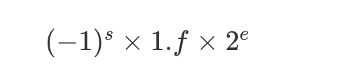

你会发现，这里的浮点数，没有办法表示 0。的确，要表示 0 和一些特殊的数，我们就要用上在 e 里面留下的 0 和 255 这两个表示，这两个表示其实是两个标记位。在 e 为 0 且 f 为 0 的时候，我们就把这个浮点数认为是 0。至于其它的 e 是 0 或者 255 的特殊情况，你可以看下面这个表格，分别可以表示出无穷大、无穷小、NAN 以及一个特殊的不规范数。

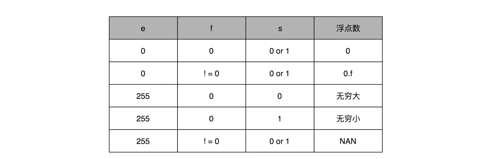

我们可以以 0.5 为例子。0.5 的符号为 s 应该是 0，f 应该是 0，而 e 应该是 -1，也就是

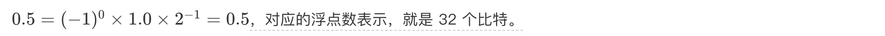

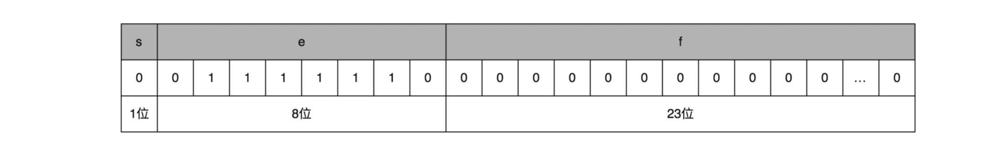

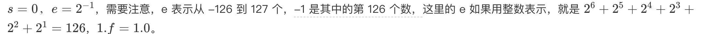

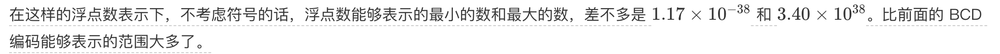

> 
>
> 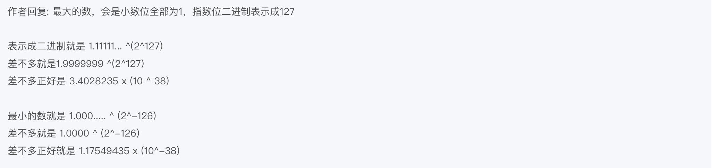

#### 4.总结延伸

浮点数能够表示的数据范围一下子大了很多。**正是因为这个数对应的小数点的位置是“浮动”的，它才被称为浮点数。随着指数位 e 的值的不同，小数点的位置也在变动。**对应的，前面的 BCD 编码的实数，就是小数点固定在某一位的方式，我们也就把它称为**定点数**。

回到我们最开头，为什么我们用 0.3 + 0.6 不能得到 0.9 呢？这是因为，浮点数没有办法精确表示 0.3、0.6 和 0.9。事实上，我们拿出 0.1～0.9 这 9 个数，其中只有 0.5 能够被精确地表示成二进制的浮点数，也就是 s = 0、e = -1、f = 0 这样的情况。

而 0.3、0.6 乃至我们希望的 0.9，都只是一个近似的表达。这个也为我们带来了一个挑战，就是浮点数无论是表示还是计算其实都是近似计算。那么，在使用过程中，我们该怎么来使用浮点数，以及使用浮点数会遇到些什么问题呢？下一讲，我会用更多的实际代码案例，来带你看看浮点数计算中的各种“坑”。

#### 5.推荐阅读

如果对浮点数的表示还不是很清楚，你可以仔细阅读一下《计算机组成与设计：硬件 / 软件接口》的 3.5.1 节。


