### 一、建立数据通路

#### 1.1指令周期 (Instruction Cycle)

计算机每执行一条指令的过程，可以分解成这样几个步骤：

1. **Fetch（取得指令）**，也就是从 PC 寄存器里找到对应的指令地址，根据指令地址从内存里把具体的指令，加载到指令寄存器中，然后把 PC 寄存器自增，好在未来执行下一条指令。

2. **Decode（指令译码）**，也就是根据指令寄存器里面的指令，解析成要进行什么样的操作，是 R、I、J 中的哪一种指令，具体要操作哪些寄存器、数据或者内存地址。
3. **Execute（执行指令）**，也就是实际运行对应的 R、I、J 这些特定的指令，进行算术逻辑操作、数据传输或者直接的地址跳转。

4. 重复进行 1～3 的步骤。

这样的步骤，其实就是一个永不停歇的“Fetch - Decode - Execute”的循环，我们把这个循环称之为**指令周期（Instruction Cycle）**。

在取指令的阶段，我们的指令是放在**存储器**里的，实际上，通过 PC 寄存器和指令寄存器取出指令的过程，是由**控制器（Control Unit）**操作的。指令的解码过程，也是由**控制器**进行的。一旦到了执行指令阶段，无论是进行算术操作、逻辑操作的 R 型指令，还是进行数据传输、条件分支的 I 型指令，都是由**算术逻辑单元（ALU）**操作的，也就是由**运算器**处理的。不过，如果是一个简单的无条件地址跳转，那么我们可以直接在**控制器**里面完成，不需要用到运算器。

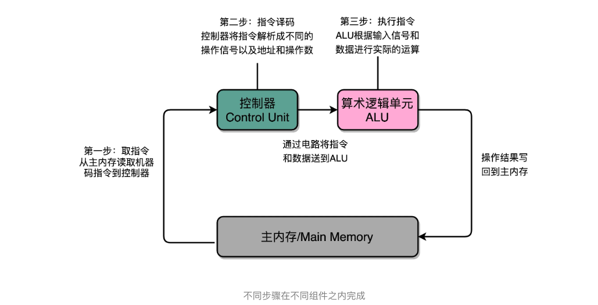

除了 Instruction Cycle 这个指令周期，在 CPU 里面我们还会提到另外两个常见的 Cycle。一个叫 **Machine Cycle，机器周期或者 CPU 周期**。CPU 内部的操作速度很快，但是访问内存的速度却要慢很多。每一条指令都需要从内存里面加载而来，所以我们一般把从内存里面读取一条指令的最短时间，称为 **CPU 周期**。

还有一个是之前提过的 **Clock Cycle**，也就是**时钟周期**以及我们机器的主频。一个 CPU 周期，通常会由几个时钟周期累积起来。一个 CPU 周期的时间，就是这几个 Clock Cycle 的总和。

对于一个指令周期来说，我们取出一条指令，然后执行它，至少需要两个 CPU 周期。取出指令至少需要一个 CPU 周期，执行至少也需要一个 CPU 周期，复杂的指令则需要更多的 CPU 周期。

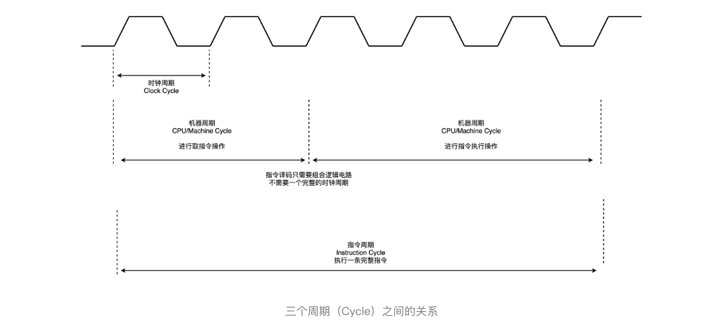

所以，说一个指令周期，包含多个 CPU 周期，而一个 CPU 周期包含多个时钟周期。

#### 1.2建立数据通路

一般来说，我们可以认为，数据通路就是我们的处理器单元。它通常由两类原件组成。

第一类叫操作元件，也叫**组合逻辑元件（Combinational Element）**，其实就是我们的 ALU。在前面讲 ALU 的过程中可以看到，它们的功能就是在特定的输入下，根据下面的组合电路的逻辑，生成特定的输出。

第二类叫存储元件，也有叫**状态元件（State Element）**的。比如我们在计算过程中需要用到的寄存器，无论是通用寄存器还是状态寄存器，其实都是存储元件。

我们通过数据总线的方式，把它们连接起来，就可以完成数据的存储、处理和传输了，这就是所谓的**建立数据通路**了。

**控制器**它的逻辑就没那么复杂了，可以把它看成只是机械地重复“Fetch - Decode - Execute“循环中的前两个步骤，然后把最后一个步骤，通过控制器产生的控制信号，交给 ALU 去处理。

听起来是不是很简单？实际上，控制器的电路特别复杂。下面我给你详细解析一下。

一方面，所有 CPU 支持的指令，都会在控制器里面，被解析成不同的输出信号。我们之前说过，现在的 Intel CPU 支持 2000 个以上的指令。这意味着，控制器输出的控制信号，至少有 2000 种不同的组合。

运算器里的 ALU 和各种组合逻辑电路，可以认为是一个固定功能的电路。控制器“翻译”出来的，就是不同的控制信号。这些控制信号，告诉 ALU 去做不同的计算。可以说正是控制器的存在，让我们可以“编程”来实现功能，能让我们的“存储程序型计算机”名副其实。

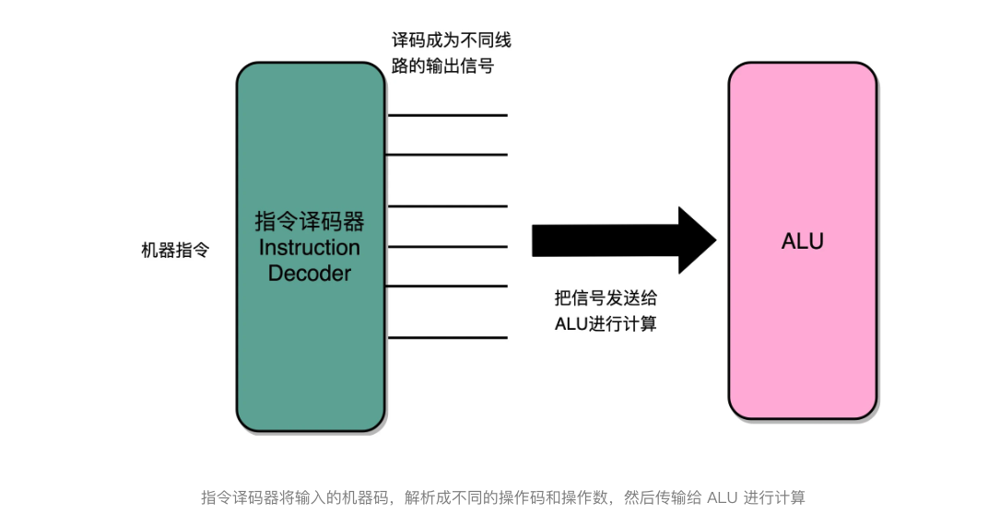

#### 1.3CPU 所需要的硬件电路

那么，要想搭建出来整个 CPU，我们需要在数字电路层面，实现这样一些功能。

首先，自然是我们之前已经讲解过的 ALU 了，它实际就是一个没有状态的，根据输入计算输出结果的第一个电路。

第二，我们需要有一个能够进行状态读写的电路元件，也就是我们的寄存器。我们需要有一个电路，能够存储到上一次的计算结果。这个计算结果并不一定要立刻拿到电路的下游去使用，但是可以在需要的时候拿出来用。常见的能够进行状态读写的电路，就有锁存器（Latch），以及我们后面要讲的 D 触发器（Data/Delay Flip-flop）的电路。

第三，我们需要有一个“自动”的电路，按照固定的周期，不停地实现 PC 寄存器自增，自动地去执行“Fetch - Decode - Execute“的步骤。我们的程序执行，并不是靠人去拨动开关来执行指令的。我们希望有一个“自动”的电路，不停地去一条条执行指令。

我们看似写了各种复杂的高级程序进行各种函数调用、条件跳转。其实只是修改 PC 寄存器里面的地址。PC 寄存器里面的地址一修改，计算机就可以加载一条指令新指令，往下运行。实际上，PC 寄存器还有一个名字，就叫作**程序计数器**。顾名思义，就是随着时间变化，不断去数数。数的数字变大了，就去执行一条新指令。所以，我们需要的就是一个自动数数的电路。

第四，我们需要有一个“译码”的电路。无论是对于指令进行 decode，还是对于拿到的内存地址去获取对应的数据或者指令，我们都需要通过一个电路找到对应的数据。这个对应的自然就是“译码器”的电路了。

好了，现在我们把这四类电路，通过各种方式组合在一起，就能最终组成功能强大的 CPU 了。但是，要实现这四种电路中的中间两种，我们还需要时钟电路的配合。下一节，一起来看一看，这些基础的电路功能是怎么实现的，以及怎么把这些电路组合起来变成一个 CPU。

#### 1.4总结延伸

CPU 运转需要的数据通路和控制器介绍完了，也找出了需要完成这些功能，需要的 4 种基本电路。它们分别是，ALU 这样的组合逻辑电路、用来存储数据的锁存器和 D 触发器电路、用来实现 PC 寄存器的计数器电路，以及用来解码和寻址的译码器电路。

虽然 CPU 已经是由几十亿个晶体管组成的及其复杂的电路，但是它仍然是由这样一个个基本功能的电路组成的。只要搞清楚这些电路的运作原理，你自然也就弄明白了 CPU 的工作原理。

#### 1.5推荐阅读

如果想要了解数据通路，可以参看《计算机组成与设计 硬件软件接口》的第 5 版的 4.1 到 4.4 节。专栏里的内容是从更高一层的抽象逻辑来解释这些问题，而教科书里包含了更多电路的技术细节。这两者结合起来学习，能够帮助你更深入地去理解数据通路。

#### 1.6课后思考

这一讲，我们说 CPU 好像一个永不停歇的机器，一直在不停地读取下一条指令去运行。那为什么 CPU 还会有满载运行和 Idle 闲置的状态呢？请你自己搜索研究一下这是为什么？

#### 2.1时序逻辑电路

其中有一些电路，和实现过的加法器一样，只需要给定输入，就能得到固定的输出。这样的电路，称之为**组合逻辑电路（Combinational Logic Circuit）。**

> 但是，光有组合逻辑电路是不够的。你可以想一下，如果只有组合逻辑电路，我们的 CPU 会是什么样的？电路输入是确定的，对应的输出自然也就确定了。那么，我们要进行不同的计算，就要去手动拨动各种开关，来改变电路的开闭状态。这样的计算机，不像我们现在每天用的功能强大的电子计算机，反倒更像古老的计算尺或者机械计算机，干不了太复杂的工作，只能协助我们完成一些计算工作。

这样，我们就需要引入第二类的电路，也就是**时序逻辑电路（Sequential Logic Circuit）**。

时序逻辑电路可以帮我们解决这样几个问题。

**第一个就是自动运行的问题。**

时序电路接通之后可以不停地开启和关闭开关，进入一个自动运行的状态。这个使得我们上一讲说的，控制器不停地让 PC 寄存器自增读取下一条指令成为可能。

**第二个是存储的问题。**

通过时序电路实现的触发器，能把计算结果存储在特定的电路里面，而不是像组合逻辑电路那样，一旦输入有任何改变，对应的输出也会改变。

**第三个本质上解决了各个功能按照时序协调的问题。**

无论是程序实现的软件指令，还是到硬件层面，各种指令的操作都有先后的顺序要求。时序电路使得不同的事件按照时间顺序发生。

#### 2.2始终信号的硬件实现

想要实现时序逻辑电路，第一步我们需要的就是一个时钟。CPU 的主频是由一个晶体振荡器来实现的，而这个晶体振荡器生成的电路信号，就是我们的时钟信号。

一旦我们合上开关 A，磁性线圈就会通电，产生磁性，开关 B 就会从合上变成断开。一旦这个开关断开了，电路就中断了，磁性线圈就失去了磁性。于是，开关 B 又会弹回到合上的状态。这样一来，电路接通，线圈又有了磁性。我们的电路就会来回不断地在开启、关闭这两个状态中切换。

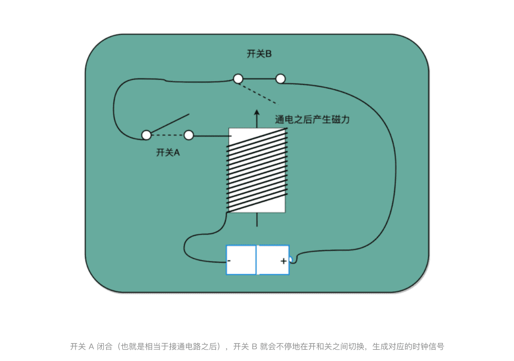

这个不断切换的过程，对于下游电路来说，就是不断地产生新的 0 和 1 这样的信号。如果你在下游的电路上接上一个灯泡，就会发现这个灯泡在亮和暗之间不停切换。这个按照固定的周期不断在 0 和 1 之间切换的信号，就是我们的**时钟信号（Clock Signal）**。

一般这样产生的时钟信号，就像你在各种教科书图例中看到的一样，是一个振荡产生的 0、1 信号。

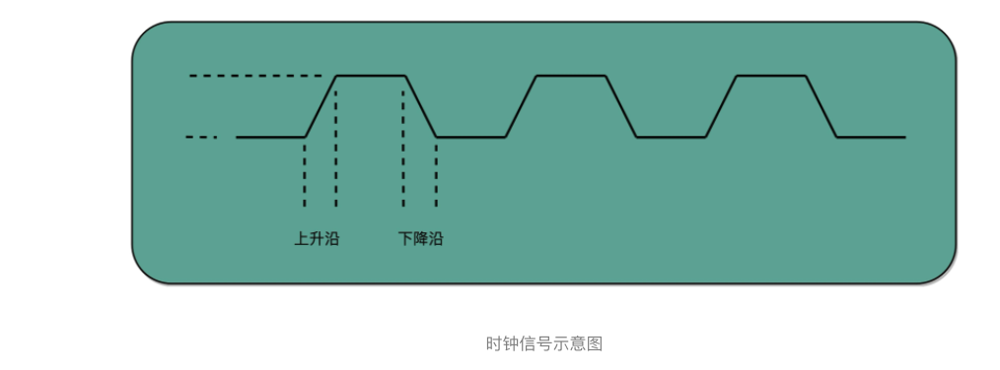

这种电路，其实就相当于把电路的输出信号作为输入信号，再回到当前电路。这样的电路构造方式呢，我们叫作反馈电路（Feedback Circuit）。

上面这个反馈电路一般可以用下面这个示意图来表示，其实就是一个输出结果接回输入的**反相器（Inverter**），也就是我们之前讲过的非门。

#### 2.3通过D触发器实现存储功能

有了时钟信号，我们的系统里就有了一个像“自动门”一样的开关。利用这个开关和相同的反馈电路，我们就可以构造出一个有“记忆”功能的电路。这个有记忆功能的电路，可以实现在 CPU 中用来存储计算结果的寄存器，也可以用来实现计算机五大组成部分之一的存储器。

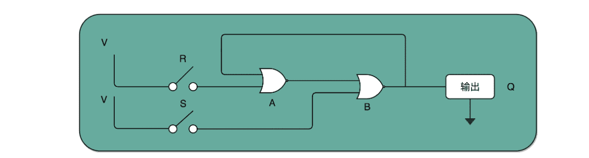

我们先来看下面这个 RS 触发器电路。这个电路由两个或非门电路组成。我在图里面，把它标成了 A 和 B。

1. 在这个电路一开始，输入开关都是关闭的，所以或非门（NOR）A 的输入是 0 和 0。对应到我列的这个真值表，输出就是 1。而或非门 B 的输入是 0 和 A 的输出 1，对应输出就是 0。B 的输出 0 反馈到 A，和之前的输入没有变化，A 的输出仍然是 1。而整个电路的输出 Q，也就是 0。
2. 当我们把 A 前面的开关 R 合上的时候，A 的输入变成了 1 和 0，输出就变成了 0，对应 B 的输入变成 0 和 0，输出就变成了 1。B 的输出 1 反馈给到了 A，A 的输入变成了 1 和 1，输出仍然是 0。所以把 A 的开关合上之后，电路仍然是稳定的，不会像晶振那样振荡，但是整个电路的输出 Q 变成了 1。
3. 这个时候，如果我们再把 A 前面的开关 R 打开，A 的输入变成和 1 和 0，输出还是 0，对应的 B 的输入没有变化，输出也还是 1。B 的输出 1 反馈给到了 A，A 的输入变成了 1 和 0，输出仍然是 0。这个时候，电路仍然稳定。开关 R 和 S 的状态和上面的第一步是一样的，但是最终的输出 Q 仍然是 1，和第 1 步里 Q 状态是相反的。我们的输入和刚才第二步的开关状态不一样，但是输出结果仍然保留在了第 2 步时的输出没有发生变化。
4. 这个时候，只有我们再去关闭下面的开关 S，才可以看到，这个时候，B 有一个输入必然是 1，所以 B 的输出必然是 0，也就是电路的最终输出 Q 必然是 0。

这样一个电路，我们称之为触发器（Flip-Flop）。接通开关 R，输出变为 1，即使断开开关，输出还是 1 不变。接通开关 S，输出变为 0，即使断开开关，输出也还是 0。也就是，**当两个开关都断开的时候，最终的输出结果，取决于之前动作的输出结果，这个也就是我们说的记忆功能。**

这里的这个电路是最简单的 RS 触发器，也就是所谓的复位置位触发器（Reset-Set Flip Flop) 。对应的输出结果的真值表，你可以看下面这个表格。可以看到，当两个开关都是 0 的时候，对应的输出不是 1 或者 0，而是和 Q 的上一个状态一致。

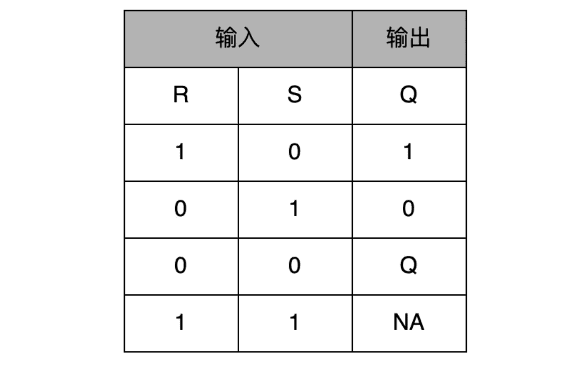

再往这个电路里加两个与门和一个小小的时钟信号，我们就可以实现一个利用时钟信号来操作一个电路了。这个电路可以帮我们实现什么时候可以往 Q 里写入数据。

我们看看下面这个电路，这个在我们的上面的 R-S 触发器基础之上，在 R 和 S 开关之后，加入了两个与门，同时给这两个与门加入了**一个时钟信号 CLK** 作为电路输入。

这样，当时钟信号 CLK 在低电平的时候，与门的输入里有一个 0，两个实际的 R 和 S 后的与门的输出必然是 0。也就是说，无论我们怎么按 R 和 S 的开关，根据 R-S 触发器的真值表，对应的 Q 的输出都不会发生变化。

有当时钟信号 CLK 在高电平的时候，与门的一个输入是 1，输出结果完全取决于 R 和 S 的开关。我们可以在这个时候，通过开关 R 和 S，来决定对应 Q 的输出。

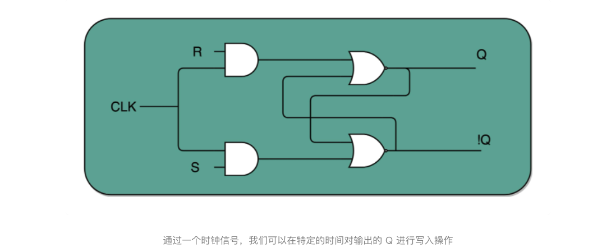

如果这个时候，我们让 R 和 S 的开关，也用一个反相器连起来，也就是通过同一个开关控制 R 和 S。只要 CLK 信号是 1，R 和 S 就可以设置输出 Q。而当 CLK 信号是 0 的时候，无论 R 和 S 怎么设置，输出信号 Q 是不变的。这样，这个电路就成了我们最常用的 D 型触发器。用来控制 R 和 S 这两个开关的信号呢，我们视作一个输入的数据信号 D，也就是 Data，这就是 D 型触发器的由来。

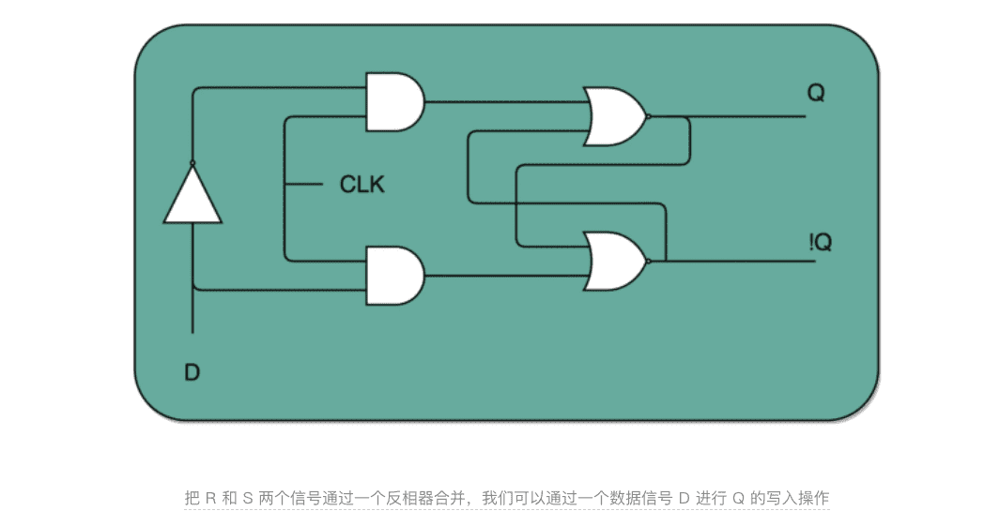

一个 D 型触发器，只能控制 1 个比特的读写，但是如果我们同时拿出多个 D 型触发器并列在一起，并且把用同一个 CLK 信号控制作为所有 D 型触发器的开关，这就变成了一个 N 位的 D 型触发器，也就可以同时控制 N 位的读写。

CPU 里面的寄存器可以直接通过 D 型触发器来构造。我们可以在 D 型触发器的基础上，加上更多的开关，来实现清 0 或者全部置为 1 这样的快捷操作。

#### 2.4总结延伸

通过引入了时序电路，我们终于可以把数据“存储”下来了。我们通过反馈电路，创建了时钟信号，然后再利用这个时钟信号和门电路组合，实现了“状态记忆”的功能。

电路的输出信号不单单取决于当前的输入信号，还要取决于输出信号之前的状态。最常见的这个电路就是我们的 D 触发器，它也是我们实际在 CPU 内实现存储功能的寄存器的实现方式。

这也是现代计算机体系结构中的“冯·诺伊曼”机的一个关键，就是程序需要可以“存储”，而不是靠固定的线路连接或者手工拨动开关，来实现计算机的可存储和可编程的功能。

有了时钟信号和触发器之后，我们还差一个“自动”需求没有实现。我们的计算机还不能做到自动地不停地从内存里面读取指令去执行。

#### 2.5推荐阅读

想要深入了解计算机里面的各种功能组件，是怎么通过电路来实现的，推荐你去阅读《编码：隐匿在计算机软硬件背后的语言》这本书的第 14 章和 16 章。

如果对于数字电路和数字逻辑特别感兴趣，想要彻底弄清楚数字电路、时序逻辑电路，也可以看一看计算机学科的一本专业的教科书《数字逻辑应用与设计》。

#### 2.6课后思考

现在我们的 CPU 主频非常高了，通常在几 GHz 了，但是实际上我们的晶振并不能提供这么高的频率，而是通过“外频 + 倍频“的方式来实现高频率的时钟信号。请你研究一下，倍频和分频的信号是通过什么样的电路实现的？

#### 3.1PC寄存器所需要的计数器

> PC寄存器也叫程序计数器

TODO

3.2

### 二、面向流水线的指令设计

> 程序的性能 是由三个因素相乘来衡量的，“指令数xCPIx时钟周期”

#### 1.1单指令周期处理器

一条 CPU 指令的执行，是由“取得指令（Fetch）- 指令译码（Decode）- 执行指令（Execute） ”这样三个步骤组成的。

我们希望能确保让这样一整条指令的执行，在一个时钟周期内完成。这样，我们一个时钟周期可以执行一条指令，CPI 也就是 1，看起来就比执行一条指令需要多个时钟周期性能要好。**采用这种设计思路的处理器，就叫作单指令周期处理器（Single Cycle Processor）**，也就是在一个时钟周期内，处理器正好能处理一条指令。

不过，我们的时钟周期是固定的，但是指令的电路复杂程度是不同的，所以实际一条指令执行的时间是不同的。

不同指令的执行时间不同，但是我们需要让所有指令都在一个时钟周期内完成，那就只好把时钟周期和执行时间最长的那个指令设成一样。

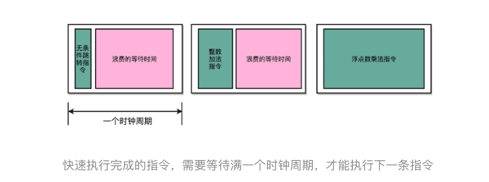

所以，在单指令周期处理器里面，无论是执行一条用不到 ALU 的无条件跳转指令，还是一条计算起来电路特别复杂的浮点数乘法运算，我们都等要等满一个时钟周期。在这个情况下，虽然 CPI 能够保持在 1，但是我们的时钟频率却没法太高。因为太高的话，有些复杂指令没有办法在一个时钟周期内运行完成。那么在下一个时钟周期到来，开始执行下一条指令的时候，前一条指令的执行结果可能还没有写入到寄存器里面。那下一条指令读取的数据就是不准确的，就会出现错误。

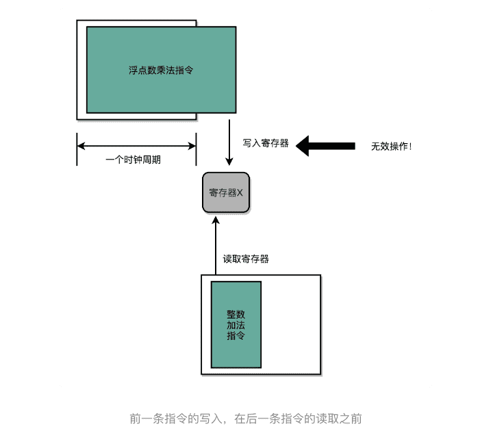

#### 1.2现代处理器的流水线设计

指令执行过程会拆分成“取指令、译码、执行”这样三大步骤。更细分一点的话，执行的过程，其实还包含从寄存器或者内存中读取数据，通过 ALU 进行运算，把结果写回到寄存器或者内存中。

>  如果我们有一个开发团队，我们不会让后端工程师开发完 API 之后，就歇着等待前台 App 的开发、测试乃至发布，而是会在客户端 App 开发的同时，着手下一个需求的后端 API 开发。那么，同样的思路我们可以一样应用在 CPU 执行指令的过程中。

CPU 的指令执行过程，其实也是由各个电路模块组成的。我们在取指令的时候，需要一个译码器把数据从内存里面取出来，写入到寄存器中；在指令译码的时候，我们需要另外一个译码器，把指令解析成对应的控制信号、内存地址和数据；到了指令执行的时候，我们需要的则是一个完成计算工作的 ALU。这些都是一个一个独立的组合逻辑电路，我们可以把它们看作一个团队里面的产品经理、后端工程师和客户端工程师，共同协作来完成任务。

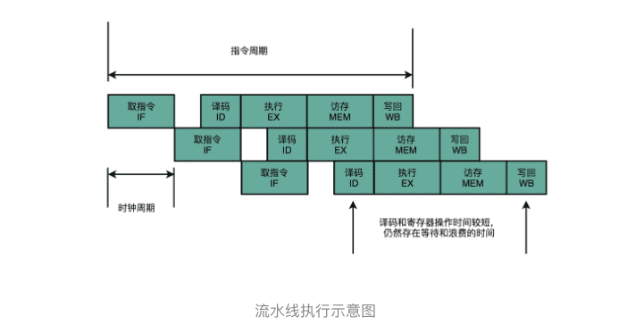

这样一来，我们就不用把时钟周期设置成整条指令执行的时间，而是拆分成完成这样的一个一个小步骤需要的时间。同时，每一个阶段的电路在完成对应的任务之后，也不需要等待整个指令执行完成，而是可以直接执行下一条指令的对应阶段。

这就好像我们的后端程序员不需要等待功能上线，就会从产品经理手中拿到下一个需求，开始开发 API。这样的协作模式，就是我们所说的**指令流水线**。这里面每一个独立的步骤，我们就称之为**流水线阶段或者流水线级（Pipeline Stage）**。

如果我们把一个指令拆分成“取指令 - 指令译码 - 执行指令”这样三个部分，那这就是一个三级的流水线。

如果我们进一步把“执行指令”拆分成“ALU 计算（指令执行）- 内存访问 - 数据写回”，那么它就会变成一个五级的流水线。

五级的流水线，就表示我们在同一个时钟周期里面，同时运行五条指令的不同阶段。这个时候，虽然执行一条指令的时钟周期变成了 5，但是我们可以把 CPU 的主频提得更高了。**我们不需要确保最复杂的那条指令在时钟周期里面执行完成，而只要保障一个最复杂的流水线级的操作，在一个时钟周期内完成就好了。**

> 如果某一个操作步骤的时间太长，我们就可以考虑把这个步骤，拆分成更多的步骤，让所有步骤需要执行的时间尽量都差不多长。这样，也就可以解决我们在单指令周期处理器中遇到的，性能瓶颈来自于最复杂的指令的问题。像我们现代的 ARM 或者 Intel 的 CPU，流水线级数都已经到了 14 级。
>
> 虽然我们不能通过流水线，来减少单条指令执行的“延时”这个性能指标，但是，通过同时在执行多条指令的不同阶段，我们提升了 CPU 的“吞吐率”。在外部看来，我们的 CPU 好像是“一心多用”，在同一时间，同时执行 5 条不同指令的不同阶段。在 CPU 内部，其实它就像生产线一样，不同分工的组件不断处理上游传递下来的内容，而不需要等待单件商品生产完成之后，再启动下一件商品的生产过程。

