### 一、建立数据通路

#### 1.指令周期 (Instruction Cycle)

计算机每执行一条指令的过程，可以分解成这样几个步骤：

1. **Fetch（取得指令）**，也就是从 PC 寄存器里找到对应的指令地址，根据指令地址从内存里把具体的指令，加载到指令寄存器中，然后把 PC 寄存器自增，好在未来执行下一条指令。

2. **Decode（指令译码）**，也就是根据指令寄存器里面的指令，解析成要进行什么样的操作，是 R、I、J 中的哪一种指令，具体要操作哪些寄存器、数据或者内存地址。
3. **Execute（执行指令）**，也就是实际运行对应的 R、I、J 这些特定的指令，进行算术逻辑操作、数据传输或者直接的地址跳转。

4. 重复进行 1～3 的步骤。

这样的步骤，其实就是一个永不停歇的“Fetch - Decode - Execute”的循环，我们把这个循环称之为**指令周期（Instruction Cycle）**。

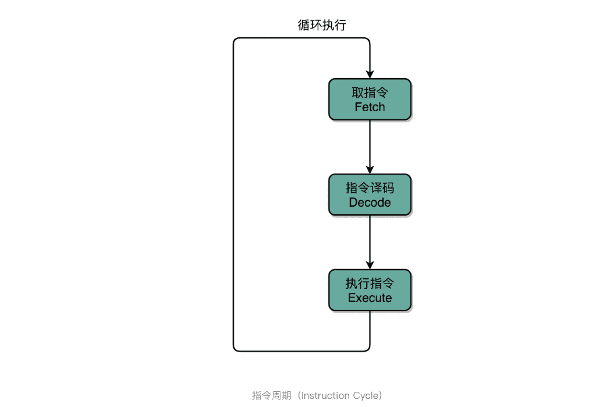

在取指令的阶段，我们的指令是放在**存储器**里的，实际上，通过 PC 寄存器和指令寄存器取出指令的过程，是由**控制器（Control Unit）**操作的。指令的解码过程，也是由**控制器**进行的。一旦到了执行指令阶段，无论是进行算术操作、逻辑操作的 R 型指令，还是进行数据传输、条件分支的 I 型指令，都是由**算术逻辑单元（ALU）**操作的，也就是由**运算器**处理的。不过，如果是一个简单的无条件地址跳转，那么我们可以直接在**控制器**里面完成，不需要用到运算器。


除了 Instruction Cycle 这个指令周期，在 CPU 里面我们还会提到另外两个常见的 Cycle。一个叫 **Machine Cycle，机器周期或者 CPU 周期**。CPU 内部的操作速度很快，但是访问内存的速度却要慢很多。每一条指令都需要从内存里面加载而来，所以我们一般把从内存里面读取一条指令的最短时间，称为 **CPU 周期**。

还有一个是之前提过的 **Clock Cycle**，也就是**时钟周期**以及我们机器的主频。一个 CPU 周期，通常会由几个时钟周期累积起来。一个 CPU 周期的时间，就是这几个 Clock Cycle 的总和。

对于一个指令周期来说，我们取出一条指令，然后执行它，至少需要两个 CPU 周期。取出指令至少需要一个 CPU 周期，执行至少也需要一个 CPU 周期，复杂的指令则需要更多的 CPU 周期。


所以，说一个指令周期，包含多个 CPU 周期，而一个 CPU 周期包含多个时钟周期。

##### 1.建立数据通路

一般来说，我们可以认为，数据通路就是我们的处理器单元。它通常由两类原件组成。

第一类叫操作元件，也叫**组合逻辑元件（Combinational Element）**，其实就是我们的 ALU。在前面讲 ALU 的过程中可以看到，它们的功能就是在特定的输入下，根据下面的组合电路的逻辑，生成特定的输出。

第二类叫存储元件，也有叫**状态元件（State Element）**的。比如我们在计算过程中需要用到的寄存器，无论是通用寄存器还是状态寄存器，其实都是存储元件。

我们通过数据总线的方式，把它们连接起来，就可以完成数据的存储、处理和传输了，这就是所谓的**建立数据通路**了。


**控制器**它的逻辑就没那么复杂了，可以把它看成只是机械地重复“Fetch - Decode - Execute“循环中的前两个步骤，然后把最后一个步骤，通过控制器产生的控制信号，交给 ALU 去处理。

听起来是不是很简单？实际上，控制器的电路特别复杂。下面我给你详细解析一下。

一方面，所有 CPU 支持的指令，都会在控制器里面，被解析成不同的输出信号。我们之前说过，现在的 Intel CPU 支持 2000 个以上的指令。这意味着，控制器输出的控制信号，至少有 2000 种不同的组合。

运算器里的 ALU 和各种组合逻辑电路，可以认为是一个固定功能的电路。控制器“翻译”出来的，就是不同的控制信号。这些控制信号，告诉 ALU 去做不同的计算。可以说正是控制器的存在，让我们可以“编程”来实现功能，能让我们的“存储程序型计算机”名副其实。


##### 2.CPU 所需要的硬件电路

那么，要想搭建出来整个 CPU，我们需要在数字电路层面，实现这样一些功能。

首先，自然是我们之前已经讲解过的 ALU 了，它实际就是一个没有状态的，根据输入计算输出结果的第一个电路。

第二，我们需要有一个能够进行状态读写的电路元件，也就是我们的寄存器。我们需要有一个电路，能够存储到上一次的计算结果。这个计算结果并不一定要立刻拿到电路的下游去使用，但是可以在需要的时候拿出来用。常见的能够进行状态读写的电路，就有锁存器（Latch），以及我们后面要讲的 D 触发器（Data/Delay Flip-flop）的电路。

第三，我们需要有一个“自动”的电路，按照固定的周期，不停地实现 PC 寄存器自增，自动地去执行“Fetch - Decode - Execute“的步骤。我们的程序执行，并不是靠人去拨动开关来执行指令的。我们希望有一个“自动”的电路，不停地去一条条执行指令。

我们看似写了各种复杂的高级程序进行各种函数调用、条件跳转。其实只是修改 PC 寄存器里面的地址。PC 寄存器里面的地址一修改，计算机就可以加载一条指令新指令，往下运行。实际上，PC 寄存器还有一个名字，就叫作**程序计数器**。顾名思义，就是随着时间变化，不断去数数。数的数字变大了，就去执行一条新指令。所以，我们需要的就是一个自动数数的电路。

第四，我们需要有一个“译码”的电路。无论是对于指令进行 decode，还是对于拿到的内存地址去获取对应的数据或者指令，我们都需要通过一个电路找到对应的数据。这个对应的自然就是“译码器”的电路了。

好了，现在我们把这四类电路，通过各种方式组合在一起，就能最终组成功能强大的 CPU 了。但是，要实现这四种电路中的中间两种，我们还需要时钟电路的配合。下一节，一起来看一看，这些基础的电路功能是怎么实现的，以及怎么把这些电路组合起来变成一个 CPU。

##### 3.总结延伸

CPU 运转需要的数据通路和控制器介绍完了，也找出了需要完成这些功能，需要的 4 种基本电路。它们分别是，ALU 这样的组合逻辑电路、用来存储数据的锁存器和 D 触发器电路、用来实现 PC 寄存器的计数器电路，以及用来解码和寻址的译码器电路。

虽然 CPU 已经是由几十亿个晶体管组成的及其复杂的电路，但是它仍然是由这样一个个基本功能的电路组成的。只要搞清楚这些电路的运作原理，你自然也就弄明白了 CPU 的工作原理。

##### 5.推荐阅读

如果想要了解数据通路，可以参看《计算机组成与设计 硬件软件接口》的第 5 版的 4.1 到 4.4 节。专栏里的内容是从更高一层的抽象逻辑来解释这些问题，而教科书里包含了更多电路的技术细节。这两者结合起来学习，能够帮助你更深入地去理解数据通路。

> 这一讲，我们说 CPU 好像一个永不停歇的机器，一直在不停地读取下一条指令去运行。那为什么 CPU 还会有满载运行和 Idle 闲置的状态呢？请你自己搜索研究一下这是为什么？


#### 2.时序逻辑电路

其中有一些电路，和实现过的加法器一样，只需要给定输入，就能得到固定的输出。这样的电路，称之为**组合逻辑电路（Combinational Logic Circuit）。**

> 但是，光有组合逻辑电路是不够的。你可以想一下，如果只有组合逻辑电路，我们的 CPU 会是什么样的？电路输入是确定的，对应的输出自然也就确定了。那么，我们要进行不同的计算，就要去手动拨动各种开关，来改变电路的开闭状态。这样的计算机，不像我们现在每天用的功能强大的电子计算机，反倒更像古老的计算尺或者机械计算机，干不了太复杂的工作，只能协助我们完成一些计算工作。


这样，我们就需要引入第二类的电路，也就是**时序逻辑电路（Sequential Logic Circuit）**。

时序逻辑电路可以帮我们解决这样几个问题。

**第一个就是自动运行的问题。**

时序电路接通之后可以不停地开启和关闭开关，进入一个自动运行的状态。这个使得我们上一讲说的，控制器不停地让 PC 寄存器自增读取下一条指令成为可能。

**第二个是存储的问题。**

通过时序电路实现的触发器，能把计算结果存储在特定的电路里面，而不是像组合逻辑电路那样，一旦输入有任何改变，对应的输出也会改变。

**第三个本质上解决了各个功能按照时序协调的问题。**

无论是程序实现的软件指令，还是到硬件层面，各种指令的操作都有先后的顺序要求。时序电路使得不同的事件按照时间顺序发生。

##### 1.始终信号的硬件实现

想要实现时序逻辑电路，第一步我们需要的就是一个时钟。CPU 的主频是由一个晶体振荡器来实现的，而这个晶体振荡器生成的电路信号，就是我们的时钟信号。

一旦我们合上开关 A，磁性线圈就会通电，产生磁性，开关 B 就会从合上变成断开。一旦这个开关断开了，电路就中断了，磁性线圈就失去了磁性。于是，开关 B 又会弹回到合上的状态。这样一来，电路接通，线圈又有了磁性。我们的电路就会来回不断地在开启、关闭这两个状态中切换。


这个不断切换的过程，对于下游电路来说，就是不断地产生新的 0 和 1 这样的信号。如果你在下游的电路上接上一个灯泡，就会发现这个灯泡在亮和暗之间不停切换。这个按照固定的周期不断在 0 和 1 之间切换的信号，就是我们的**时钟信号（Clock Signal）**。

一般这样产生的时钟信号，就像你在各种教科书图例中看到的一样，是一个振荡产生的 0、1 信号。

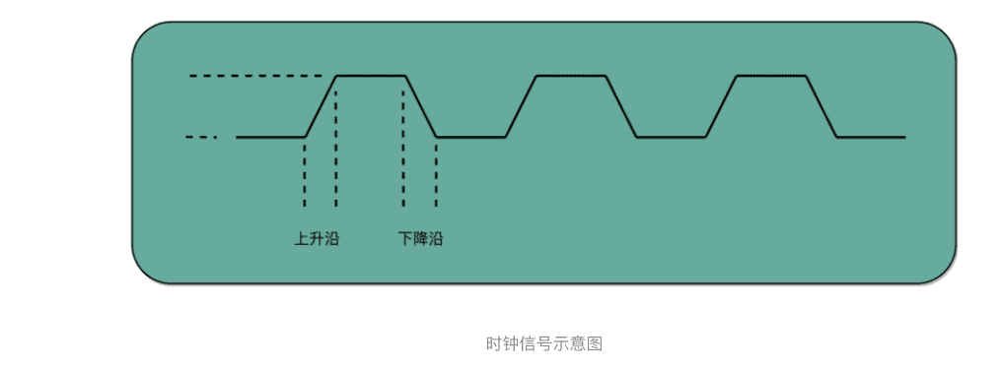

这种电路，其实就相当于把电路的输出信号作为输入信号，再回到当前电路。这样的电路构造方式呢，我们叫作反馈电路（Feedback Circuit）。

上面这个反馈电路一般可以用下面这个示意图来表示，其实就是一个输出结果接回输入的**反相器（Inverter**），也就是我们之前讲过的非门。

##### 2.通过D触发器实现存储功能

有了时钟信号，我们的系统里就有了一个像“自动门”一样的开关。利用这个开关和相同的反馈电路，我们就可以构造出一个有“记忆”功能的电路。这个有记忆功能的电路，可以实现在 CPU 中用来存储计算结果的寄存器，也可以用来实现计算机五大组成部分之一的存储器。


我们先来看下面这个 RS 触发器电路。这个电路由两个或非门电路组成。我在图里面，把它标成了 A 和 B。


1. 在这个电路一开始，输入开关都是关闭的，所以或非门（NOR）A 的输入是 0 和 0。对应到我列的这个真值表，输出就是 1。而或非门 B 的输入是 0 和 A 的输出 1，对应输出就是 0。B 的输出 0 反馈到 A，和之前的输入没有变化，A 的输出仍然是 1。而整个电路的输出 Q，也就是 0。
2. 当我们把 A 前面的开关 R 合上的时候，A 的输入变成了 1 和 0，输出就变成了 0，对应 B 的输入变成 0 和 0，输出就变成了 1。B 的输出 1 反馈给到了 A，A 的输入变成了 1 和 1，输出仍然是 0。所以把 A 的开关合上之后，电路仍然是稳定的，不会像晶振那样振荡，但是整个电路的输出 Q 变成了 1。
3. 这个时候，如果我们再把 A 前面的开关 R 打开，A 的输入变成和 1 和 0，输出还是 0，对应的 B 的输入没有变化，输出也还是 1。B 的输出 1 反馈给到了 A，A 的输入变成了 1 和 0，输出仍然是 0。这个时候，电路仍然稳定。开关 R 和 S 的状态和上面的第一步是一样的，但是最终的输出 Q 仍然是 1，和第 1 步里 Q 状态是相反的。我们的输入和刚才第二步的开关状态不一样，但是输出结果仍然保留在了第 2 步时的输出没有发生变化。
4. 这个时候，只有我们再去关闭下面的开关 S，才可以看到，这个时候，B 有一个输入必然是 1，所以 B 的输出必然是 0，也就是电路的最终输出 Q 必然是 0。

这样一个电路，我们称之为触发器（Flip-Flop）。接通开关 R，输出变为 1，即使断开开关，输出还是 1 不变。接通开关 S，输出变为 0，即使断开开关，输出也还是 0。也就是，**当两个开关都断开的时候，最终的输出结果，取决于之前动作的输出结果，这个也就是我们说的记忆功能。**

这里的这个电路是最简单的 RS 触发器，也就是所谓的复位置位触发器（Reset-Set Flip Flop) 。对应的输出结果的真值表，你可以看下面这个表格。可以看到，当两个开关都是 0 的时候，对应的输出不是 1 或者 0，而是和 Q 的上一个状态一致。


再往这个电路里加两个与门和一个小小的时钟信号，我们就可以实现一个利用时钟信号来操作一个电路了。这个电路可以帮我们实现什么时候可以往 Q 里写入数据。

我们看看下面这个电路，这个在我们的上面的 R-S 触发器基础之上，在 R 和 S 开关之后，加入了两个与门，同时给这两个与门加入了**一个时钟信号 CLK** 作为电路输入。

这样，当时钟信号 CLK 在低电平的时候，与门的输入里有一个 0，两个实际的 R 和 S 后的与门的输出必然是 0。也就是说，无论我们怎么按 R 和 S 的开关，根据 R-S 触发器的真值表，对应的 Q 的输出都不会发生变化。

有当时钟信号 CLK 在高电平的时候，与门的一个输入是 1，输出结果完全取决于 R 和 S 的开关。我们可以在这个时候，通过开关 R 和 S，来决定对应 Q 的输出。

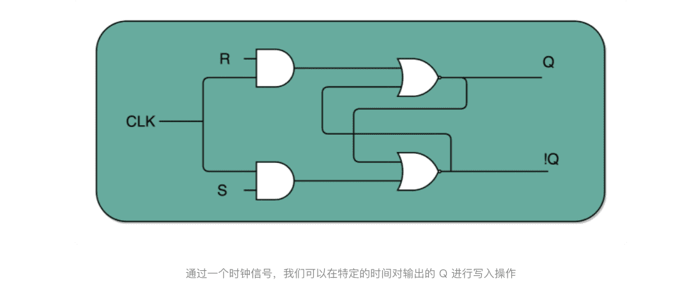


如果这个时候，我们让 R 和 S 的开关，也用一个反相器连起来，也就是通过同一个开关控制 R 和 S。只要 CLK 信号是 1，R 和 S 就可以设置输出 Q。而当 CLK 信号是 0 的时候，无论 R 和 S 怎么设置，输出信号 Q 是不变的。这样，这个电路就成了我们最常用的 D 型触发器。用来控制 R 和 S 这两个开关的信号呢，我们视作一个输入的数据信号 D，也就是 Data，这就是 D 型触发器的由来。


一个 D 型触发器，只能控制 1 个比特的读写，但是如果我们同时拿出多个 D 型触发器并列在一起，并且把用同一个 CLK 信号控制作为所有 D 型触发器的开关，这就变成了一个 N 位的 D 型触发器，也就可以同时控制 N 位的读写。

CPU 里面的寄存器可以直接通过 D 型触发器来构造。我们可以在 D 型触发器的基础上，加上更多的开关，来实现清 0 或者全部置为 1 这样的快捷操作。

##### 3.总结延伸

通过引入了时序电路，我们终于可以把数据“存储”下来了。我们通过反馈电路，创建了时钟信号，然后再利用这个时钟信号和门电路组合，实现了“状态记忆”的功能。

电路的输出信号不单单取决于当前的输入信号，还要取决于输出信号之前的状态。最常见的这个电路就是我们的 D 触发器，它也是我们实际在 CPU 内实现存储功能的寄存器的实现方式。

这也是现代计算机体系结构中的“冯·诺伊曼”机的一个关键，就是程序需要可以“存储”，而不是靠固定的线路连接或者手工拨动开关，来实现计算机的可存储和可编程的功能。

有了时钟信号和触发器之后，我们还差一个“自动”需求没有实现。我们的计算机还不能做到自动地不停地从内存里面读取指令去执行。

##### 4.推荐阅读

想要深入了解计算机里面的各种功能组件，是怎么通过电路来实现的，推荐你去阅读《编码：隐匿在计算机软硬件背后的语言》这本书的第 14 章和 16 章。

如果对于数字电路和数字逻辑特别感兴趣，想要彻底弄清楚数字电路、时序逻辑电路，也可以看一看计算机学科的一本专业的教科书《数字逻辑应用与设计》。

> 现在我们的 CPU 主频非常高了，通常在几 GHz 了，但是实际上我们的晶振并不能提供这么高的频率，而是通过“外频 + 倍频“的方式来实现高频率的时钟信号。请你研究一下，倍频和分频的信号是通过什么样的电路实现的？

#### 3.PC寄存器所需要的计数器

> PC寄存器也叫程序计数器

TODO

3.2

### 二、面向流水线的指令设计

> 程序的性能 是由三个因素相乘来衡量的，“指令数xCPIx时钟周期”

#### 1.一心多用的现代CPU

##### 1.单指令周期处理器

一条 CPU 指令的执行，是由“取得指令（Fetch）- 指令译码（Decode）- 执行指令（Execute） ”这样三个步骤组成的。

我们希望能确保让这样一整条指令的执行，在一个时钟周期内完成。这样，我们一个时钟周期可以执行一条指令，CPI 也就是 1，看起来就比执行一条指令需要多个时钟周期性能要好。**采用这种设计思路的处理器，就叫作单指令周期处理器（Single Cycle Processor）**，也就是在一个时钟周期内，处理器正好能处理一条指令。

不过，我们的时钟周期是固定的，但是指令的电路复杂程度是不同的，所以实际一条指令执行的时间是不同的。

不同指令的执行时间不同，但是我们需要让所有指令都在一个时钟周期内完成，那就只好把时钟周期和执行时间最长的那个指令设成一样。


所以，在单指令周期处理器里面，无论是执行一条用不到 ALU 的无条件跳转指令，还是一条计算起来电路特别复杂的浮点数乘法运算，我们都等要等满一个时钟周期。在这个情况下，虽然 CPI 能够保持在 1，但是我们的时钟频率却没法太高。因为太高的话，有些复杂指令没有办法在一个时钟周期内运行完成。那么在下一个时钟周期到来，开始执行下一条指令的时候，前一条指令的执行结果可能还没有写入到寄存器里面。那下一条指令读取的数据就是不准确的，就会出现错误。


##### 2.现代处理器的流水线设计

指令执行过程会拆分成“取指令、译码、执行”这样三大步骤。更细分一点的话，执行的过程，其实还包含从寄存器或者内存中读取数据，通过 ALU 进行运算，把结果写回到寄存器或者内存中。

>  如果我们有一个开发团队，我们不会让后端工程师开发完 API 之后，就歇着等待前台 App 的开发、测试乃至发布，而是会在客户端 App 开发的同时，着手下一个需求的后端 API 开发。那么，同样的思路我们可以一样应用在 CPU 执行指令的过程中。

CPU 的指令执行过程，其实也是由各个电路模块组成的。我们在取指令的时候，需要一个译码器把数据从内存里面取出来，写入到寄存器中；在指令译码的时候，我们需要另外一个译码器，把指令解析成对应的控制信号、内存地址和数据；到了指令执行的时候，我们需要的则是一个完成计算工作的 ALU。这些都是一个一个独立的组合逻辑电路，我们可以把它们看作一个团队里面的产品经理、后端工程师和客户端工程师，共同协作来完成任务。


这样一来，我们就不用把时钟周期设置成整条指令执行的时间，而是拆分成完成这样的一个一个小步骤需要的时间。同时，每一个阶段的电路在完成对应的任务之后，也不需要等待整个指令执行完成，而是可以直接执行下一条指令的对应阶段。

这就好像我们的后端程序员不需要等待功能上线，就会从产品经理手中拿到下一个需求，开始开发 API。这样的协作模式，就是我们所说的**指令流水线**。这里面每一个独立的步骤，我们就称之为**流水线阶段或者流水线级（Pipeline Stage）**。

如果我们把一个指令拆分成“取指令 - 指令译码 - 执行指令”这样三个部分，那这就是一个三级的流水线。

如果我们进一步把“执行指令”拆分成“ALU 计算（指令执行）- 内存访问 - 数据写回”，那么它就会变成一个五级的流水线。

五级的流水线，就表示我们在同一个时钟周期里面，同时运行五条指令的不同阶段。这个时候，虽然执行一条指令的时钟周期变成了 5，但是我们可以把 CPU 的主频提得更高了。**我们不需要确保最复杂的那条指令在时钟周期里面执行完成，而只要保障一个最复杂的流水线级的操作，在一个时钟周期内完成就好了。**

> 如果某一个操作步骤的时间太长，我们就可以考虑把这个步骤，拆分成更多的步骤，让所有步骤需要执行的时间尽量都差不多长。这样，也就可以解决我们在单指令周期处理器中遇到的，性能瓶颈来自于最复杂的指令的问题。像我们现代的 ARM 或者 Intel 的 CPU，流水线级数都已经到了 14 级。
>
> 虽然我们不能通过流水线，来减少单条指令执行的“延时”这个性能指标，但是，通过同时在执行多条指令的不同阶段，我们提升了 CPU 的“吞吐率”。在外部看来，我们的 CPU 好像是“一心多用”，在同一时间，同时执行 5 条不同指令的不同阶段。在 CPU 内部，其实它就像生产线一样，不同分工的组件不断处理上游传递下来的内容，而不需要等待单件商品生产完成之后，再启动下一件商品的生产过程。

##### 3.超长流水线的性能瓶颈

>  既然流水线可以增加我们的吞吐率，你可能要问了，为什么我们不把流水线级数做得更深呢？为什么不做成 20 级，乃至 40 级呢？这个其实有很多原因，我在之后几讲里面会详细讲解。**一个最基本的原因，就是增加流水线深度，其实是有性能成本的。**

我们用来同步时钟周期的，不再是指令级别的，而是流水线阶段级别的。每一级流水线对应的输出，都要放到流水线寄存器（Pipeline Register）里面，然后在下一个时钟周期，交给下一个流水线级去处理。所以，每增加一级的流水线，就要多一级写入到流水线寄存器的操作。虽然流水线寄存器非常快，比如只有 20 皮秒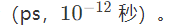

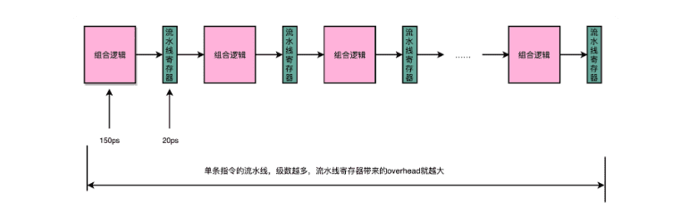

但是，如果我们不断加深流水线，这些操作占整个指令的执行时间的比例就会不断增加。最后，我们的性能瓶颈就会出现在这些 overhead 上。如果我们指令的执行有 3 纳秒，也就是 3000 皮秒。我们需要 20 级的流水线，那流水线寄存器的写入就需要花费 400 皮秒，占了超过 10%。如果我们需要 50 级流水线，就要多花费 1 纳秒在流水线寄存器上，占到 25%。这也就意味着，单纯地增加流水线级数，不仅不能提升性能，反而会有更多的 overhead 的开销。所以，设计合理的流水线级数也是现代 CPU 中非常重要的一点。

##### 4.推荐阅读

想要了解 CPU 的流水线设计，可以参看《深入理解计算机系统》的 4.4 章节，以及《计算机组成与设计 硬件 / 软件接口》的 4.5 章节。

##### 5.课后思考

一个 CPU 的时钟周期，可以认为是完成一条简单指令的时间。在这一讲之后，你觉得这句话正确吗？为什么？在了解了 CPU 的流水线设计之后，你是怎么理解这句话的呢？

>  一个 CPU 的时钟周期，可以认为是完成一条简单指令的时间。 两个错误：
>
>  1简单：不是简单是复杂（耗时最长） 
>
> 2指令：不是指令时间，而是指令拆分后线级执行时间 
>
> 简单线级需要等待以补齐时间然后与上下流水线一起牵手步入下一线级 线级分的多的话，这个时钟周期应该就可以固定是IF取指令的时间了 如果把IF取指令看做是最简单的指令的话，这句话就没毛病了 但一般说指令应该是指令集的一个命令吧？ 但是指令集是提供给开发者视角的，在CPU内部IF取指令才是一个原子化操作，从CPU视角来看又觉得这句话是靠谱的……

> 随着流水线设计的引入，一个指令被拆分为14个子流程。一个CPU的时钟时间，应该是14个子流程中最长的那条的耗时时间

#### 2.奔腾4是怎么失败的?

##### 1.‘主频战争’带来的超长流水线

> Pentium 4 之前的 Pentium III CPU，流水线的深度是 11 级，也就是一条指令最多会拆分成 11 个更小的步骤来操作，而 CPU 同时也最多会执行 11 条指令的不同 Stage。随着技术发展到今天，你日常用的手机 ARM 的 CPU 或者 Intel i7 服务器的 CPU，流水线的深度是 14 级。
>
> 可以看到，差不多 20 年过去了，通过技术进步，现代 CPU 还是增加了一些流水线深度的。那 2000 年发布的 Pentium 4 的流水线深度是多少呢？答案是 20 级，比 Pentium III 差不多多了一倍，而到了代号为 Prescott 的 90 纳米工艺处理器 Pentium 4，Intel 更是把流水线深度增加到了 31 级。

要知道，增加流水线深度，在同主频下，其实是降低了 CPU 的性能。因为一个 Pipeline Stage，就需要一个时钟周期。那么我们把任务拆分成 31 个阶段，就需要 31 个时钟周期才能完成一个任务；而把任务拆分成 11 个阶段，就只需要 11 个时钟周期就能完成任务。在这种情况下，31 个 Stage 的 3GHz 主频的 CPU，其实和 11 个 Stage 的 1GHz 主频的 CPU，性能是差不多的。事实上，因为每个 Stage 都需要有对应的 Pipeline 寄存器的开销，这个时候，更深的流水线性能可能还会更差一些。

上一讲也说过，流水线技术并不能缩短单条指令的响应时间这个性能指标，但是可以增加在运行很多条指令时候的吞吐率。因为不同的指令，实际执行需要的时间是不同的。我们可以看这样一个例子。我们顺序执行这样三条指令。

1. 一条整数的加法，需要 200ps。
2. 一条整数的乘法，需要 300ps。
3. 一条浮点数的乘法，需要 600ps。

如果我们是在单指令周期的 CPU 上运行，最复杂的指令是一条浮点数乘法，那就需要 600ps。那这三条指令，都需要 600ps。三条指令的执行时间，就需要 1800ps。

如果我们采用的是 6 级流水线 CPU，每一个 Pipeline 的 Stage 都只需要 100ps。那么，在这三个指令的执行过程中，在指令 1 的第一个 100ps 的 Stage 结束之后，第二条指令就开始执行了。在第二条指令的第一个 100ps 的 Stage 结束之后，第三条指令就开始执行了。这种情况下，这三条指令顺序执行所需要的总时间，就是 800ps。那么在 1800ps 内，使用流水线的 CPU 比单指令周期的 CPU 就可以多执行一倍以上的指令数。

虽然每一条指令从开始到结束拿到结果的时间并没有变化，也就是响应时间没有变化。但是同样时间内，完成的指令数增多了，也就是吞吐率上升了。

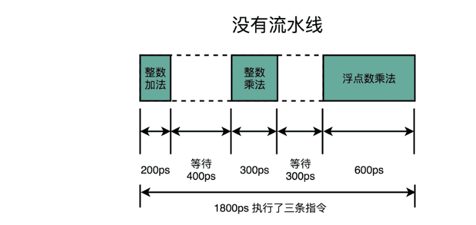

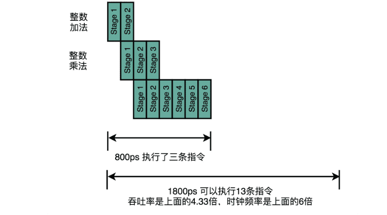


##### 2.新的挑战：冒险和分支预测

> 那到这里可能你就要问了，这样看起来不是很好么？Intel 的 CPU 支持的指令集很大，我们之前说过有 2000 多条指令。有些指令很简单，执行也很快，比如无条件跳转指令，不需要通过 ALU 进行任何计算，只要更新一下 PC 寄存器里面的内容就好了。而有些指令很复杂，比如浮点数的运算，需要进行指数位比较、对齐，然后对有效位进行移位，然后再进行计算。两者的执行时间相差二三十倍也很正常。

###### 1.功耗问题

提升流水线深度，必须要和提升 CPU 主频同时进行。因为在单个 Pipeline Stage 能够执行的功能变简单了，也就意味着单个时钟周期内能够完成的事情变少了。所以，只有提升时钟周期，CPU 在指令的响应时间这个指标上才能保持和原来相同的性能。

同时，由于流水线深度的增加，我们需要的电路数量变多了，也就是我们所使用的晶体管也就变多了。

主频的提升和晶体管数量的增加都使得我们 CPU 的功耗变大了。这个问题导致了 Pentium 4 在整个生命周期里，都成为了耗电和散热的大户。

###### 2.流水线技术带来的性能提升，是一个理想情况。在实现的程序执行中，并不一定能够做得到。

```java
int a = 10 + 5; // 指令1
int b = a * 2; // 指令2
float c = b * 1.0f; // 指令3
```

我们会发现，指令 2，不能在指令 1 的第一个 Stage 执行完成之后进行。因为指令 2，依赖指令 1 的计算结果。同样的，指令 3 也要依赖指令 2 的计算结果。这样，即使我们采用了流水线技术，这三条指令执行完成的时间，也是 200 + 300 + 600 = 1100 ps，而不是之前说的 800ps。而如果指令 1 和 2 都是浮点数运算，需要 600ps。那这个依赖关系会导致我们需要的时间变成 1800ps，和单指令周期 CPU 所要花费的时间是一样的。

这个依赖问题，就是我们在计算机组成里面所说的**冒险（Hazard）**问题。这里我们只列举了在数据层面的依赖，也就是数据冒险。在实际应用中，还会有**结构冒险**、**控制冒险**等其他的依赖问题。

但是，我们的流水线越长，这个冒险的问题就越难一解决。这是因为，同一时间同时在运行的指令太多了。如果我们只有 3 级流水线，我们可以把后面没有依赖关系的指令放到前面来执行。这个就是我们所说的乱序执行的技术。比方说，我们可以扩展一下上面的 3 行代码，再加上几行代码。

```java

int a = 10 + 5; // 指令1
int b = a * 2; // 指令2
float c = b * 1.0f; // 指令3
int x = 10 + 5; // 指令4
int y = a * 2; // 指令5
float z = b * 1.0f; // 指令6
int o = 10 + 5; // 指令7
int p = a * 2; // 指令8
float q = b * 1.0f; // 指令9
```

我们可以不先执行 1、2、3 这三条指令，而是在流水线里，先执行 1、4、7 三条指令。这三条指令之间是没有依赖关系的。然后再执行 2、5、8 以及 3、6、9。这样，我们又能够充分利用 CPU 的计算能力了。

但是，如果我们有 20 级流水线，意味着我们要确保这 20 条指令之间没有依赖关系。这个挑战一下子就变大了很多。毕竟我们平时撰写程序，通常前后的代码都是有一定的依赖关系的，几十条没有依赖关系的指令可不好找。这也是为什么，超长流水线的执行效率发而降低了的一个重要原因。

##### 3.总结延伸

CPU 的流水线技术，有了一个更加深入的了解。你会发现，流水线技术和其他技术一样，都讲究一个“折衷”（Trade-Off）。一个合理的流水线深度，会提升我们 CPU 执行计算机指令的吞吐率。我们一般用 IPC（Instruction Per Cycle）来衡量 CPU 执行指令的效率。

IPC 呢，其实就是我们之前在第 3 讲讲的 CPI（Cycle Per Instruction）的倒数。

过深的流水线，不仅不能提升计算机指令的吞吐率，更会加大计算的功耗和散热问题。

而流水线带来的吞吐率提升，只是一个理想情况下的理论值。在实践的应用过程中，还需要解决指令之间的依赖问题。这个使得我们的流水线，特别是超长的流水线的执行效率变得很低。要想解决好**冒险**的依赖关系问题，我们需要引入乱序执行、分支预测等技术，这也是我在后面几讲里面要详细讲解的内容。

##### 4.推荐阅读

除了之前的教科书之外，我推荐你读一读[Modern Microprocessors, A 90-Minute Guide!](http://www.lighterra.com/papers/modernmicroprocessors/)这篇文章。这篇文章用比较浅显的方式，介绍了现代 CPU 设计的多个方面，很适合作为一个周末读物，快速理解现代 CPU 的设计。

### 三、冒险和预测

> 任何一本讲解CPU的流水线设计的教科书，都会提到流水线设计需要解决的三个冒险，分别是**结构冒险(Structrual Hazard)**、以及**控制冒险（Control Hazard）**

#### 1.Hazard “危”也是“机”

##### 1.结构冒险：为什么工程师都喜欢用机械键盘？

CPU 在同一个时钟周期，同时在运行两条计算机指令的不同阶段。但是这两个不同的阶段，可能会用到同样的硬件电路。

5级流水线的示意图：

在第 1 条指令执行到访存（MEM）阶段的时候，流水线里的第 4 条指令，在执行取指令（Fetch）的操作。访存和取指令，都要进行内存数据的读取。我们的内存，只有一个地址译码器的作为地址输入，那就只能在一个时钟周期里面读取一条数据，没办法同时执行第 1 条指令的读取内存数据和第 4 条指令的读取指令代码。

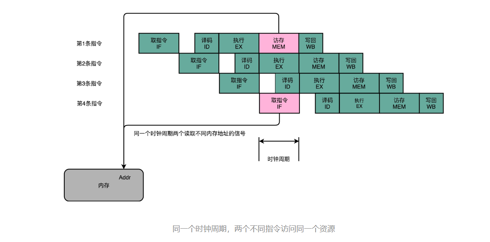


> 类似的资源冲突，其实你在日常使用计算机的时候也会遇到。最常见的就是薄膜键盘的“锁键”问题。常用的最廉价的薄膜键盘，并不是每一个按键的背后都有一根独立的线路，而是多个键共用一个线路。如果我们在同一时间，按下两个共用一个线路的按键，这两个按键的信号就没办法都传输出去。
>
> 这也是为什么，重度键盘用户，都要买贵一点儿的机械键盘或者电容键盘。因为这些键盘的每个按键都有独立的传输线路，可以做到“全键无冲”，这样，无论你是要大量写文章、写程序，还是打游戏，都不会遇到按下了键却没生效的情况。

“全键无冲”这样的资源冲突解决方案，其实本质就是**增加资源。**同样的方案，我们一样可以用在 CPU 的结构冒险里面。对于访问内存数据和取指令的冲突，一个直观的解决方案就是把我们的内存分成两部分，让它们各有各的地址译码器。这两部分分别是**存放指令的程序内存**和**存放数据的数据内存。**

这样把内存拆成两部分的解决方案，在计算机体系结构里叫作[哈佛架构（Harvard Architecture）](https://en.wikipedia.org/wiki/Harvard_architecture)，来自哈佛大学设计**[Mark I 型计算机](https://en.wikipedia.org/wiki/Harvard_Mark_I)**时候的设计。对应的，我们之前说的冯·诺依曼体系结构，又叫作**普林斯顿架构（Princeton Architecture）**。从这些名字里，我们可以看到，早年的计算机体系结构的设计，其实产生于美国各个高校之间的竞争中。

不过，我们今天使用的 CPU，仍然是冯·诺依曼体系结构的，并没有把内存拆成程序内存和数据内存这两部分。因为如果那样拆的话，对程序指令和数据需要的内存空间，我们就没有办法根据实际的应用去动态分配了。虽然解决了资源冲突的问题，但是也失去了灵活性.

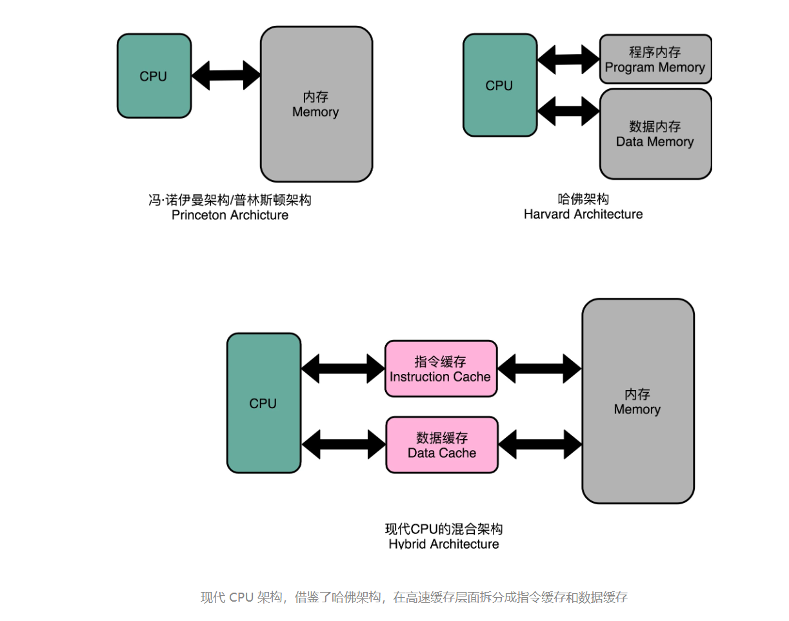

不过，借鉴了哈佛结构的思路，现代的 CPU 虽然没有在内存层面进行对应的拆分，却在 CPU 内部的高速缓存部分进行了区分，把高速缓存分成了**指令缓存（Instruction Cache）**和**数据缓存（Data Cache）**两部分。

内存的访问速度远比 CPU 的速度要慢，所以现代的 CPU 并不会直接读取主内存。它会从主内存把指令和数据加载到高速缓存中，这样后续的访问都是访问高速缓存。而指令缓存和数据缓存的拆分，使得我们的 CPU 在进行数据访问和取指令的时候，不会再发生资源冲突的问题了。

##### 2.数据冒险：三种不同的依赖关系

结构冒险是一个硬件层面的问题，我们可以靠增加硬件资源的方式来解决。然而还有很多冒险问题，是程序逻辑层面的事儿。其中，最常见的就是数据冒险。

数据冒险，其实就是同时在执行的多个指令之间，有数据依赖的情况。这些数据依赖，我们可以分成三大类，分别是**先写后读（Read After Write，RAW）**、**先读后写（Write After Read，WAR）**和**写后再写（Write After Write，WAW）**。下面，我们分别看一下这几种情况。

###### 1.先写后读（Read After Write）

```c
int main() {
  int a = 1;
  int b = 2;
  a = a + 2;
  b = a + 3;
}
```

```c

int main() {
   0:   55                      push   rbp
   1:   48 89 e5                mov    rbp,rsp
  int a = 1;
   4:   c7 45 fc 01 00 00 00    mov    DWORD PTR [rbp-0x4],0x1
  int b = 2;
   b:   c7 45 f8 02 00 00 00    mov    DWORD PTR [rbp-0x8],0x2
  a = a + 2;
  12:   83 45 fc 02             add    DWORD PTR [rbp-0x4],0x2
  b = a + 3;
  16:   8b 45 fc                mov    eax,DWORD PTR [rbp-0x4]
  19:   83 c0 03                add    eax,0x3
  1c:   89 45 f8                mov    DWORD PTR [rbp-0x8],eax
}
  1f:   5d                      pop    rbp
  20:   c3                      ret  
```

在内存地址为 12 的机器码，我们把 0x2 添加到 rbp-0x4 对应的内存地址里面。然后，在紧接着的内存地址为 16 的机器码，我们又要从 rbp-0x4 这个内存地址里面，把数据写入到 eax 这个寄存器里面。

需要保证，在内存地址为 16 的指令读取 rbp-0x4 里面的值之前，内存地址 12 的指令写入到 rbp-0x4 的操作必须完成。这就是先写后读所面临的数据依赖。如果这个顺序保证不了，我们的程序就会出错。

这个先写后读的依赖关系，我们一般被称之为**数据依赖**，也就是 Data Dependency。

###### 2.先读后写 (Write After Read)

```c

int main() {
  int a = 1;
  int b = 2;
  a = b + a;
  b = a + b;
}
```

```c

int main() {
   0:   55                      push   rbp
   1:   48 89 e5                mov    rbp,rsp
   int a = 1;
   4:   c7 45 fc 01 00 00 00    mov    DWORD PTR [rbp-0x4],0x1
   int b = 2;
   b:   c7 45 f8 02 00 00 00    mov    DWORD PTR [rbp-0x8],0x2
   a = b + a;
  12:   8b 45 f8                mov    eax,DWORD PTR [rbp-0x8]
  15:   01 45 fc                add    DWORD PTR [rbp-0x4],eax
   b = a + b;
  18:   8b 45 fc                mov    eax,DWORD PTR [rbp-0x4]
  1b:   01 45 f8                add    DWORD PTR [rbp-0x8],eax
}
  1e:   5d                      pop    rbp
  1f:   c3                      ret       
```

在内存地址为 15 的汇编指令里，我们要把 eax 寄存器里面的值读出来，再加到 rbp-0x4 的内存地址里。接着在内存地址为 18 的汇编指令里，我们要再写入更新 eax 寄存器里面。

如果我们在内存地址 18 的 eax 的写入先完成了，在内存地址为 15 的代码里面取出 eax 才发生，我们的程序计算就会出错。这里，我们同样要保障对于 eax 的先读后写的操作顺序。

这个先读后写的依赖，一般被叫作**反依赖，也**就是 Anti-Dependency。

###### 3.写后再写（Write After Write）

```c
int main() {
  int a = 1;
  a = 2;
}
```

```c

int main() {
   0:   55                      push   rbp
   1:   48 89 e5                mov    rbp,rsp
  int a = 1;
   4:   c7 45 fc 01 00 00 00    mov    DWORD PTR [rbp-0x4],0x1
  a = 2;
   b:   c7 45 fc 02 00 00 00    mov    DWORD PTR [rbp-0x4],0x2
}
```

内存地址 4 所在的指令和内存地址 b 所在的指令，都是将对应的数据写入到 rbp-0x4 的内存地址里面。如果内存地址 b 的指令在内存地址 4 的指令之后写入。那么这些指令完成之后，rbp-0x4 里的数据就是错误的。这就会导致后续需要使用这个内存地址里的数据指令，没有办法拿到正确的值。所以，我们也需要保障内存地址 4 的指令的写入，在内存地址 b 的指令的写入之前完成。

这个写后再写的依赖，一般被叫作**输出依赖**，也就是 Output Dependency。

##### 3.通过流水线停顿解决数据冒险

因为流水线架构的核心，就是在前一个指令还没有结束的时候，后面的指令就要开始执行。

其中最简单的一个办法，不过也是最笨的一个办法，就是**[流水线停顿（Pipeline Stall）](https://en.wikipedia.org/wiki/Pipeline_stall)**，或者叫**流水线冒泡（Pipeline Bubbling）**。

我们在进行指令译码的时候，会拿到对应指令所需要访问的寄存器和内存地址。所以，在这个时候，我们能够判断出来，这个指令是否会触发数据冒险。如果会触发数据冒险，我们就可以决定，让整个流水线停顿一个或者多个周期。


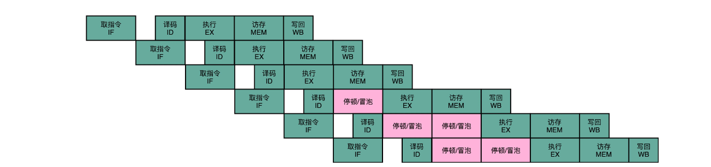


时钟信号会不停地在 0 和 1 之前自动切换，其实，并没有办法真的停顿下来。流水线的每一个操作步骤必须要干点儿事情。

所以，在实践过程中，我们并不是让流水线停下来，而是在执行后面的操作步骤前面，插入一个 NOP 操作，也就是执行一个其实什么都不干的操作。

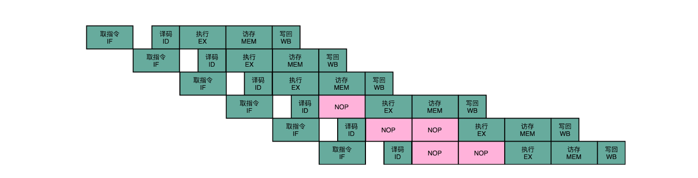

##### 4.总结延伸

一方面，我们可以通过增加资源来解决结构冒险问题。我们现代的 CPU 的体系结构，其实也是在冯·诺依曼体系结构下，借鉴哈佛结构的一个混合结构的解决方案。我们的内存虽然没有按照功能拆分，但是在高速缓存层面进行了拆分，也就是拆分成指令缓存和数据缓存这样的方式，从硬件层面，使得同一个时钟下对于相同资源的竞争不再发生。

另一方面，我们也可以通过“等待”，也就是插入无效的 NOP 操作的方式，来解决冒险问题。这就是所谓的流水线停顿。不过，流水线停顿这样的解决方案，是以牺牲 CPU 性能为代价的。因为，实际上在最差的情况下，我们的流水线架构的 CPU，又会退化成单指令周期的 CPU 了。

##### 5.推荐阅读

想要进一步理解流水线冒险里数据冒险的相关知识，你可以仔细看一看《计算机组成与设计：硬件 / 软件接口》的第 4.5～4.7 章。

想要了解流水线冒险里面结构冒险的相关知识，你可以去看一看 Coursera 上普林斯顿大学的 Computer Architecture 的**Structure Hazard**部分。

#### 2.流水线里的接力赛

##### 1.NOP 操作和指令对齐

MIPS体系结构下的R、I、J三类指令，以及五级流水线“取指令（IF）- 指令译码（ID）- 指令执行（EX）- 内存访问（MEM）- 数据写回（WB） ”。

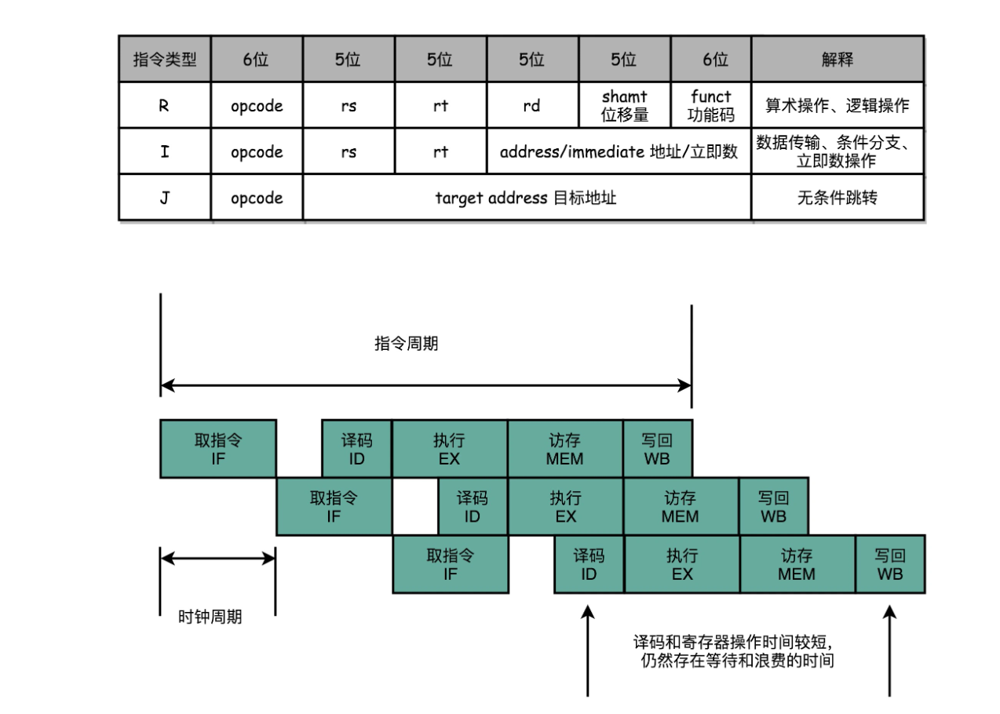

以 MIPS 的 LOAD，这样从内存里读取数据到寄存器的指令为例，来仔细看看，它需要经历的 5 个完整的流水线。STORE 这样从寄存器往内存里写数据的指令，不需要有写回寄存器的操作，也就是没有数据写回的流水线阶段。至于像 ADD 和 SUB 这样的加减法指令，所有操作都在寄存器完成，所以没有实际的内存访问（MEM）操作。

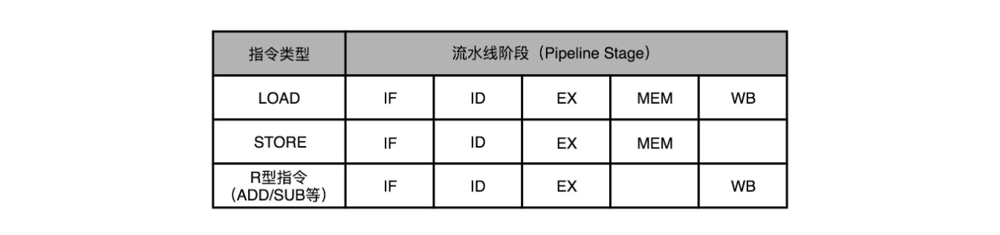

有些指令没有对应的流水线阶段，但是我们并不能跳过对应的阶段直接执行下一阶段。不然，如果我们先后执行一条 LOAD 指令和一条 ADD 指令，就会发生 LOAD 指令的 WB 阶段和 ADD 指令的 WB 阶段，在同一个时钟周期发生。这样，相当于触发了一个结构冒险事件，产生了资源竞争。

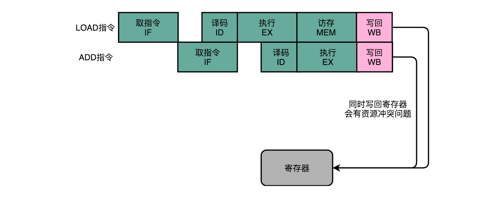

所以，在实践当中，各个指令不需要的阶段，并不会直接跳过，而是会运行一次 NOP 操作。通过插入一个 NOP 操作，我们可以使后一条指令的每一个 Stage，一定不和前一条指令的同 Stage 在一个时钟周期执行。这样，就不会发生先后两个指令，在同一时钟周期竞争相同的资源，产生结构冒险了。


##### 2.流水线里的接力赛：操作数前推

通过 NOP 操作进行对齐，我们在流水线里，就不会遇到资源竞争产生的结构冒险问题了。除了可以解决结构冒险之外，这个 NOP 操作，也是我们之前讲的流水线停顿插入的对应操作。

 但是，插入过多的 NOP 操作，意味着我们的 CPU 总是在空转，干吃饭不干活。

```c
add $t0, $s2,$s1
add $s2, $s1,$t0
```

1.第一条指令，把 s1 和 s2 寄存器里面的数据相加，存入到 t0 这个寄存器里面。

2.第二条指令，把 s1 和 t0 寄存器里面的数据相加，存入到 s2 这个寄存器里面。

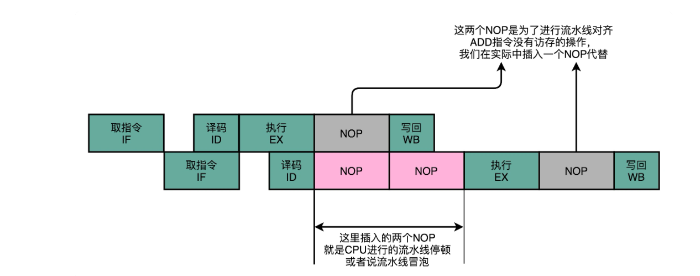

不过，其实我们第二条指令的执行，未必要等待第一条指令写回完成，才能进行。如果我们第一条指令的执行结果，能够直接传输给第二条指令的执行阶段，作为输入，那我们的第二条指令，就不用再从寄存器里面，把数据再单独读出来一次，才来执行代码。

我们完全可以在第一条指令的执行阶段完成之后，直接将结果数据传输给到下一条指令的 ALU。然后，下一条指令不需要再插入两个 NOP 阶段，就可以继续正常走到执行阶段。

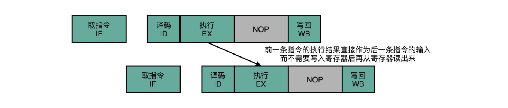

这样的解决方案，我们就叫**作操作数前推（Operand Forwarding）**，或者**操作数旁路（Operand Bypassing）**。其实我觉得，更合适的名字应该叫**操作数转发**。

> 这里的 Forward，其实就是我们写 Email 时的“转发”（Forward）的意思。不过现有的经典教材的中文翻译一般都叫“前推”，我们也就不去纠正这个说法了，你明白这个意思就好。

> 转发，其实是这个技术的逻辑含义，也就是在第 1 条指令的执行结果，直接“转发”给了第 2 条指令的 ALU 作为输入。另外一个名字，旁路（Bypassing），则是这个技术的硬件含义。为了能够实现这里的“转发”，我们在 CPU 的硬件里面，需要再单独拉一根信号传输的线路出来，使得 ALU 的计算结果，能够重新回到 ALU 的输入里来。这样的一条线路，就是我们的“旁路”。它越过（Bypass）了写入寄存器，再从寄存器读出的过程，也为我们节省了 2 个时钟周期。

操作数前推的解决方案不但可以单独使用，还可以和流水线冒泡一起使用。有的时候，虽然我们可以把操作数转发到下一条指令，但是下一条指令仍然需要停顿一个时钟周期。

比如说，我们先去执行一条 LOAD 指令，再去执行 ADD 指令。LOAD 指令在访存阶段才能把数据读取出来，所以下一条指令的执行阶段，需要在访存阶段完成之后，才能进行。

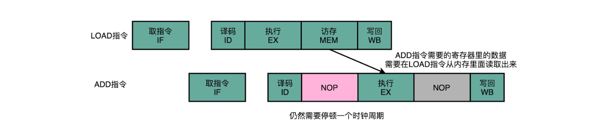

总的来说，操作数前推的解决方案，比流水线停顿更进了一步。流水线停顿的方案，有点儿像游泳比赛的接力方式。下一名运动员，需要在前一个运动员游玩了全程之后，触碰到了游泳池壁才能出发。而操作数前推，就好像短跑接力赛。后一个运动员可以提前抢跑，而前一个运动员会多跑一段主动把交接棒传递给他。

##### 3.总结延伸

操作数前推，就是通过在硬件层面制造一条旁路，让一条指令的计算结果，可以直接传输给下一条指令，而不再需要“指令 1 写回寄存器，指令 2 再读取寄存器“这样多此一举的操作。这样直接传输带来的好处就是，后面的指令可以减少，甚至消除原本需要通过流水线停顿，才能解决的数据冒险问题。

##### 4.推荐阅读

想要深入了解操作数前推相关的内容，推荐你读一下《计算机组成与设计：硬件 / 软件接口》的 4.5～4.7 章节。

> 前面讲 5 级流水线指令的时候，我们说，STORE 指令是没有数据写回阶段的，而 ADD 指令是没有访存阶段的。那像 CMP 或者 JMP 这样的比较和跳转指令，5 个阶段都是全的么？还是说不需要哪些阶段呢

#### 3.CPU里的“线程池”

> 那我们能不能让后面没有数据依赖的指令，在前面指令停顿的时候先执行呢？
>
> 答案当然是可以的。毕竟，流水线停顿的时候，对应的电路闲着也是闲着。那我们完全可以先完成后面指令的执行阶段。

##### 1.填上空闲的NOP：上菜的顺序不必是点菜的顺序

无论是流水线停顿，还是操作数前推，归根到底，只要前面指令的特定阶段还没有执行完成，后面的指令就会被“阻塞”住。

但是这个“阻塞”很多时候是没有必要的。因为尽管你的代码生成的指令是顺序的，但是如果后面的指令不需要依赖前面指令的执行结果，完全可以不必等待前面的指令运算完成。

```javascript
a = b + c
d = a * e
x = y * z
```

计算里面的 x ，却要等待 a 和 d 都计算完成，实在没啥必要。所以我们完全可以在 d 的计算等待 a 的计算的过程中，先把 x 的结果给算出来。

在流水线里，后面的指令不依赖前面的指令，那就不用等待前面的指令执行，它完全可以先执行。

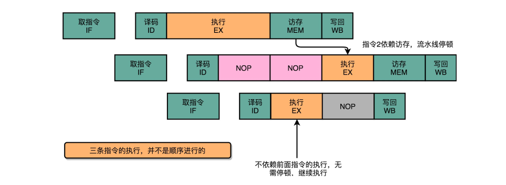

在计算机组成里面，被称为**乱序执行（Out-of-Order Execution，OoOE）**。

乱序执行，最早来自于著名的 IBM 360。相信你一定听说过《人月神话》这本软件工程届的经典著作，它讲的就是 IBM 360 开发过程中的“人生体会”。

##### 2.CPU 里的“线程池”：理解乱序执行

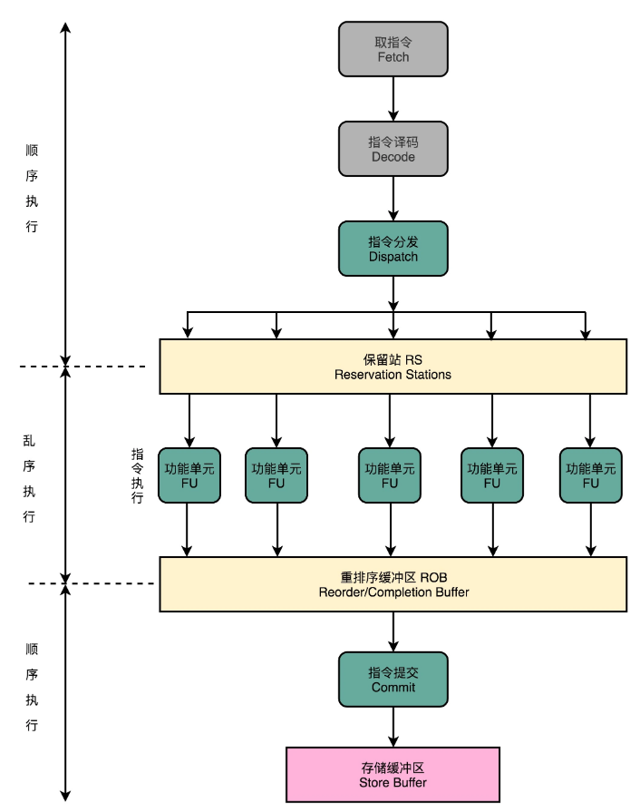

1.  在取指令和指令译码的时候，乱序执行的 CPU 和其他使用流水线架构的 CPU 是一样的。它会一级一级顺序地进行取指令和指令译码的工作。
2. 在指令译码完成之后，就不一样了。CPU 不会直接进行指令执行，而是进行一次指令分发，把指令发到一个叫作保留站（Reservation Stations）的地方。顾名思义，这个保留站，就像一个火车站一样。发送到车站的指令，就像是一列列的火车。
3. 这些指令不会立刻执行，而要等待它们所依赖的数据，传递给它们之后才会执行。这就好像一列列的火车都要等到乘客来齐了才能出发。
4. 一旦指令依赖的数据来齐了，指令就可以交到后面的功能单元（Function Unit，FU），其实就是 ALU，去执行了。我们有很多功能单元可以并行运行，但是不同的功能单元能够支持执行的指令并不相同。就和我们的铁轨一样，有些从上海北上，可以到北京和哈尔滨；有些是南下的，可以到广州和深圳。
5. 指令执行的阶段完成之后，我们并不能立刻把结果写回到寄存器里面去，而是把结果再存放到一个叫作重排序缓冲区（Re-Order Buffer，ROB）的地方。
6. 在重排序缓冲区里，我们的 CPU 会按照取指令的顺序，对指令的计算结果重新排序。只有排在前面的指令都已经完成了，才会提交指令，完成整个指令的运算结果。
7. 实际的指令的计算结果数据，并不是直接写到内存或者高速缓存里，而是先写入存储缓冲区（Store Buffer 面，最终才会写入到高速缓存和内存里。
8. 

可以看到，在乱序执行的情况下，只有 CPU 内部指令的执行层面，可能是“乱序”的。只要我们能在指令的译码阶段正确地分析出指令之间的数据依赖关系，这个“乱序”就只会在互相没有影响的指令之间发生。

即便指令的执行过程中是乱序的，我们在最终指令的计算结果写入到寄存器和内存之前，依然会进行一次排序，以确保所有指令在外部看来仍然是有序完成的。

```c
a = b + c
d = a * e
x = y * z
```

里面的 d 依赖于 a 的计算结果，不会在 a 的计算完成之前执行。但是我们的 CPU 并不会闲着，因为 x = y * z 的指令同样会被分发到保留站里。因为 x 所依赖的 y 和 z 的数据是准备好的， 这里的乘法运算不会等待计算 d，而会先去计算 x 的值。

如果我们只有一个 FU 能够计算乘法，那么这个 FU 并不会因为 d 要等待 a 的计算结果，而被闲置，而是会先被拿去计算 x。

在 x 计算完成之后，d 也等来了 a 的计算结果。这个时候，我们的 FU 就会去计算出 d 的结果。然后在重排序缓冲区里，把对应的计算结果的提交顺序，仍然设置成 a -> d -> x，而计算完成的顺序是 x -> a -> d。

在这整个过程中，整个计算乘法的 FU 都没有闲置，这也意味着我们的 CPU 的吞吐率最大化了。

整个乱序执行技术，就好像在指令的执行阶段提供一个“线程池”。指令不再是顺序执行的，而是根据池里所拥有的资源，以及各个任务是否可以进行执行，进行动态调度。在执行完成之后，又重新把结果在一个队列里面，按照指令的分发顺序重新排序。即使内部是“乱序”的，但是在外部看起来，仍然是井井有条地顺序执行。

乱序执行，极大地提高了 CPU 的运行效率。核心原因是，现代 CPU 的运行速度比访问主内存的速度要快很多。如果完全采用顺序执行的方式，很多时间都会浪费在前面指令等待获取内存数据的时间里。CPU 不得不加入 NOP 操作进行空转。而现代 CPU 的流水线级数也已经相对比较深了，到达了 14 级。这也意味着，同一个时钟周期内并行执行的指令数是很多的。

而乱序执行，以及我们后面要讲的高速缓存，弥补了 CPU 和内存之间的性能差异。同样，也充分利用了较深的流水行带来的并发性，使得我们可以充分利用 CPU 的性能。

##### 3.推荐阅读

想要更深入地了解 CPU 的乱序执行的知识，我们就不能局限于组成原理，而要深入到体系结构中去了。你可以读一下《计算机体系结构：量化研究方法》的 3.4 和 3.5 章节。

想要了解乱序执行为什么可行，你可以看看 Wikipedia 上，乱序执行所依赖的[Tomasulo](https://en.wikipedia.org/wiki/Tomasulo_algorithm) 算法。这个算法，也是在 IBM 360 时代引入的。

> 在现代 Intel 的 CPU 的乱序执行的过程中，只有指令的执行阶段是乱序的，后面的内存访问和数据写回阶段都仍然是顺序的。这种保障内存数据访问顺序的模型，叫作强内存模型（Strong Memory Model）。你能想一想，我们为什么要保障内存访问的顺序呢？在前后执行的指令没有相关数据依赖的情况下，为什么我们仍然要求这个顺序呢？

#### 4.今天下雨了，明天还会下雨么？

> 在结构冒险和数据冒险中，你会发现，所有的流水线停顿操作都要从指令执行阶段开始。流水线的前两个阶段，也就是取指令（IF）和指令译码（ID）的阶段，是不需要停顿的。CPU 会在流水线里面直接去取下一条指令，然后进行译码。
>
> 取指令和指令译码不会需要遇到任何停顿，这是基于一个假设。这个假设就是，所有的指令代码都是顺序加载执行的。不过这个假设，在执行的代码中，一旦遇到 if…else 这样的条件分支，或者 for/while 循环，就会不成立。


