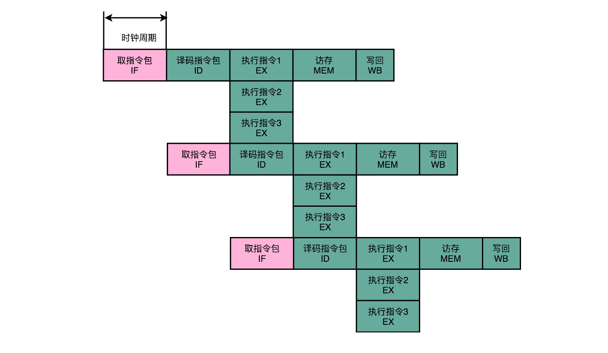
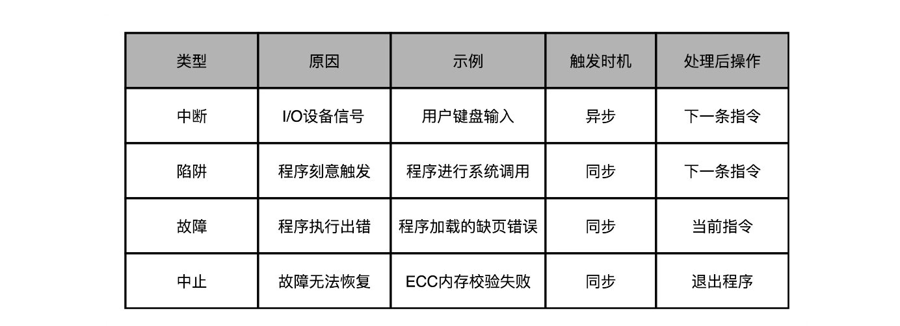

### 1.Superscalar和VLIW：如何让CPU的吞吐率超过1？

程序的 CPU 执行时间 = 指令数 × CPI × Clock Cycle Time

CPI 的倒数，又叫作 I**PC（Instruction Per Clock）**，也就是一个时钟周期里面能够执行的指令数


无论指令后续能优化得多好，一个时钟周期也只能执行完这样一条指令，CPI 只能是 1。

#### 1.多发射与超标量：同一时间执行的两条指令

虽然浮点数计算已经变成 CPU 里的一部分，但并不是所有计算功能都在一个 ALU 里面，真实的情况是，会有多个 ALU。乱序执行的时候，其实指令的执行阶段，是由很多个功能单元（FU）并行（Parallel）进行的。

在指令乱序执行的过程中，我们的取指令（IF）和指令译码（ID）部分并不是并行进行的。既然指令的执行层面可以并行进行，为什么取指令和指令译码不行呢？如果想要实现并行，该怎么办呢？

**其实只要我们把取指令和指令译码，也一样通过增加硬件的方式，并行进行就好了。我们可以一次性从内存里面取出多条指令，然后分发给多个并行的指令译码器，进行译码，然后对应交给不同的功能单元去处理。这样，我们在一个时钟周期里，能够完成的指令就不只一条了。IPC 也就能做到大于 1 了。**


这种 CPU 设计，我们叫作**多发射（Mulitple Issue）**和**超标量（Superscalar）**。

什么叫多发射呢？这个词听起来很抽象，其实它意思就是说，我们同一个时间，可能会同时把多条指令发射（Issue）到不同的译码器或者后续处理的流水线中去。

在超标量的 CPU 里面，有很多条并行的流水线，而不是只有一条流水线。“超标量“这个词是说，本来我们在一个时钟周期里面，只能执行一个标量（Scalar）的运算。在多发射的情况下，我们就能够超越这个限制，同时进行多次计算。


事实上，不同的功能单元的流水线长度本来就不一样。平时所说的 14 级流水线，指的通常是进行整数计算指令的流水线长度。如果是浮点数运算，实际的流水线长度则会更长一些。

#### 2.Intel 的失败之作：安腾的超长指令字设计

无论是乱序执行，还是超标量技术，在实际的硬件层面实施起来很麻烦。这是因为，在乱序执行和超标量的体系里面，CPU要解决依赖冲突的问题。

CPU 需要在指令执行之前，去判断指令之间是否有依赖关系。如果有对应的依赖关系，指令就不能分发到执行阶段。因为这样，上面我们所说的超标量 CPU 的多发射功能，又被称为动态多发射处理器。这些对于依赖关系的检测，都会使得我们的 CPU 电路变得更加复杂。

计算机科学家和工程师们就又有了一个大胆的想法。我们能不能不把分析和解决依赖关系的事情，放在硬件里面，而是放到软件里面来干呢？

程序的 CPU 执行时间 = 指令数 × CPI × Clock Cycle Time

当时我们说过，这个公式里面，我们可以通过改进编译器来优化指令数这个指标。那接下来，我们就来看看一个非常大胆的 CPU 设计想法，叫作**超长指令字设计（Very Long Instruction Word，VLIW）**。这个设计呢，不仅想让编译器来优化指令数，还想直接通过编译器，来优化 CPI。

在乱序执行和超标量的 CPU 架构里，指令的前后依赖关系，是由 CPU 内部的硬件电路来检测的。而到了超长指令字的架构里面，这个工作交给了编译器这个软件。




CPU 在运行的时候，不再是取一条指令，而是取出一个指令包。然后，译码解析整个指令包，解析出 3 条指令直接并行运行。可以看到，使用**超长指令字**架构的 CPU，同样是采用流水线架构的。也就是说，一组（Group）指令，仍然要经历多个时钟周期。同样的，下一组指令并不是等上一组指令执行完成之后再执行，而是在上一组指令的指令译码阶段，就开始取指令了。

值得注意的一点是，流水线停顿这件事情在超长指令字里面，很多时候也是由编译器来做的。除了停下整个处理器流水线，超长指令字的 CPU 不能在某个时钟周期停顿一下，等待前面依赖的操作执行完成。编译器需要在适当的位置插入 NOP 操作，直接在编译出来的机器码里面，就把流水线停顿这个事情在软件层面就安排妥当。

安腾失败的原因有很多，其中有一个重要的原因就是“向前兼容”。

> ，安腾处理器的 VLIW 架构决定了，如果安腾需要提升并行度，就需要增加一个指令包里包含的指令数量，比方说从 3 个变成 6 个。一旦这么做了，虽然同样是 VLIW 架构，同样指令集的安腾 CPU，程序也需要重新编译。因为原来编译器判断的依赖关系是在 3 个指令以及由 3 个指令组成的指令包之间，现在要变成 6 个指令和 6 个指令组成的指令包。编译器需要重新编译，交换指令顺序以及 NOP 操作，才能满足条件。甚至，我们需要重新来写编译器，才能让程序在新的 CPU 上跑起来。

#### 3.推荐阅读

关于超标量和多发射的相关知识，你可以多看一看《计算机组成与设计：硬件 / 软件接口》的 4.10 部分。其中，4.10.1 和 4.10.2 的推测和静态多发射，其实就是今天我们讲的超长指令字（VLIW）的知识点。4.10.2 的动态多发射，其实就是今天我们讲的超标量（Superscalar）的知识点。

### 2. SIMD：如何加速矩阵乘法？

#### 1.超线程：Intel多卖给你的那一倍CPU

因为这些解决“冒险”、提升并发的方案，本质上都是一种因为这些解决“冒险”、提升并发的方案，本质上都是一种指令级并行（Instruction-level parallelism，简称 IPL）的技术方案。换句话说就是，CPU 想要在同一个时间，去并行地执行两条指令。而这两条指令呢，原本在我们的代码里，是有先后顺序的。无论是我们在流水线里面讲到的流水线架构、分支预测以及乱序执行，还是我们在上一讲说的超标量和超长指令字，都是想要通过同一时间执行两条指令，来提升 CPU 的吞吐率。的技术方案。换句话说就是，CPU 想要在同一个时间，去并行地执行两条指令。而这两条指令呢，原本在我们的代码里，是有先后顺序的。无论是我们在流水线里面讲到的流水线架构、分支预测以及乱序执行，还是我们在上一讲说的超标量和超长指令字，都是想要通过同一时间执行两条指令，来提升 CPU 的吞吐率。

**超线程（Hyper-Threading）技术**：

什么是超线程技术呢？Intel 想，既然 CPU 同时运行那些在代码层面有前后依赖关系的指令，会遇到各种冒险问题，我们不如去找一些和这些指令完全独立，没有依赖关系的指令来运行好了。那么，这样的指令哪里来呢？自然同时运行在另外一个程序里了。

> 然而这个时候，你可能就会觉得奇怪了，这么做似乎不需要什么新技术呀。现在我们用的 CPU 都是多核的，本来就可以用多个不同的 CPU 核心，去运行不同的任务。即使当时的 Pentium 4 是单核的，我们的计算机本来也能同时运行多个进程，或者多个线程。这个超线程技术有什么特别的用处呢？无论是上面说的多个 CPU 核心运行不同的程序，还是在单个 CPU 核心里面切换运行不同线程的任务，在同一时间点上，一个物理的 CPU 核心只会运行一个线程的指令，所以其实我们并没有真正地做到指令的并行运行。


超线程可不是这样。超线程的 CPU，其实是把一个物理层面 CPU 核心，“伪装”成两个逻辑层面的 CPU 核心。这个 CPU，会在硬件层面增加很多电路，使得我们可以在一个 CPU 核心内部，维护两个不同线程的指令的状态信息。

比如，在一个物理 CPU 核心内部，会有双份的 PC 寄存器、指令寄存器乃至条件码寄存器。这样，这个 CPU 核心就可以维护两条并行的指令的状态。在外面看起来，似乎有两个逻辑层面的 CPU 在同时运行。所以，超线程技术一般也被叫作**同时多线程（Simultaneous Multi-Threading，简称 SMT）技术**。

不过，在 CPU 的其他功能组件上，Intel 可不会提供双份。无论是指令译码器还是 ALU，一个 CPU 核心仍然只有一份。因为超线程并不是真的去同时运行两个指令，那就真的变成物理多核了。超线程的目的，是在一个线程 A 的指令，在流水线里停顿的时候，让另外一个线程去执行指令。因为这个时候，CPU 的译码器和 ALU 就空出来了，那么另外一个线程 B，就可以拿来干自己需要的事情。这个线程 B 可没有对于线程 A 里面指令的关联和依赖。

这样，CPU 通过很小的代价，就能实现“同时”运行多个线程的效果。通常我们只要在 CPU 核心的添加 10% 左右的逻辑功能，增加可以忽略不计的晶体管数量，就能做到这一点。

不过，你也看到了，我们并没有增加真的功能单元。所以超线程只在特定的应用场景下效果比较好。一般是在那些各个线程“等待”时间比较长的应用场景下。比如，我们需要应对很多请求的数据库应用，就很适合使用超线程。各个指令都要等待访问内存数据，但是并不需要做太多计算。

于是，我们就可以利用好超线程。我们的 CPU 计算并没有跑满，但是往往当前的指令要停顿在流水线上，等待内存里面的数据返回。这个时候，让 CPU 里的各个功能单元，去处理另外一个数据库连接的查询请求就是一个很好的应用案例。

> [CPU-Z](https://www.cpuid.com/softwares/cpu-z.html) 来看手头的CPU对应的参数。 


> CPU 的 Cores，被标明了是 4，而 Threads，则是 8。这说明我手头的这个 CPU，只有 4 个物理的 CPU 核心，也就是所谓的 4 核 CPU。但是在逻辑层面，它“装作”有 8 个 CPU 核心，可以利用超线程技术，来同时运行 8 条指令。


#### 2.SIMD，单指令多数据流（Single Instruction Multiple Data）

```shell

$ python
>>> import numpy as np
>>> import timeit
>>> a = list(range(1000))
>>> b = np.array(range(1000))
>>> timeit.timeit("[i + 1 for i in a]", setup="from __main__ import a", number=1000000)
32.82800309999993
>>> timeit.timeit("np.add(1, b)", setup="from __main__ import np, b", number=1000000)
0.9787889999997788
>>>
```

原因就是，NumPy 直接用到了 SIMD 指令，能够并行进行向量的操作。

> 有些同学可能会猜测，是不是因为 Python 是一门解释性的语言，所以这个性能差异会那么大。第一段程序的循环的每一次操作都需要 Python 解释器来执行，而第二段的函数调用是一次调用编译好的原生代码，所以才会那么快。如果你这么想，不妨试试直接用 C 语言实现一下 1000 个元素的数组里面的每个数加 1。你会发现，即使是 C 语言编译出来的代码，还是远远低于 NumPy。

而前面使用循环来一步一步计算的算法呢，一般被称为 SISD，也就是单指令单数据（Single Instruction Single Data）的处理方式。

如果你手头的是一个多核 CPU 呢，那么它同时处理多个指令的方式可以叫作 MIMD，也就是多指令多数据（Multiple Instruction Multiple Dataa）。

为什么 SIMD 指令能快那么多呢？这是因为，SIMD 在获取数据和执行指令的时候，都做到了并行。一方面，在从内存里面读取数据的时候，SIMD 是一次性读取多个数据。


在数据读取到了之后，在指令的执行层面，SIMD 也是可以并行进行的。4 个整数各自加 1，互相之前完全没有依赖，也就没有冒险问题需要处理。只要 CPU 里有足够多的功能单元，能够同时进行这些计算，这个加法就是 4 路同时并行的，自然也省下了时间。

所以，对于那些在计算层面存在大量“数据并行”（Data Parallelism）的计算中，使用 SIMD 是一个很划算的办法。在这个大量的“数据并行”，其实通常就是实践当中的向量运算或者矩阵运算。在实际的程序开发过程中，过去通常是在进行图片、视频、音频的处理。最近几年则通常是在进行各种机器学习算法的计算。

而基于 SIMD 的向量计算指令，也正是在 Intel 发布 Pentium 处理器的时候，被引入的指令集。当时的指令集叫作 MMX，也就是 Matrix Math eXtensions 的缩写，中文名字就是矩阵数学扩展。而 Pentium 处理器，也是 CPU 第一次有能力进行多媒体处理。这也正是拜 SIMD 和 MMX 所赐。

> 从 Pentium 时代开始，我们能在电脑上听 MP3、看 VCD 了，而不用专门去买一块“声霸卡”或者“显霸卡”了。没错，在那之前，在电脑上看 VCD，是需要专门买能够解码 VCD 的硬件插到电脑上去的。而到了今天，通过 GPU 快速发展起来的深度学习技术，也一样受益于 SIMD 这样的指令级并行方案，在后面讲解 GPU 的时候，我们还会遇到它。

#### 3.总结延伸

讲完了超线程和 SIMD 这两个 CPU 的“并行计算”方案。超线程，其实是一个“线程级并行”的解决方案。它通过让一个物理 CPU 核心，“装作”两个逻辑层面的 CPU 核心，使得 CPU 可以同时运行两个不同线程的指令。虽然，这样的运行仍然有着种种的限制，很多场景下超线程并不一定能带来 CPU 的性能提升。但是 Intel 通过超线程，让使用者有了“占到便宜”的感觉。同样的 4 核心的 CPU，在有些情况下能够发挥出 8 核心 CPU 的作用。而超线程在今天，也已经成为 Intel CPU 的标配了

而 SIMD 技术，则是一种“指令级并行”的加速方案，或者我们可以说，它是一种“数据并行”的加速方案。在处理向量计算的情况下，同一个向量的不同维度之间的计算是相互独立的。而我们的 CPU 里的寄存器，又能放得下多条数据。于是，我们可以一次性取出多条数据，交给 CPU 并行计算。

> 推荐阅读
>
> 如果你想看一看 Intel CPU 里面的 SIMD 指令具体长什么样，可以去读一读《计算机组成与设计：硬件 / 软件接口》的 3.7 章节。
>
> 1 超线程技术是在cpu中添加逻辑电路，使一个cpu核心伪装成2个或者多个cpu核心，在这个线程，需要等待的时候，cpu去计算别的线程需要计算的部分，这两个线程都在执行过程中，都没有停下。
>
>  2 SIMD（单线程多数据流）技术，是一种指令级的并行计算。一次从寄存器中取多个数据，如果这些数据的计算没有依赖关系可以同时并发计算，应用场景较多的是向量运算，也就是音频、视频技术，还有深度学习的计算等。

> 超线程技术是不是可以和各种语言中的多线程概念联系起来？ 看起来像是多个线程在运行，其实这是当流水线停顿的时候执行另一个线程的指令，这个是经常说的时间片是什么关系？ 那线程的阻塞，唤醒操作又是如何实现的呢？

### 3.异常和中断：程序出错了怎么办？

#### 1.异常：硬件、系统和应用的组合拳

**关于异常，最有意思的一点就是，它其实是一个硬件和软件组合到一起的处理过程。异常的前半生，也就是异常的发生和捕捉，是在硬件层面完成的。但是异常的后半生，也就是说，异常的处理，其实是由软件来完成的。**

计算机会为每一种可能会发生的异常，分配一个异常代码（Exception Number）。有些教科书会把异常代码叫作中断向量（Interrupt Vector）。异常发生的时候，通常是 CPU 检测到了一个特殊的信号。比如，你按下键盘上的按键，输入设备就会给 CPU 发一个信号。或者，正在执行的指令发生了加法溢出，同样，我们可以有一个进位溢出的信号。这些信号呢，在组成原理里面，我们一般叫作发生了一个事件（Event）。CPU 在检测到事件的时候，其实也就拿到了对应的异常代码。

**这些异常代码里，I/O 发出的信号的异常代码，是由操作系统来分配的，也就是由软件来设定的。而像加法溢出这样的异常代码，则是由 CPU 预先分配好的，也就是由硬件来分配的。这又是另一个软件和硬件共同组合来处理异常的过程。**

拿到异常代码之后，CPU 就会触发异常处理的流程。计算机在内存里，会保留一个异常表（Exception Table）。也有地方，把这个表叫作中断向量表（Interrupt Vector Table），好和上面的中断向量对应起来。这个异常表存放的是不同的异常代码对应的异常处理程序（Exception Handler）所在的地址。


```java

public class LastChanceHandler implements Thread.UncaughtExceptionHandler {
    @Override
    public void uncaughtException(Thread t, Throwable e) {
        // do something here - log to file and upload to    server/close resources/delete files...
    }
}

Thread.setDefaultUncaughtExceptionHandler(new LastChanceHandler());
```

再比如说，Java 里面，我们使用一个线程池去运行调度任务的时候，可以指定一个异常处理程序。对于各个线程在执行任务出现的异常情况，我们是通过异常处理程序进行处理，而不是在实际的任务代码里处理。这样，我们就把业务处理代码就和异常处理代码的流程分开了。

#### 2.异常的分类：中断、陷阱、故障和中止

##### 1.中断（Interrupt）

顾名思义，自然就是程序在执行到一半的时候，被打断了。这个打断执行的信号，来自于 CPU 外部的 I/O 设备。你在键盘上按下一个按键，就会对应触发一个相应的信号到达 CPU 里面。CPU 里面某个开关的值发生了变化，也就触发了一个中断类型的异常。

##### 2.陷阱（Trap）

陷阱，其实是我们程序员“故意“主动触发的异常。就好像你在程序里面打了一个断点，这个断点就是设下的一个"陷阱"。当程序的指令执行到这个位置的时候，就掉到了这个陷阱当中。然后，对应的异常处理程序就会来处理这个"陷阱"当中的猎物。

最常见的一类陷阱，发生在我们的应用程序调用系统调用的时候，也就是从程序的用户态切换到内核态的时候。我们在第 3 讲讲 CPU 性能的时候说过，可以用 Linux 下的 time 指令，去查看一个程序运行实际花费的时间，里面有在用户态花费的时间（user time），也有在内核态发生的时间（system time）。

我们的应用程序通过系统调用去读取文件、创建进程，其实也是通过触发一次陷阱来进行的。这是因为，我们用户态的应用程序没有权限来做这些事情，需要把对应的流程转交给有权限的异常处理程序来进行。

##### 3.故障（Fault）

它和陷阱的区别在于，陷阱是我们开发程序的时候刻意触发的异常，而故障通常不是。比如，我们在程序执行的过程中，进行加法计算发生了溢出，其实就是故障类型的异常。这个异常不是我们在开发的时候计划内的，也一样需要有对应的异常处理程序去处理。

**故障和陷阱、中断的一个重要区别是，故障在异常程序处理完成之后，仍然回来处理当前的指令，而不是去执行程序中的下一条指令。因为当前的指令因为故障的原因并没有成功执行完成。**

##### 4.中止（Abort）

与其说这是一种异常类型，不如说这是故障的一种特殊情况。当 CPU 遇到了故障，但是恢复不过来的时候，程序就不得不中止了。

 

在这四种异常里，中断异常的信号来自系统外部，而不是在程序自己执行的过程中，所以我们称之为“异步”类型的异常。而陷阱、故障以及中止类型的异常，是在程序执行的过程中发生的，所以我们称之为“同步“类型的异常。

在处理异常的过程当中，无论是异步的中断，还是同步的陷阱和故障，我们都是采用同一套处理流程，也就是上面所说的，“保存现场、异常代码查询、异常处理程序调用“。而中止类型的异常，其实是在故障类型异常的一种特殊情况。当故障发生，但是我们发现没有异常处理程序能够处理这种异常的情况下，程序就不得不进入中止状态，也就是最终会退出当前的程序执行。

##### 5.异常的处理：上下文切换

在实际的异常处理程序执行之前，CPU 需要去做一次“保存现场”的操作。这个保存现场的操作，和我在第 7 讲里讲解函数调用的过程非常相似。

因为切换到异常处理程序的时候，其实就好像是去调用一个异常处理函数。指令的控制权被切换到了另外一个"函数"里面，所以我们自然要把当前正在执行的指令去压栈。这样，我们才能在异常处理程序执行完成之后，重新回到当前的指令继续往下执行。

不过，切换到异常处理程序，比起函数调用，还是要更复杂一些。原因有下面几点。

第一点，因为异常情况往往发生在程序正常执行的预期之外，比如中断、故障发生的时候。所以，除了本来程序压栈要做的事情之外，我们还需要把 CPU 内当前运行程序用到的所有寄存器，都放到栈里面。最典型的就是条件码寄存器里面的内容。

第二点，像陷阱这样的异常，涉及程序指令在用户态和内核态之间的切换。对应压栈的时候，对应的数据是压到内核栈里，而不是程序栈里。

第三点，像故障这样的异常，在异常处理程序执行完成之后。从栈里返回出来，继续执行的不是顺序的下一条指令，而是故障发生的当前指令。因为当前指令因为故障没有正常执行成功，必须重新去执行一次。

所以，对于异常这样的处理流程，不像是顺序执行的指令间的函数调用关系。而是更像两个不同的独立进程之间在 CPU 层面的切换，所以这个过程我们称之为上下文切换（Context Switch）。

##### 6.总结延伸

计算机里的“异常”处理流程。这里的异常可以分成中断、陷阱、故障、中止这样四种情况。这四种异常，分别对应着 I/O 设备的输入、程序主动触发的状态切换、异常情况下的程序出错以及出错之后无可挽回的退出程序。

当 CPU 遭遇了异常的时候，计算机就需要有相应的应对措施。CPU 会通过“查表法”来解决这个问题。在硬件层面和操作系统层面，各自定义了所有 CPU 可能会遇到的异常代码，并且通过这个异常代码，在异常表里面查询相应的异常处理程序。在捕捉异常的时候，我们的硬件 CPU 在进行相应的操作，而在处理异常层面，则是由作为软件的异常处理程序进行相应的操作。

而在实际处理异常之前，计算机需要先去做一个“保留现场”的操作。有了这个操作，我们才能在异常处理完成之后，重新回到之前执行的指令序列里面来。这个保留现场的操作，和我们之前讲解指令的函数调用很像。但是，因为“异常”和函数调用有一个很大的不同，那就是它的发生时间。函数调用的压栈操作我们在写程序的时候完全能够知道，而“异常”发生的时间却很不确定。所以，“异常”发生的时候，我们称之为发生了一次“上下文切换”（Context Switch）。这个时候，除了普通需要压栈的数据外，计算机还需要把所有寄存器信息都存储到栈里面去。

>  推荐阅读
>
> 关于异常和中断，《深入理解计算机系统》的第 8 章“异常控制流”部分，有非常深入和充分的讲解，推荐你认真阅读一下。
>
> 很多教科书和网上的文章，会把中断分成软中断和硬中断。你能用自己的话说一说，什么是软中断，什么是硬中断吗？

### 4.CISC和RISC：为什么手机芯片都是ARM？

MIPS 指令都是固定的32位长度。


#### 1.复杂指令集和精简指令集

> .**复杂指令集**（Complex Instruction Set Computing，简称 CISC）和**精简指令集**（Reduced Instruction Set Computing，简称 RISC）

> 《计算机组成与设计：硬件 / 软件接口》和《计算机体系结构：量化研究方法》 大卫·帕特森教授


在 RISC 架构里面，CPU 选择把指令“精简”到 20% 的简单指令。而原先的复杂指令，则通过用简单指令组合起来来实现，让软件来实现硬件的功能。这样，CPU 的整个硬件设计就会变得更简单了，在硬件层面提升性能也会变得更容易了。

RISC 的 CPU 里完成指令的电路变得简单了，于是也就腾出了更多的空间。这个空间，常常被拿来放通用寄存器。因为 RISC 完成同样的功能，执行的指令数量要比 CISC 多，所以，如果需要反复从内存里面读取指令或者数据到寄存器里来，那么很多时间就会花在访问内存上。于是，RISC 架构的 CPU 往往就有更多的通用寄存器

**程序的 CPU 执行时间 = 指令数 × CPI × Clock Cycle Time**

CISC 的架构，其实就是通过优化指令数，来减少 CPU 的执行时间。而 RISC 的架构，其实是在优化 CPI。因为指令比较简单，需要的时钟周期就比较少。

#### 2.Intel 的进化：微指令架构的出现

Intel 在开发安腾处理器的同时，也在不断借鉴其他 RISC 处理器的设计思想。既然核心问题是要始终向前兼容 x86 的指令集，那么我们能不能不修改指令集，但是让 CISC 风格的指令集，用 RISC 的形式在 CPU 里面运行呢？

于是，从 Pentium Pro 时代开始，Intel 就开始在处理器里引入了**微指令（Micro-Instructions/Micro-Ops）架构**。而微指令架构的引入，也让 CISC 和 RISC 的分界变得模糊了。


在微指令架构的 CPU 里面，编译器编译出来的机器码和汇编代码并没有发生什么变化。但在指令译码的阶段，指令译码器“翻译”出来的，不再是某一条 CPU 指令。译码器会把一条机器码，“翻译”成好几条“微指令”。这里的一条条微指令，就不再是 CISC 风格的了，而是变成了固定长度的 RISC 风格的了。

这些 RISC 风格的微指令，会被放到一个微指令缓冲区里面，然后再从缓冲区里面，分发给到后面的超标量，并且是乱序执行的流水线架构里面。不过这个流水线架构里面接受的，就不是复杂的指令，而是精简的指令了。在这个架构里，我们的指令译码器相当于变成了设计模式里的一个“适配器”（Adaptor）。这个适配器，填平了 CISC 和 RISC 之间的指令差异。

这样一个能够把 CISC 的指令译码成 RISC 指令的指令译码器，比原来的指令译码器要复杂。这也就意味着更复杂的电路和更长的译码时间：本来以为可以通过 RISC 提升的性能，结果又有一部分浪费在了指令译码上。针对这个问题，我们有没有更好的办法呢？

我在前面说过，之所以大家认为 RISC 优于 CISC，来自于一个数字统计，那就是在实际的程序运行过程中，有 80% 运行的代码用着 20% 的常用指令。这意味着，CPU 里执行的代码有很强的局部性。而对于有着很强局部性的问题，常见的一个解决方案就是使用缓存。

所以，Intel 就在 CPU 里面加了一层 L0 Cache。这个 Cache 保存的就是指令译码器把 CISC 的指令“翻译”成 RISC 的微指令的结果。于是，在大部分情况下，CPU 都可以从 Cache 里面拿到译码结果，而不需要让译码器去进行实际的译码操作。这样不仅优化了性能，因为译码器的晶体管开关动作变少了，还减少了功耗。

#### 3.ARM 和 RISC-V：CPU 的现在与未来

ARM 真正能够战胜 Intel:

第一点是功耗优先的设计。

第二点则是低价。

> 另一方面，从 UC Berkeley 发起的RISC-V项目也越来越受到大家的关注。而 RISC 概念的发明人，图灵奖的得主大卫·帕特森教授从伯克利退休之后，成了 RISC-V 国际开源实验室的负责人，开始推动 [RISC-V](https://riscv.org/) 这个“CPU 届的 Linux”的开发。可以想见，未来的开源 CPU，也多半会像 Linux 一样，逐渐成为一个业界的主流选择。如果想要“打造一个属于自己 CPU”，不可不关注这个项目。


> 想要了解 x86 和 ARM 之间的功耗和性能的差异，以及这个差异到底从哪里来，你可以读一读[《Power Struggles: Revisiting the RISC vs. CISC Debate on Contemporary ARM and x86 Architectures》](https://research.cs.wisc.edu/vertical/papers/2013/hpca13-isa-power-struggles.pdf)这篇论文。
>
> 这个 12 页的论文仔细研究了 Intel 和 ARM 的差异，并且得出了一个结论。那就是 ARM 和 x86 之间的功耗差异，并不是来自于 CISC 和 RISC 的指令集差异，而是因为两类芯片的设计，本就是针对不同的性能目标而进行的，和指令集是 CISC 还是 RISC 并没有什么关系。

### 5.GPU（上）：为什么玩游戏需要使用GPU？

#### 1.图形渲染的流程

电脑里面显示出来的3D的画面，其实是通过多边形组合出来的,通过多边形建模([Polygon Modeling](https://en.wikipedia.org/wiki/Polygonal_modeling))创建出来的。

图形进行实时渲染的过程，可以被分解下面5个步骤：

1.顶点处理（Vertex Processing）

2.图元处理（Primitive Processing）

3.栅格化（Rasterization）

4.片段处理（Fragment Processing）

5.像素操作（Pixel Operations）

#### 2.顶点处理

图形渲染的第一步是顶点处理。构成多边形建模的每一个多边形呢，都有多个顶点（Vertex）。这些顶点都有一个在三维空间里的坐标。但是我们的屏幕是二维的，所以在确定当前视角的时候，我们需要把这些顶点在三维空间里面的位置，转化到屏幕这个二维空间里面。这个转换的操作，就被叫作顶点处理。

这样的转化都是通过线性代数的计算来进行的。可以想见，我们的建模越精细，需要转换的顶点数量就越多，计算量就越大。**而且，这里面每一个顶点位置的转换，互相之间没有依赖，是可以并行独立计算的。**


