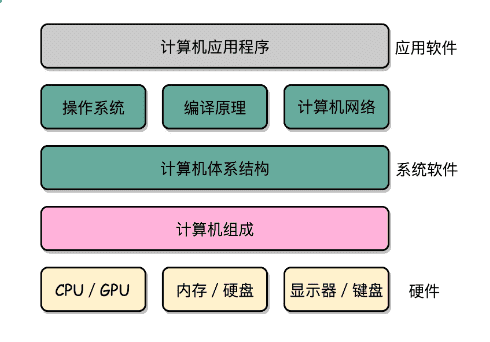
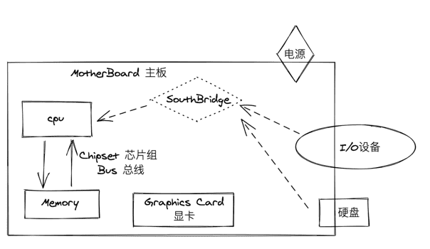
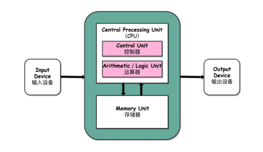
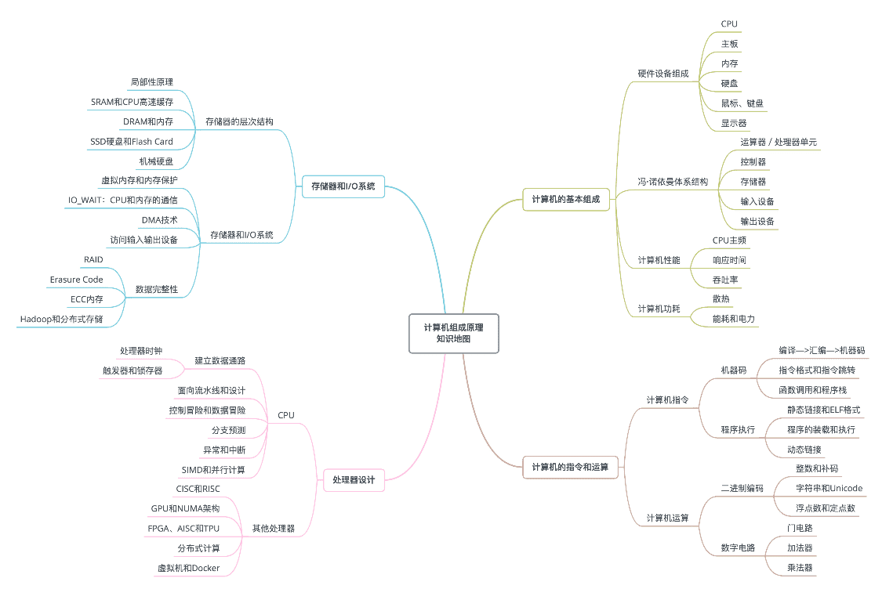
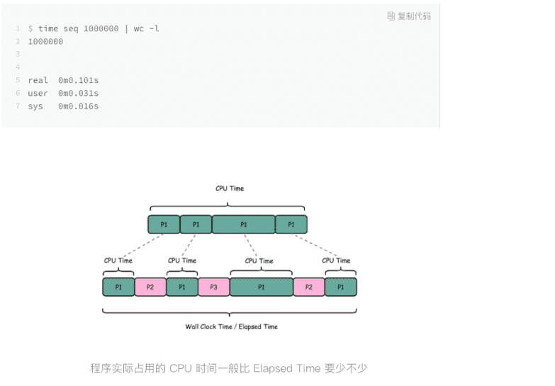

### 一、计算机组成原理是计算机体系结构的一个入门版本

### 二、计算机的基本硬件组成

#### 1.计算机三大件

1.  cpu Central Processing Unit 中央处理器

2.  memory 内存

3.  MotherBoard 主板

主板的**芯片组（Chipset）**和**总线（Bus）**解决了 CPU 和内存之间如何通信的问题。芯片组控制了数据传输的流转，也就是数据从哪里到哪里的问题。总线则是实际数据传输的高速公路。因此，总线速度（Bus Speed）决定了数据能传输得多快。

#### 2.显卡

1. **显卡 （Graphics Card）** 里有 GPU （Graphics Processing Unit 图形处理器）

2. **芯片组**：南桥芯片组（SouthBridge）、北桥芯片组（已被移到 CPU 内部）

   南桥芯片组控制 I/o 设备 （鼠标、键盘、硬盘等外部设备）和 CPU 之间通讯。

   北桥芯片组连接 CPU 和内存、显卡之间的通讯，已被移到 CPU 内部

3. System on a Chip（系统芯片):

   因为手机尺寸的原因，手机制造商们选择把 CPU、内存、网络通信，乃至摄像头芯片，都封装到一个芯片，然后再嵌入到手机主板上。这种方式叫 SoC，也就是 System on a Chip（系统芯片）。

### 三、**冯.诺依曼体系结构--存储程序计算机**

#### 1.存储程序计算机：暗含两个概念可编程计算机、存储计算机

#### 2.First Draft 《第一份草案》

1. **算术逻辑单元**（Arithmetic Logic Unit，ALU）

   **处理器寄存器**（Processor Register）的**处理器单元**（Processing Unit）

   用来完成各种算数和逻辑运算

2. **指令寄存器**（Instruction Register）

   **程序计数器**（Program Counter）的**控制器单元**（Control Unit/CU）

   用来控制程序的流程，通常就是不同条件下的分支和跳转。

   算术逻辑单元和控制器单元，共同组成了我们说的 CPU。

任何一台计算机的任何一个部件都可以归到**运算器、控制器、存储器、输入设备和输出设备**中，而所有的现代计算机也都是基于这个基础架构来设计开发的。所有的计算机程序，也都可以抽象为从输入设备读取输入信息，通过运算器和控制器来执行存储在存储器里的程序，最终把结果输出到输出设备中。

​ 冯.诺依曼机侧重于硬件抽象，图灵机侧重于计算抽象。

​ 冯.诺依曼体系结构示意图

### 四、计算机组成原理知识地图

1. 计算机的基本组成
2. 计算机的指令和计算
   1. 程序是怎么通过编译器和汇编器，变成一条条机器指令这样的编译过程，展开编程一门完整的编译原理课程
   2. 操作系统是怎么链接、装载、执行这些程序的，深入学习变成一门操作系统课程
   3. 重要知识点浮点数：掌握浮点数能让你对数据的编码、存储和计算能够有一个从表到里的深入理解
3. 处理器
4. 存储和 I/O 系统

### 五、学习计算机组成原理方法

1. 学会提问自己来串知识点
2. 写一些实例程序来验证知识点
3. 通过和计算机硬件发展的历史做对照

#### 1.入门书籍

1. 《程序是怎么跑起来》一个入门微缩版本的“计算机组成原理”。
2. 《计算机是怎么跑起来的》
3. 计算机组成中，硬件层面的基础实现，比如寄存器、ALU 这些电路是怎么回事，Coursera 上的北京大学免费公开课[《Computer Organization》](https://www.coursera.org/learn/jisuanji-zucheng)。

#### 2.深入学习书籍

1. 《计算机组成与设计：硬件 / 软件接口》
2. 《深入理解计算机系统》
   1. [哔哩哔哩配套教程](https://www.bilibili.com/video/av24540152/)
   2. [youtobe 配套教程](https://www.youtube.com/playlist?list=PLmBgoRqEQCWy58EIwLSWwMPfkwLOLRM5R)
   3. 引发了对于计算机体系结构的兴趣，还可以深入读一读《计算机体系结构：量化研究方法》。

#### 3.课外阅读

1. 在上面这些教材之外，对于资深程序员来说，来自 Redhat 的 What Every Programmer Should Know About Memory 是写出高性能程序不可不读的经典材料。
2. 而 LMAX 开源的 Disruptor，则是通过实际应用程序，来理解计算机组成原理中各个知识点的最好范例了。
3. 《编码：隐匿在计算机软硬件背后的语言》和《程序员的自我修养：链接、装载和库》是理解计算机硬件和操作系统层面代码执行的优秀阅读材料。

最有效的办法，不是短时间冲刺，而是有节奏地坚持，希望你能够和专栏的发布节奏同步推进，做好思考题，并且多在留言区和其他朋友一起交流，就更容易能够“积小步而至千里”，在程序员这个职业上有更长足的发展。

### 六、什么是性能？时间的倒数

#### 1.性能的两个指标

1. 响应时间（Response time）或者叫执行时间（Execution time）。

   想要提升响应时间这个性能指标，你可以理解为让计算机“跑得更快”。响应时间指的就是，我们执行一个程序，到底需要花多少时间。花的时间越少，自然性能就越好。

2. 吞吐率（Throughput）或者带宽（Bandwidth）

   想要提升这个指标，你可以理解为让计算机“搬得更多”。吞吐率是指我们在一定的时间范围内，到底能处理多少事情。这里的“事情”，在计算机里就是处理的数据或者执行的程序指令。

#### 2.一般把性能，定义成响应时间的倒数

​ 性能 = 1/ 响应时间

> 手机跑分软件，就是把多个预设好的程序在手机上运行，然后根据运行需要的时间，算出一个分数来给出手机的性能评估。

### 七、计算机的计时单位：CPU 时钟

#### 1.Wall Clock Time

​ 我们统计时间是用类似于“掐秒表”一样，记录程序运行结束的时间减去程序开始运行的时间。这个时间也叫 Wall Clock Time 或者 Elapsed Time，就是在运行程序期间，挂在墙上的钟走掉的时间。

#### 2.程序执行时间计算

​ Linux 的 time 的命令，统计同样的 Wall Clock Time 下，程序实际在 CPU 上到底花了多少时间。

​ 它会返回三个值：

​ 第一个是 real time，也就是我们说的 Wall Clock Time，也就是运行程序整个过程中流逝掉的时间；

​ 第二个是 user time，也就是 CPU 在运行你的程序，在用户态运行指令的时间；

​ 第三个是 sys time，是 CPU 在运行你的程序，在操作系统内核里运行指令的时间。而程序实际花费的 CPU 执行时间（CPU Time），就是 user time 加上 sys time。

​ 

#### 3.CPU 执行时间公式

其次，即使我们已经拿到了 CPU 时间，我们也不一定可以直接“比较”出两个程序的性能差异。所以，我们需要对“时间”这个我们可以感知的指标进行拆解，把程序的 CPU 执行时间变成 CPU 时钟周期数（CPU Cycles）和 时钟周期时间（Clock Cycle）的乘积。

`程序的 CPU 执行时间 =CPU 时钟周期数×时钟周期时间`

#### 4.时钟周期时间

而在 CPU 内部，有一个叫晶体振荡器（Oscillator Crystal）的东西，简称为晶振。我们把晶振当成 CPU 内部的电子表来使用。晶振带来的每一次“滴答”，就是时钟周期时间。

> 在我这个 2.8GHz 的 CPU 上，这个时钟周期时间，就是 1/2.8G。我们的 CPU，是按照这个“时钟”提示的时间来进行自己的操作。主频越高，意味着这个表走得越快，我们的 CPU 也就“被逼”着走得越快。

#### 5.最简单的提升性能方法

1. 自然缩短时钟周期时间，也就是提升主频。（换个好点 cpu）
2. 减少程序需要的 CPU 时钟周期数量，一样能够提升程序性能。

#### 6.CPU 时钟周期数

` CPU 时钟周期数 = 指令数×每条指令的平均时钟周期数（Cycles Per Instruction，简称 CPI）`

> 不同的指令需要的 Cycles 是不同的，加法和乘法都对应着一条 CPU 指令，但是乘法需要的 Cycles 就比加法要多，自然也就慢。

**综上所述**：

`程序的 CPU 执行时间 = 指令数×CPI×Clock Cycle Time`

#### 7.性能问题优化三方面

1. 时钟周期时间，就是计算机主频，这个取决于计算机硬件。

   我们所熟知的摩尔定律就一直在不停地提高我们计算机的主频。比如说，我最早使用的 80386 主频只有 33MHz，现在手头 的笔记本电脑就有 2.8GHz，在主频层面，就提升了将近 100 倍。

2. 每条指令的平均时钟周期数 CPI，就是一条指令到底需要多少 CPU Cycle。

   在后面讲解 CPU 结构的时候，我们会看到，现代的 CPU 通过流水线技术（Pipeline），让一条指令需要的 CPU Cycle 尽可能地少。因此，对于 CPI 的优化，也是计算机组成和体系结构中的重要一环。

3. 指令数，代表执行我们的程序到底需要多少条指令、用哪些指令。

   这个很多时候就把挑战交给了编译器。同样的代码，编译成计算机指令时候，就有各种不同的表示方式。

我们可以把自己想象成一个 CPU，坐在那里写程序。计算机主频就好像是你的打字速度，打字越快，你自然可以多写一点程序。CPI 相当于你在写程序的时候，熟悉各种快捷键，越是打同样的内容，需要敲击键盘的次数就越少。指令数相当于你的程序设计得够合理，同样的程序要写的代码行数就少。如果三者皆能实现，你自然可以很快地写出一个优秀的程序，你的“性能”从外面来看就是好的。

> **优化计算机性能的三条康庄大道:**
>
> 1. 提升计算机主频
> 2. 优化 CPU 设计使得在单个时钟周期内能够执行更多指令
> 3. 通过编译器来减少需要的指令数

### 八、**功耗：CPU 的“人体极限”**

#### CPU 一般被叫做超大规模集成电路(Very-Large-Scale Integration, VLSI)

​ 这些电路，实际上都是一个个晶体管组合而成的。CPU 在计算，其实就是让晶体管里面的“开关”不断地去“打开”和“关闭”，来组合完成各种运算和功能。

​ 想要计算得快，一方面，我们要在 CPU 里，同样的面积里面，多放一些晶体管，也就是增加密度；另一方面，我们要让晶体管“打开”和“关闭”得更快一点，也就是提升主频。而这两者，都会增加功耗，带来耗电和散热的问题。

因此，在 CPU 里面，能够放下的晶体管数量和晶体管的“开关”频率也都是有限的。一个 CPU 的功率，可以用这样一个公式来表示：

​ ` 功耗 ~= 1/2 ×负载电容×电压的平方×开关频率×晶体管数量`

### 九、并行优化，理解阿姆达尔定律

#### 1.通过并行提供性能

​ 并不是所有问题，都可以通过并行提高性能来解决。如果想要使用这种思想，需要满足这样几个条件 1.

1. 需要进行的计算，本身可以分解成几个可以并行的任务
2. 需要能够分解好问题，并确保几个人的结果能够汇总到一起
3. 在“汇总”这个阶段，是没有办法并行进行的，还是得顺序执行，一步一步来

#### 2.阿姆达尔定律

​ `  优化后的执行时间 = 受优化影响的执行时间 / 加速倍数 + 不受影响的执行时间`

#### 3.在整个计算机组成层面，还有以下三个原则性的性能提升方法

1. 加速大概率事件

   CPU -> GPU -> TPU

2. 通过流水线提供性能

   我们把 CPU 指令执行的过程进行拆分，细化运行，也是现代 CPU 在主频没有办法提升那么多的情况下，性能仍然可以得到提升的重要原因之一。

3. 通过预测提供性能

   通过预先猜测下一步该干什么，而不是等上一步运行的结果，提前进行运算，也是让程序跑得更快一点的办法。”分支和冒险” 、“局部性原理"
