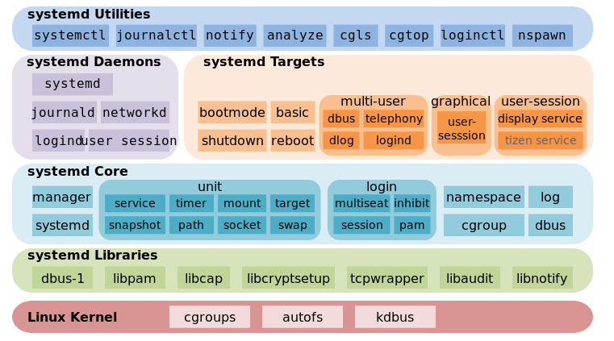

### shell命令

> https://www.linuxcool.com/ linxu 命令大全

#### **1.别名设置**

1. alias 设置一个别名 `alias  alias_name='origin_command'`
2. unaries 删除已设置别名 `unalias [-a][alias_name]`    
   1.  `unalias -a` 删除所有别名， `unalias alias_name` 仅删除alias_name的别名clear

#### 2.环境变量

1. `env`查看环境变量
2. `echo $PATH` 查看单个环境变量
3. `set` 查看本地变量
4. `sex=man` 设置变量. `PATH=${PATH}:/home/bin` 扩容变量
5. `unset sex` 取消变量 

1. `uname -a` 显示电脑以及操作系统的相关信息

#### 3.`tar` 命令

1. 解压命令
   1. `tar -xf filename.tar.xz`
   2. `tar -zcvf 压缩文件名 .tar.gz 被压缩文件名` 压缩
   3. `tar -zxvf 压缩文件名.tar.gz` 解压

#### **4.wget** 

1. `wget downloadUrl` 下载文件

   > 正在连接 download.redis.io|109.74.203.151|:80... 失败：拒绝连接。
   >
   > 应该是网站禁止被爬，没关系，在wget命令中添加一个参数 -e robots=off 就可以了

#### **5.`scp` 命令**

```
 scp /path/filename username@servername:/path ;
```

[Linux中的scp命令用于将文件和目录复制到远程系统或从远程系统复制文件和目录。](https://cn.linux-console.net/?p=10502)

#### 6.`grep` 查找文件中的关键字

```shell
grep [选项] "string" file

grep -i "string" file  #文件中不区分大小写地搜索字符串

grep -A “string” file  #显示之后几行,后跟数字

grep -B “string” file  #显示之前几行,后跟数字

grep -C “string” file #显示前后几行,后跟数字

grep -E "pattern" file #正则表达式匹配

```

#### 7.`echo` 字符串输出

```shell
echo "some text"
```

#### 8.`touch `

 用于创建没有任何内容的文件

```shell
touch somefile
```

#### 9.`cat` 文本输出命令

```shell
cat filename  #一次显示整个文件

cat > filename  #从键盘创建一个文件,只能创建新文件,不能编辑已有文件

cat file1 file2 > file #将几个文件合并为一个文件

```

#### 10.`mkdir` 创建一个新的空目录   `rmdir` 删除空目录

``` shell
mkdir some-directory

rmdir some-directory
```

#### 11.`rm` 删除文件/目录

```shell
rm [选项] somefile

rm -f somefile  #somefile 即使原档案属性设为维读,亦直接删除,无需逐一确认

rm -r directory #将目录及以下之档案亦逐一删除
```

#### 12.`tail` 查看文档的内容

```shell
tail [选项] somefile  #默认显示文档的最后10行

tail -n 10 somefile #显示文件的尾部n行内容

tail -f somefile #循环读取

tail +20 somefile #显示文件的内容,从第20行至文件末尾

tail -c 10 somefile #显示文件的最后 10个字符
```

#### 13.`find` 搜索文件

```shell
find path -name filename

find . -name index.js #查找所有名为indexjs的文件 

find . -name "*.js" #查找指定类型的文件
```

#### 14.`|` 管道命令

```shell
ls -l /etc | more #分页显示 /etc 目录 中内容的详细信息

echo "Hello World" | cat > hello.txt #将一个字符串输入到一个文件中
```

#### 15.`ps` 命令

```shell
ps aux | grep "nginx" #查看进程 并 筛选 nginx 进程

```

#### 16.`telnet`

```shell
telnet 101.200.195.41 8080 # 查看远程端口是否开放
```

#### 17.`curl`

1. 查看完整的网络请求

   `curl -v  https://ddlh-gzh.yunfuw.cn?ddlh=1`

2. 查看响应头部、响应行、响应数据

   `curl -i  https://ddlh-gzh.yunfuw.cn?ddlh=1`
   
   只查看响应行、响应头部，用-I
   
3. 下载文件

   ` curl -O  http://nginx.org/download/nginx-1.20.1.tar.gz`

#### 18.`man` 查看命令信息

#### 19.`netstat -tnlp`   

 `netstat -anp tcp | grep 80`

​	查看端口号

#### 20.`iptables -L -n`

​	查看防火墙对外开放了那些

#### 21.zip

```shell
zip -r mysql.zip mysql #将mysql文件夹压缩成mysql.zip
unzip mysql.zip
```

#### 22.更新shell 配置

` vim ~/.bash_profile`   `vim ~/.zshrc`

#### 23.`ll` 

查看文件夹列表  `stat filename` 查看文件具体信息

```shell
$ type ll
ll is an alias for ls -lh
```

#### 24.dig 命令查看DNS

#### 25.Systemd

http://www.ruanyifeng.com/blog/2016/03/systemd-tutorial-commands.html

#### 26.nohup

**nohup** 英文全称 no hang up（不挂起），用于在系统后台不挂断地运行命令，退出终端不会影响程序的运行。

https://www.runoob.com/linux/linux-comm-nohup.html

#### [27.type](https://bash.cyberciti.biz/guide/Type_command)  

查看命令来源

If the -t option is used, it will print a single word which is one of the following

- alias (command is shell alias)
- keyword (command is shell reserved word)
- function (command is shell function)
- builtin (command is shell builtin)
- file (command is disk file)

#### 28.查看当前用户

`whoami`

`id`

`echo $USER`

#### 29.which

```shell
which npm 
// OUTPUT SAMPLE
/usr/local/bin/npm
```

#### 30.la

#### 31.查杀端口号进程

`lsof -i:8080` 查看占用端口的进程号

```
kill -9 `lsof -ti:8080`  直接通过端口号杀进程
```

#### 32.service 查看服务状态

查看单个服务运行状态

`service 服务名 status`

查看所有服务的运行状态

`service --status-all`

#### 35.Systemctl

check service status

`systemctl status servicename.service`

Start service

`systemctl start servicename`




[1]: https://www.liquidweb.com/kb/what-is-systemctl-an-in-depth-overview/

#### 36.dig

`dig` 是一个常用的用于查询 DNS（Domain Name System）信息的命令行工具。它可以用来查询域名的各种记录类型，如 A 记录、CNAME 记录、MX 记录等。

#### 37.`env`、 `set` 、`declare` 、`export`


[1]: https://www.cnblogs.com/wfwenchao/p/6139039.html	"Linux中 set、env、declare、export显示shell变量的区别"


#### 38.`set`

Change the value of shell attributes and positional parameters, or
display the names and values of shell variables.

#### 39.`declare`

The ***declare*** is a builtin command of the **bash** shell. It is used to declare shell variables and functions, set their attributes and display their values.

#### 40.awk

#### 41.sed

#### 42.perl

#### 43.cp 

复制命令
