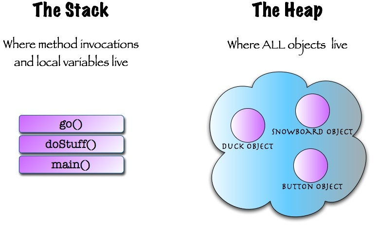

### 堆栈

#### 1.什么是堆栈

1. 栈：**栈申请内存时是由系统自动分配的**，

   而且系统分配也是有大小限制的，只要栈的剩余空间大于所申请空间，系统将为程序提供内存，否则将报异常提示栈溢出。

   > 用于存储Js中的简单数据类型及对象的引用指针, 该指针指向的是堆内存中对应的值
   >
   > 栈内存的特点是后进先出, 可以直接存取的，而堆内存是不可以直接存取的内存。对于我们的对象来数就是一种大的数据类型而且是占用空间不定长的类型，所以说对象是放在堆里面的，但对象名称是放在栈里面的，这样通过对象名称就可以使用对象了。

2. 堆：**堆内存是一般是由语言运行环境分配管理**

   首先应该知道操作系统有一个记录空闲内存地址的链表，当系统收到程序的申请时，会遍历该链表，寻找第一个空间大于所申请空间的堆结点，然后将该结点从空闲结点链表中删除，并将该结点的空间分配给程序，另外，对于大多数系统，会在这块内 存空间中的首地址处记录本次分配的大小，这样，代码中的delete语句才能正确的释放本内存空间。另外，由于找到的堆结点的大小不一定正好等于申请的大 小，系统会自动的将多余的那部分重新放入空闲链表中。
   
   > 用于存储Js中的复杂数据类型，当我们创建一个对象或数组或new一个实例的时候，就会在堆内存中开辟一段空间给它，用于存放。
   >
   > 堆内存可以动态地分配内存大小，生存期也不必事先告诉编译器，因为它是在运行时动态分配内存的，但缺点是，由于要在运行时动态分配内存，存取速度较慢。

#### 2.堆（heap）和栈的（stack）区别

1. 在哪找

​		栈：

​		堆：推是在链表上面去找，找到合适的就把推放上去

2. 查找方式

   栈：自顶向下分配，空间限制

   推：从下往上分配，空间无限

