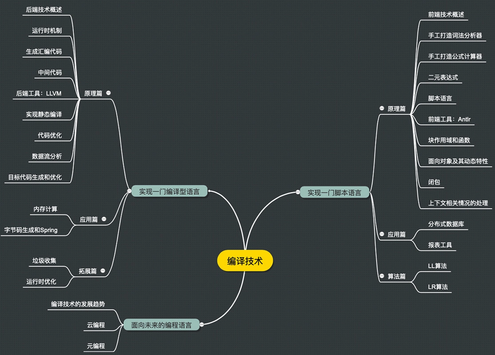
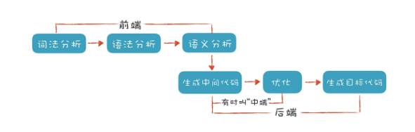

### 1.理解代码：编译器的前端技术

#### 1.词法分析 Lexical Analysis

> 词法分析工具:Lex
>
> 正则文法 Regular Grammar、有限自动机 Finite-state Automation FSA

#### 2.语法分析 Syntactic Analysis， or Parsing

> 语义分析工具：Yacc、Antlr、JavaCC
>
> 抽象语法树 Abstract Syntax Tree, AST
>
> 递归下降算法  Recursive Descent Parsing、 

#### 3.语义分析 Semantic Analysis

[1]: https://www.javatpoint.com/lex
[2]: https://silcnitc.github.io/lex.html

