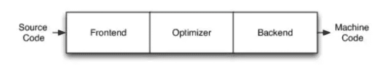
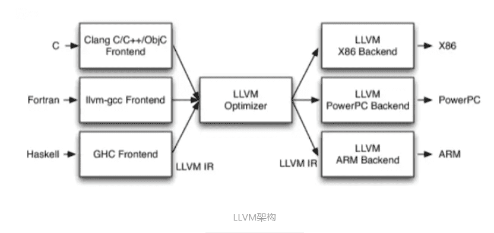
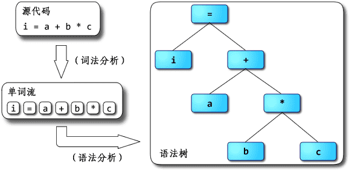

#### 1.LLVM

LLVM项目是模块化和可重用的编译器和工具链技术的集合。

LLVM提供了一套适合编译器系统的[中间语言](https://zh.wikipedia.org/wiki/中間語言)（Intermediate Representation，IR），有大量变换和优化都围绕其实现。经过变换和优化后的中间语言，可以转换为目标平台相关的[汇编语言](https://zh.wikipedia.org/wiki/汇编语言)代码。

##### 1.传统的编译器架构

1. **Frontend:前端**

   词法分析、语法分析、语义分析、生成中间代码

2. **Optimizer:优化器**

   中间代码优化

3. **Backend:后端**

   生成机器码

##### 2.LLVM框架

### 2.沙箱机制

### 3.JIT

### 4. parser

1. 主要作用是进行语法分析，提取出句子的结构。

   输入程序源代码，输出语法树（syntax tree）或者抽象语法树(abstract syntax tree, AST)。

   > javascript转译、代码压缩、css预处理器、elint、pretiier 等工具建立在AST上。

2. 解析器的工作流程

   

### 5.解释器 interpreter

1. 什么是解释器？

   解释器是一种[程序](https://zh.wikipedia.org/wiki/计算机程序)，能够把[编程语言](https://zh.wikipedia.org/wiki/程式語言)一行一行解释运行。解释器像是一位“中间人”，每次运行程序时都要先转成另一种语言再作运行，因此解释器的程序运行速度比较缓慢。它不会一次把整个程序翻译出来，而是每翻译一行程序叙述就立刻运行，然后再翻译下一行，再运行，如此不停地进行下去。

### 6.编译器compiler

1. 什么是编译器？

   编译器是一种计算机程序，它会将某种编程语言写成的[源代码](https://zh.wikipedia.org/wiki/原始碼)（原始语言）转换成另一种编程语言（目标语言）。

2. 一个现代编译器的主要工作流程：

   [源代码](https://zh.wikipedia.org/wiki/源代码)（source code）→ [预处理器](https://zh.wikipedia.org/wiki/预处理器)（preprocessor）→ [编译器](https://zh.wikipedia.org/wiki/编译器)（compiler）→ [汇编程序](https://zh.wikipedia.org/wiki/汇编程序)（assembler）→ [目标代码](https://zh.wikipedia.org/wiki/目标代码)（object code）→ [链接器](https://zh.wikipedia.org/wiki/链接器)（linker）→ [可执行文件](https://zh.wikipedia.org/wiki/執行檔)（executables），最后打包好的文件就可以给电脑去判读运行了。

### 7.静态分析

https://baike.baidu.com/item/%E7%A8%8B%E5%BA%8F%E9%9D%99%E6%80%81%E5%88%86%E6%9E%90/1968823?fr=aladdin

程序静态分析（Program Static Analysis）是指在不运行[代码](https://baike.baidu.com/item/代码/86048)的方式下，通过[词法分析](https://baike.baidu.com/item/词法分析/8853461)、[语法分析](https://baike.baidu.com/item/语法分析/8853407)、[控制流](https://baike.baidu.com/item/控制流/854473)、[数据流分析](https://baike.baidu.com/item/数据流分析/21496987)等技术对程序代码进行扫描，验证代码是否满足规范性、安全性、可靠性、可维护性等指标的一种代码分析技术。目前静态分析技术向模拟执行的技术发展以能够发现更多传统意义上动态测试才能发现的缺陷，例如符号执行、抽象解释、值依赖分析等等并采用数学约束求解工具进行路径约减或者可达性分析以减少误报增加效率。

（1）[词法分析](https://baike.baidu.com/item/词法分析)：从左至右一个字符一个字符的读入[源程序](https://baike.baidu.com/item/源程序)，对构成源程序的字符流进行扫描，通过使用[正则表达式](https://baike.baidu.com/item/正则表达式)匹配方法将[源代码](https://baike.baidu.com/item/源代码)转换为等价的符号（Token） 流，生成相关符号列表，Lex为常用词法分析工具。

（2）[语法分析](https://baike.baidu.com/item/语法分析)：判断源程序结构上是否正确，通过使用上下文无关语法将相关符号整理为语法树， Yacc为常用工具。

（3）[抽象语法树](https://baike.baidu.com/item/抽象语法树)分析：将程序组织成树形结构，树中相关节点代表了程序中的相关代码，目前已有[javacc](https://baike.baidu.com/item/javacc)/ Antlra等抽象语法树生成工具。

（4）[语义分析](https://baike.baidu.com/item/语义分析)：对结构上正确的源程序进行上下文有关性质的审查。

（5）[控制流](https://baike.baidu.com/item/控制流)分析：生成有向[控制流图](https://baike.baidu.com/item/控制流图)，用节点表示基本代码块，节点间的有向边代表控制流路径，反向边表示可能存在的循环；还可生成[函数调用](https://baike.baidu.com/item/函数调用)关系图，表示函数间的嵌套关系。

（6）数据流分析：对控制流图进行遍历，记录变量的初始化点和引用点，保存切片相关数据信息。

（7）污点分析：基于[数据流图](https://baike.baidu.com/item/数据流图)判断[源代码](https://baike.baidu.com/item/源代码)中哪些变量可能受到攻击，是验证程序输入、识别代码表达缺陷的关键。

（8）无效代码分析，根据控制流图可分析孤立的节点部分为无效代码。

程序[静态分析](https://baike.baidu.com/item/静态分析)是在不执行程序的情况下对其进行分析的技术，简称为静态分析。而程序动态分析则是另外一种[程序分析](https://baike.baidu.com/item/程序分析)策略，需要实际执行程序。大多数情况下，静态分析的输入都是[源程序](https://baike.baidu.com/item/源程序)代码，只有极少数情况会使用[目标代码](https://baike.baidu.com/item/目标代码)。静态分析这一术语一般用来形容自动化工具的分析，而人工分析则往往叫做程序理解。

静态分析越来越多地被应用到[程序优化](https://baike.baidu.com/item/程序优化)、[软件错误](https://baike.baidu.com/item/软件错误)检测和系统理解领域。Coverity Inc.的[软件质量](https://baike.baidu.com/item/软件质量)检测产品就是利用[静态分析](https://baike.baidu.com/item/静态分析)技术进行错误检测的成功代表。国内某软件公司的闪蝶（BlueMropho）代码分析平台，是利用程序静态分析技术专注于大型机遗留系统的代码理解领域，尤其擅长分析千万行代码规模级的COBOL系统

