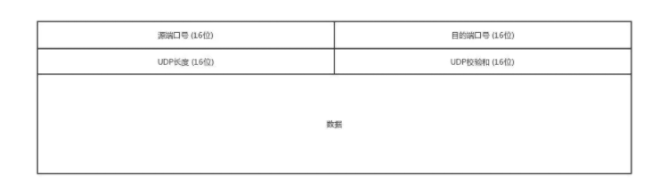
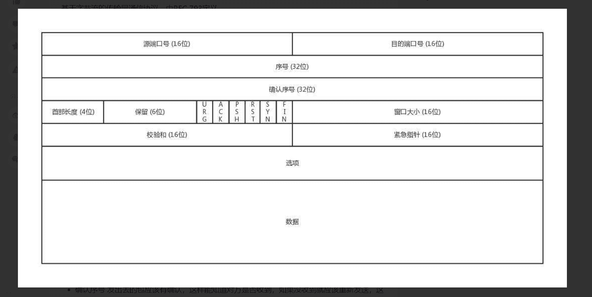

https://blog.csdn.net/rock_joker/article/details/76769404

TCP的全称是Transmission Control Protocol,传输控制协议。TCP并不是基于UDP协议构建的，和UDP协议一样是基于IP协议构建的。

#### 1.TCP主要解决下面三个问题

1. 数据的可靠传输

   发送方如何知道发出的数据，接收方已经收到

2. 接收方的流量控制

   因为各种原因，接收方可能来不及处理发送方发送的数据，而造成没有及时回应发送方，造成发送方不断的重发数据，最后造成接收方的主机宕机。

3. 计算机网络的拥塞控制

   数据在计算机网络之上传输，当出现数据拥塞时如何进行处理

#### 2.TCP 的可靠传输

TCP的可靠传输是通过确认和超时重传的机制来实现的，而确认和超时重传的具体的实现是通过以字节为单位的滑动窗口机制来完成。

#### 3.TCP 拥塞控制

1. 慢启动机制
2. 拥塞避免机制
3. 加速递减机制
4. 快重传和快恢复机制

《计算机网络 自顶向下方法》

#### 4.谈谈你对TCP 三次握手和四次挥手的理解

####  5.TCP 与 UDP 协议的区别？

##### UDP

UDP（User Datagram Protocol） 全称是用户数据电报协议，是一种无连接的协议，提供不可靠的用户数据报服务。

UDP 协议头中只包含 4 个字段：源端口、目的端口、UDP长度、UDP校验码，其中每一个字段都占 16 位，即 2 字节，共8个字节。

1. 面向无连接 UDP 不需要与 TCP一样在发送数据前进行三次握手建立连接，UDP想发数据就直接发送了；并且UDP只是数据报文的搬运工，不会对数据报文进行任何拆分和拼接操作。
2. 不可靠 首先不可靠性体现在无连接上，通信都不需要建立连接，想发就发，这样的情况肯定不可靠的；并且收到什么数据就传递什么数据，也不会备份数据，发送数据也不会关心对方是否已经正确接收到数据； 再者网络环境时好时坏，但是 UDP 因为没有拥塞控制，一直会以恒定的速度发送数据；即使网络条件不好，也不会对发送速率进行调整，这样实现的弊端就是在网络条件不好的情况下可能会导致丢包，但是优点也很明显，在某些实时性要求高的场景（比如直播、电话会议等）就需要使用 UDP 而不是 TCP；
3. 单播、多播、广播功能。 由于 UDP 不会建立连接，因此它可以给任何人传递数据，不止支持一对一的传输方式，同样支持一对多、多对多、多对一的方式；
4. UDP是面向报文的 发送方的UDP对应用程序交下来的报文，在添加首部后就向下交付IP层（UDP对应用层交下来的报文，既不合并，也不拆分，而是保留这些报文的边界）；
5. 头部开销小，传输数据高效 UDP 的头部开销小，只有八字节，在传输数据报文时是比较高效的（在某些实时性要求高的场景，例如直播、电话会议、媒体传输等场景经常使用 UDP协议）；

##### TCP

TCP（Transmission Control Protocol）协议全称是传输控制协议，是一种面向连接的、可靠的、基于字节流的传输层通信协议。

1. 源端口、目标端口 发送方进程的端口号，数据接收方的端口号（范围0-65535）；

2. 序号 主要是为了解决乱序问题（编好号才知道哪个先来，哪个后到）；

3. **确认序号 发出去的包应该有确认，这样能知道对方是否收到，如果没收到就应该重新发送，这个解决的是不丢包的问题；**

4. 状态位 SYN 是发起一个链接，ACK 是回复，RST 是重新连接，FIN 是结束连接（TCP 是面向连接的，因此需要双方维护连接的状态，这些状态位的包会引起双方的状态变更）；

5. 窗口大小 TCP 要做流量控制，需要通信双方各声明一个窗口，标识自己当前的处理能力

#### **6.回答这个问题之前，要考虑TCP协议为什么会丢包，在什么样的情况下会丢包。**

A服务器发送数据给B服务器频率过高时，B服务器来不及处理，造成数据丢包。

(原因可能是程序逻辑问题，多线程同步问题，缓冲区溢出问题)

如果A服务器不对发送频率进行控制，或者数据进行重发的话，那么B服务器收到数据就会少。就会造成丢失数据

#### **7.TCP协议丢包后，如何解决丢包的问题**

为了满足TCP协议不丢包。TCP协议有如下规定：

1. 数据分片：发送端对数据进行分片，接受端要对数据进行重组，由TCP确定分片的大小并控制分片和重组

2. 到达确认：接收端接收到分片数据时，根据分片数据序号向发送端发送一个确认

3. 超时重发：发送方在发送分片时设置超时定时器，如果在定时器超时之后没有收到相应的确认，重发分片数据

4. 滑动窗口：TCP连接的每一方的接受缓冲空间大小固定，接收端只允许另一端发送接收端缓冲区所能接纳的数据，TCP在滑动窗口的基础上提供流量控制，防止较快主机致使较慢主机的缓冲区溢出

5. 失序处理：作为IP数据报来传输的TCP分片到达时可能会失序，TCP将对收到的数据进行重新排序，将收到的数据以正确的顺序交给应用层;

6. 重复处理：作为IP数据报来传输的TCP分片会发生重复，TCP的接收端必须丢弃重复的数据;

7. 数据校验：TCP将保持它首部和数据的检验和，这是一个端到端的检验和，目的是检测数据在传输过程中的任何变化。如果收到分片的检验或有差错，TCP将丢弃这个分片，并不确认收到此报文段导致对端超时并重发

