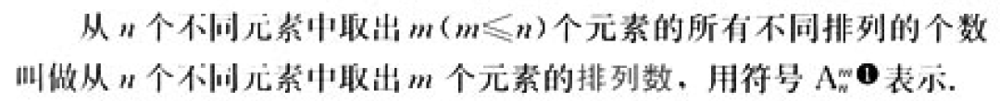
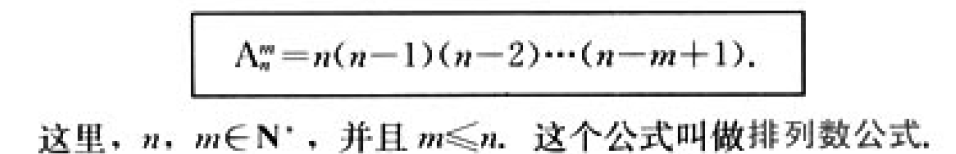
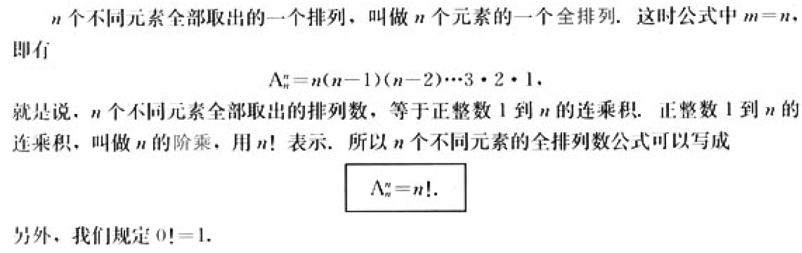
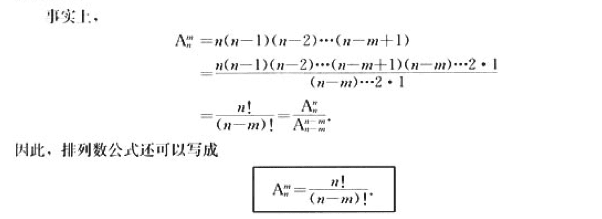
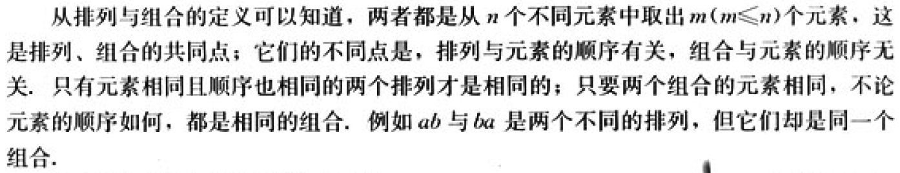
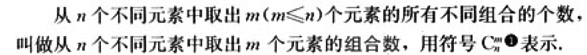
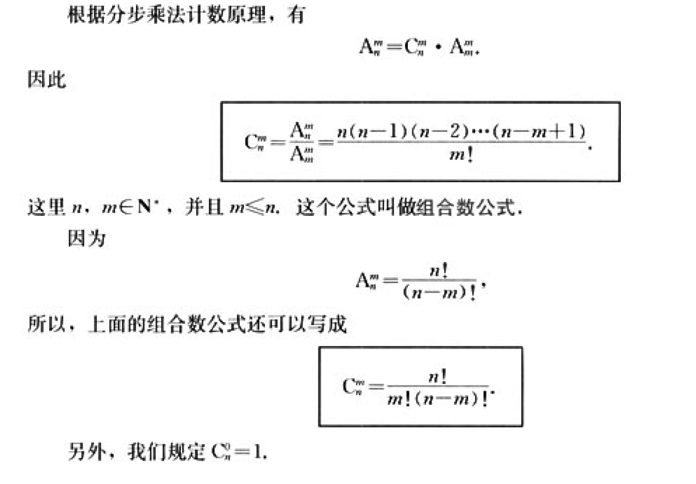
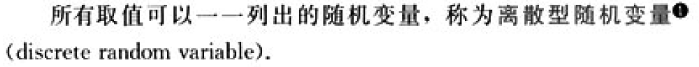
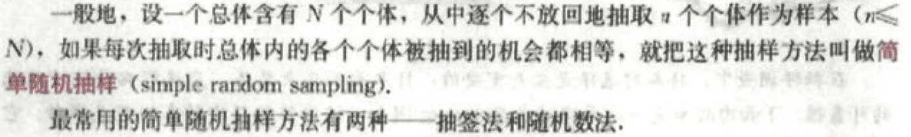
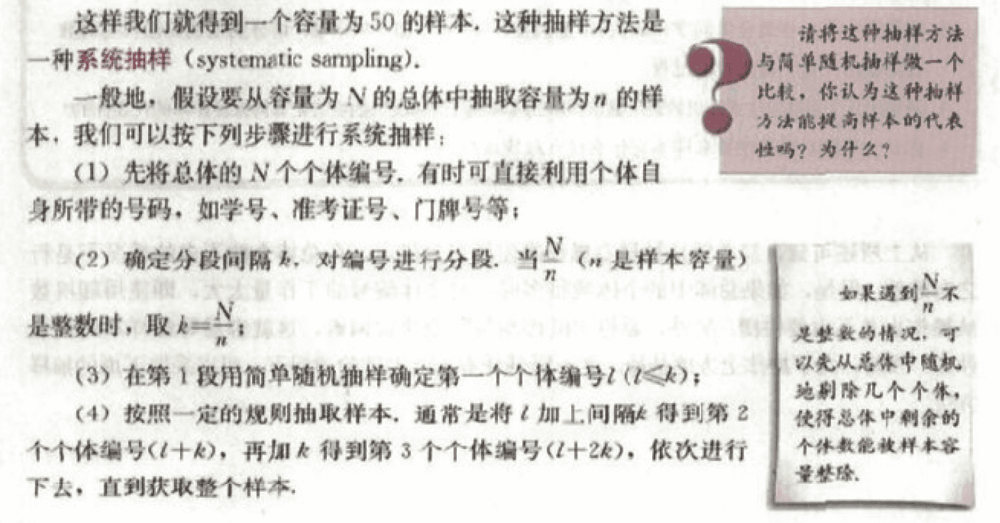

### 1.分类加法计数原理和分步乘法计数原理

### 2.排列与组合

#### 1.排列

一般地，从n个不同元素中取出m(m<=n) 个元素，按照一定的顺序排成一列，叫做从n个不同元素中取出m个元素的一个排列(arrangement)。

#### 2.组合

一般地，从n个不同元素中取出m(m<=n)各元素合成一组，叫做从n个不同元素中取出m个元素的一个组合(combination)。

### 3.二项式定理

### 4.离散型随机变量及其分布列

### 5.统计

#### 1.简单随机抽样

#### 2.系统抽样

