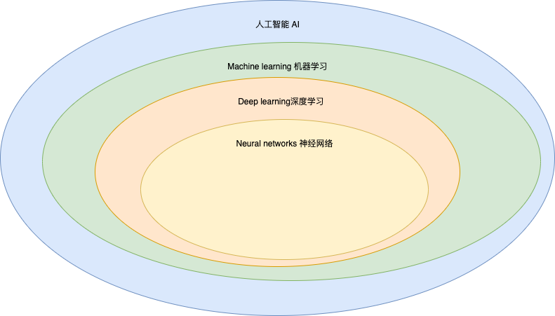

1.AI-Artificial Intelligence  人工智能

2.ML-Machine Learning 机器学习

#### 1.数据科学与机器学习

机器学习主要是发现模式和相关性，从中进行学习并不断自我优化。数据挖掘则是机器学习的信息源。数据挖掘技术本身使用了复杂的算法，能够帮助提供条理更清晰的数据集，供机器学习应用使用。

#### 2.数据科学与机器学习

相对于机器学习，数据科学是一个子集，侧重于统计和算法，主要使用回归和分类技术来解释和传达结果。机器学习则着重于编程、自动化、扩展、合并和储存结果。

#### 3.统计与机器学习

机器学习包含了多种学习模型和技术，其中就包括统计。统计本身主要是利用数据进行预测和创建分析模型。

> [人工智能](https://www.sap.cn/products/artificial-intelligence/business-technology-platform.html)是父集，包含了机器学习及其所有子集。人工智能下面的第一个子集是机器学习，深度学习是机器学习的一个分支，神经网络则是深度学习的基础结构。

