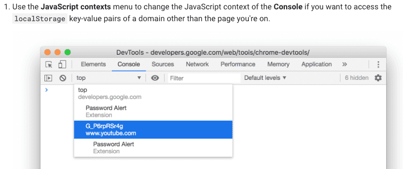

### DevTools

#### 1.JavaScript contexts

#### 2.Local Overrides

https://developers.google.com/web/updates/2018/01/devtools?utm_source=devtools#overrides

#### 3.Lighthouse  panel

性能报告

#### 4.Properties 面板 已废弃

可通过`console.log($0)` 打印当前选中元素

15699840214

#### 5.network 面板过滤filter 使用技巧

https://www.freecodecamp.org/news/chrome-devtools-network-tab-tricks/

#### 6.选中所有同类元素某个属性，只需要鼠标放到对应的css属性上

