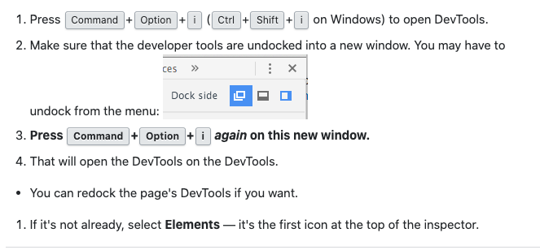

### 1.捕获全屏快照

> 控制面板 => command + shift + p => capture full size screenshot

### 2.捕获局部快照

> 控制面板 => 审查元素 => command + shift + p => capture node screenshot

### 3.open devtools on devtools

4.颜色转换

https://www.digitalocean.com/community/tutorials/css-hex-code-colors-alpha-values