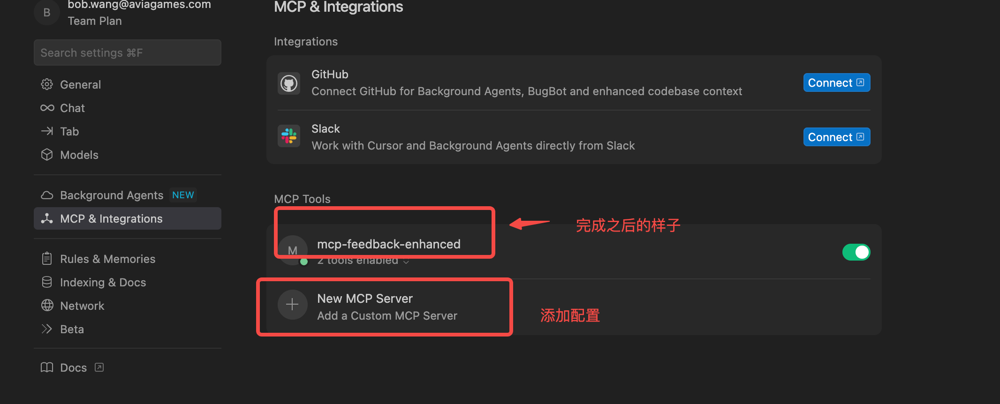
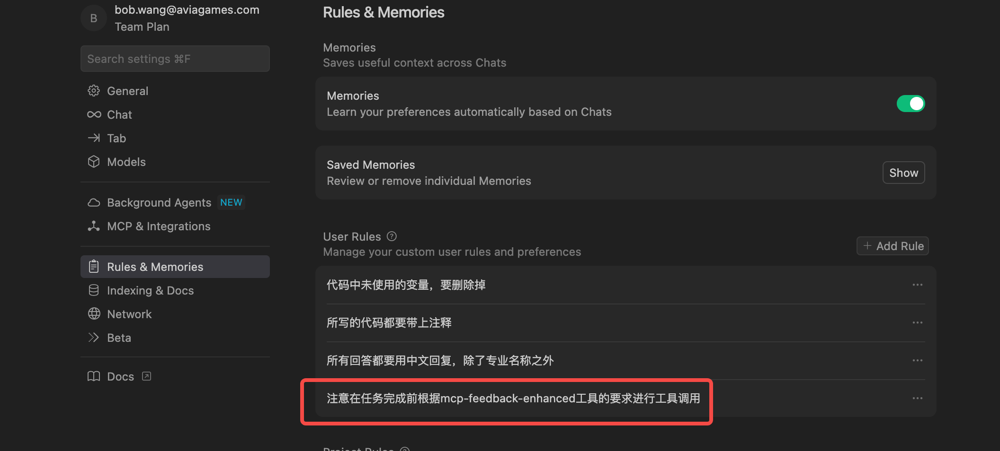

### 1.MCP 的 安装使用

#### 1.Feedback Enhanced

##### 1.安装uv

```
pip install uv

```

或者使用官方安装：https://docs.astral.sh/uv/getting-started/installation/

```
curl -LsSf https://astral.sh/uv/install.sh | sh
```

##### 2.配置MCP

```
{
  "mcpServers": {
    ....已有的其他 mcp
    "mcp-feedback-enhanced": {
      "command": "uvx",
      "args": ["mcp-feedback-enhanced@latest"],
      "timeout": 600,
      "autoApprove": ["interactive_feedback"]
    }
  }
}

```



> 如果未安装成功，可执行 `uvx mcp-feedback-enhanced@latest test --web `

##### 3.配置规则

```Plain
注意在任务完成前根据mcp-feedback-enhanced工具的要求进行工具调用
```



