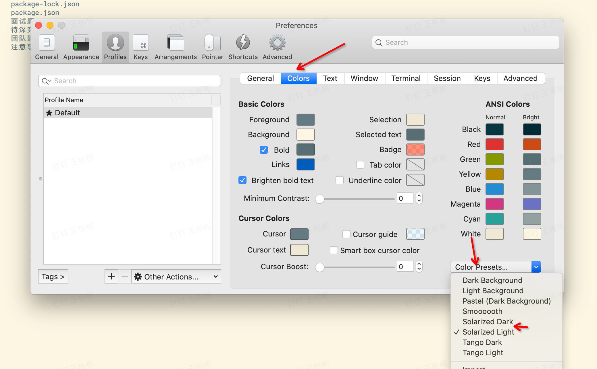

#### 1.主题配置路径

`~/.zshrc`

#### 2.修改主题路径

`vim ~/.oh-my-zsh/themes/agnoster.zsh-theme`

#### 3.只显示当前文件夹

`/Users/binbin.wang/.oh-my-zsh/themes/agnoster.zsh-theme`

`%1~` 只显示当前文件夹

```shell
prompt_dir() {
  prompt_segment blue $CURRENT_FG '%1~'
}
```


```shell
build_prompt() {
  RETVAL=$?
  # prompt_status
  # prompt_virtualenv
  # prompt_aws
  # prompt_context
  prompt_dir
  prompt_git
  prompt_bzr
  prompt_hg
  prompt_end
}
```

#### 4.插件安装

- [zsh-autosuggestions](https://github.com/zsh-users/zsh-autosuggestions)
- [wd](https://github.com/ohmyzsh/ohmyzsh/tree/master/plugins/wd)
- [zsh-syntax-highlighting](https://github.com/zsh-users/zsh-syntax-highlighting)
- [Screen](https://github.com/ohmyzsh/ohmyzsh/tree/master/plugins/screen)

#### 5.颜色设置



[1]: https://zhuanlan.zhihu.com/p/290737828	"iTerm2 + oh-my-zsh 教程（7000字长文）"

