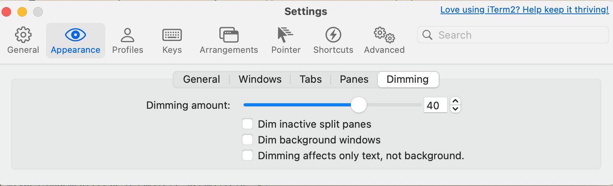

#### 1.主题配置路径

`~/.zshrc`

#### 2.修改主题路径

`vim ~/.oh-my-zsh/themes/agnoster.zsh-theme`

#### 3.只显示当前文件夹

`/Users/binbin.wang/.oh-my-zsh/themes/agnoster.zsh-theme`

`%1~` 只显示当前文件夹

`%2~` 显示当前文件夹+父级

```shell
prompt_dir() {
  prompt_segment blue $CURRENT_FG '%1~'
}
```


```shell
build_prompt() {
  RETVAL=$?
  # prompt_status
  # prompt_virtualenv
  # prompt_aws
  # prompt_context
  prompt_dir
  prompt_git
  prompt_bzr
  prompt_hg
  prompt_end
}
```

#### 4.插件安装

- [zsh-autosuggestions](https://github.com/zsh-users/zsh-autosuggestions)
- [wd](https://github.com/ohmyzsh/ohmyzsh/tree/master/plugins/wd)
- [zsh-syntax-highlighting](https://github.com/zsh-users/zsh-syntax-highlighting)
- [Screen](https://github.com/ohmyzsh/ohmyzsh/tree/master/plugins/screen)

#### 5.颜色设置


[1]: https://zhuanlan.zhihu.com/p/290737828	"iTerm2 + oh-my-zsh 教程（7000字长文）"

#### 6.iterm2 三个窗口，我点击一个窗口时，其他两个窗口有了暗色背景，怎么取消暗色背景呢



#### 7.iterm2 能保存打开的窗口吗

iTerm2 本身没有直接的“保存窗口”功能，但可以通过以下几种方式实现类似的效果，保存当前打开的窗口和会话布局，以便下次恢复：

---

### **方法 1：使用 iTerm2 的窗口恢复功能**
iTerm2 支持在退出时自动保存窗口状态，并在重新启动时恢复。

**设置步骤：**
1. 打开 iTerm2。
2. 进入菜单栏，选择 `iTerm2` > `Preferences`。
3. 在设置窗口中，选择 `General` 选项卡。
4. 在 `Startup` 部分，勾选以下选项：
   - **Restore window arrangement at startup**：启动时恢复窗口布局。
   - **Open default window arrangement at startup**：启动时打开默认窗口布局。
5. 关闭设置窗口。

**使用方法：**
- 当你退出 iTerm2 时，当前的窗口布局和会话会被自动保存。
- 下次启动 iTerm2 时，窗口和会话会自动恢复。

---

### **方法 2：使用 iTerm2 的会话保存功能**
iTerm2 允许你保存当前的会话（Session），并在需要时重新打开。

**保存会话的步骤：**
1. 在 iTerm2 中，右键点击当前会话的标签页。
2. 选择 `Save Current Session as a Profile...`。
3. 输入一个名称并保存。

**恢复会话的步骤：**
1. 打开 iTerm2。
2. 右键点击窗口或标签页，选择 `New Tab` > `Profiles` > 选择你保存的会话。

---

### **方法 3：使用 iTerm2 的 Arrangements 功能**
iTerm2 提供了“Arrangements”功能，可以保存当前的窗口布局和会话。

**保存 Arrangement 的步骤：**
1. 打开 iTerm2 并设置好你需要的窗口布局和会话。
2. 进入菜单栏，选择 `Window` > `Save Window Arrangement`。
3. 输入一个名称并保存。

**恢复 Arrangement 的步骤：**
1. 打开 iTerm2。
2. 进入菜单栏，选择 `Window` > `Restore Window Arrangement`。
3. 选择你保存的 Arrangement 名称。

---

### **方法 4：使用 tmux 或 screen**
如果你需要更强大的会话管理功能，可以使用 `tmux` 或 `screen` 工具。它们可以在后台运行会话，即使关闭终端窗口也不会丢失。

**使用 tmux 的步骤：**
1. 安装 tmux：
   - macOS：`brew install tmux`
   - Linux：`sudo apt install tmux`
2. 启动 tmux：
   ```bash
   tmux new -s mysession
   ```
3. 在 tmux 中运行你的任务。
4. 分离会话（detach）：
   - 按下 `Ctrl + b`，然后按 `d`。
5. 重新连接会话：
   ```bash
   tmux attach -t mysession
   ```

---

### **方法 5：使用 iTerm2 的 Python API**
如果你有编程经验，可以使用 iTerm2 的 Python API 编写脚本，保存和恢复窗口布局。

**参考文档：**
- [iTerm2 Python API](https://iterm2.com/python-api/)

---

### **总结**
- 如果你只是需要简单的窗口恢复功能，可以使用 **方法 1** 或 **方法 3**。
- 如果你需要更强大的会话管理功能，推荐使用 **tmux**（方法 4）。
- 如果你有编程需求，可以尝试 **方法 5**。

