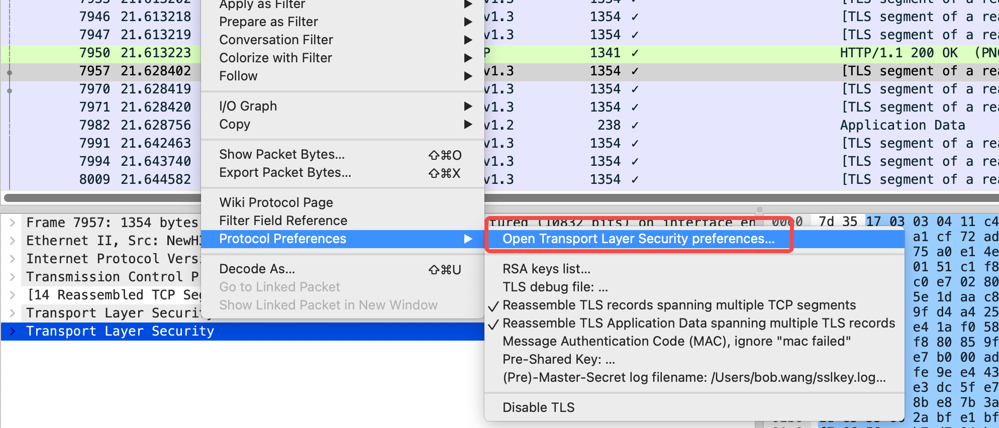
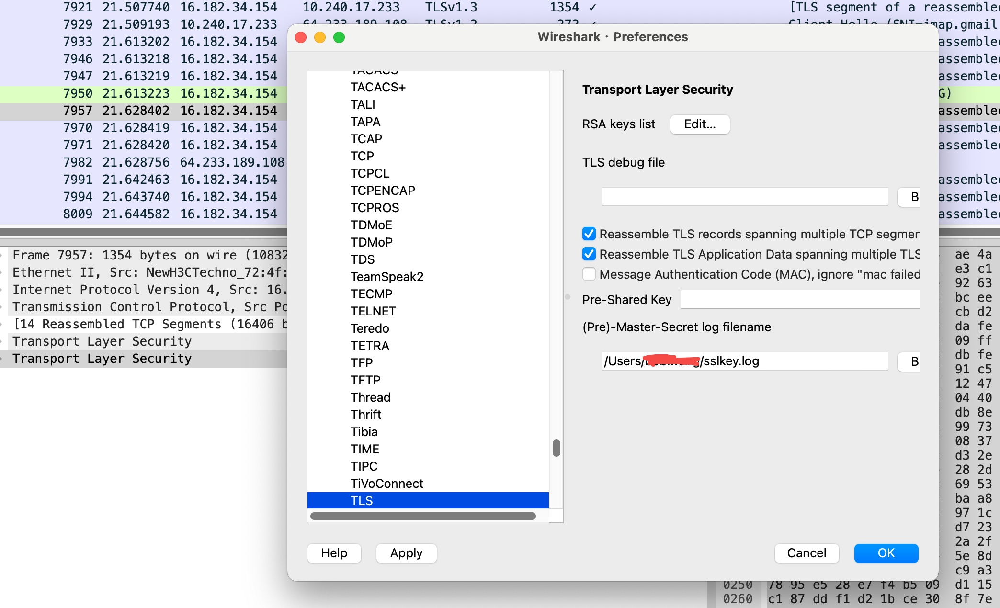
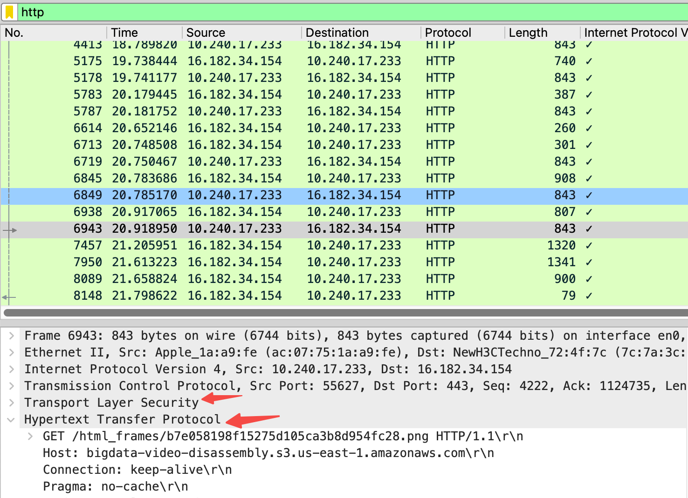

### 1.抓包https

1. 关闭chrome，彻底退出

2. 配置`SSLKEYLOGFILE`

   ```shell
   export SSLKEYLOGFILE="/Users/$USER/sslkey.log"
   ```

3. 启动wireshark，开始抓包

4. 使用在步骤 2 中设置环境变量的终端窗口启动 Chrome 。（环境变量仅为特定的终端会话设置）。

   ```shell
   open -a "Google Chrome"
   ```

5. 使用终端验证 sslkey.log 文件是否已创建。

6. 设置TLS 

   




7. 解密后的packet capture(数据包捕获-pcap)显示在Wireshark中。

   

[1]: https://monkeywie.cn/2020/08/07/wireshark-capture-https/	"我云了，原来wireshark可以抓HTTPS明文包"
[2]: https://knowledgebase.paloaltonetworks.com/KCSArticleDetail?id=kA14u000000oM2ECAU&amp;lang=zh_CN

