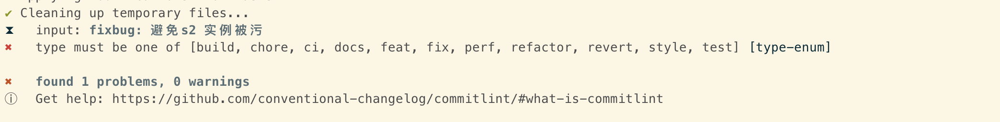

[git commit 提交规范](https://docs.google.com/document/d/1QrDFcIiPjSLDn3EL15IJygNPiHORgU1_OOAqWjiDU5Y/edit#heading=h.4e0o8t4fffjf)

build, chore, ci, docs, feat, fix, perf, refactor, revert, style, test

