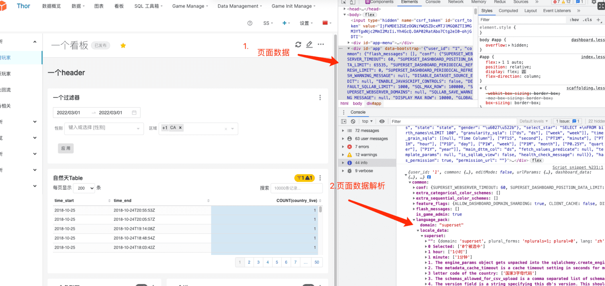

### 前端-thor项目国际化I18n

thor 项目国际化基于`jed`插件做开发的，封装目录在`superset-ui-cor/src/translation/`下。

翻译字典从后台返回，嵌入在`div`的`data-bootstrap`属性上，解析之后如下图所示： 字典在`common.language_pack.locale_dta.superset`中

基于jed封装的模块，调用字典来进行翻译。所以每次切换语言时，都需要重新请求后端，获取本国家的字典。