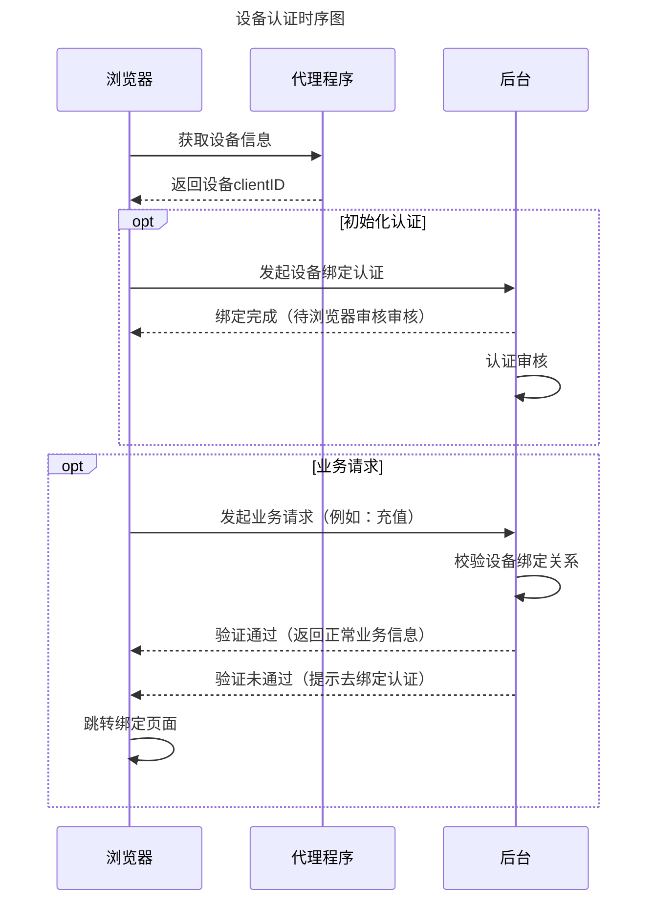
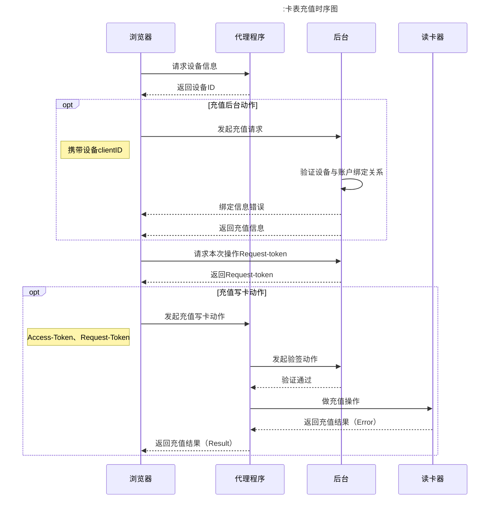

### 卡表操作时序图

#### 1.设备认证时序图

```mermaid
sequenceDiagram
title 设备认证时序图
  浏览器->>代理程序:获取设备信息
  代理程序-->>浏览器:返回设备clientID
  opt 初始化认证
  浏览器->>后台:发起设备绑定认证
  后台-->>浏览器:绑定完成（待浏览器审核审核）
  后台->>后台:认证审核
  end
  opt 业务请求
  浏览器->>后台: 发起业务请求（例如：充值）
  后台->>后台: 校验设备绑定关系
  后台-->>浏览器:验证通过（返回正常业务信息）
  后台-->>浏览器:验证未通过（提示去绑定认证）
  浏览器->>浏览器:跳转绑定页面
  end
```

#### 2.卡表充值时序图

```mermaid
sequenceDiagram
    Title :卡表充值时序图
    浏览器->>代理程序:请求设备信息
    代理程序-->>浏览器:返回设备ID
    opt 充值后台动作
    浏览器->>后台:发起充值请求
    Note left of 浏览器:携带设备clientID
    后台->>后台:验证设备与账户绑定关系
    后台-->>浏览器:绑定信息错误
    后台-->>浏览器:返回充值信息
    end
    浏览器->>后台:请求本次操作Request-token
    后台-->>浏览器:返回Request-token
    opt 充值写卡动作
    浏览器->>代理程序:发起充值写卡动作
    Note left of 浏览器:Access-Token、Request-Token
    代理程序->>后台:发起验签动作
    后台-->>代理程序:验证通过
    代理程序->>读卡器:做充值操作
    读卡器-->>代理程序:返回充值结果（Error）
    代理程序-->>浏览器:返回充值结果（Result）
    end
```

