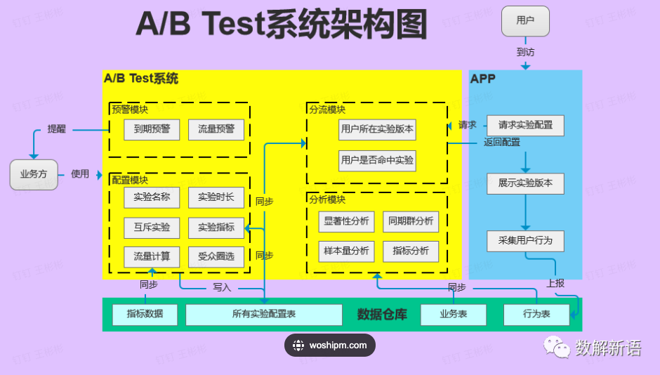
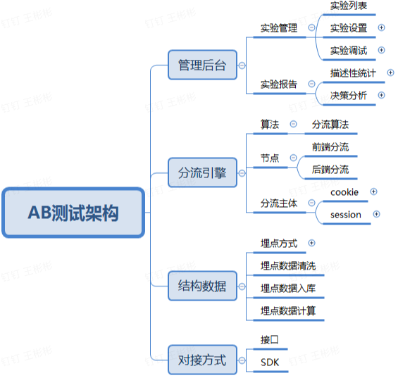

### [A/B test](A/B test)

[FeatureProbe](https://github.com/FeatureProbe/FeatureProbe)

FeatureProbe is an open source feature management service. 开源的高效可视化『特性』管理平台，提供特性开关、灰度发布、AB实验全功能。

[1]: https://cloud.tencent.com/developer/article/1938086	"A/B Test︱一轮完美的A/B Test 需要具备哪些要素（一）"
[2]: https://www.woshipm.com/pd/4362705.html	"https://www.woshipm.com/pd/4362705.html"
[3]: https://www.oracle.com/cn/cx/marketing/what-is-ab-testing/	"A/B 测试"
[4]: https://cloud.tencent.com/developer/article/1882322	" 3分钟，看懂ABtest基本原理"
[5]: https://featureprobe.github.io/FeatureProbe/zh-CN/	"FeatureProbe"

