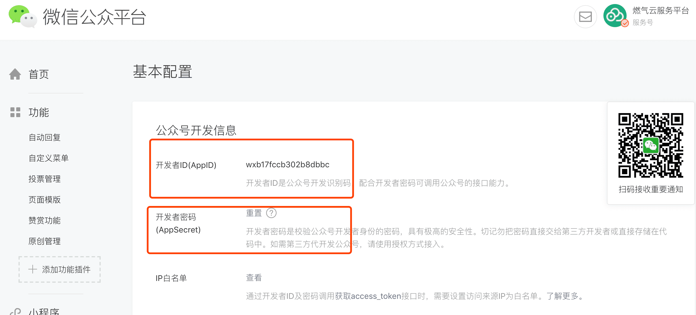

### 微信公众号权限认证过程/步骤

#### 1.AppID(应用ID) 和  AppSecret(应用秘钥)  在微信微信公众号--**基本配置** 查看



### **2.微信网页授权流程图**

> [微信网页授权官方文档](https://developers.weixin.qq.com/doc/offiaccount/OA_Web_Apps/Wechat_webpage_authorization.html)

1. 注释1：获取code 代码

2. ```javascript
   const host = window.location.origin + window.location.pathname;
   const redirect_uri = encodeURI(host)
   const wx_auth_url = `https://open.weixin.qq.com/connect/oauth2/authorize?appid=${appid}&redirect_uri=${redirect_uri}&response_type=code&scope=snsapi_base&state=${state}&connect_redirect=1#wechat_redirect`
   window.location.href = wx_auth_url
   ```

3. 注释2：含code 的url

   ```javascript
   https://gzh.yunfuw.cn/?code=021jQoBb1IQWVw0YTsDb1PFyBb1jQoBg&state=
   ```

4. 注释3：获取网页授权 access_token

   1. 通过code换取网页授权access_token

   ```javascript
   
   https://api.weixin.qq.com/sns/oauth2/access_token?appid=APPID&secret=SECRET&code=CODE&grant_type=authorization_code
   
   ```

   1. 返回格式为:

   ```javascript
   {
     "access_token":"ACCESS_TOKEN",//网页授权接口调用凭证,注意：此access_token与基础支持的access_token不同
     "expires_in":7200,
     "refresh_token":"REFRESH_TOKEN",
     "openid":"OPENID",
     "scope":"SCOPE" 
   }
   
   
   ```

5. 注释4：获取openId

   ```javascript
   http请求方式: GET（请使用https协议）
   https://api.weixin.qq.com/cgi-bin/user/get?access_token=ACCESS_TOKEN&next_openid=NEXT_OPENID
   ```


3. **微信JS-SDK 权限验证配置**

> [微信通用接口]([https://developers.weixin.qq.com/doc/offiaccount/WeChat_Invoice/Nontax_Bill/API_list.html#1.1%20%E8%8E%B7%E5%8F%96access_token](https://developers.weixin.qq.com/doc/offiaccount/WeChat_Invoice/Nontax_Bill/API_list.html#1.1 获取access_token))   [JS-SDK说明文档](https://developers.weixin.qq.com/doc/offiaccount/OA_Web_Apps/JS-SDK.html#62) [**JS-SDK使用权限签名算法**](https://developers.weixin.qq.com/doc/offiaccount/OA_Web_Apps/JS-SDK.html#62)

1. 注释1：获取access_token
2. 

```javascript
https请求方式: GET https://api.weixin.qq.com/cgi-bin/token?grant_type=client_credential&appid=APPID&secret=APPSECRET
```

2. 注释2：获取ticket

```javascript
请求URL：https://api.weixin.qq.com/cgi-bin/ticket/getticket?access_token=ACCESS_TOKEN&type=wx_card
```

3. 注释3：**JS-SDK使用权限签名算法**

```
四个字段noncestr（随机字符串）, 有效的jsapi_ticket, timestamp（时间戳）, url（当前网页的URL，不包含#及其后面部分）拼成字符串string1，对string1作sha1加密即可得签名signature。详细见JS-SDK使用权限签名算法


```


