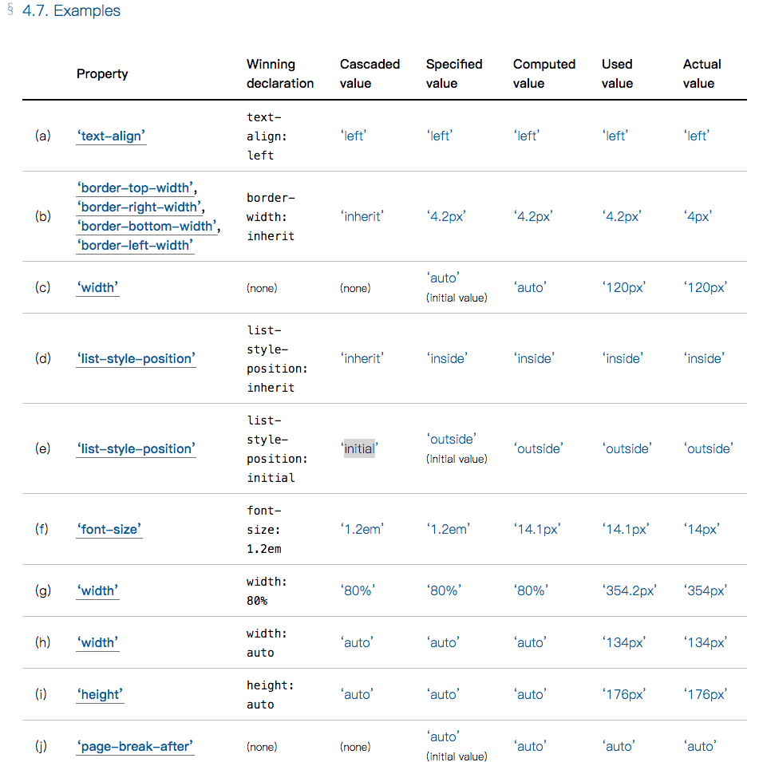

## **Value Processing**

1. value 计算流程

   The final value of a CSS property for a given element or box is the result of a multi-step calculation:

   1. First, all the [declared values](https://drafts.csswg.org/css-cascade-4/#declared-value) applied to an element are collected, for each property on each element. There may be zero or many declared values applied to the element.
   2. Cascading yields the [cascaded value](https://drafts.csswg.org/css-cascade-4/#cascaded-value). There is at most one cascaded value per property per element.
   3. Defaulting yields the [specified value](https://drafts.csswg.org/css-cascade-4/#specified-value). Every element has exactly one specified value per property.
   4. Resolving value dependencies yields the [computed value](https://drafts.csswg.org/css-cascade-4/#computed-value). Every element has exactly one computed value per property.
   5. Formatting the document yields the [used value](https://drafts.csswg.org/css-cascade-4/#used-value). An element only has a used value for a given property if that property applies to the element.
   6. Finally, the used value is transformed to the [actual value](https://drafts.csswg.org/css-cascade-4/#actual-value) based on constraints of the display environment. As with the [used value](https://drafts.csswg.org/css-cascade-4/#used-value), there may or may not be an actual value for a given property on an element.

2. 各值含义

   1. Declared Values  声明值

   2. Cascaded Values  级联值

   3. Specified Values 规定值

      样式表设定的值

      规定值赋值规则：

      1. 如果样式表指定了css属性值，则规定值为样式表指定值
      2. 如果样式表未指定值，且此属性为**继承属性**且不是Dom tree 的根元素，则规定值继承自他的父元素
      3. 如果1、2都不符合，则规定值 为 **initial value**

   4. Computed Values 计算值

      The computed value is the result of resolving the [specified value](https://drafts.csswg.org/css-cascade-4/#specified-value) as defined in the “Computed Value” line of the property definition table, generally absolutizing it in preparation for [inheritance](https://drafts.csswg.org/css-cascade-4/#inheritance).

   5. Used Values 使用值

   6. Actual Values 实际值

      

      >1. 初始值 Initial value
      >
      >2. 解析值 Resolved value
      >
      >   通过`getComputedStyle()` 获取的css属性值
      >
      >   对于大多数属性，返回**computed value**，但是少数旧属性（包括width、height）,
      >
      >   返回的是 **used value**



3. 所有css 属性都适用的四个关键字`initial` `inherit` `unset` `revert`

   1. initial 初始值

      If the [cascaded value](https://drafts.csswg.org/css-cascade/#cascaded-value) of a property is the [initial](https://drafts.csswg.org/css-cascade/#valdef-all-initial) keyword, the property’s [specified value](https://drafts.csswg.org/css-cascade/#specified-value) is its [initial value](https://drafts.csswg.org/css-cascade/#initial-value).

   2. Inherit 继承

      If the [cascaded value](https://drafts.csswg.org/css-cascade/#cascaded-value) of a property is the [inherit](https://drafts.csswg.org/css-cascade/#valdef-all-inherit) keyword, the property’s [specified](https://drafts.csswg.org/css-cascade/#specified-value) and [computed values](https://drafts.csswg.org/css-cascade/#computed-value) are the [inherited value](https://drafts.csswg.org/css-cascade/#inherited-value).

   3. unset 未设置

      If the [cascaded value](https://drafts.csswg.org/css-cascade/#cascaded-value) of a property is the [unset](https://drafts.csswg.org/css-cascade/#valdef-all-unset) keyword, then if it is an inherited property, this is treated as [inherit](https://drafts.csswg.org/css-cascade/#valdef-all-inherit), and if it is not, this is treated as [initial](https://drafts.csswg.org/css-cascade/#valdef-all-initial). This keyword effectively erases all [declared values](https://drafts.csswg.org/css-cascade/#declared-value) occurring earlier in the [cascade](https://drafts.csswg.org/css-cascade/#cascade), correctly inheriting or not as appropriate for the property (or all longhands of a [shorthand](https://drafts.csswg.org/css-cascade/#shorthand-property)).

   4. revert 还原

      表示样式表中定义的元素属性的默认值。若用户定义样式表中显式设置，则按此设置；否则，按照浏览器定义样式表中的样式设置；否则，等价于unset

      > ## all
      >
      > 表示重设除unicode-bidi和direction之外的所有CSS属性的属性值，取值只能是initial、inherit、unset和revert
      > 兼容性: IE不支持，safari9-不支持，ios9.2-不支持，android4.4-不支持
      >
      > ```html
      > <style>
      > .test{
      >     border: 1px solid black;
      >     padding: 20px;
      >     color: red;
      > }
      > .in{
      > /*  all: initial; //都取默认值 border:none;padding:0;color:black;
      >     all: inherit; // 都取父元素继承值 border:1px solid black;padding:20px;color:red;
      >     all: unset; // .in的所有属性都相当于不设置值，默认可继承的继承，不可继承的保持默认值		  border:none;padding:0;color:red;
      >     all: revert; // 等价于unset
      > */
      > }
      > </style>
      > <div class="test">
      >     <div class="in">测试文字</div>            
      > </div>
      > ```

 

