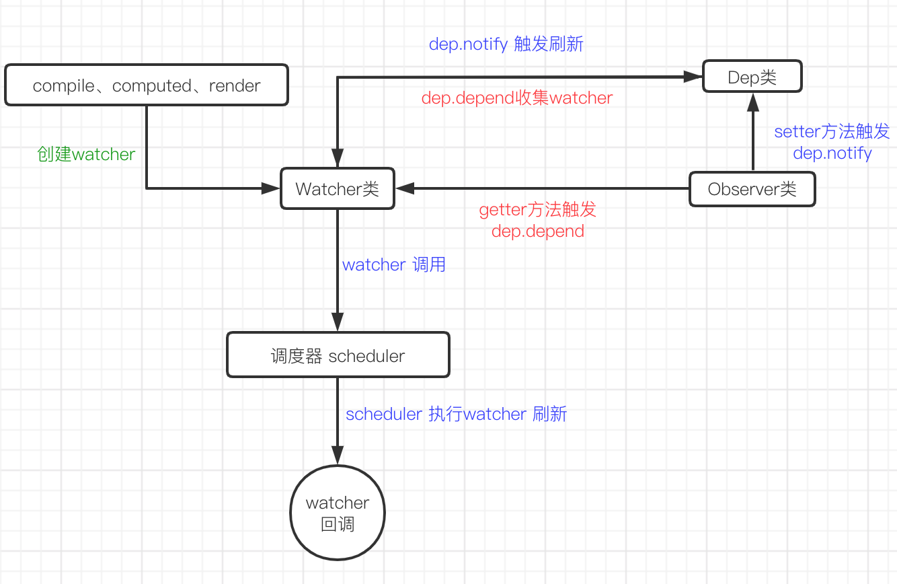

### Vue响应式原理

#### 一、响应式原理简介

Vue响应功能实现涉及Observer类、Dep类、Watcher类，

- Observer类 对数据进行劫持，get 劫持 触发 Dep实例 收集 Watcher 实例，set劫持 触发 Dep实例发布事件
- Dep 类 实现  Watcher 的收集、删除及 发布事件
- Watcher类 实现 添加wather 实例到dep实例、update 方法

Watcher 分三种：Computed Watcher、用户Watcher（侦听器）、渲染Watcher

流程图如下：



#### 二、Observer 类

Observer类对数据进行劫持，分数组和对象两种情况。并把Observer 实例对象绑定到数据的`__ob__`属性上,`def(value, '__ob__', this)`，dep属性保存Dep 实例。

1. 劫持数据是对象

   劫持数据为对象类型时，Observer类调用 **walk** 方法遍历对象的每个key键 ，并调用**defineReactive**方法来劫持对象数据。defineReactive 通过`Object.defineProperty` 劫持数据设置`get` 和 `set`。在get 中，如果Dep.target 不为空则调用**dep.depend**方法 来收集watcher。在setter 中有新数据设置时，调用**dep.notify** 发布watcher订阅的事件。

2. 劫持对象是数组

   重新数组的`push` `pop` `shift` `unshift` `splice` `sort` `reverse` 方法，当数值执行这些方法时，通过`__ob__.dep.notify()`  发布事件。

   > 这里数值直接通过 arr[0] = x 进行赋值操作不会引起 视图的变化，因为没有触发dep.notify() ，可通过上述方法来实现。  数组也是对象，为什么不对数组进行 get、set 劫持呢？因为数组内元素多、嵌套数组情况下，遍历劫持会影响性能。

#### 三、Dep 类

Dep类实现对watcher 实例的收集，包含 添加 `addSub`、删除`removeSub`、依赖自收集`depend`、发布`notify` 事件。`addSub`、`removeSub` `notify` 方法好理解，addSub 方法把watcher实例添加到subs 数组中，removeSub删除watcher 实例从subs数组中，notify 遍历subs数组中的watcher实例，执行watcher 的update方法。

`depend` 方法比较难理解，watcher 创建之后如何添加到对应的dep依赖中呢？如果每创建一个watcher实例，都要手动把watcher 实例添加到 dep依赖中，显然会麻烦。有没有一种模式，在watcher 实例创建时就自动把watcher 实例添加到dep 依赖中呢？在数据劫持的get 上，dep 实例来收集watcher 实例。

```javascript
// Observer 类
get: function reactiveGetter () {
  const value = getter ? getter.call(obj) : val
  if (Dep.target) { 
    dep.depend()  // 3.收集watcher实例
    if (childOb) {
      childOb.dep.depend()
      if (Array.isArray(value)) {
      	dependArray(value)
      }
    }
  }
  return value
}

// Dep 静态属性 target 保存watcher
Dep.target = null 
export function pushTarget (target: ?Watcher) {
  targetStack.push(target)
  Dep.target = target
}
```

```javascript
//dep 类
depend () {
  if (Dep.target) {
    Dep.target.addDep(this)   // 4.调用watcher 的addDep 方法
  }
}
```

```javascript
// watch 类 
get () {
    pushTarget(this)  // 1. Dep.target 保存当前watcher
    let value
    const vm = this.vm
    try {
      value = this.getter.call(vm, vm)  // 2.触发get 劫持 
    } catch (e) {
      if (this.user) {
        handleError(e, vm, `getter for watcher "${this.expression}"`)
      } else {
        throw e
      }
    } finally {
      // "touch" every property so they are all tracked as
      // dependencies for deep watching
      if (this.deep) {
        traverse(value)
      }
      popTarget()
      this.cleanupDeps()
    }
    return value
 }

//  watcher 方法
addDep (dep: Dep) {
    const id = dep.id
    if (!this.newDepIds.has(id)) {
      this.newDepIds.add(id)
      this.newDeps.push(dep)
      if (!this.depIds.has(id)) {
        dep.addSub(this) // 5. 把watcher实例添加到dep实例依赖中
      }
    }
  }
```

#### 四、Watcher 类

Watcher 类主要实现update 方法，收到通知执行run方法调用回调函数 。watcher 是通过一个事件调度器的函数`queueWatcher` ,把watcher 实例添加到watcher 队列中。

`queueWatcher`判断watcher队列的状态

- watcher 实例 添加到队列的方法
  - 如果watcher 队列未在执行中，则把watcher添加到队列中。
  - 如果队列正在执行中，按watcher的id，把它插到队列中，如果已经id已过，添加到队列最前端。
- 是否执行队列
  - 如果当前队列未在执行，则在下次事件循环事执行调用`flushSchedulerQueue` 方法执行队列

`flushSchedulerQueue` 方法在执行队列之前，会根据watcher 的id 进行从小到大排序。这样排序的目的是：

1. 组件的updated要从父组件 到 子组件进行，因为父组件总是比子组件先创建。
2. 组件的用户watcher 比 渲染watcher先执行，因为用户watcher 比 渲染watcher 先创建。
3. 如果一个组件在它父组件watcher 运行时被销毁，则它的watcher 会被跳过

以上是Vue响应式原理大体流程。


