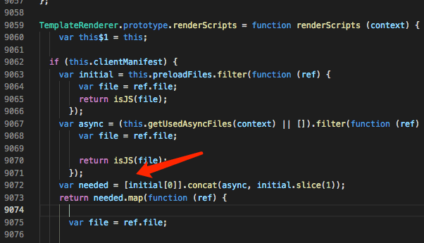

### vue-server-renderer 构建配置报错-Vue SSR

#### 项目依赖版本号为：

```json
{
	"vue": "^2.6.12",
	"webpack": "^5.4.0",
	"vue-server-renderer": "^2.6.12"
}
```

#### 一、服务器配置报错

```
/Users/***/workspace/x-fe/vue-ssr/node_modules/vue-server-renderer/server-plugin.js:74
      throw new Error(
      ^
Error: Entry "main" not found. Did you specify the correct entry option?
```

经分析是`vue-server-renderer`的server-plugin.js 文件出错

file 是个对象`{name:'filename.js'}`，isJS 函数处理的时候报错。


修改为一下代码即可：

`var entryAssets = entryInfo.assets.filter( file => isJS(file.name));`

#### 二、客户端配置报错

客户端构建完毕之后，启动服务。在浏览器中访问网址，渲染报错如下

```
TypeError: Cannot read property 'file' of undefined
    at /Users/binbinwang/workspace/x-fe/vue-ssr/node_modules/vue-server-renderer/build.dev.js:9075:22
    at Array.map (<anonymous>)
```

分析得是`vue-ssr-client-manifest.json` 文件中的`initial` 属性为空导致。

```
// vue-ssr-client-manifest.json
{
  "publicPath": "/dist/",
  "all": [
    "app.0178268b84efde12045b.js"
  ],
  "initial": [],
  "async": [
    "app.0178268b84efde12045b.js"
  ],
  "modules": {
    "239adfd4": [
      0
    ],
    "6fbc4fdc": [
      0
    ]
  }
}
```

导致`build.dev.js` 下列代码报错



默认情况下，只有 JavaScript 和 CSS 文件会被预加载，因为它们是启动应用时所必需的。可得vue-ssr-client-manifest.json文件构建是错误的。查看`vue-server-renderer` 中客户端构建插件`client-plugin.js`下列代码报错引起的，file 为对象 `{name:'filename.js'}` 


添加以下代码即可：

` .map(function (asset) { return asset.name} )`

